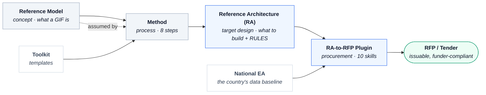

# 08 — Interoperability Module

**National Government Interoperability Framework (GIF)** — the substrate every sectoral architecture consumes for cross-government data exchange, and the basis of **Knowledge Product 2 (KP2)**.

This module is a **value chain from concept to procurement**. Each artefact sits at a different *altitude* and feeds the next — none replaces another.

## Conceptual model



**In one line:** the **Reference Model + Method** are the *knowledge*, the **Reference Architecture** is the *enforceable specification*, and the **plugin** is the *automation* that converts that specification into a tender.

## What each piece is

| Piece | Altitude | Question it answers | Consumes | Produces |
|---|---|---|---|---|
| **Reference Model** | Concept | *What* a GIF is — the generic architectural shape (4 interoperability + 4 functional layers), technology-agnostic | PAERA, EIF | The shared mental model |
| **Method** | Process | *How* to develop a country's GIF — the 8 steps; assumes the Reference Model's shape | The Reference Model | A running GIF |
| **Toolkit** | Tools | The templates applied at each Method step (+ the new RA, plugin & guide — see below) | — | Completed step artefacts |
| **Reference Architecture (RA)** | Target design + rules | *Exactly* what to build and the mandatory rules — enforceable, detailed; extends the Reference Model with the 5th EIF layer (Infrastructure) | The Reference Model | The procurement-ready specification |
| **RA-to-RFP Plugin** | Procurement (automation) | *How to buy it* — turns the specification into a tender | **The RA + the country's National EA** | The RFP package (RFP, Data Sheet + annexes, traceability matrix, transmittal) |

**Where the plugin sits.** At the delivery end of the chain. Its two inputs are the **RA** (the *“should”*) and the country's **National EA** (the *“is”*); its output is the issuable tender.

## How it maps to KP2 / the Implementation Plan (no plan change needed)

The Implementation Plan defines KP2 on **three pillars — Reference Model + Method + Toolkit**. The new assets in this module — the **Reference Architecture**, the **RA-to-RFP plugin**, and the why/how guide — are **components of the Toolkit pillar** (the practical-delivery layer):

```
KP2  =  Reference Model   +   Method   +   Toolkit
                                            └── 14 templates
                                            └── Reference Architecture (RA)
                                            └── RA-to-RFP plugin (10 skills)
                                            └── RA-to-RFP guide
```

The value chain above explains the *altitudes* for understanding; for KP2 accounting the RA and plugin **roll up under Toolkit**. So the published plan's framing already covers them — **the plan needs no edit; the Toolkit simply grew.**

> **Layer reconciliation.** The Reference Model frames interoperability on the EIF **four** layers (technical, semantic, organisational, legal); the RA uses the EIF **five** layers, adding **Infrastructure** and treating governance/legal as cross-cutting. The RA's five-layer view is the superset; the Reference Model's four-layer view is the teachable subset — consistent, not competing.

## Artefacts in this folder

| File | Role |
|---|---|
| [`GEATDM-Interop-Reference-Model-v1.0.md`](GEATDM-Interop-Reference-Model-v1.0.md) | **Reference Model** — the GIF's architectural shape (concept) |
| [`GEATDM-Interop-Method-v1.0.md`](GEATDM-Interop-Method-v1.0.md) | **Method** — the 8 steps to develop a country's GIF |
| [`GEATDM-Interop-Toolkit-v1.0.md`](GEATDM-Interop-Toolkit-v1.0.md) | **Toolkit** — the 14 templates (TK-IO-01 … TK-IO-14) |
| [`GEATDM-Interop-Reference-Architecture-v1.0.docx`](GEATDM-Interop-Reference-Architecture-v1.0.docx) | **Reference Architecture (RA)** — the enforceable, layered target design + RULES |
| [`RA-to-RFP-Plugin/`](RA-to-RFP-Plugin/) | **RA-to-RFP plugin** — 10 Claude skills (source + packaged `.plugin`) that turn the RA + a National EA into a tender |
| [`GEATDM-Interop-RA-to-RFP-Guide-v1.0.md`](GEATDM-Interop-RA-to-RFP-Guide-v1.0.md) | **Guide** — why & how to use the RA + plugin, with the worked Gambia GIP example |

## Where this module sits in GEATDM

- **DPI assessment first** (Module 09) scopes the foundational pillars; interoperability is one of them.
- **Interoperability framework next** — this module is the methodology to build/modernise it.
- **Sector EAs consume it** (Module 06: Health, Education, Tax, Justice, Customs) on top of the operational GIF.

For the full rationale, the step-by-step how-to, and the doctrine behind the plugin, read **[`GEATDM-Interop-RA-to-RFP-Guide-v1.0.md`](GEATDM-Interop-RA-to-RFP-Guide-v1.0.md)**.
