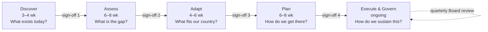

# 1.6 The lifecycle on one page


🎬 **Video in production:** *The 5-phase Enterprise Architecture lifecycle — commission a national EA in six months* (~5 min).
The play below does not depend on the video: the concept section carries what the video will say. Come back for the embed, or follow the [video index](../../start-here/video-index.md).


> **Single message.** Six months from start to a roadmap your minister can take to cabinet. Then ongoing governance. Five phases. Four sign-offs. One continuous practice.

| | |
| --- | --- |
| **Persona** | Strategist (CDO, Director-General, sector minister or ministerial-equivalent sponsor) |
| **PAERA anchor** | §3.1.3 Readiness Assessment; §5.4 Organisational Assessment & Roadmap |
| **Your play** | ✍️ Draft a phase-by-phase RACI for your country's EA programme · *Drafting* · produces workbook artefact **A6** |

## The concept

If you take one picture away from this knowledge product, take this one: the EA lifecycle on a single page. The picture on the wall of the EA Board room, in every cabinet briefing, and on the screen when your team explains where the work is. Five phases, each answering a single question, each producing a single deliverable, each ending with a sign-off by the senior decision-maker. The first four together take about six months; the fifth is ongoing.



**Discover:** what exists today? Your architects map the current landscape: strategies in force, systems, sector plans, stakeholders, legal framework. The deliverable is a Discovery brief with no recommendations yet; the sign-off is that the picture is accurate enough to build on. **Assess:** what is the gap? Architects compare Discovery against PAERA-anchored standards, write the current state in the four parts of an EA, produce maturity scorecards and the gap analysis; the sign-off is that the gap analysis reflects ground truth. **Adapt:** what fits our country? PAERA is a starting point, not a constraint; architects shape the framework with sector CIOs and the Board, and for each building block ask whether to build, buy from the marketplace, share another country's, or test in a sandbox first. **Plan:** how do we get there? Target state, sequenced roadmap, investment estimates; the Board approves and commits budget. This is the deliverable your minister takes to cabinet. **Execute & Govern:** how do we sustain this? The roadmap becomes a project pipeline, the small permanent EA team turns the EA into a living repository, and the Board reviews new projects against the architecture, quarterly, indefinitely.

Notice the rhythm. Four sign-offs in six months. Your minister does not review every diagram; they review at four moments, each tied to a defined deliverable. Between sign-offs the architects work, and the minister's job is to remove obstacles — the political ones, mostly. The phases depend on each other in order: discover before you measure, measure before you adapt, adapt before you plan, plan before you execute, govern always. You can skip a phase, but you will pay for it later, usually several times what skipping appeared to save. Six months to an approved roadmap, then your country in permanent EA-governed mode — that is what "months, not years" actually means.

## Do this on your own sector — Draft a phase-by-phase RACI for your country's EA programme


**✍️ Drafting play · produces A6 Phase RACI and role-gap list**

**Bring:** A list of existing roles in the country, each tagged confirmed / partial / gap. Posts, not names. From **A0 §4 Institutional roles register** (see [Play 0](../../start-here/play-0.md)).
**Get:** A per-phase RACI matrix plus a list of role gaps to resolve. As text in the chat, not a file or a chart.
**Time:** ~15 min · **Assistant:** any; the plays are tool-neutral.
**With the kit:** `ea-governance-drafter` — ToR, RACI, repository policy, gate checklist, scorecard, risk register. It also runs `ea-institution-mapper`. Optional: the prompt runs bare.
**Watch for:** A RACI is only as useful as the people named in it have actual authority — if the 'Accountable' role for a phase is unclear in the country, the gap matters more than the matrix.


✍️ **Drafting play.** You give a few facts; the play produces a first draft of a document you will edit.

**What it does.** Before the lifecycle starts, the Strategist needs to know who in their country plays which role at which phase. This play produces a draft RACI matrix that surfaces the role gaps.

**When to run it.** Before Discovery starts. The role-gap list is the thing to resolve first.



Copy the prompt, replace the bracketed parts with your own context, and run it in the AI assistant of your choice. Never paste personal data or unpublished documents — see [How to use the plays](../../start-here/how-to-use-the-plays.md).

```text
Below is a description of [country X]'s existing institutional roles relevant to a national EA programme: [list the CDO/CTO or equivalent, sector ministry CIOs, ICT unit head, any existing EA function, the Governance Board if one exists, the procurement authority, the data protection regulator, the budget authority — and any roles you know are missing]. For each phase of the PAERA-anchored EA lifecycle (Discover, Assess, Adapt, Plan, Execute & Govern), draft a RACI matrix — who is Responsible, Accountable, Consulted, Informed. Identify any role gap (a phase responsibility with no existing role to assign it) and flag for resolution before the phase starts. Output: a 5-row RACI table (one row per phase, columns R/A/C/I) plus a 'role gaps' list at the end. For each role gap, name the phase it blocks and give 2–3 resolution options. Return the output as text in this chat, not as a file.
```

[Open in Claude](<https://claude.ai/new?q=Below%20is%20a%20description%20of%20%5Bcountry%20X%5D%27s%20existing%20institutional%20roles%20relevant%20to%20a%20national%20EA%20programme%3A%20%5Blist%20the%20CDO%2FCTO%20or%20equivalent%2C%20sector%20ministry%20CIOs%2C%20ICT%20unit%20head%2C%20any%20existing%20EA%20function%2C%20the%20Governance%20Board%20if%20one%20exists%2C%20the%20procurement%20authority%2C%20the%20data%20protection%20regulator%2C%20the%20budget%20authority%20%E2%80%94%20and%20any%20roles%20you%20know%20are%20missing%5D.%20For%20each%20phase%20of%20the%20PAERA-anchored%20EA%20lifecycle%20%28Discover%2C%20Assess%2C%20Adapt%2C%20Plan%2C%20Execute%20%26%20Govern%29%2C%20draft%20a%20RACI%20matrix%20%E2%80%94%20who%20is%20Responsible%2C%20Accountable%2C%20Consulted%2C%20Informed.%20Identify%20any%20role%20gap%20%28a%20phase%20responsibility%20with%20no%20existing%20role%20to%20assign%20it%29%20and%20flag%20for%20resolution%20before%20the%20phase%20starts.%20Output%3A%20a%205-row%20RACI%20table%20%28one%20row%20per%20phase%2C%20columns%20R%2FA%2FC%2FI%29%20plus%20a%20%27role%20gaps%27%20list%20at%20the%20end.%20For%20each%20role%20gap%2C%20name%20the%20phase%20it%20blocks%20and%20give%202%E2%80%933%20resolution%20options.%20Return%20the%20output%20as%20text%20in%20this%20chat%2C%20not%20as%20a%20file.>) *(experimental deep link: pre-fills the prompt in a new claude.ai chat; check the bracketed parts before sending)*

*Input, output and the kit skill are in the box above.*




**Draft worked example.** Progressa is the fictional demonstration country used across all four Knowledge Products. This input and the output in the next tab are drafts: generated for the demo site and not yet re-run under the worked-example procedure.


The bracketed context in the prompt was replaced with the following:

- Minister of ICT (political sponsor of the Digital Transformation Roadmap)
- PDGA Director-General (coordinating mandate; reports to Minister of ICT)
- PDGA architecture unit: 1 senior architect (contract, donor-funded), 2 junior analysts
- Sector CIOs: MoEYS ICT Director; Ministry of Health ICT Director; Social Protection Agency IT manager; Ministry of Agriculture has no ICT director (handled by the Planning unit)
- PNIA Director (National ID; owner of the identity register)
- Civil Registration Department (under Ministry of Interior)
- Progressa Public Procurement Authority
- Data Protection Commission (established 2023, 6 staff, no enforcement action yet)
- Ministry of Finance budget department (annual budget cycle; no multi-year envelopes for ICT)
- No EA Governance Board exists; an ICT Steering Committee met twice in 2024 and not since




**Draft: model output, unverified.** Read it with the annotations in the next tab, not on its own.


| Phase | Responsible | Accountable | Consulted | Informed |
| --- | --- | --- | --- | --- |
| Discover | PDGA architecture unit (senior architect + analysts) | PDGA Director-General | Sector CIOs (MoEYS, Health, SPA); PNIA Director; Civil Registration; Data Protection Commission | Minister of ICT; Ministry of Finance budget dept |
| Assess | PDGA architecture unit | PDGA Director-General | Sector CIOs; PNIA; Procurement Authority (for existing-contract review); Data Protection Commission | Minister of ICT; ICT Steering Committee (if revived) |
| Adapt | PDGA architecture unit with sector CIOs | **⚠ EA Governance Board — does not exist** (interim: Minister of ICT) | PNIA; Procurement Authority (build/buy/share); Data Protection Commission; Ministry of Finance | Cabinet secretariat; donors (World Bank, AfDB, Global Fund) |
| Plan | PDGA architecture unit | **⚠ EA Governance Board — does not exist**; budget commitment: Minister of ICT + Ministry of Finance | Sector CIOs; Ministry of Finance budget dept; Procurement Authority; donors | Cabinet |
| Execute & Govern | **⚠ Permanent EA team — does not exist** (current unit is 1 contract architect) | **⚠ EA Governance Board — does not exist** | Sector CIOs; PNIA; Data Protection Commission; Procurement | Minister of ICT; Cabinet (annual) |

Role gaps to resolve before the phase starts:
1. **EA Governance Board** — Accountable role for Adapt, Plan and Execute & Govern has no holder. The ICT Steering Committee is dormant and was advisory. Needs a binding body with a chair (PDGA DG or Minister) before Adapt begins. → See play 1.7.
2. **Permanent EA team** — Responsible role for Execute & Govern has no holder; the one senior architect is donor-funded on contract. Needs 2–4 established posts before the end of Plan.
3. **Ministry of Agriculture CIO** — no ICT director; the Planning unit cannot represent the Farmer Registry in Consulted roles. Nominate a named officer before Discover.
4. **Multi-year budget authority** — Ministry of Finance runs annual cycles only; the Plan sign-off requires a commitment instrument that does not currently exist. Resolve with Finance before Plan, not during it.
5. **Data Protection Commission capacity** — Consulted in every phase with six staff and no enforcement history; confirm they can respond within phase timelines or agree a named liaison.



This is the teaching part of the play. Work through the output the way a chief architect would — what is earned, what is invented, what is missing.

<details>

<summary>1. Three cells are flagged ⚠ and they all point at the same two missing things</summary>

A Board and a team. That is the whole of 1.7 in one table. The RACI did its job by making the absence visible in the Accountable column — the safeguard's exact point.

</details>

<details>

<summary>2. The interim Accountable ('Minister of ICT') is the model's suggestion, not Progressa's decision</summary>

It is a reasonable placeholder. Do not leave it in the version you circulate unless the Minister has agreed to hold that role until the Board exists.

</details>

<details>

<summary>3. Gap 4 is the one people miss</summary>

The budget-cycle gap is institutional, not organisational — no post can fix it. The model found it because the input said 'no multi-year envelopes'. Thin inputs produce thin gap lists; this is why the roles input asks you to state what is missing.

</details>

<details>

<summary>4. Donors appear only as Informed</summary>

Argue with that. In Progressa three donors fund the sectoral systems the EA will govern; many countries would put them in Consulted for Adapt. The RACI is a proposal — the boundary is yours to move.

</details>


**Safeguard for this play.** A RACI is only as useful as the people named in it have actual authority — if the 'Accountable' role for a phase is unclear in the country, the gap matters more than the matrix.




Gaps 1 and 2 are asks 1 and 2 in [1.7](./1-7.md); gap 4 is ask 3. Take the role-gap list, not the matrix, into the meeting with your minister. Workbook artefact **A6**.

**This artefact feeds:** [1.7 Draft a Terms of Reference for your EA Governance Board](./1-7.md)

See the full chain in [Your country workbook](../your-country-workbook.md).



## Sources

- PAERA v1.0 §3.1.3 Readiness Assessment; §5.4 Organisational Assessment & Roadmap — https://paera.govstack.global
