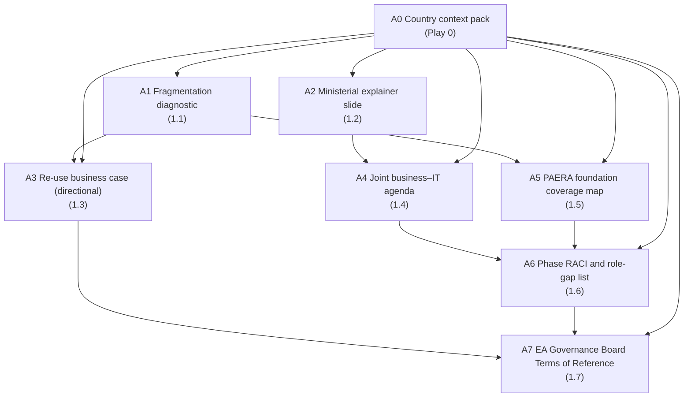

# Module 1 — Why a PAERA-anchored EA


🎬 **Video in production:** *KP1 Module 1 — Why a PAERA-anchored EA* (~2 min).
The play below does not depend on the video: the concept section carries what the video will say. Come back for the embed, or follow the [video index](../../start-here/video-index.md).


**Persona:** Strategist (CDO, Director-General, sector minister or ministerial-equivalent sponsor).

**You leave with:** A1, A2, A3, A4, A5, A6, A7, filed in your country workbook. Runtime ~31 minutes across seven videos.

Seven short videos that make the case for a national Enterprise Architecture anchored on PAERA — what it is, why projects cannot do it themselves, what the lifecycle looks like, and what to ask your minister for. Each video hands you one play to run on your own country.

## Subtopics

| # | Subtopic | Single message | Your play | Kit skill |
| --- | --- | --- | --- | --- |
| [1.1](./1-1.md) | Why your country needs a national EA | Without a shared plan for your government's digital systems, every new programme rebuilds what others have already built. The country pays. The citizen pays. Your minister cannot deliver what they promised. | 🔍 A1 | `country-context-pack` |
| [1.2](./1-2.md) | What an EA actually is, in one breath | An EA is the picture everyone agrees describes your government — minister, ministry CIO, donor, vendor. With it, you can lead the conversation. Without it, others lead it for you. | ✍️ A2 | `ea-institution-mapper` |
| [1.3](./1-3.md) | Why projects can't do this themselves | Procurement rules can require interoperability. They cannot deliver it. Only planning at the level of the whole government, supported by reference architectures, can. | ✍️ A3 | `ea-cost-case` |
| [1.4](./1-4.md) | Why an EA matters more now — and what it lets your minister actually do | For thirty years, digital work meant putting paper online. That era is ending. The work now is to redesign how your ministry serves citizens — and that work needs business and IT in the same room, using the same words. | 🔁 A4 | `ea-legal-context` |
| [1.5](./1-5.md) | Why PAERA-anchored — the head start you do not pay for twice | PAERA gives your team five years of head start. Adopt it, and the architecture work begins on day one. Do not adopt it, and your first year is spent inventing what others have already published. | 🔍 A5 | `paera-reference-check` |
| [1.6](./1-6.md) | The lifecycle on one page | Six months from start to a roadmap your minister can take to cabinet. Then ongoing governance. Five phases. Four sign-offs. One continuous practice. | ✍️ A6 | `ea-governance-drafter` |
| [1.7](./1-7.md) | What you will need from your minister — and how to ask for it | Four asks. A small permanent EA team. An EA Board with real authority. About two per cent of digital budget, sustained for five years. And one promise — that the team will not be pulled onto the urgent project of the week. | ✍️ A7 | `ea-governance-drafter` |

## How the plays chain in this module

The full chain, including where these artefacts come from and go next, is on [Your country workbook](../your-country-workbook.md).


**Before you start.** Every play asks you to paste country context. Build it once with [Play 0](../../start-here/play-0.md) — that is **A0**, and it feeds the whole chain. No country to hand? Run them on [Progressa](../../start-here/progressa.md), the fictional demonstration country.



New to the plays? Read [How to use the plays](../../start-here/how-to-use-the-plays.md) and [Working with AI](../../start-here/working-with-ai.md) first — part of the about fifteen minutes of Start here, and they apply to every module of every Knowledge Product.

