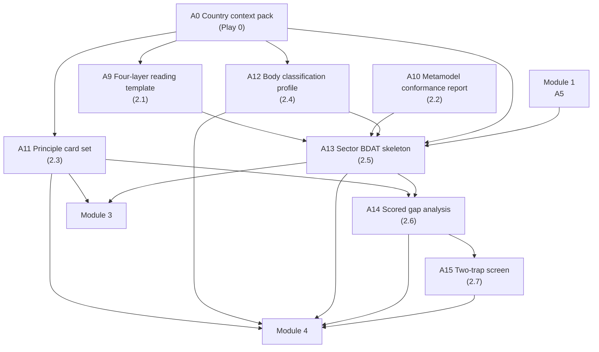

# Module 2 — Principles, the metamodel and the BDAT layers


🎬 **Video in production:** *KP1 Module 2 — Principles, the metamodel and the BDAT layers* (~2 min).
The play below does not depend on the video: the concept section carries what the video will say. Come back for the embed, or follow the [video index](../../start-here/video-index.md).



**Worked examples for this module are pending** — every prompt on these pages runs today.


**Persona:** Architect (chief or senior architect in a national digital agency or sector ICT unit).

**You leave with:** A9, A10, A11, A12, A13, A14, A15, filed in your country workbook. Runtime ~32 minutes across seven videos.

Seven videos on the architect's core toolkit: reading any government in four layers, the shared vocabulary that makes re-use possible, adopting PAERA's principles rather than drafting your own, and running a Phase 2 Assess that survives contact with a real ministry.


**On the artefact numbers.** They follow the curriculum order in which the plays were first written, so they are not always in module order: **A8** (comparator-country cards) is produced in Module 5, play 5.1.


## Subtopics

| # | Subtopic | Single message | Your play | Kit skill |
| --- | --- | --- | --- | --- |
| [2.1](./2-1.md) | Read any government in four layers | Every government, in any sector, can be read in four layers — Business, Data, Application, Technology. Learn the question each layer answers, the deliverable it produces, and the mistake first-time architects make, and you can decompose any ministry put in front of you. | ✍️ A9 | `bdat-assessor` |
| [2.2](./2-2.md) | The shared vocabulary that makes re-use possible | The metamodel is the small set of entities — Capability, Service, Application, Data Domain, Technology Component — and the relationships between them that PAERA already defines. Adopt it, and two ministries' architectures can be compared, connected and re-used. Skip it, and every team draws a different picture that no one else can read. | 🔍 A10 | `paera-reference-check` |
| [2.3](./2-3.md) | Adopt your principles, don't draft them | PAERA publishes ten architectural principles, already debated across many countries. Your job is to adopt them, tailor the wording to your context, and use them to settle design arguments — not to spend your first year drafting principles from scratch. | ✍️ A11 | `paera-reference-check` |
| [2.4](./2-4.md) | Classify any public body before you model it | PAERA publishes a taxonomy of public bodies — policy unit, regulatory agency, service-delivery authority, plus supporting elements like state registries. Classify a body first, and you already know what capabilities, data and governance to expect from it — before you interview anyone. | 🔍 A12 | `ea-institution-mapper` |
| [2.5](./2-5.md) | BDAT on a real ministry — the Progressa walkthrough | Watch the four layers and the shared entities applied to one real education system — Progressa's ministry, learner registry, examination authority and identity authority — and the abstract method becomes a concrete picture you can reproduce on your own sector. | ✍️ A13 | `bdat-assessor` |
| [2.6](./2-6.md) | Run a Phase 2 Assess — what good looks like, and the gaps you'll find | A good current-state picture is judged by a few quality tests per layer, not by its length. Learn the tests, learn the gaps you will always find, and you can run a Phase 2 Assess that names the right problems in the right order. | 🔍 A14 | `bdat-assessor` |
| [2.7](./2-7.md) | The two traps to catch at Assess — bespoke and vendor-driven | Two traps recur in every assessment: the bespoke trap, where each project builds its own version of a shared function, and the vendor-driven trap, where a supplier's product quietly becomes the architecture. Learn to spot both at Assess, and you protect the country from paying many times for one thing. | 🔍 A15 | `bb-landscape-check` |

## How the plays chain in this module

The full chain, including where these artefacts come from and go next, is on [Your country workbook](../your-country-workbook.md).


**Before you start.** Every play asks you to paste country context. Build it once with [Play 0](../../start-here/play-0.md) — that is **A0**, and it feeds the whole chain. No country to hand? Run them on [Progressa](../../start-here/progressa.md), the fictional demonstration country.



New to the plays? Read [How to use the plays](../../start-here/how-to-use-the-plays.md) and [Working with AI](../../start-here/working-with-ai.md) first — part of the about fifteen minutes of Start here, and they apply to every module of every Knowledge Product.

