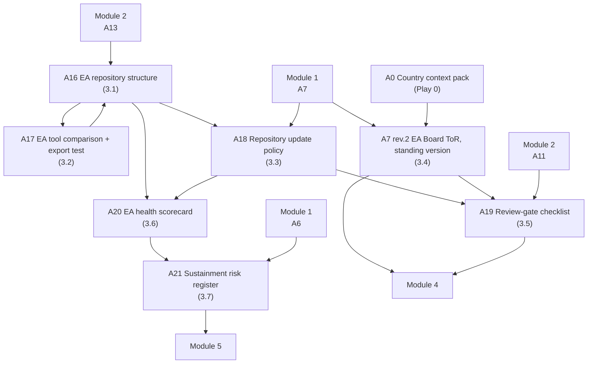

# Module 3 — EA repository, tooling and governance


🎬 **Video in production:** *KP1 Module 3 — EA repository, tooling and governance* (~2 min).
The play below does not depend on the video: the concept section carries what the video will say. Come back for the embed, or follow the [video index](../../start-here/video-index.md).



**Worked examples for this module are pending** — every prompt on these pages runs today.


**Persona:** Architect (chief or senior architect in a national digital agency or sector ICT unit).

**You leave with:** A16, A17, A18, A7 rev.2, A19, A20, A21, filed in your country workbook. Runtime ~29 minutes across seven videos.

Seven videos on making the architecture a practice rather than a document: where it lives, how it is kept true, how tooling is chosen without lock-in, and how an EA Board reviews projects, proves its worth and survives past year two.

## Subtopics

| # | Subtopic | Single message | Your play | Kit skill |
| --- | --- | --- | --- | --- |
| [3.1](./3-1.md) | Set up the one place your architecture lives | An EA repository is the single agreed place the architecture lives — the four layers, the entities and the decisions — so that one picture of your government exists instead of many private copies. Set it up first; everything else governs what goes into it. | ✍️ A16 | `ea-governance-drafter` |
| [3.2](./3-2.md) | Choose EA tooling without locking yourself in | Choose your EA tooling the way you would choose any system — reuse before buy, buy before build, keep your data in open formats you control, and never let the EA tool itself become the vendor trap it is meant to help you avoid. | 🔍 A17 | `ea-tool-evaluator` |
| [3.3](./3-3.md) | Keep the repository true — the update discipline | A repository is only worth what it is current. Decide who owns it, what event triggers an update, and how a change is checked — so the architecture tracks reality instead of slowly becoming a confident work of fiction. | ✍️ A18 | `ea-governance-drafter` |
| [3.4](./3-4.md) | Stand up an EA Board that can actually say no | An EA Board with binding authority — the right chair, the right members, a regular cadence, and a mandate that lets it say no — is what turns the architecture from a document into the place every digital decision passes through. | ✍️ A7 rev.2 | `ea-governance-drafter` |
| [3.5](./3-5.md) | Review projects against the architecture | The architecture review gate — a short, consistent set of questions every project passes through before funding — is what turns principles and re-use from good intentions into the actual path of least resistance. | ✍️ A19 | `ea-governance-drafter` |
| [3.6](./3-6.md) | Show the EA is working — the few metrics that matter | A handful of honest metrics — coverage, re-use rate, open exceptions, decisions made — show the minister and the team that the EA is working, and tell you where it isn't, without drowning anyone in vanity numbers. | ✍️ A20 | `ea-governance-drafter` |
| [3.7](./3-7.md) | Keep the practice alive past year two | EA programmes rarely fail technically; they fade — the team gets pulled away, the repository goes stale, the Board drifts to advisory, the sponsor changes. Naming these four fade-modes and the move that counters each is how you keep the practice alive. | ✍️ A21 | `ea-governance-drafter` |

## How the plays chain in this module

The full chain, including where these artefacts come from and go next, is on [Your country workbook](../your-country-workbook.md).


**Before you start.** Every play asks you to paste country context. Build it once with [Play 0](../../start-here/play-0.md) — that is **A0**, and it feeds the whole chain. No country to hand? Run them on [Progressa](../../start-here/progressa.md), the fictional demonstration country.



New to the plays? Read [How to use the plays](../../start-here/how-to-use-the-plays.md) and [Working with AI](../../start-here/working-with-ai.md) first — part of the about fifteen minutes of Start here, and they apply to every module of every Knowledge Product.

