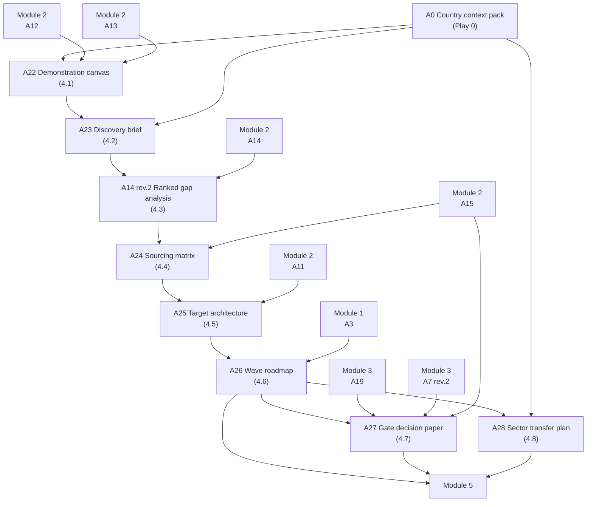

# Module 4 — Progressa end-to-end — the method on one sector


🎬 **Video in production:** *KP1 Module 4 — Progressa end-to-end — the method on one sector* (~2 min).
The play below does not depend on the video: the concept section carries what the video will say. Come back for the embed, or follow the [video index](../../start-here/video-index.md).



**Worked examples for this module are pending** — every prompt on these pages runs today.


**Persona:** Architect (chief or senior architect in a national digital agency or sector ICT unit).

**You leave with:** A22, A23, A14 rev.2, A24, A25, A26, A27, A28, filed in your country workbook. Runtime ~28 minutes across eight videos.

Eight videos running the full five-phase lifecycle on Progressa's education sector, from a stalled flagship to a gate decision and a transfer plan for the next sector. Every deliverable and every sign-off is visible in detail.

## Subtopics

| # | Subtopic | Single message | Your play | Kit skill |
| --- | --- | --- | --- | --- |
| [4.1](./4-1.md) | Meet Progressa — a real sector with a real fragmentation problem | Progressa is a demonstration education sector with the fragmentation problem most countries share — the same learner registered in several places, identity proven on paper. Meet its institutions and its problem, because the rest of this topic runs the full method on exactly this canvas. | ✍️ A22 | `ea-institution-mapper` |
| [4.2](./4-2.md) | Phase 1, Discover — map what the sector has today | Discovery produces one deliverable — an honest picture of what the sector has today, with no recommendations yet — signed off as accurate before any analysis begins. Watch it done on Progressa. | ✍️ A23 | `ea-method-runner` |
| [4.3](./4-3.md) | Phase 2, Assess — find the gaps and rank them | Assess turns Progressa's picture into a ranked gap analysis — the right problems, in the right order — signed off as ground truth. It is the assessment method applied to a real sector. | 🔍 A14 rev.2 | `ea-method-runner` |
| [4.4](./4-4.md) | Phase 3, Adapt — fit PAERA and decide build, buy or share | Adapt fits PAERA to Progressa — localising principles, setting sector priorities, and deciding for each building block whether to build, buy, share or sandbox — signed off as the framework and sourcing approach. | 🔍 A24 | `ea-method-runner` |
| [4.5](./4-5.md) | Phase 4, Plan — design the target architecture | Between the gaps and the roadmap sits the deliverable the whole EA is for — the target architecture: a future-state picture of the capabilities, the data owners, the shared platforms and the integration map your government should have. Design it by applying your principles to the gaps, and the roadmap finally has somewhere to go. | ✍️ A25 | `ea-method-runner` |
| [4.6](./4-6.md) | Phase 4, Plan — sequence the roadmap and cost it | Plan turns Progressa's decisions into a sequenced, costed roadmap in waves — the deliverable the minister takes to cabinet — signed off with budget committed. | ✍️ A26 | `ea-method-runner` |
| [4.7](./4-7.md) | Phase 5, Execute & Govern — stand up the living EA | Execute & Govern makes Progressa's architecture live — the repository, the Board, and the review gate that catches a project trying to build its own learner list and tells it to consume the registry. This is where re-use actually happens. | ✍️ A27 | `ea-method-runner` |
| [4.8](./4-8.md) | Run this on your own sector — the transferable recipe | The five phases, four sign-offs and six deliverables you watched on Progressa are the recipe — change the institutions and the data domains, and the same method runs on any sector you are handed. | 🔁 A28 | `ea-method-runner` |

## How the plays chain in this module

The full chain, including where these artefacts come from and go next, is on [Your country workbook](../your-country-workbook.md).


**Before you start.** Every play asks you to paste country context. Build it once with [Play 0](../../start-here/play-0.md) — that is **A0**, and it feeds the whole chain. No country to hand? Run them on [Progressa](../../start-here/progressa.md), the fictional demonstration country.



New to the plays? Read [How to use the plays](../../start-here/how-to-use-the-plays.md) and [Working with AI](../../start-here/working-with-ai.md) first — part of the about fifteen minutes of Start here, and they apply to every module of every Knowledge Product.

