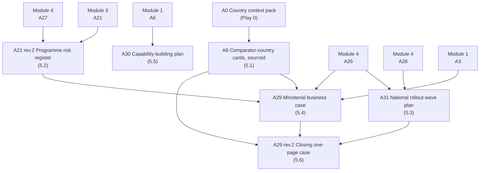

# Module 5 — Evidence, rollout and the case


🎬 **Video in production:** *KP1 Module 5 — Evidence, rollout and the case* (~2 min).
The play below does not depend on the video: the concept section carries what the video will say. Come back for the embed, or follow the [video index](../../start-here/video-index.md).



**Worked examples for this module are pending** — every prompt on these pages runs today.


**Persona:** Strategist (CDO, Director-General, sector minister or ministerial-equivalent sponsor).

**You leave with:** A8, A21 rev.2, A31, A29, A30, A29 rev.2, filed in your country workbook. Runtime ~23 minutes across six videos.

Six videos on proving the method and carrying it: what the cross-country evidence says works and what quietly kills these programmes, how the practice rolls out across sectors, and the business case that wins sustained commitment.

## Subtopics

| # | Subtopic | Single message | Your play | Kit skill |
| --- | --- | --- | --- | --- |
| [5.1](./5-1.md) | Is this proven, or just theory? — evidence from real programmes | This is not a theory waiting for its first trial. Across four very different governments, the same architectural approach has already produced results — which means the question for you is not whether it works, but how to apply it where you are. | 🔍 A8 | `ea-comparator-evidence` |
| [5.2](./5-2.md) | What the evidence says works — and what quietly kills these programmes | The public record is consistent about what makes these programmes succeed and what kills them — and the killers are organisational, not technical. Knowing both lets you design your programme to last, and brief your minister on the real risks. | ✍️ A21 rev.2 | `ea-governance-drafter` |
| [5.3](./5-3.md) | Roll it out across sectors — and why the second is cheaper | The method is sector-agnostic — only the record at the centre changes — so roll it out as a wave roadmap: one sector first to build the shared platforms, then sectors one at a time, each cheaper than the last, governed into a single national architecture. | ✍️ A31 | `ea-method-runner` |
| [5.4](./5-4.md) | Win the commitment — the business case that gets your minister to yes | Winning the minister's commitment is not about the architecture — it's about the number. Pair the whole-of-government re-use saving with the proven evidence and an honest time horizon, and you turn a technical case into one a minister can take to cabinet. | 🔁 A29 | `ea-cost-case` |
| [5.5](./5-5.md) | Build your team's capability with open knowledge products | You don't have to train your team from scratch — open knowledge products, a shared framework, and a community of practising countries mean your people can learn the method from materials that already exist, freeing your budget for the work itself. | ✍️ A30 | `ea-open-learning-catalogue` |
| [5.6](./5-6.md) | The closing case — proven, portable, and necessary now | The case for a national EA comes down to three things you can now say with confidence — it is proven, it is portable, and in the era of redesigning how government works it is no longer optional but necessary — held together by the two reasons an EA exists: it makes re-use possible, and it gives business and IT a shared language. | 🔁 A29 rev.2 | `ea-comparator-evidence` |

## How the plays chain in this module

The full chain, including where these artefacts come from and go next, is on [Your country workbook](../your-country-workbook.md).


**Before you start.** Every play asks you to paste country context. Build it once with [Play 0](../../start-here/play-0.md) — that is **A0**, and it feeds the whole chain. No country to hand? Run them on [Progressa](../../start-here/progressa.md), the fictional demonstration country.



New to the plays? Read [How to use the plays](../../start-here/how-to-use-the-plays.md) and [Working with AI](../../start-here/working-with-ai.md) first — part of the about fifteen minutes of Start here, and they apply to every module of every Knowledge Product.

