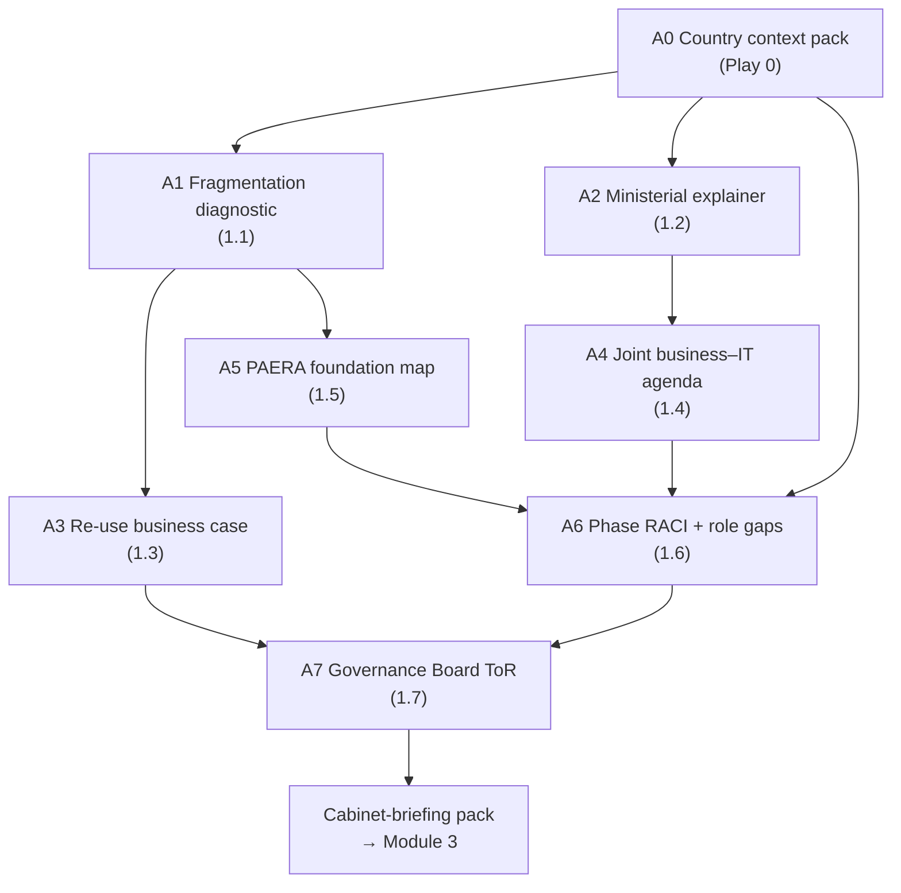

# Your country workbook

Each play produces one artefact. Run them in order and the artefacts feed each other; run all seven plays of Module 1 and you hold a **draft cabinet-briefing pack** for your country. Run all five modules and you hold the architecture itself. This page is the map. If you have no country to hand, use Progressa — the worked examples on each play page show what each artefact looks like for it.


Keep the artefacts in one folder, named as below. The **Consumes** and **Feeds** columns are the chain: every play names what it reads and what reads it, so you can start anywhere and see what you need first.


## A0 — the pack everything starts from

| Artefact | What it is | Produced by | Feeds |
| --- | --- | --- | --- |
| **A0** | Country context pack — landscape brief, programme list, ministry context, roles register, characteristics, sector bodies, legal list | [Play 0](../start-here/play-0.md) 🔍 | the whole chain below |

## Module 1 — the cabinet-briefing pack

## Every artefact in KP1

*The numbers follow the curriculum order in which the plays were first written, not module order: **A8** (comparator-country cards) is produced in Module 5, play 5.1.*

### Module 1 — Why a PAERA-anchored EA

| Artefact | What it is | Produced by | Consumes | Feeds |
| --- | --- | --- | --- | --- |
| **A1** | Fragmentation diagnostic | [1.1](module-1/1-1.md) 🔍 | A0 §1 Digital-landscape brief | 1.3, 1.5 |
| **A2** | Ministerial explainer slide | [1.2](module-1/1-2.md) ✍️ | A0 §1 (the named institutions and services) | 1.4 |
| **A3** | Re-use business case (directional) | [1.3](module-1/1-3.md) ✍️ | A0 §2 Programme list | 1.7 |
| **A4** | Joint business–IT agenda | [1.4](module-1/1-4.md) 🔁 | A0 §3 Ministry operating context | 1.6 |
| **A5** | PAERA foundation coverage map | [1.5](module-1/1-5.md) 🔍 | A0 §2 Programme list (plus any strategies from §1) | 1.6 |
| **A6** | Phase RACI and role-gap list | [1.6](module-1/1-6.md) ✍️ | A0 §4 Institutional roles register | 1.7 |
| **A7** | EA Governance Board Terms of Reference | [1.7](module-1/1-7.md) ✍️ | A0 §4 Institutional roles register (posts only) and the gap list from A6 | M3 |

### Module 2 — Principles, the metamodel and the BDAT layers

| Artefact | What it is | Produced by | Consumes | Feeds |
| --- | --- | --- | --- | --- |
| **A9** | Four-layer reading template | [2.1](module-2/2-1.md) ✍️ | A0 §6 | 2.5 |
| **A10** | Metamodel conformance report | [2.2](module-2/2-2.md) 🔍 | a draft model, or the initiatives list | 2.5 |
| **A11** | Principle card set | [2.3](module-2/2-3.md) ✍️ | A0 §7 | 2.6, 3.5, 4.5 |
| **A12** | Body classification profile | [2.4](module-2/2-4.md) 🔍 | A0 §6 | 2.5, 4.1 |
| **A13** | Sector BDAT skeleton | [2.5](module-2/2-5.md) ✍️ | A0 §6, A5, A9, A12, A10 | 2.6, 3.1, 4.1 |
| **A14** | Scored gap analysis | [2.6](module-2/2-6.md) 🔍 | A13, A11 | 2.7, 4.3 |
| **A15** | Two-trap screen | [2.7](module-2/2-7.md) 🔍 | A14, BB status register | 4.4, 4.7 |

### Module 3 — EA repository, tooling and governance

| Artefact | What it is | Produced by | Consumes | Feeds |
| --- | --- | --- | --- | --- |
| **A16** | EA repository structure | [3.1](module-3/3-1.md) ✍️ | A13, A17 | 3.2, 3.3, 3.6 |
| **A17** | EA tool comparison + export test | [3.2](module-3/3-2.md) 🔍 | A16, candidate list | 3.1 |
| **A18** | Repository update policy | [3.3](module-3/3-3.md) ✍️ | A16, A7 | 3.5, 3.6 |
| **A7 rev.2** | EA Board ToR, standing version | [3.4](module-3/3-4.md) ✍️ | A7, A0 §7 | 3.5, 4.7 |
| **A19** | Review-gate checklist | [3.5](module-3/3-5.md) ✍️ | A7 rev.2, A11, BB status register, A18 | 4.7 |
| **A20** | EA health scorecard | [3.6](module-3/3-6.md) ✍️ | A16, A18 | 3.7 |
| **A21** | Sustainment risk register | [3.7](module-3/3-7.md) ✍️ | A20, A6 | 5.2 |

### Module 4 — Progressa end-to-end — the method on one sector

| Artefact | What it is | Produced by | Consumes | Feeds |
| --- | --- | --- | --- | --- |
| **A22** | Demonstration canvas | [4.1](module-4/4-1.md) ✍️ | A0 §6, A12, A13, the sector problem paragraph | 4.2 |
| **A23** | Discovery brief | [4.2](module-4/4-2.md) ✍️ | A22, A0 §7 | 4.3 |
| **A14 rev.2** | Ranked gap analysis | [4.3](module-4/4-3.md) 🔍 | A23, A14 | 4.4 |
| **A24** | Sourcing matrix | [4.4](module-4/4-4.md) 🔍 | A14 rev.2, BB status register, A15 | 4.5 |
| **A25** | Target architecture | [4.5](module-4/4-5.md) ✍️ | A24, A11, BB status register | 4.6 |
| **A26** | Wave roadmap | [4.6](module-4/4-6.md) ✍️ | A25, A3 | 4.7, 4.8, 5.3, 5.4 |
| **A27** | Gate decision paper | [4.7](module-4/4-7.md) ✍️ | A26, A19, A7 rev.2, BB status register, A15 | 5.2 |
| **A28** | Sector transfer plan | [4.8](module-4/4-8.md) 🔁 | A26, A0 §6 (next sector) | 5.3, 5.3b |

### Module 5 — Evidence, rollout and the case

| Artefact | What it is | Produced by | Consumes | Feeds |
| --- | --- | --- | --- | --- |
| **A8** | Comparator-country cards, sourced | [5.1](module-5/5-1.md) 🔍 | A0 §5 | 5.4, 5.6 |
| **A21 rev.2** | Programme risk register | [5.2](module-5/5-2.md) ✍️ | A21, A27 | 5.4 |
| **A31** | National rollout wave plan | [5.3](module-5/5-3.md) ✍️ | A26, A28, BB status register | 5.3b, 5.6 |
| **A28 rev.2** | Second-sector map | [5.3b](module-5/5-3.md) 🔁 | A28, A31, BB status register | — |
| **A29** | Ministerial business case | [5.4](module-5/5-4.md) 🔁 | A3, A8, A21 rev.2, A26 | 5.6 |
| **A30** | Capability-building plan | [5.5](module-5/5-5.md) ✍️ | A6 | — |
| **A29 rev.2** | Closing one-page case | [5.6](module-5/5-6.md) 🔁 | A29, A31, A8 | — |

## What the Module 1 pack contains when you are done

1. **The problem:** A1, validated against named sources.
2. **The words:** A2, checked by a sector CIO.
3. **The money:** A3, directional, with a costing exercise commissioned.
4. **The first decisions:** A4, the agenda for a Board that does not yet exist.
5. **What we keep and what we build:** A5, corrected against the actual documents.
6. **Who does what, and who is missing:** A6, the role-gap list above the matrix.
7. **The Board:** A7, after legal counsel.

Bring items 1–7 as a single pack and make the four asks from [1.7](module-1/1-7.md) together, not in pieces.

## Where the chain goes after KP1

Module 5 closes KP1 with the case for sustained commitment (A29 rev.2). In KP2 the chain continues into the build pack, where the play outputs become the inputs to the interoperability proving slice. Those pages are added as KP2 is published.
