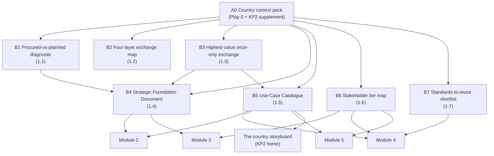

# Module 1 — Why interoperability and the four layers


🎬 **Video in production:** *KP2 Module 1 — Why interoperability and the four layers* (~2 min).
The play below does not depend on the video: the concept section carries what the video will say. Come back for the embed, or follow the [video index](../../start-here/video-index.md).



**Worked examples for this module are pending** — every prompt on these pages runs today.


**Persona:** S (Strategist) — national interoperability authority, ministry CIO, Ministry of Justice sponsor, or development-partner lead.

**You leave with:** B1, B2, B3, B4, B5, B6, B7, filed in your framework workbook — the foundation. Runtime ~31 minutes across 7 videos.

Seven videos for the Strategist making the case: why interoperability is built rather than bought, the four layers it fails at, the once-only promise it exists for, and the three foundation artefacts — the Strategic Foundation Document, the Use-Case Catalogue and the stakeholder map — every later module reads.

## Subtopics

| # | Subtopic | Single message | Your play | Kit skill |
| --- | --- | --- | --- | --- |
| [1.1](./1-1.md) | Why interoperability can't be bought, only built | Procurement rules can require interoperability. Only whole-of-government planning delivers it — and once the framework exists, procurement is how you enforce it. | 🔍 B1 | `country-context-pack` |
| [1.2](./1-2.md) | The four layers of interoperability | Interoperability fails at whichever of the four layers — Technical, Semantic, Organisational, Legal — you skip. The framework makes you address all four on purpose. | 🔍 B2 | `gif-four-layer-map` |
| [1.3](./1-3.md) | The once-only promise | Once-only — the state never asks a citizen for the same data twice — is the outcome interoperability is for, and the test of whether it works. | 🔍 B3 | `country-context-pack` |
| [1.4](./1-4.md) | The Strategic Foundation Document | Name the mandate, the scope and the principles once, in writing, before any wiring — it is what every later decision is checked against. | ✍️ B4 | `gif-foundation-drafter` |
| [1.5](./1-5.md) | The Use-Case Catalogue | Turn your integration map into a ranked catalogue of exchanges worth building — and start with the one that removes the most counters for citizens. | ✍️ B5 | `country-context-pack` |
| [1.6](./1-6.md) | Mapping your stakeholders | Sort the agencies into Champions, Early Adopters and Observers, and you know who to onboard first and who to convince. | 🔍 B6 | `ea-institution-mapper` |
| [1.7](./1-7.md) | What the world already proved | Estonia's X-Road and the EU's once-only systems show the pattern; the education semantic standards show the vocabularies you will reuse rather than invent. | 🔍 B7 | `ea-comparator-evidence` |

## How the plays chain in this module

The full chain, including where these artefacts come from and go next, is on [Your framework workbook](../your-framework-workbook.md).


**Before you start.** Every play asks you to paste country context. Build it once with [Play 0](../../start-here/play-0.md) — that is **A0** — and add the three KP2 sections from the [Play 0 supplement](../play-0-supplement.md). No country to hand? Run them on [Progressa](../../start-here/progressa.md), the fictional demonstration country; for Modules 4 and 5 the [build pack](../build-pack/README.md) is Progressa's finished output.



New to the plays? Read [How to use the plays](../../start-here/how-to-use-the-plays.md) and [Working with AI](../../start-here/working-with-ai.md) first — part of the about fifteen minutes of Start here, and they apply to every module of every Knowledge Product.

