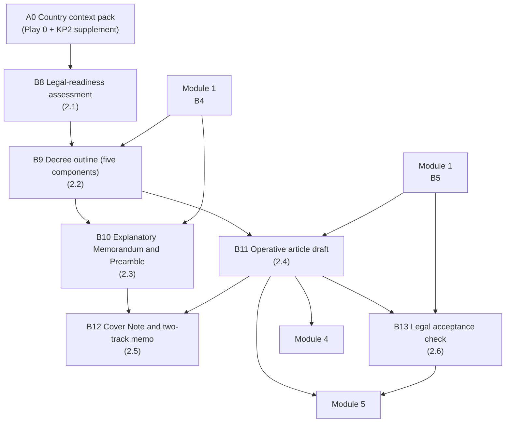

# Module 2 — Legal framework — the Decree Drafting Kit


🎬 **Video in production:** *KP2 Module 2 — Legal framework — the Decree Drafting Kit* (~2 min).
The play below does not depend on the video: the concept section carries what the video will say. Come back for the embed, or follow the [video index](../../start-here/video-index.md).



**Worked examples for this module are pending** — every prompt on these pages runs today.


**Persona:** S (Strategist) — national interoperability authority, ministry CIO, Ministry of Justice sponsor, or development-partner lead.

**You leave with:** B8, B9, B10, B11, B12, B13, filed in your framework workbook — the legal configuration — the decree. Runtime ~29 minutes across 6 videos.

Six videos on the legal layer: why the bus needs a mandate, the five components of an interoperability decree, the Explanatory Memorandum, the Draft Articles and the Cover Note generated against published models, and the decree read as the legal configuration that authorises exactly the exchanges in your catalogue.

## Subtopics

| # | Subtopic | Single message | Your play | Kit skill |
| --- | --- | --- | --- | --- |
| [2.1](./2-1.md) | Why the platform needs a legal mandate | Without the legal layer, the bus cannot lawfully carry one cross-agency message — the decree is the on-switch, not paperwork. | 🔍 B8 | `ea-legal-context` |
| [2.2](./2-2.md) | Anatomy of an interoperability decree | A sound decree is five parts; knowing them lets you brief a Ministry of Justice instead of waiting on it. | ✍️ B9 | `gif-decree-draft` |
| [2.3](./2-3.md) | The Explanatory Memorandum and Preamble | Draft the case-for and the recitals with Claude from your Strategic Foundation Document — then check every claim against a real statute. | ✍️ B10 | `gif-decree-draft` |
| [2.4](./2-4.md) | The Draft Articles Package | The operative articles — mandatory connection, once-only, data protection — generated against published models, every clause confirmed, not invented. | ✍️ B11 | `gif-decree-draft` |
| [2.5](./2-5.md) | The Cover Note and Two-Track Regulatory Memo | Transmit the package with a specific ask, and show how the decree and the data-protection law fit together — so the decree moves instead of sitting in a queue, and the data-protection authority backs it instead of blocking it. | ✍️ B12 | `gif-decree-draft` |
| [2.6](./2-6.md) | The decree as configuration | The finished decree authorises exactly the exchanges in your Use-Case Catalogue — read it as the legal configuration that binds the technical bus. | 🔍 B13 | `gif-consistency-check` |

## How the plays chain in this module

The full chain, including where these artefacts come from and go next, is on [Your framework workbook](../your-framework-workbook.md).


**Before you start.** Every play asks you to paste country context. Build it once with [Play 0](../../start-here/play-0.md) — that is **A0** — and add the three KP2 sections from the [Play 0 supplement](../play-0-supplement.md). No country to hand? Run them on [Progressa](../../start-here/progressa.md), the fictional demonstration country; for Modules 4 and 5 the [build pack](../build-pack/README.md) is Progressa's finished output.



New to the plays? Read [How to use the plays](../../start-here/how-to-use-the-plays.md) and [Working with AI](../../start-here/working-with-ai.md) first — part of the about fifteen minutes of Start here, and they apply to every module of every Knowledge Product.

