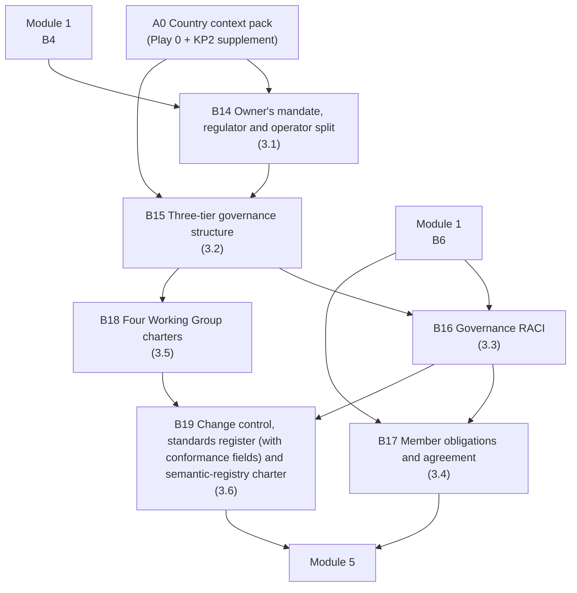

# Module 3 — Governance model — three tiers with RACI


🎬 **Video in production:** *KP2 Module 3 — Governance model — three tiers with RACI* (~2 min).
The play below does not depend on the video: the concept section carries what the video will say. Come back for the embed, or follow the [video index](../../start-here/video-index.md).



**Worked examples for this module are pending** — every prompt on these pages runs today.


**Persona:** S (Strategist) — national interoperability authority, ministry CIO, Ministry of Justice sponsor, or development-partner lead.

**You leave with:** B14, B15, B16, B17, B18, B19, filed in your framework workbook — the organisational configuration — the Governance Pack. Runtime ~28 minutes across 6 videos.

Six videos on the organisational layer: naming the owner before the first member joins — and keeping the body that sets the rules apart from the body that runs the bus — the three tiers of governance, the RACI, member obligations, the four standing Technical Working Groups, and change control, conformance and the semantic registry that keep the framework current instead of frozen at launch.

## Subtopics

| # | Subtopic | Single message | Your play | Kit skill |
| --- | --- | --- | --- | --- |
| [3.1](./3-1.md) | Why a bus needs an owner | An interoperability platform with no owner decays in its second year — name the owner before the first member joins, and split the body that sets the rules from the body that runs the bus. | ✍️ B14 | `ea-institution-mapper` |
| [3.2](./3-2.md) | The three tiers of governance | Strategic Council, Steering Committee, Technical Working Groups — political authority, programme leadership and the specialists, each with one job. | ✍️ B15 | `ea-institution-mapper` |
| [3.3](./3-3.md) | The RACI matrix | Write down who decides, who runs, who is consulted, once — it is what stops every onboarding turning into a turf fight. | ✍️ B16 | `ea-governance-drafter` |
| [3.4](./3-4.md) | Member obligations | What an agency signs up to when it joins is the difference between a federation and a free-for-all. | ✍️ B17 | `ea-governance-drafter` |
| [3.5](./3-5.md) | The four Technical Working Groups | Security, semantics, APIs, platform operations — the four standing groups that keep the bus coherent as it grows. | ✍️ B18 | `ea-governance-drafter` |
| [3.6](./3-6.md) | Governance as living configuration | Change control and a named standards-portfolio owner keep the framework current instead of frozen at launch. | ✍️ B19 | `ea-governance-drafter` |

## How the plays chain in this module

The full chain, including where these artefacts come from and go next, is on [Your framework workbook](../your-framework-workbook.md).


**Before you start.** Every play asks you to paste country context. Build it once with [Play 0](../../start-here/play-0.md) — that is **A0** — and add the three KP2 sections from the [Play 0 supplement](../play-0-supplement.md). No country to hand? Run them on [Progressa](../../start-here/progressa.md), the fictional demonstration country; for Modules 4 and 5 the [build pack](../build-pack/README.md) is Progressa's finished output.



New to the plays? Read [How to use the plays](../../start-here/how-to-use-the-plays.md) and [Working with AI](../../start-here/working-with-ai.md) first — part of the about fifteen minutes of Start here, and they apply to every module of every Knowledge Product.

