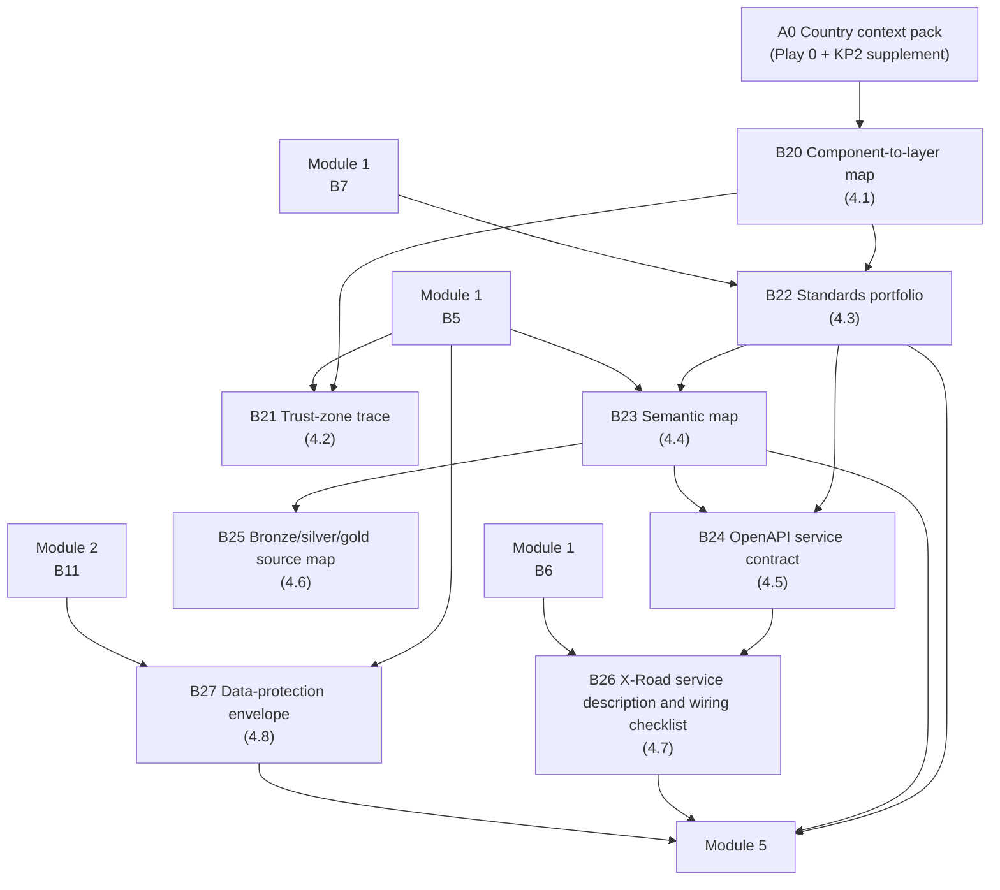

# Module 4 — Architecture and technical standards


🎬 **Video in production:** *KP2 Module 4 — Architecture and technical standards* (~2 min).
The play below does not depend on the video: the concept section carries what the video will say. Come back for the embed, or follow the [video index](../../start-here/video-index.md).



**Worked examples for this module are pending** — every prompt on these pages runs today.


**Persona:** A (Architect) — chief or senior architect, integration lead, or agency technical lead building on the interoperability bus.

**You leave with:** B20, B21, B22, B23, B24, B25, B26, B27, filed in your framework workbook — the technical configuration. Runtime ~40 minutes across 8 videos.

Eight videos on the technical layer: the four functional layers and three trust zones, the standards portfolio adopted rather than written, the semantic map and the OpenAPI contract generated for a real exchange, Giga's school data taken bronze-to-gold onto the bus, the X-Road wiring, and the data-protection envelope that makes an exchange lawful.

## Subtopics

| # | Subtopic | Single message | Your play | Kit skill |
| --- | --- | --- | --- | --- |
| [4.1](./4-1.md) | Place every component — the four functional layers | Four functional layers — Service Access, Event Distribution, Trust and Security, Governance and Administration — give every component of the platform a place. | 🔍 B20 | `bb-landscape-check` |
| [4.2](./4-2.md) | Secure every call — the three trust zones | Public, Member-Internal, Trust-Anchor — knowing which zone a call crosses tells you exactly what security it needs. | ✍️ B21 | `bb-landscape-check` |
| [4.3](./4-3.md) | Adopt the standards portfolio | Adopt the published standards — REST/OpenAPI, OAuth/OIDC, mTLS, X-Road — instead of writing your own; the portfolio is the menu every member shares. | 🔍 B22 | `ea-comparator-evidence` |
| [4.4](./4-4.md) | Generate the semantic map | Generate a semantic map so two agencies mean the same 'learner' before they exchange one — the hardest layer, made tractable. | ✍️ B23 | `gif-semantic-map` |
| [4.5](./4-5.md) | Generate a service contract | Turn a service brief into an OpenAPI contract, then an X-Road service description — the configuration that puts a service on the bus. | ✍️ B24 | `gif-openapi-gen` |
| [4.6](./4-6.md) | Put a real data source on the bus — the Giga case | Take Giga's real school data through a bronze/silver/gold pipeline onto the bus — a worked exchange you can copy for your sector. | ✍️ B25 | `gif-semantic-map` |
| [4.7](./4-7.md) | Wire a service onto the bus | The OpenAPI contract becomes an X-Road service description and the call resolves — the GovStack Information Mediation pattern. | ✍️ B26 | `gif-openapi-gen` |
| [4.8](./4-8.md) | Make the exchange lawful — the data-protection envelope | Letters of Interest plus a data-protection envelope make a real exchange lawful as well as technically possible. | ✍️ B27 | `ea-legal-context` |

## How the plays chain in this module

The full chain, including where these artefacts come from and go next, is on [Your framework workbook](../your-framework-workbook.md).


**Before you start.** Every play asks you to paste country context. Build it once with [Play 0](../../start-here/play-0.md) — that is **A0** — and add the three KP2 sections from the [Play 0 supplement](../play-0-supplement.md). No country to hand? Run them on [Progressa](../../start-here/progressa.md), the fictional demonstration country; for Modules 4 and 5 the [build pack](../build-pack/README.md) is Progressa's finished output.



New to the plays? Read [How to use the plays](../../start-here/how-to-use-the-plays.md) and [Working with AI](../../start-here/working-with-ai.md) first — part of the about fifteen minutes of Start here, and they apply to every module of every Knowledge Product.

