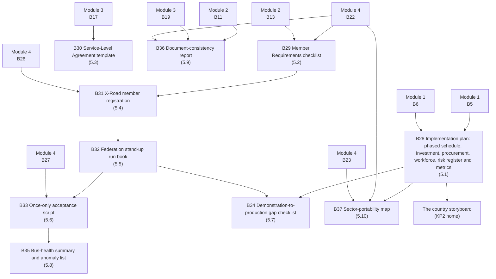

# Module 5 — Implementation and onboarding


🎬 **Video in production:** *KP2 Module 5 — Implementation and onboarding* (~2 min).
The play below does not depend on the video: the concept section carries what the video will say. Come back for the embed, or follow the [video index](../../start-here/video-index.md).



**Worked examples for this module are pending** — every prompt on these pages runs today.


**Why ten videos.** 5.8–5.10 were Module 6 in the v0.1 bundles. Module 6 was retired on 12 September 2026 (as KP1 retired its AI-plays module on 3 September): its catalogue, role-paths and storyboard repeated the earlier modules and now live on the [KP2 home page](../README.md); its three genuinely new plays — watching the bus, cross-checking the framework's documents, carrying it to the next sector — are the last three videos here. 5.9 and 5.10 return to the Strategist; every video states its persona and stands alone.


**Persona:** Architect for 5.1–5.8; Strategist for 5.9–5.10.

**You leave with:** B28, B29, B30, B31, B32, B33, B34, B35, B36, B37, filed in your framework workbook — the runnable slice, then the framework in operation. Runtime ~47 minutes across 10 videos.

Ten videos on standing the framework up and running it: the four-phase plan on an honest calendar with the investment, procurement, workforce and risk plans beside it, Member Requirements and the SLA, registering a member, standing up the Linkup federation, the live once-only exchange that is the framework's acceptance check, what changes for production — and then watching the bus from its logs, keeping the decree, Governance Pack and standards portfolio from contradicting each other, and carrying the framework to the next sector.

## Subtopics

| # | Subtopic | Single message | Your play | Kit skill |
| --- | --- | --- | --- | --- |
| [5.1](./5-1.md) | Plan the build in four phases | Foundation, Pilot, Expansion, Optimisation — four phases with decision gates, an honest calendar, and the four plans beside the schedule that a funder actually reads. | ✍️ B28 | `ea-method-runner` |
| [5.2](./5-2.md) | State what a member must have — the Member Requirements | The Member Requirements template tells an agency exactly what it must have before it can join — no surprises at go-live. | ✍️ B29 | `ea-governance-drafter` |
| [5.3](./5-3.md) | Make 'connected' mean 'dependable' — the SLA | A Service-Level Agreement turns 'connected' into 'dependable' — the template makes it a fill-in, not a negotiation from scratch. | ✍️ B30 | `ea-governance-drafter` |
| [5.4](./5-4.md) | Register a member on X-Road | Generate the subsystem registration and the access-control list — the configuration that admits one agency to the bus. | ✍️ B31 | `gif-federation-standup` |
| [5.5](./5-5.md) | Stand up the federation | Central Server, four Security Servers, a Test CA — the Linkup federation, stood up from the run book. | ✍️ B32 | `gif-federation-standup` |
| [5.6](./5-6.md) | Run the once-only exchange, live | PNEA issues a credential and pre-fills identity from PNIA and enrolment from PLR — a real cross-server call, the data asked once. | ✍️ B33 | `gif-federation-standup` |
| [5.7](./5-7.md) | From demonstration to production | What changes between the sandboxed Linkup demonstration and a production-grade federation a country would actually run. | 🔍 B34 | `ea-method-runner` |
| [5.8](./5-8.md) | Watch the bus — monitoring and anomaly detection | Point Claude at the real bus logs to spot a failing or unusual exchange before a citizen does. | 🔍 B35 | `gif-bus-monitor` |
| [5.9](./5-9.md) | Keep the documents honest — the consistency cross-check | Keep the decree, the Governance Pack and the standards portfolio saying the same thing — a cross-check that catches drift across the three. | 🔍 B36 | `gif-consistency-check` |
| [5.10](./5-10.md) | Carry the framework to the next sector | The same four-layer framework stands up interoperability beyond education — the method is sector-portable, and the second sector is cheaper than the first. | ✍️ B37 | `ea-method-runner` |

## How the plays chain in this module

The full chain, including where these artefacts come from and go next, is on [Your framework workbook](../your-framework-workbook.md).


**Before you start.** Every play asks you to paste country context. Build it once with [Play 0](../../start-here/play-0.md) — that is **A0** — and add the three KP2 sections from the [Play 0 supplement](../play-0-supplement.md). No country to hand? Run them on [Progressa](../../start-here/progressa.md), the fictional demonstration country; for Modules 4 and 5 the [build pack](../build-pack/README.md) is Progressa's finished output.



New to the plays? Read [How to use the plays](../../start-here/how-to-use-the-plays.md) and [Working with AI](../../start-here/working-with-ai.md) first — part of the about fifteen minutes of Start here, and they apply to every module of every Knowledge Product.

