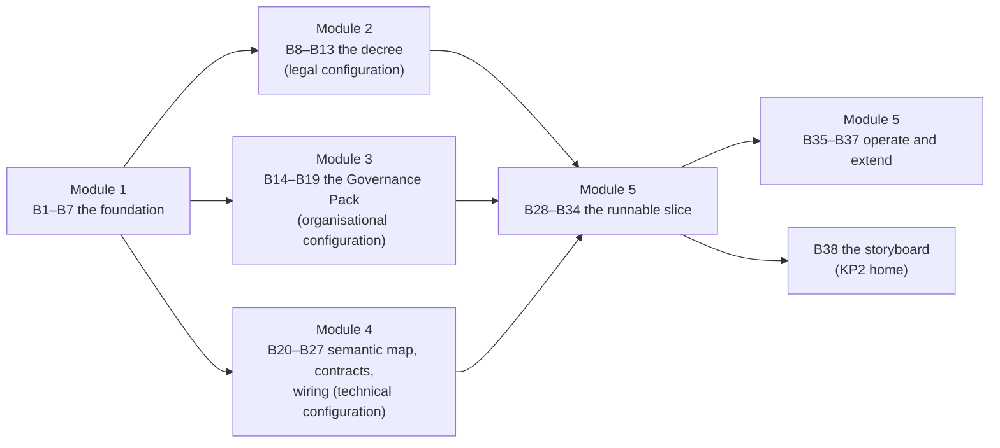

# Your framework workbook

Each play produces one artefact. Run them in order and the artefacts feed each other. KP2's artefacts are not briefing documents, as KP1's were; they are the **configuration of your framework** — the decree is the legal configuration, the Governance Pack the organisational, the semantic map and service contracts the technical — and Module 5 stands them up as one running solution. This page is the map. If you have no country to hand, use Progressa: the [build pack](build-pack/README.md) is Progressa's finished configuration, and the worked examples on each play page show what each artefact looks like.


Keep the artefacts in one folder, named as below. The **Consumes** and **Feeds** columns are the chain: every play names what it reads and what reads it, so you can start anywhere and see what you need first.


## A0 — the pack everything starts from

| Artefact | What it is | Produced by | Feeds |
| --- | --- | --- | --- |
| **A0 §1–§7** | Country context pack — landscape brief, programme list, ministry context, roles register, characteristics, sector bodies, legal list | [Play 0](../start-here/play-0.md) 🔍 | the whole chain below |
| **A0 §8–§10** | The KP2 supplement — the current exchange approach, the integration map, the data-protection law and DPA | [Play 0 supplement](play-0-supplement.md) 🔍 | 1.1, 1.2, 1.3, 1.5, 2.1, 4.8 |

## Hand-offs from KP1

If you ran KP1, three of its artefacts enter the chain here; if not, the plays named build the equivalent.

| KP1 artefact | Enters KP2 at | If you do not have it |
| --- | --- | --- |
| **A0** country context pack | [1.1](module-1/1-1.md), [1.5](module-1/1-5.md), [1.6](module-1/1-6.md) | run [Play 0](../start-here/play-0.md) and the [supplement](play-0-supplement.md) |
| **A7** Governance Board terms of reference | [3.1](module-3/3-1.md) — the Operating Authority | 3.1 drafts the mandate from A0 §6 |
| **A24** sourcing matrix | [4.3](module-4/4-3.md) — the standards portfolio | 4.3 assembles it from the published menu and 1.7's shortlist |

## The three configuration layers, and where they run

## Every artefact in KP2

### Module 1 — Why interoperability and the four layers

*The foundation.*

| Artefact | What it is | Produced by | Consumes | Feeds |
| --- | --- | --- | --- | --- |
| **B1** | Procured-vs-planned diagnostic | [1.1](module-1/1-1.md) 🔍 | A0 §1, A0 §8 | 1.4 |
| **B2** | Four-layer exchange map | [1.2](module-1/1-2.md) 🔍 | A0 §1, A0 §9 | — |
| **B3** | Highest-value once-only exchange | [1.3](module-1/1-3.md) 🔍 | A0 §2, A0 §9 | 1.4, 1.5 |
| **B4** | Strategic Foundation Document | [1.4](module-1/1-4.md) ✍️ | B1, B3, A0 §7 | 2.2, 2.3, 3.1 |
| **B5** | Use-Case Catalogue | [1.5](module-1/1-5.md) ✍️ | A0 §9, B3 | 2.4, 2.6, 4.2, 4.4, 4.8, 5.1, storyboard |
| **B6** | Stakeholder tier map | [1.6](module-1/1-6.md) 🔍 | A0 §4, A0 §6 | 3.3, 3.4, 4.7, 5.1 |
| **B7** | Standards-to-reuse shortlist | [1.7](module-1/1-7.md) 🔍 | A0 §1 | 4.3 |

### Module 2 — Legal framework — the Decree Drafting Kit

*The legal configuration — the decree.*

| Artefact | What it is | Produced by | Consumes | Feeds |
| --- | --- | --- | --- | --- |
| **B8** | Legal-readiness assessment | [2.1](module-2/2-1.md) 🔍 | A0 §7, A0 §10 | 2.2 |
| **B9** | Decree outline (five components) | [2.2](module-2/2-2.md) ✍️ | B4, B8 | 2.3, 2.4 |
| **B10** | Explanatory Memorandum and Preamble | [2.3](module-2/2-3.md) ✍️ | B4, B9 | 2.5 |
| **B11** | Operative article draft | [2.4](module-2/2-4.md) ✍️ | B9, B5 | 2.5, 2.6, 4.8, 5.9 |
| **B12** | Cover Note and two-track memo | [2.5](module-2/2-5.md) ✍️ | B10, B11 | — |
| **B13** | Legal acceptance check | [2.6](module-2/2-6.md) 🔍 | B5, B11 | 5.2 |

### Module 3 — Governance model — three tiers with RACI

*The organisational configuration — the Governance Pack.*

| Artefact | What it is | Produced by | Consumes | Feeds |
| --- | --- | --- | --- | --- |
| **B14** | Owner's mandate, regulator and operator split | [3.1](module-3/3-1.md) ✍️ | A0 §6, B4 | 3.2 |
| **B15** | Three-tier governance structure | [3.2](module-3/3-2.md) ✍️ | A0 §4, B14 | 3.3, 3.5 |
| **B16** | Governance RACI | [3.3](module-3/3-3.md) ✍️ | B15, B6 | 3.4, 3.6 |
| **B17** | Member obligations and agreement | [3.4](module-3/3-4.md) ✍️ | B16, B6 | 5.3 |
| **B18** | Four Working Group charters | [3.5](module-3/3-5.md) ✍️ | B15 | 3.6 |
| **B19** | Change control, standards register (with conformance fields) and semantic-registry charter | [3.6](module-3/3-6.md) ✍️ | B16, B18 | 5.9 |

### Module 4 — Architecture and technical standards

*The technical configuration.*

| Artefact | What it is | Produced by | Consumes | Feeds |
| --- | --- | --- | --- | --- |
| **B20** | Component-to-layer map | [4.1](module-4/4-1.md) 🔍 | A0 §6 | 4.2, 4.3 |
| **B21** | Trust-zone trace | [4.2](module-4/4-2.md) ✍️ | B5, B20 | — |
| **B22** | Standards portfolio | [4.3](module-4/4-3.md) 🔍 | B7, B20 | 4.4, 4.5, 5.2, 5.9, 5.10 |
| **B23** | Semantic map | [4.4](module-4/4-4.md) ✍️ | B5, B22 | 4.5, 4.6, 5.10 |
| **B24** | OpenAPI service contract | [4.5](module-4/4-5.md) ✍️ | B23, B22 | 4.7 |
| **B25** | Bronze/silver/gold source map | [4.6](module-4/4-6.md) ✍️ | B23 | — |
| **B26** | X-Road service description and wiring checklist | [4.7](module-4/4-7.md) ✍️ | B24, B6 | 5.4 |
| **B27** | Data-protection envelope | [4.8](module-4/4-8.md) ✍️ | B5, B11 | 5.6 |

### Module 5 — Implementation and onboarding

*The runnable slice, then the framework in operation.*

| Artefact | What it is | Produced by | Consumes | Feeds |
| --- | --- | --- | --- | --- |
| **B28** | Implementation plan: phased schedule, investment, procurement, workforce, risk register and metrics | [5.1](module-5/5-1.md) ✍️ | B5, B6 | 5.7, 5.10, storyboard |
| **B29** | Member Requirements checklist | [5.2](module-5/5-2.md) ✍️ | B22, B13 | 5.4 |
| **B30** | Service-Level Agreement template | [5.3](module-5/5-3.md) ✍️ | B17 | — |
| **B31** | X-Road member registration | [5.4](module-5/5-4.md) ✍️ | B26, B29 | 5.5 |
| **B32** | Federation stand-up run book | [5.5](module-5/5-5.md) ✍️ | B31 | 5.6, 5.7 |
| **B33** | Once-only acceptance script | [5.6](module-5/5-6.md) ✍️ | B32, B27 | 5.8 |
| **B34** | Demonstration-to-production gap checklist | [5.7](module-5/5-7.md) 🔍 | B32, B28 | — |
| **B35** | Bus-health summary and anomaly list | [5.8](module-5/5-8.md) 🔍 | B33 | — |
| **B36** | Document-consistency report | [5.9](module-5/5-9.md) 🔍 | B11, B19, B22 | — |
| **B37** | Sector-portability map | [5.10](module-5/5-10.md) ✍️ | B28, B22, B23 | — |

### The storyboard

| Artefact | What it is | Produced by | Consumes | Feeds |
| --- | --- | --- | --- | --- |
| **B38** | Country storyboard — a minister-ready narrative of your country's path to its first once-only service | [KP2 home](README.md#from-no-framework-to-first-service-the-storyboard) ✍️ | B5, B28 | — |

## What the pack contains when you are done

1. **The foundation:** B4 the Strategic Foundation Document and B5 the Use-Case Catalogue, with B6 telling you who to onboard first.
2. **The legal configuration:** the decree — B9 to B12 — checked by B13 against the catalogue it must authorise exactly.
3. **The organisational configuration:** the Governance Pack — B14 to B19 — with one Accountable per decision and a named standards-portfolio owner.
4. **The technical configuration:** B22 the standards portfolio, B23 the semantic map, B24 the contract, B26 the wiring and B27 the data-protection envelope, for the first exchange.
5. **The runnable slice:** B28 the phased plan, the member artefacts B29–B31, B32 the run book, and B33 the once-only acceptance script that proves all four layers in one call.
6. **The framework in operation:** B34 the production gap, B35 the bus watched from its logs, B36 the three documents kept honest, B37 the map to the next sector.

## Where the chain goes after KP2

KP3 (the national DPI roadmap) reads the framework this workbook describes as one of the shared platforms a country sequences; KP4 (building-block services) puts services on the bus KP2 stood up. Those pages are added as each Knowledge Product is published.
