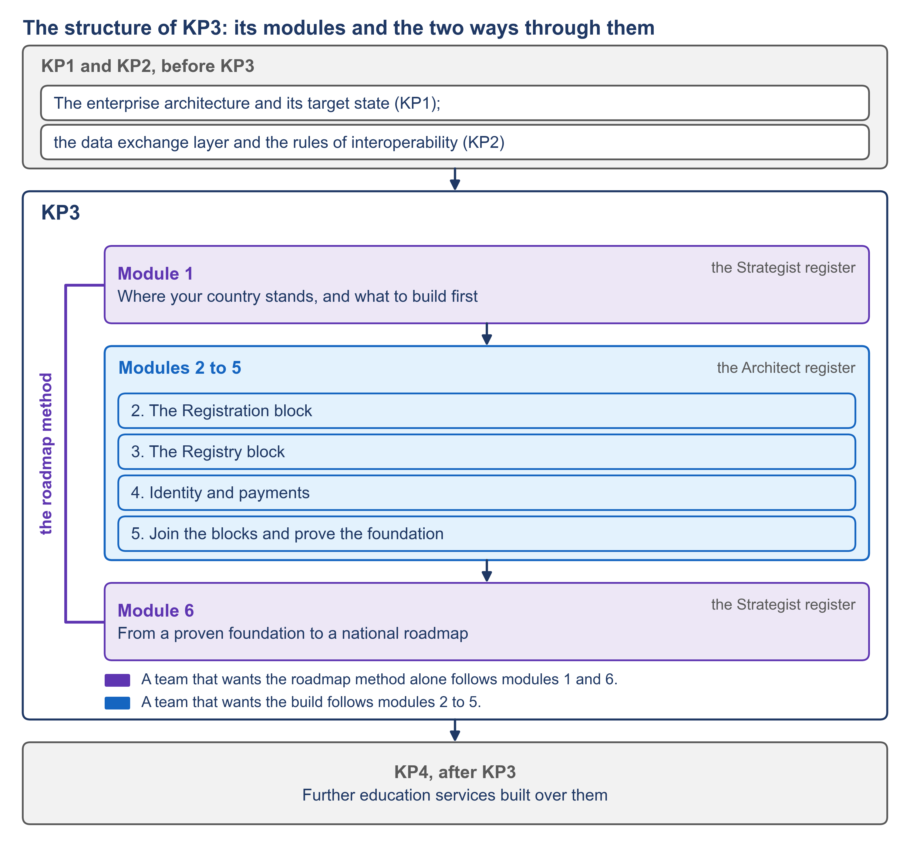

# Education Digital Public Infrastructure (DPI) Roadmap

45 videos in six modules · about 217 minutes of video · an AI usage tip on every page · nine worked examples · an assessment toolkit · self-paced · free and open

This guide teaches a government team how to produce a national roadmap for digital public infrastructure, and it shows the first step of such a roadmap working in the education sector. Digital public infrastructure, DPI for short, is the set of shared digital systems that many services of a country stand on: digital identity, digital payments and the exchange of data between public bodies, with others emerging.

The guide has six modules and 45 subtopics. Each subtopic is one short video with a written page and an AI usage tip. Module 1 teaches how to find out where the country stands and how to choose what to build first. Modules 2 to 5 build one education service, the registration of a learner, on four shared building blocks, and prove that the blocks work together. Module 6 teaches how to turn that proof into a national roadmap: priorities, sequence, investment, sourcing, governance, adoption and upkeep. Everything is shown on Progressa, a fictional country, and the method is written so that another sector can use it.

*F1. The structure of the guide: its modules and the two ways through them.*

## Outline

| Module | Topic | Persona | Videos | AI tips | Status |
| --- | --- | --- | --- | --- | --- |
| [1](module-1/README.md) | Where your country stands, and what to build first | Strategist | 10 | 10 tips | Prompts live |
| [2](module-2/README.md) | The Registration block | Architect | 6 | 6 tips | Prompts live |
| [3](module-3/README.md) | The Registry block | Architect | 7 | 7 tips | Prompts live |
| [4](module-4/README.md) | Identity and payments | Architect | 6 | 6 tips | Prompts live |
| [5](module-5/README.md) | Join the blocks and prove the foundation | Architect | 6 | 6 tips | Prompts live |
| [6](module-6/README.md) | From a proven foundation to a national roadmap | Strategist | 10 | 10 tips | Prompts live |

*Prompts live — every page of the module is written, with its prompt. In production — the module's pages are added as its scripts are written.*


**How the course works.** **Watch** the video → **Read** its page, the video written out in full → **Prompt** with its AI usage tip on your own country → **Compare** your draft with the worked example for Progressa. The nine [worked examples](examples/README.md), E1 to E9, follow the nine steps of the method and link to one another: findings, gaps, roadmap components, investment lines and comments, so that any budget line can be followed back to the evidence behind it. Work through them in order and you have the shape of your own country's roadmap, step by step.


| Module | What you can do afterwards | What is built |
| --- | --- | --- |
| 1 | Commission and defend an assessment of the country's DPI; read its result on one table; say which blocks are foundational, which belong to the sector, and which service to build first | Nothing is built. The module uses the assessment toolkit. |
| 2 | Set up a registration service from a description, with its checks, its officer's decision and its write to the register | Configurations R1 to R10 |
| 3 | Set up a register from a schema file, load it through checked tiers, account for every load and open it to other services under rules | Configurations RG1 to RG13 |
| 4 | Connect a service to the identity block and to the Payments block instead of building either again | Configurations I1 to I7 and P1 to P7 |
| 5 | Say what must be in place before blocks can call each other, name the block that holds the sequence, run the once-only registration and read its evidence | Configurations X1 to X7 |
| 6 | Rank the gaps, decide what to fund first, write the roadmap over time and its investment case, choose how to source each block, set up its governance, have it adopted and keep it healthy | Nothing is built. The module uses the worked examples. |

## Audience — and the path for your role

| Persona | Who that is in practice | Modules | What you leave with |
| --- | --- | --- | --- |
| **Strategist** | Director of a digital agency, head of a sector's ICT unit, or the officer who prepares the minister's brief: the person who plans the work and makes the case for it | [1](module-1/README.md), [6](module-6/README.md) | The case and the plan: an assessment of the country's DPI read on one maturity table, the foundational blocks told apart from the sector's own, the first service chosen; then the ranked gaps, what to fund first, the roadmap over time with its investment case, its sourcing and its governance, and the route to its adoption and upkeep. |
| **Architect** | The technical lead of a sector ICT unit or a digital agency: the team that sets the service up | [2](module-2/README.md), [3](module-3/README.md), [4](module-4/README.md), [5](module-5/README.md) | The build: a registration service and a learner register set up from descriptions, connected to identity and payments through the data exchange layer instead of building either again, and one once-only registration run from beginning to end and read from its evidence. |

In both, the listener is the person who builds the case upward, not the minister. A Strategist who follows only modules 1 and 6 gets the whole method; an Architect who follows only 2 to 5 gets the whole build.

### Two ways through

| Way | Modules | What it gives |
| --- | --- | --- |
| **The method alone** | [1](module-1/README.md), [6](module-6/README.md) | A team that wants the roadmap method follows modules 1 and 6: the nine steps, from a desk assessment of what the country has to a roadmap that an authority adopts. |
| **The build** | [2](module-2/README.md), [3](module-3/README.md), [4](module-4/README.md), [5](module-5/README.md) | A team that wants the build follows modules 2 to 5: one registration service and one learner register, connected to identity and payments through the data exchange layer, and proved by checks. |

The order of the modules follows the order in which a country that starts from little would work. It first assesses where it stands and picks one priority service. It then builds that service on the foundational blocks and proves it. With that proof it writes the full roadmap, with its costs and its governance, and has it adopted.

## All videos

Core marks the content without which the method cannot be followed from assessment to roadmap, or the build from its first configuration to its proof. Supplementary marks a video that deepens a core one and can be left out without losing the thread.

<strong>Module 1 — Where your country stands, and what to build first</strong>

| # | Video | Class | Demonstration | Page |
| --- | --- | --- | --- | --- |
| [1.1](module-1/1-1.md) | What makes infrastructure foundational | Core | — | Page live |
| [1.2](module-1/1-2.md) | The five domains, as a map | Core | — | Page live |
| [1.3](module-1/1-3.md) | The roadmap method in nine steps: who does what | Core | — | Page live |
| [1.4](module-1/1-4.md) | Start at the desk: a first assessment from public sources, with AI | Core | Yes | Page live |
| [1.5](module-1/1-5.md) | Ask the people who run the systems: the five questionnaires | Core | — | Page live |
| [1.6](module-1/1-6.md) | Verify before you score | Core | — | Page live |
| [1.7](module-1/1-7.md) | Score each domain: five stages and one table | Core | Yes | Page live |
| [1.8](module-1/1-8.md) | Foundational blocks and the sector's own | Core | — | Page live |
| [1.9](module-1/1-9.md) | What comes first: the order of building | Core | — | Page live |
| [1.10](module-1/1-10.md) | The first proof for education: one service on four blocks | Core | — | Page live |

<strong>Module 2 — The Registration block</strong>

| # | Video | Class | Demonstration | Page |
| --- | --- | --- | --- | --- |
| [2.1](module-2/2-1.md) | What the Registration block does | Core | — | Page live |
| [2.2](module-2/2-2.md) | The published specification, and how to judge a product against it | Supplementary | — | Page live |
| [2.3](module-2/2-3.md) | Generating the registration service | Core | Yes | Page live |
| [2.4](module-2/2-4.md) | Checks before the officer decides | Core | Yes | Page live |
| [2.5](module-2/2-5.md) | The officer decides, and the record is written | Core | Yes | Page live |
| [2.6](module-2/2-6.md) | The whole service as a description you can move | Supplementary | Yes | Page live |

<strong>Module 3 — The Registry block</strong>

| # | Video | Class | Demonstration | Page |
| --- | --- | --- | --- | --- |
| [3.1](module-3/3-1.md) | What a register is for: one authoritative record | Core | — | Page live |
| [3.2](module-3/3-2.md) | Five tiers between a messy file and a trusted record | Core | Yes | Page live |
| [3.3](module-3/3-3.md) | Generating the register's schema | Core | Yes | Page live |
| [3.4](module-3/3-4.md) | Quality checks that stop a bad row | Core | Yes | Page live |
| [3.5](module-3/3-5.md) | A published pattern, followed in the open | Supplementary | — | Page live |
| [3.6](module-3/3-6.md) | Account for every load | Core | Yes | Page live |
| [3.7](module-3/3-7.md) | The register as a service others can use | Core | Yes | Page live |

<strong>Module 4 — Identity and payments</strong>

| # | Video | Class | Demonstration | Page |
| --- | --- | --- | --- | --- |
| [4.1](module-4/4-1.md) | Why identity is built once | Core | — | Page live |
| [4.2](module-4/4-2.md) | The published Identity block, and what the identity authority offers today | Core | — | Page live |
| [4.3](module-4/4-3.md) | Generating the identity connection | Core | Yes | Page live |
| [4.4](module-4/4-4.md) | The Payments block and the payment systems behind it | Core | — | Page live |
| [4.5](module-4/4-5.md) | Generating the payment connection | Core | Yes | Page live |
| [4.6](module-4/4-6.md) | Reuse is the return on planning | Core | — | Page live |

<strong>Module 5 — Join the blocks and prove the foundation</strong>

| # | Video | Class | Demonstration | Page |
| --- | --- | --- | --- | --- |
| [5.1](module-5/5-1.md) | What must be in place before the blocks can call each other | Core | Yes | Page live |
| [5.2](module-5/5-2.md) | Who puts the steps in order: contracts, and the block that calls them | Core | — | Page live |
| [5.3](module-5/5-3.md) | The once-only registration, from beginning to end | Core | Yes | Page live |
| [5.4](module-5/5-4.md) | The acceptance checks: from "set up" to "proven" | Core | Yes | Page live |
| [5.5](module-5/5-5.md) | Reading the evidence of a call | Supplementary | Yes | Page live |
| [5.6](module-5/5-6.md) | What the next services can now use | Core | — | Page live |

<strong>Module 6 — From a proven foundation to a national roadmap</strong>

| # | Video | Class | Demonstration | Page |
| --- | --- | --- | --- | --- |
| [6.1](module-6/6-1.md) | From findings to priorities: the gap register | Core | — | Page live |
| [6.2](module-6/6-2.md) | What to fund first: cost against reuse | Core | — | Page live |
| [6.3](module-6/6-3.md) | The roadmap over time: horizons, waves and tracks | Core | — | Page live |
| [6.4](module-6/6-4.md) | The investment case your finance ministry can read | Core | — | Page live |
| [6.5](module-6/6-5.md) | Sourcing each block without lock-in | Core | — | Page live |
| [6.6](module-6/6-6.md) | Governance that keeps shared blocks shared | Core | — | Page live |
| [6.7](module-6/6-7.md) | Validate, revise, adopt | Core | — | Page live |
| [6.8](module-6/6-8.md) | Keep the foundation healthy and safe | Core | — | Page live |
| [6.9](module-6/6-9.md) | The AI plays, step by step | Core | Yes | Page live |
| [6.10](module-6/6-10.md) | Carry the method to another sector | Core | — | Page live |

## How to use this guide

Each subtopic page holds the content of its video written out in full, its worked example, its AI usage tip with the prompt ready to copy, and its sources with their links. A page can be read on its own, like the video it goes with.

Every AI usage tip has four parts: the problem it solves, the prompt, what goes in and what comes out, and a safeguard. The assistant drafts and a person decides: no tip hands a decision over.

Every worked example is built for Progressa. Its values are invented for Progressa, and nothing in it is taken from the results of any country. Figures from public sources are given with their source, their year and their page.

Before your first prompt, read [Working with AI](../start-here/working-with-ai.md) and [How to use the plays](../start-here/how-to-use-the-plays.md): they hold the ground rules for using an assistant on government material, and they apply to every course on this site.

## Prerequisites

**[Developing a Gov Enterprise Architecture (GEA)](../kp1/README.md) and [Building a Government Interoperability Framework (GIF)](../kp2/README.md) come before this course, but neither is a prerequisite.** Modules 1 and 6 stand on their own. Modules 2 to 5 assume a data exchange layer is already running, the one the interoperability course sets up; on Progressa it is Linkup, already in place, so you can follow them without having taken that course.

**What you do need:**

| | |
| --- | --- |
| **A real subject** | A country, or a sector within one, whose digital public infrastructure you are asked to assess or plan. The AI usage tips act on your context, not on a case study. No subject to hand? Follow everything on [Progressa](../start-here/progressa.md) instead. |
| **Enough access to describe it** | The desk assessment starts from the country's public record alone ([1.4](module-1/1-4.md)). The five questionnaires need the time of the people who run its systems ([1.5](module-1/1-5.md)). |
| **An AI assistant** | Any general assistant — Claude, ChatGPT, Gemini. A free account is enough. Nothing to install. |
| **Nothing to run** | No code is written. Modules 2 to 5 show each configuration as a specimen until it has been built and checked; [the build plan](build-pack.md) says which. |
| **About fifteen minutes, once** | The first pages of [Start here](../start-here/README.md) cover how to work with the prompts and the ground rules for using an assistant on government material. Read them before your first prompt. |

Time: each subtopic is a video of about five minutes, its page, and an AI usage tip of ten to fifteen minutes. A module is an afternoon. The whole course is roughly two working days spread over as long as you like.

<table data-view="cards"><thead><tr><th></th><th></th><th></th><th data-hidden data-card-target data-type="content-ref"></th></tr></thead><tbody>
<tr><td><h3>🛡️</h3></td><td><strong>Working with AI</strong></td><td>What an assistant is good for, the four ways it misleads you, and the safeguards. Read once; applies to all four Knowledge Products.</td><td><a href="../start-here/working-with-ai.md">working-with-ai</a></td></tr>
<tr><td><h3>🏁</h3></td><td><strong>Module 1 — Where your country stands, and what to build first</strong></td><td>10 videos for the Strategist: the five domains, the nine steps, the assessment and its scoring, and the first proof chosen.</td><td><a href="module-1/README.md">module-1</a></td></tr>
<tr><td><h3>📒</h3></td><td><strong>The worked examples</strong></td><td>E1 to E9, one for each step of the method, built for Progressa and linked to one another: the shape of the roadmap you will write.</td><td><a href="examples/README.md">examples</a></td></tr>
<tr><td><h3>🧰</h3></td><td><strong>The assessment toolkit</strong></td><td>The question bank, the five questionnaires with their guides, the scoring criteria and the templates for verification.</td><td><a href="toolkit/README.md">toolkit</a></td></tr>
</tbody></table>

## Reference pages

<table data-view="cards"><thead><tr><th></th><th></th><th data-hidden data-card-target data-type="content-ref"></th></tr></thead><tbody>
<tr><td><strong>The nine steps</strong></td><td>Each step of the method with its roles, inputs, outputs, tools or templates, decision point and validation.</td><td><a href="nine-steps.md">nine-steps</a></td></tr>
<tr><td><strong>The assessment toolkit</strong></td><td>The question bank, the five questionnaires with their guides, the scoring criteria and the templates for verification.</td><td><a href="toolkit/README.md">toolkit</a></td></tr>
<tr><td><strong>The worked examples</strong></td><td>One example for each of the nine steps, built for Progressa and linked to one another.</td><td><a href="examples/README.md">examples</a></td></tr>
<tr><td><strong>The build plan</strong></td><td>What the build will contain: every configuration of modules 2 to 5, its check, and how it is taught until it is built.</td><td><a href="build-pack.md">build-pack</a></td></tr>
<tr><td><strong>Frameworks and standards</strong></td><td>The public frameworks and standards this guide cites, in five kinds, each with its address.</td><td><a href="frameworks-and-standards.md">frameworks-and-standards</a></td></tr>
<tr><td><strong>Glossary</strong></td><td>The terms this guide uses, and the names used for Progressa.</td><td><a href="glossary.md">glossary</a></td></tr>
<tr><td><strong>Figures</strong></td><td>The sixteen figures of the guide.</td><td><a href="figures.md">figures</a></td></tr>
</tbody></table>

## Where this sits

This course is the third of four ITU/Giga Knowledge Products, after [Developing a Gov Enterprise Architecture (GEA)](../kp1/README.md) and [Building a Government Interoperability Framework (GIF)](../kp2/README.md); a fourth, on building-block services, is planned.

| Part | What it takes | What it gives |
| --- | --- | --- |
| [Developing a Gov Enterprise Architecture (GEA)](../kp1/README.md) and [Building a Government Interoperability Framework (GIF)](../kp2/README.md), before this course | — | The enterprise architecture and its target state; the data exchange layer and the rules of interoperability |
| Module 1 | Public information about the country, and the time of the people who run its systems | The map of the five domains, the maturity table, the list of foundational and sectoral blocks, the order of building, the first proof chosen |
| Modules 2 to 5 | The first proof chosen, and the foundations the country already has | A registration service, a learner register, connections to identity and payments, and one proven run from beginning to end |
| Module 6 | The findings of the assessment, and the proof | The gap register, the order of funding, the roadmap over time, the investment case, the choice of sourcing, the governance, the adopted roadmap and its upkeep |
| The course after this one | The blocks this course has proven | Further education services built over them |

All the courses on this site use [Progressa](../start-here/progressa.md) as the one worked example and share one set of [ground rules](../start-here/working-with-ai.md).


**Use this site from your AI assistant.** Every page is also published as plain Markdown, and the site exposes an `llms.txt` and an MCP endpoint at `/~gitbook/mcp`. Point Claude, ChatGPT or another assistant at the site and ask it to *run the AI usage tip of 1.4 with the following context* — the site becomes the tool's reference, not just yours.

