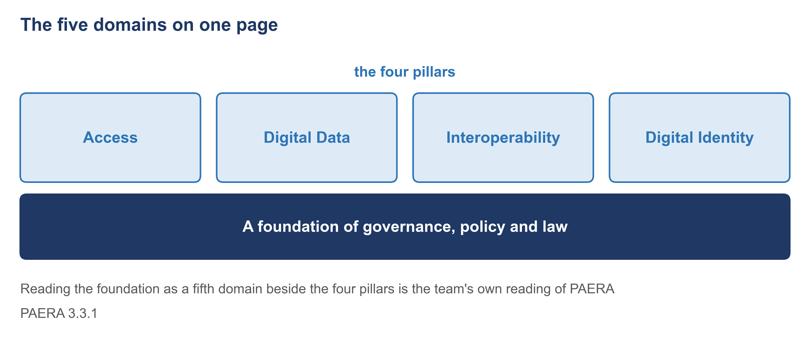
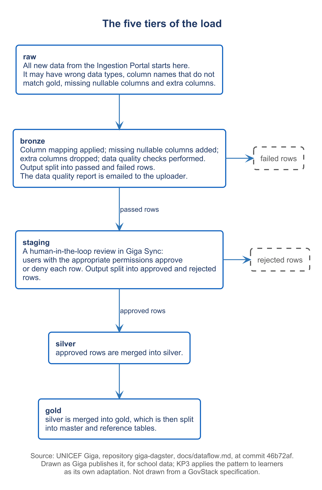
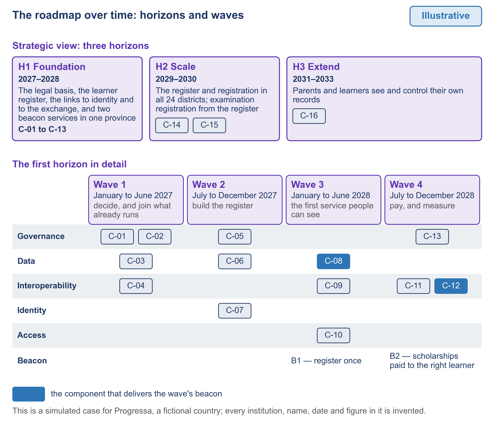
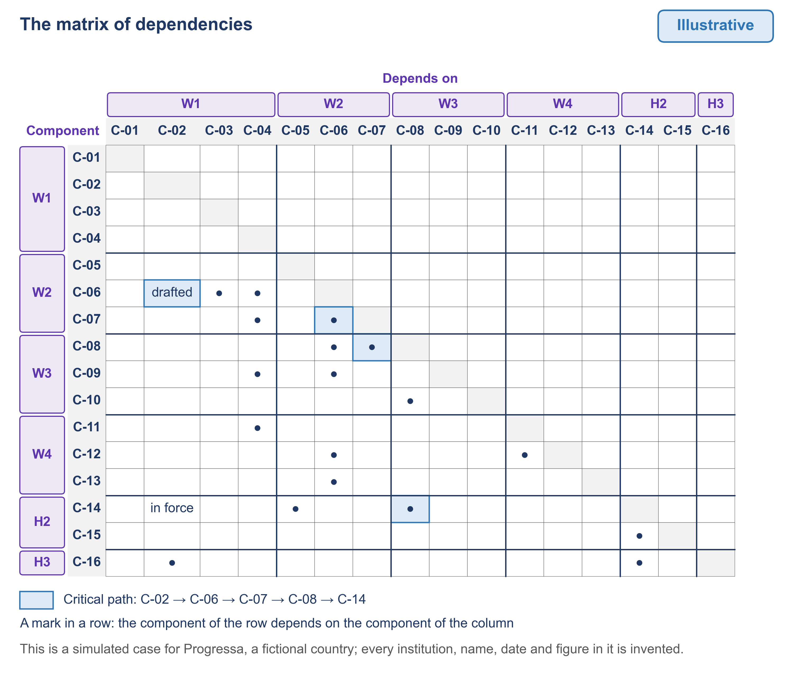
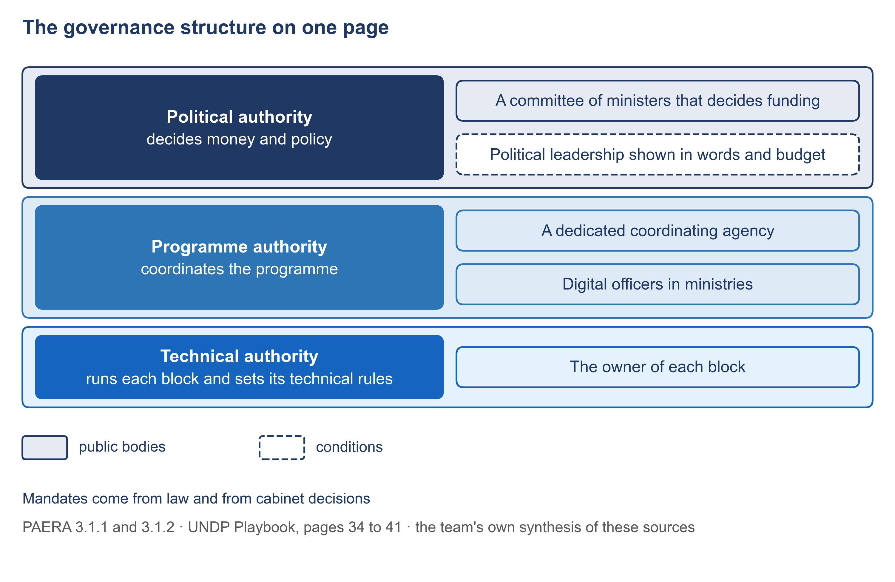

# Figures

The figures are made for this written guide; the slides of the videos stay text-only. A figure marked "from the specification" is drawn from the published specifications and corrected when the configuration is built. A figure drawn from a worked example is illustrative, like the example.

| Figure | What it shows | Used by | State |
| --- | --- | --- | --- |
| F1 | The structure of the guide: its modules and the two ways through them | The opening | Drawn |
| F2 | The five domains on one page | [1.2](module-1/1-2.md) | Drawn |
| F3 | The nine steps with their roles and outputs | [1.3](module-1/1-3.md) | Drawn |
| F4 | The maturity table of Progressa's five domains, marked illustrative | [1.7](module-1/1-7.md) | Drawn |
| F5 | The order of building: PAERA's four phases and the blocks of each | [1.9](module-1/1-9.md) | Drawn |
| F6 | The first proof: four blocks on the data exchange layer | [1.10](module-1/1-10.md) and [5.1](module-5/5-1.md) | Drawn |
| F7 | The workflow of the registration service | [2.5](module-2/2-5.md) | Drawn |
| F8 | The data model of the learner register | [3.3](module-3/3-3.md) | Drawn |
| F9 | The five tiers of the load | [3.2](module-3/3-2.md) | Drawn |
| F10 | The sign-in between the service, the learner and the identity block | [4.3](module-4/4-3.md) | Drawn |
| F11 | The path of a payment: programme account, Payments block, payer bank, payment system | [4.4](module-4/4-4.md) and [4.5](module-4/4-5.md) | Drawn |
| F12 | The once-only registration as a sequence of calls | [5.2](module-5/5-2.md) and [5.3](module-5/5-3.md) | Drawn |
| F13 | The roadmap over time: horizons and waves | [6.3](module-6/6-3.md) | Drawn |
| F14 | The matrix of dependencies | [6.3](module-6/6-3.md) | Drawn |
| F15 | The investment case: its four sheets as tables | [6.4](module-6/6-4.md) | Drawn |
| F16 | The governance structure on one page | [6.6](module-6/6-6.md) | Drawn |

## F1. The structure of the guide: its modules and the two ways through them

## F2. The five domains on one page

## F3. The nine steps with their roles and outputs

## F4. The maturity table of Progressa's five domains, marked illustrative

## F5. The order of building: PAERA's four phases and the blocks of each

## F6. The first proof: four blocks on the data exchange layer

## F7. The workflow of the registration service

## F8. The data model of the learner register

## F9. The five tiers of the load

## F10. The sign-in between the service, the learner and the identity block

## F11. The path of a payment: programme account, Payments block, payer bank, payment system

## F12. The once-only registration as a sequence of calls

## F13. The roadmap over time: horizons and waves

## F14. The matrix of dependencies

## F15. The investment case: its four sheets as tables

## F16. The governance structure on one page

