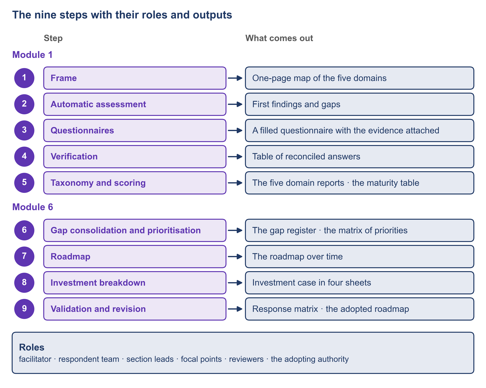

# 1.3 The roadmap method in nine steps: who does what


🎬 **Video in production:** *The roadmap method in nine steps: who does what* (~5 min).
The page below does not depend on the video: it carries what the video will say. The [video index](../../start-here/video-index.md) is the page to watch for links.


> **Single message.** A roadmap is produced in nine steps, and for each step you can say who acts, what goes in, what comes out, who decides and how the result is checked.

| | |
| --- | --- |
| **Written for** | Strategist — the public-sector middle manager who commissions the assessment, defends its result to the minister and plans what to build first |
| **Anchor** | PAERA v1.0 §5.3 (the nine questions of a national assessment; no scale), §5.4 (the eight steps of an organisational assessment) and §3.1.3 (the seven indicators of low maturity); UNDP, The DPI Approach: A Playbook (2023), page 23. The sequence of nine steps is the team's own. |
| **Runtime** | ~5 min |
| **Class** | Core |
| **Terms of reference** | §3.3 (an assessment method); §4.1 (a step-by-step method with roles, inputs, outputs, tools or templates, decision points and validation); §6 (templates); §4.3 (AI integration — the assessment plan) |

## The concept

A minister who commissions a roadmap will ask three things. Who does the work? When must I decide? How will anyone know the result is right? Nine named steps let you answer all three before the work starts.

For each step you can say five things: who acts, what goes in, what comes out, who decides, and how the result is checked. Add one more: the tool or template the step uses. The roles are few and they recur. The facilitator plans and runs the assessment and keeps its evidence. A respondent team answers for one domain, with a section lead for each part of its questionnaire. Focal points in other bodies confirm what is said about their systems. Reviewers check each step before the next one starts. At the end, an adopting authority makes the roadmap the government's own.

The first five steps find out where the country stands. Step one frames the work on one page. In Progressa, the fictional country of these examples, the ministry of education sponsors it together with PDGA, the digital government authority. Step two reads what the country has published, with an AI assistant; nothing it drafts is yet a finding. Step three sends one questionnaire to each domain. Step four checks every answer before anything is scored; in Progressa, four verification sessions took place in the eighth week. Step five scores each domain on five stages and puts the result on one table. An assistant may propose each stage; a person decides on the evidence, and a reviewer checks.

The last four steps turn the result into a roadmap. Step six turns findings into gaps and ranks them, and a workshop of the bodies concerned decides the order. Step seven writes the roadmap over time. Its dates stay proposals until the budget and the owners of the work confirm them. Step eight costs the roadmap in four sheets that a finance ministry can read. Step nine sends everything back to the bodies for comment, answers every comment in writing, and revises. In Progressa, the ministry of education and PDGA adopt the roadmap, with the cabinet where the budget requires it.

Where do the nine steps come from? No public source gives them in this form. PAERA's section 5.3 lists nine questions that a national assessment must answer, and gives no scale. Its section 5.4 gives eight steps for assessing one organisation, from setting the criteria to continuous improvement. Its section 3.1.3 lists seven signs of low maturity, such as a lack of digital data. UNDP's playbook gives six steps that lead from national priorities to a roadmap. The sequence of nine steps is the team's own, drawn from its multi-country implementation experience.



*F3. The nine steps with their roles and outputs.*

## Your turn — Turn your list of institutions and a start date into an assessment plan

**The problem it solves.** Once a ministry agrees to an assessment, someone has to say who takes part, in which session, in which week, and which documents to ask for. This prompt turns a list of institutions and a start date into a first assessment plan: a stakeholder map, a schedule by step, a plan of sessions and the list of documents to request.

Copy the prompt, replace the bracketed parts with your own context, and run it in the AI assistant of your choice. Never paste personal data or unpublished documents — see [How to use the plays](../../start-here/how-to-use-the-plays.md).

```text
Below is the list of institutions that bear on digital public infrastructure for [sector] in [country X], with what each runs or decides [paste the list], and the planned start date [date]. Plan the first five steps of an assessment: 1 frame; 2 desk review of public sources; 3 one questionnaire per domain; 4 verification; 5 scoring. The five domains are governance and policy with the legal framework, access, digital data, interoperability and digital identity. Produce: (a) a stakeholder map — for each institution, its part in each domain, its influence on the result (high, medium or low) and how it will take part (questionnaire, interview, workshop, or validation only); (b) a schedule by week for the five steps, with the decision taken at the end of each step; (c) a plan of sessions for step 4, each with its domain, the roles invited, its length and the evidence to bring; (d) the list of documents to request from each institution. Name people by role only. Output: a stakeholder map, a schedule by step, a plan of sessions and the list of documents to request, with every name and date marked PROPOSED.
```

[Open in Claude](<https://claude.ai/new?q=Below%20is%20the%20list%20of%20institutions%20that%20bear%20on%20digital%20public%20infrastructure%20for%20%5Bsector%5D%20in%20%5Bcountry%20X%5D%2C%20with%20what%20each%20runs%20or%20decides%20%5Bpaste%20the%20list%5D%2C%20and%20the%20planned%20start%20date%20%5Bdate%5D.%20Plan%20the%20first%20five%20steps%20of%20an%20assessment%3A%201%20frame%3B%202%20desk%20review%20of%20public%20sources%3B%203%20one%20questionnaire%20per%20domain%3B%204%20verification%3B%205%20scoring.%20The%20five%20domains%20are%20governance%20and%20policy%20with%20the%20legal%20framework%2C%20access%2C%20digital%20data%2C%20interoperability%20and%20digital%20identity.%20Produce%3A%20%28a%29%20a%20stakeholder%20map%20%E2%80%94%20for%20each%20institution%2C%20its%20part%20in%20each%20domain%2C%20its%20influence%20on%20the%20result%20%28high%2C%20medium%20or%20low%29%20and%20how%20it%20will%20take%20part%20%28questionnaire%2C%20interview%2C%20workshop%2C%20or%20validation%20only%29%3B%20%28b%29%20a%20schedule%20by%20week%20for%20the%20five%20steps%2C%20with%20the%20decision%20taken%20at%20the%20end%20of%20each%20step%3B%20%28c%29%20a%20plan%20of%20sessions%20for%20step%204%2C%20each%20with%20its%20domain%2C%20the%20roles%20invited%2C%20its%20length%20and%20the%20evidence%20to%20bring%3B%20%28d%29%20the%20list%20of%20documents%20to%20request%20from%20each%20institution.%20Name%20people%20by%20role%20only.%20Output%3A%20a%20stakeholder%20map%2C%20a%20schedule%20by%20step%2C%20a%20plan%20of%20sessions%20and%20the%20list%20of%20documents%20to%20request%2C%20with%20every%20name%20and%20date%20marked%20PROPOSED.>) *(pre-fills the prompt in a new chat; check the bracketed parts before sending)*

**What goes in and what comes out.** Input: a list of institutions with what each runs or decides, and a start date. Output: a stakeholder map, a schedule by step, a plan of sessions and the list of documents to request, every name and date marked as proposed.


**Safeguard.** Names and dates in the plan are proposals until the coordinating body confirms them. A plan that circulates with dates the institutions have not agreed creates commitments nobody made; send it out only after the coordinating body has confirmed who takes part and when.


## Sources

- PAERA v1.0, sections 3.1.3, 5.3 and 5.4 (https://paera.govstack.global/)
- UNDP, The DPI Approach: A Playbook, 21 August 2023, page 23 (https://www.undp.org/publications/dpi-approach-playbook)
