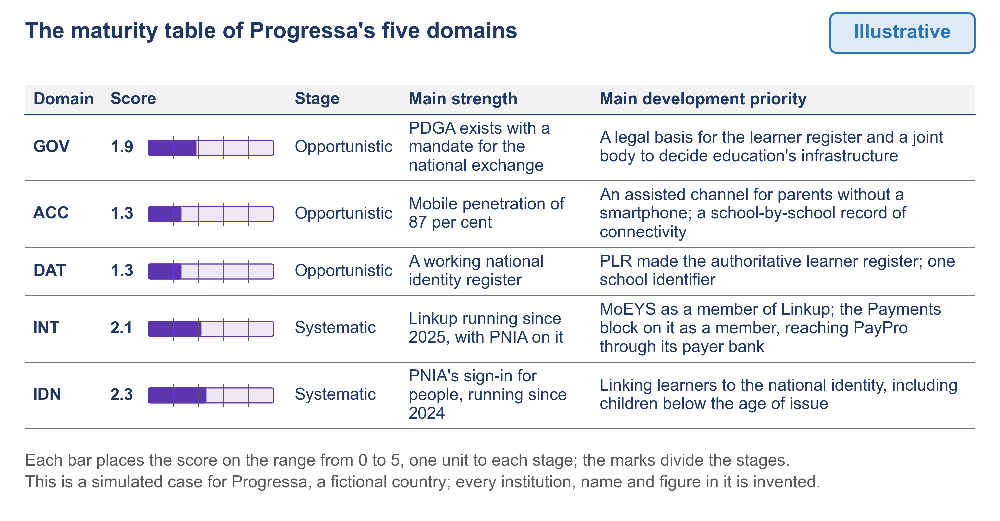

# 1.7 Score each domain: five stages and one table


🎬 **Video in production:** *Score each domain: five stages and one table* (~5 min).
The page below does not depend on the video: it carries what the video will say. The [video index](../../start-here/video-index.md) is the page to watch for links.


> **Single message.** Score each domain on five published stages against written criteria, so that two assessors reach the same result and the whole picture fits on one table.

## The concept

Two assessors who read the same evidence should reach the same score. If they do not, the score is an opinion, and a minister can set it aside. Written criteria on a published scale prevent that.

The scale is the one UNDP publishes in its Digital Development Compass. It has five stages, under these names: Basic, Opportunistic, Systematic, Differentiating and Transformational. The Compass rescales all scores between zero and five, with no zero scores, so that each stage takes one unit of that range. The domains you score are those of PAERA, the GovStack reference architecture, which gives no scale of its own for a national assessment.

The rule that lays the Compass over the five domains is this course's own, and it has four parts. Each of the 26 sub-components has written criteria at three levels: Basic, Systematic and Transformational. Meeting part of the Systematic criterion places a sub-component at Opportunistic; part of the Transformational one, at Differentiating. Only verified positions are scored. Each stage scores the middle of its unit, from 0.5 for Basic to 4.5 for Transformational. A domain's score is the mean of its sub-components, to one decimal place, and its stage is the unit the score falls in.

Here is the result for Progressa, the fictional country of these examples, on one table. Governance, 1.9, Opportunistic. Access, 1.3, Opportunistic. Digital data, 1.3, Opportunistic. Interoperability, 2.1, Systematic. Digital identity, 2.3, Systematic. Each row also names a main strength and a development priority. For digital data, the strength is a working national identity register, and the priority is to make PLR, the learner registry, the authoritative learner register. The digital data score is the mean of six sub-components. Five sit at Opportunistic and one, data quality and master data, at Basic. That gives 1.3.

The demonstration applies the scoring prompt to Progressa's digital data domain. The prompt proposes a stage for each sub-component, and quotes the evidence for each criterion. The assessor confirms or changes each stage in a written record. A good run passes when every stage rests on quoted, verified evidence and the arithmetic gives 1.3. One correction shows why the rule matters. Progressa's draft placed interoperability at 2.3, from an unverified desk result. But a session had already verified that the ministry of education is not a member of Linkup, the data exchange. Once that was pointed out, the score fell to 2.1. Its stage stayed Systematic.




**The worked example of this step** is [E5](../examples/E5_domain-report-and-maturity-table.md), built for Progressa.



**Demonstration.** The scorer applied to one domain of Progressa. It needs The scoring criteria of the assessment toolkit. Until it is recorded, the storyboard in the script stands in its place; see the [build plan](../build-pack.md).


## Your turn — Propose a stage for each sub-component with the scoring prompt


**💡 AI usage tip** · Propose a stage for each sub-component with the scoring prompt

**Bring:** The domain's criteria, copied from the scoring criteria, and the domain's answers as verified, each with its evidence and its verification record.
**Get:** A proposed stage and score for every sub-component, each criterion quoted against the evidence, the proposed domain score and stage, the answers left out, and the conflicts found.
**Time:** ~10–15 min · **Assistant:** any; the tips are tool-neutral.
**Watch for:** The prompt proposes and the assessor decides.


**The problem it solves.** Placing twenty-six sub-components by hand, each against five rows of criteria and many pages of verified answers, is slow, and a tired assessor can skip a criterion. The scoring prompt of the assessment toolkit reads one domain's verified answers against its written criteria and proposes a stage for each sub-component, quoting the evidence for every criterion it counts as met or not met. The assessor then checks each proposal against its quotations, which is faster and leaves a record of why each stage was chosen.



Copy the prompt, replace the bracketed parts with your own context, and run it in the AI assistant of your choice. Never paste personal data or unpublished documents — see [How to use the plays](../../start-here/how-to-use-the-plays.md).

```text
You are helping an assessment team score one domain of a country's digital public infrastructure. You propose; a person decides. DOMAIN: <domain name and code, for example "Digital Data (DAT)"> CRITERIA: <paste this domain's tables from the scoring criteria: every sub-component with its code, its name and its five rows, Basic, Opportunistic, Systematic, Differentiating and Transformational> VERIFIED ANSWERS: <paste the domain's answers. For each: the question code, the answer, the evidence attached to it, and the verification record that confirmed it. Mark any answer that was not verified as UNVERIFIED.> Rules: 1. Use only verified answers. List every answer marked UNVERIFIED under "Answers not used" and do not score from it. 2. For each sub-component, read its rows from Basic upward. Propose the highest stage whose description the evidence fully meets. A row that begins "As Systematic, and" also needs every part of the Systematic row. 3. For every part of a criterion you count as met or as not met, quote the evidence word for word and give its question code. A claim with no quotation behind it is not allowed. 4. If the evidence is not enough to place a sub-component, write "cannot place" and name the question that would settle it. Do not guess. Never fill in an answer that is missing. 5. Give each proposed stage its score: Basic 0.5, Opportunistic 1.5, Systematic 2.5, Differentiating 3.5, Transformational 4.5. The domain score is the mean of the sub-component scores, to one decimal place. The domain's stage is the unit the score falls in: below 1.0 Basic, from 1.0 Opportunistic, from 2.0 Systematic, from 3.0 Differentiating, from 4.0 Transformational. If any sub-component is "cannot place", do not compute the domain score. Write four parts: A. A table with one row per sub-component: code and name; proposed stage; score; the parts of the criterion met, each with its quotation and question code; the parts not met, each with its quotation and question code, or "no evidence". B. The domain score with its arithmetic written out, and the domain's stage; or, if a sub-component could not be placed, what is missing. C. Answers not used, and why. D. Every point where two pieces of evidence disagree, quoted side by side. Everything you write is a proposal for the assessor to confirm or change.
```

[Open in Claude](<https://claude.ai/new?q=You%20are%20helping%20an%20assessment%20team%20score%20one%20domain%20of%20a%20country%27s%20digital%20public%20infrastructure.%20You%20propose%3B%20a%20person%20decides.%20DOMAIN%3A%20%3Cdomain%20name%20and%20code%2C%20for%20example%20%22Digital%20Data%20%28DAT%29%22%3E%20CRITERIA%3A%20%3Cpaste%20this%20domain%27s%20tables%20from%20the%20scoring%20criteria%3A%20every%20sub-component%20with%20its%20code%2C%20its%20name%20and%20its%20five%20rows%2C%20Basic%2C%20Opportunistic%2C%20Systematic%2C%20Differentiating%20and%20Transformational%3E%20VERIFIED%20ANSWERS%3A%20%3Cpaste%20the%20domain%27s%20answers.%20For%20each%3A%20the%20question%20code%2C%20the%20answer%2C%20the%20evidence%20attached%20to%20it%2C%20and%20the%20verification%20record%20that%20confirmed%20it.%20Mark%20any%20answer%20that%20was%20not%20verified%20as%20UNVERIFIED.%3E%20Rules%3A%201.%20Use%20only%20verified%20answers.%20List%20every%20answer%20marked%20UNVERIFIED%20under%20%22Answers%20not%20used%22%20and%20do%20not%20score%20from%20it.%202.%20For%20each%20sub-component%2C%20read%20its%20rows%20from%20Basic%20upward.%20Propose%20the%20highest%20stage%20whose%20description%20the%20evidence%20fully%20meets.%20A%20row%20that%20begins%20%22As%20Systematic%2C%20and%22%20also%20needs%20every%20part%20of%20the%20Systematic%20row.%203.%20For%20every%20part%20of%20a%20criterion%20you%20count%20as%20met%20or%20as%20not%20met%2C%20quote%20the%20evidence%20word%20for%20word%20and%20give%20its%20question%20code.%20A%20claim%20with%20no%20quotation%20behind%20it%20is%20not%20allowed.%204.%20If%20the%20evidence%20is%20not%20enough%20to%20place%20a%20sub-component%2C%20write%20%22cannot%20place%22%20and%20name%20the%20question%20that%20would%20settle%20it.%20Do%20not%20guess.%20Never%20fill%20in%20an%20answer%20that%20is%20missing.%205.%20Give%20each%20proposed%20stage%20its%20score%3A%20Basic%200.5%2C%20Opportunistic%201.5%2C%20Systematic%202.5%2C%20Differentiating%203.5%2C%20Transformational%204.5.%20The%20domain%20score%20is%20the%20mean%20of%20the%20sub-component%20scores%2C%20to%20one%20decimal%20place.%20The%20domain%27s%20stage%20is%20the%20unit%20the%20score%20falls%20in%3A%20below%201.0%20Basic%2C%20from%201.0%20Opportunistic%2C%20from%202.0%20Systematic%2C%20from%203.0%20Differentiating%2C%20from%204.0%20Transformational.%20If%20any%20sub-component%20is%20%22cannot%20place%22%2C%20do%20not%20compute%20the%20domain%20score.%20Write%20four%20parts%3A%20A.%20A%20table%20with%20one%20row%20per%20sub-component%3A%20code%20and%20name%3B%20proposed%20stage%3B%20score%3B%20the%20parts%20of%20the%20criterion%20met%2C%20each%20with%20its%20quotation%20and%20question%20code%3B%20the%20parts%20not%20met%2C%20each%20with%20its%20quotation%20and%20question%20code%2C%20or%20%22no%20evidence%22.%20B.%20The%20domain%20score%20with%20its%20arithmetic%20written%20out%2C%20and%20the%20domain%27s%20stage%3B%20or%2C%20if%20a%20sub-component%20could%20not%20be%20placed%2C%20what%20is%20missing.%20C.%20Answers%20not%20used%2C%20and%20why.%20D.%20Every%20point%20where%20two%20pieces%20of%20evidence%20disagree%2C%20quoted%20side%20by%20side.%20Everything%20you%20write%20is%20a%20proposal%20for%20the%20assessor%20to%20confirm%20or%20change.>) *(pre-fills the prompt in a new chat; check the bracketed parts before sending)*

*What to bring and what you get are in the box above.*




**Draft worked example, 2026-10-04.** Progressa is the fictional country used across these courses. The input below and the output in the next tab were made for this page by running the prompt once; they are shortened, and they have not been checked as the worked examples of the method have.


The bracketed parts of the prompt were replaced with the following:

**DOMAIN:** Digital Data (DAT).

**CRITERIA:** the tables of D1 to D6 from the scoring criteria, each with its five rows.

**VERIFIED ANSWERS (extract):**

- 2.1: the education act of 2011 names PEMIS as the source of education statistics (V-01).
- 2.2: PLR holds enrolment records for some learners; no law names it the learner register; primary class registers on paper (V-01).
- 2.3: no shared identifier; one school in ten has a different code at PNEA (V-01).
- 2.4: district officers can change PEMIS totals for their own district; changes are not logged (V-04).
- 4.1: PNIA and PLR each offer one service on Linkup, called by PNEA alone; otherwise spreadsheets and file export (V-02).
- 5.2: no education body has made a data protection impact assessment (V-04).
- 6.1: PEMIS holds totals by district, grade and sex; corrects AF-DAT-02 (V-01).
- 1.4: "a data policy is in preparation", no draft attached. UNVERIFIED.




**Draft: model output, shortened and unverified.** Read it with the notes in the next tab, not on its own.


**A. Proposed stages (quotations shortened):**

| Sub-component | Stage, score | Met | Not met |
|---|---|---|---|
| D1 Governance and policy | Opportunistic, 1.5 | A law names the source of statistics: "PEMIS as the source" (2.1) | No policy on owners, use or retention: no evidence |
| D2 State registers | Opportunistic, 1.5 | Some registers in systems: "PLR holds enrolment records" (2.2) | Keeper named in law: "no law names it" (2.2) |
| D3 Quality and master data | Basic, 0.5 | — | Shared identifier: "no shared identifier" (2.3); logging: "not logged" (2.4) |
| D4 Sharing and reuse | Opportunistic, 1.5 | "Spreadsheets and file export" (4.1) | Main data online: no evidence |
| D5 Protection in practice | Opportunistic, 1.5 | Some access control: "for their own district" (2.4) | Impact assessments: "no education body" (5.2) |
| D6 Statistics | Opportunistic, 1.5 | "Totals by district, grade and sex" (6.1) | Learner-level records: no evidence |

**B. Domain score:** (1.5 + 1.5 + 0.5 + 1.5 + 1.5 + 1.5) ÷ 6 = 1.33, so **1.3, Opportunistic**.

**C. Answers not used:** 1.4, UNVERIFIED; a policy "in preparation" would not meet Systematic in any case.

**D. Conflicts:** none among verified answers. AF-DAT-02, the desk result, was corrected in V-01 and is not scored.



This is the teaching part of the tip. Work through the output the way a chief architect would: what is earned, what is invented, what is missing.

<details>

<summary>1. D3 is placed on every part of Basic</summary>

No shared identifier, no quality rules, changes not logged: each part of the Basic row has its quotation. The domain score, 1.3, matches the validated report in E5.

</details>

<details>

<summary>2. D5 rests on a stretch</summary>

The run counted "for their own district" as a control on access. That sentence is about who may change statistics, not who may read personal data. The stage agrees with E5, but on weaker grounds than it seems; the assessor should decide D5 on its own evidence.

</details>

<details>

<summary>3. Ask about the policy before confirming D1</summary>

Answer 1.4 was set aside correctly. Put it to the statistics unit before the stage is confirmed, and record any change of stage with its reason.

</details>


**Safeguard.** The prompt proposes and the assessor decides. A stage with no quoted evidence behind it is not accepted. Where the assessor changes a proposed stage, the reason is written in the record of confirmation, so that a reviewer can follow it. The answers describe systems and bodies, not people: no person's personal data is given to the assistant.




The confirmed stages make the Digital Data domain report and its row in the maturity table, which [1.10](./1-10.md) reads to draft the first shortlist. The findings go to the gap register of [6.1](../module-6/6-1.md); compare with [E5](../examples/E5_domain-report-and-maturity-table.md).



## Sources

- UNDP, Digital Development Compass — Methodology (https://digitaldevelopmentcompass.undp.org/methodology)
- PAERA v1.0, sections 3.3.1, 5.1, 5.3 and 5.4 (https://paera.govstack.global/)
