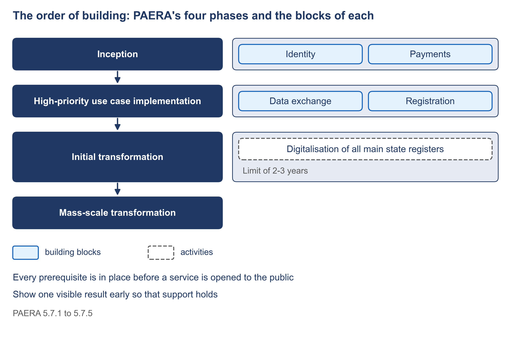

# 1.9 What comes first: the order of building


🎬 **Video in production:** *What comes first: the order of building* (~5 min).
The page below does not depend on the video: it carries what the video will say. The [video index](../../start-here/video-index.md) is the page to watch for links.


> **Single message.** Build identity and payments first, bring in data exchange and registration with the first priority services, digitalise the registers next, and show one visible result early so that support holds.

| | |
| --- | --- |
| **Written for** | Strategist — the public-sector middle manager who commissions the assessment, defends its result to the minister and plans what to build first |
| **Anchor** | PAERA v1.0 §5.7.1 to §5.7.5 (four phases, the blocks of each, every prerequisite before a service opens, the limit on the third phase) and §3.3.3 (the two-tier approach); e-Estonia, 'e-Estonia story' and 'Frequently asked questions — Story of e-Estonia', cited for what the shared blocks became once they existed |
| **Runtime** | ~5 min |
| **Class** | Core |
| **Terms of reference** | §3.3 (implementation sequencing); §4.2 (international frameworks and standards referenced); §4.3 (AI integration — the order of dependencies) |

## The concept

Money for digital government comes in pieces: a donor here, a budget line there. Each piece is spent on something. Unless someone has fixed the order of building, the pieces arrive in an order that nobody chose.

PAERA, the GovStack reference architecture, gives an order in four phases. In the first phase, inception, the country puts in place the Identity and Payment building blocks. It adds a platform for building services with little or no code. In the second, it picks high-priority services and builds them fast. They are built on the Information Mediator, which is the data exchange layer, on Registration and on other shared blocks. In the third, all main state registries are digitalised, in no more than two to three years. The fourth completes the digitalisation of every government service. Each phase puts in place the blocks that the next one needs.

PAERA adds two rules. Every internal prerequisite must be in place before a service opens to the public. And citizens and businesses should always see a positive result. PAERA explains why both matter. Nobody wants to fund a digital identity while no service uses it, and no ministry can build personal services without one. The answer is to do two things at once. Put the foundational elements in place, and show early results that political leaders and the public can see. A service that opens before its foundations are ready fails in public, and the whole plan loses support.

Estonia's official record shows the order there. The tax board offered online tax returns in 2000. X-Road, the data exchange layer, followed in 2001, and the electronic identity with the digital signature in 2002. So in Estonia the first services came before the shared blocks. The lesson lies in what those blocks became once they existed. Estonia's own account names X-Road and the digital identity as part of the foundation that makes digital Estonia possible.

Here is the order for Progressa, the fictional country of these examples, on one page. Identity and payments already run there: PNIA, the identity authority, offers a sign-in, and PayPro, the payment provider, runs a fast-payment system. So phase one connects to them instead of building them, and sets up the decision body and the legal basis. Phase two brings the ministry of education onto Linkup, the data exchange. It builds the registration service, and brings the learner register forward because that service needs it. Its visible result: a parent registers a child once. Phase three takes the register to every district. Phase four lets parents and learners see their own records.



*F5. The order of building: PAERA's four phases and the blocks of each.*

## Your turn — Order your planned services and blocks by what each depends on


**💡 AI usage tip** · Order your planned services and blocks by what each depends on

**Bring:** The list of planned services and blocks, with the planned year or phase of each.
**Get:** The order the dependencies allow, in four phases, with every service placed before a block it needs marked and the missing block named.
**Time:** ~10–15 min · **Assistant:** any; the tips are tool-neutral.
**Watch for:** The prompt orders by dependency only.


**The problem it solves.** A plan lists services and blocks, but not always in an order their dependencies allow, and a service placed before a block it needs will be late or built badly. This prompt takes the planned services and blocks and returns the order their dependencies allow, marking every service that is placed before a block it needs.



Copy the prompt, replace the bracketed parts with your own context, and run it in the AI assistant of your choice. Never paste personal data or unpublished documents — see [How to use the plays](../../start-here/how-to-use-the-plays.md).

```text
Below is the list of services and shared blocks that [country X] plans to build or connect, each with the year or phase in which it is planned [paste the list]. For each service, list the shared blocks it needs, such as identity, payments, the data exchange, registration and the registers it reads or writes. Then: (1) order all the items so that no service comes before a block it needs, and no block comes before a block it depends on; (2) mark every service that the current plan places before a block it needs, and name the missing block; (3) group the items into four phases — identity and payments; the first priority services, with the data exchange and registration; the state registers; every other service — and say which item in each phase gives a result the public can see. Order by dependency only; do not weigh cost or politics. Output: the order the dependencies allow, in four phases, with every service placed before a block it needs marked and the missing block named.
```

[Open in Claude](<https://claude.ai/new?q=Below%20is%20the%20list%20of%20services%20and%20shared%20blocks%20that%20%5Bcountry%20X%5D%20plans%20to%20build%20or%20connect%2C%20each%20with%20the%20year%20or%20phase%20in%20which%20it%20is%20planned%20%5Bpaste%20the%20list%5D.%20For%20each%20service%2C%20list%20the%20shared%20blocks%20it%20needs%2C%20such%20as%20identity%2C%20payments%2C%20the%20data%20exchange%2C%20registration%20and%20the%20registers%20it%20reads%20or%20writes.%20Then%3A%20%281%29%20order%20all%20the%20items%20so%20that%20no%20service%20comes%20before%20a%20block%20it%20needs%2C%20and%20no%20block%20comes%20before%20a%20block%20it%20depends%20on%3B%20%282%29%20mark%20every%20service%20that%20the%20current%20plan%20places%20before%20a%20block%20it%20needs%2C%20and%20name%20the%20missing%20block%3B%20%283%29%20group%20the%20items%20into%20four%20phases%20%E2%80%94%20identity%20and%20payments%3B%20the%20first%20priority%20services%2C%20with%20the%20data%20exchange%20and%20registration%3B%20the%20state%20registers%3B%20every%20other%20service%20%E2%80%94%20and%20say%20which%20item%20in%20each%20phase%20gives%20a%20result%20the%20public%20can%20see.%20Order%20by%20dependency%20only%3B%20do%20not%20weigh%20cost%20or%20politics.%20Output%3A%20the%20order%20the%20dependencies%20allow%2C%20in%20four%20phases%2C%20with%20every%20service%20placed%20before%20a%20block%20it%20needs%20marked%20and%20the%20missing%20block%20named.>) *(pre-fills the prompt in a new chat; check the bracketed parts before sending)*

*What to bring and what you get are in the box above.*




**Draft worked example, 2026-10-04.** Progressa is the fictional country used across these courses. The input below and the output in the next tab were made for this page by running the prompt once; they are shortened, and they have not been checked as the worked examples of the method have.


The bracketed parts of the prompt were replaced with the following:

**[country X]:** Progressa.

**[paste the list]** (MoEYS's draft plan):

- MoEYS joins Linkup — 2027
- PLR and the registration service as clients of PNIA's sign-in — 2027
- Learner registration service, writing to PLR — 2027
- Scholarship pilot, paid to learners verified in PLR — 2027
- PLR made the authoritative learner register — 2028
- Payments block on Linkup, reaching PayPro through its payer bank — 2028
- PEMIS fed from PLR over Linkup — 2028
- Examination registration by PNEA read from PLR — 2029
- Parent and learner view of their records — 2030




**Draft: model output, shortened and unverified.** Read it with the notes in the next tab, not on its own.


| Phase | Items, in the order the dependencies allow | Visible result |
|---|---|---|
| **1 Identity and payments** | PNIA's sign-in and PayPro already run; MoEYS joins Linkup; Payments block on Linkup | None to the public yet |
| **2 First priority services** | PLR made authoritative (needed by registration); PLR and the service as PNIA clients; learner registration | A parent registers a child once |
| **3 State registers** | PEMIS fed from PLR | Schools stop sending the annual return |
| **4 Every other service** | Scholarship pilot; examination registration from PLR; parent view | Scholarships paid to the right learner |

**Placed before a block it needs:**

- **Learner registration (2027)** needs PLR as the authoritative register (2028).
- **Scholarship pilot (2027)** needs the Payments block on Linkup (2028) and PLR (2028).

**Note:** PLR is moved from phase 3 to phase 2, because the first priority service cannot work without it.



This is the teaching part of the tip. Work through the output the way a chief architect would: what is earned, what is invented, what is missing.

<details>

<summary>1. Both marks are earned</summary>

The two services placed too early each name the block they miss, and both follow from the input lines. Moving PLR forward, and saying so, matches the course's own choice for Progressa.

</details>

<details>

<summary>2. "Already run" covers only half of payments</summary>

The run put PayPro in phase 1 as running, which is true, but the block education calls is the Payments block, and it does not exist yet. Phase 1 is a build for payments, not just a connection.

</details>

<details>

<summary>3. The law is not on the list</summary>

The order is right on blocks and silent on law. PLR cannot be made the authoritative register nationally without an amendment to the education act, the slowest item of all. Add the legal basis and the budget line to the list and run the prompt again.

</details>


**Safeguard.** The prompt orders by dependency only. Cost, the weight of each service to the government and what partners will fund are judged when the roadmap is prioritised and costed, by the people accountable for those decisions; an order that is right on dependencies can still be wrong on money.




The order goes to the roadmap's waves in [6.3](../module-6/6-3.md), where cost and partner funds are weighed. [1.10](./1-10.md) takes the first priority service and lists the blocks it needs.



## Sources

- PAERA v1.0, sections 3.3.3 and 5.7.1 to 5.7.5 (https://paera.govstack.global/)
- e-Estonia, 'e-Estonia story' and 'Frequently asked questions — Story of e-Estonia' (https://e-estonia.com/story/)
