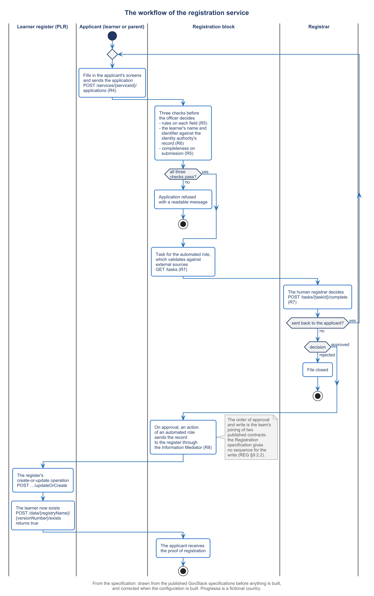

# 2.5 The officer decides, and the record is written


🎬 **Video in production:** *The officer decides, and the record is written* (~5 min).
The page below does not depend on the video: it carries what the video will say. The [video index](../../start-here/video-index.md) is the page to watch for links.


> **Single message.** A registrar approves, rejects or sends back each application, and only on approval does the block write the record to the register, in a sequence the specifications leave you to define and test.

## The concept

Software can check an application. It cannot take responsibility for it. In registration, a named officer decides, and the register is written only after that decision. Getting this order right is what makes the record worth trusting.

The specification gives the operator three decisions: approve, reject, or send back for correction, marking the field that is wrong so the applicant sees it. The analyst builds the processing part as a chain of roles. Each role has a list of files and a screen on which to decide. For each status a role may give, pending, approved, rejected or sent back, the analyst sets where the file goes next: to another role, back to the applicant, or to the end. A role can be a person or an automated role, and the specification lets an automated role carry actions, such as a call to another service. The tasks are read and completed through published operations.

Progressa's flow has three roles. An automated role takes the file as sent and checks it again. It decides nothing that the law gives to the registrar; it only prepares the file for the person who does. The registrar of PLR, a person, then decides. Only on approval does a second automated role write the record to the register and issue the confirmation with the learner's register number. A rejected file is closed, and nothing is written.

Now the write. On approval, the specification says, the system sends the information to a registry, using an action that sends form data to another service. Its traffic must pass through an Information Mediator or a secure gateway; in Progressa that is Linkup. The register accepts the record through its create-or-update operation. But neither specification publishes the order of calls or the data between the two blocks. Joining them is your team's own work. Write it down as a short agreement between the two owners: which call is made, with which fields, at which moment, and what happens when the register refuses. Then test both outcomes: an approval that writes, and a refusal that leaves the file waiting.

Where does the record land? PLR, the Progressa Learner Registry, is already a member of Linkup, with one enrolment service. This course sets up the authoritative learner register behind it, and that register is what this service writes to. The record carries the identifier PNIA gave the service, never the national number. And the order matters to a minister as much as to an architect: a record written before a decision is a record nobody answers for.



*F7. The workflow of the registration service.*


**Demonstration.** The registrar's approval, and the record appearing in the register. It needs R7 and R8, with the register of RG1 and RG2. Until it is recorded, the storyboard in the script stands in its place; see the [build plan](../build-pack.md).


## Your turn — Map the form to the register and write the test of the write


**💡 AI usage tip** · Map the form to the register and write the test of the write

**Bring:** The form's fields and the register's schema.
**Get:** A table mapping each form field to a register field, and the test sequence for the write, for an approved and a rejected application.
**Time:** ~10–15 min · **Assistant:** any; the tips are tool-neutral.
**Watch for:** The owner of the register confirms the mapping before it is configured; the model cannot know which field the register treats as authoritative.


**The problem it solves.** The write from the registration service to the register is the team's own joining of two published contracts, so nobody else will test it. This prompt maps each field of the form to a field of the register's schema and writes the sequence of steps that tests the write after approval.



Copy the prompt, replace the bracketed parts with your own context, and run it in the AI assistant of your choice. Never paste personal data or unpublished documents — see [How to use the plays](../../start-here/how-to-use-the-plays.md).

```text
Below are (1) the fields of a registration form in [country X], with their names and types [paste them], and (2) the schema of the register the approved record is written to, with its fields, types, required fields and the field it keys on [paste the schema]. Map each form field to one register field, or mark it NOT WRITTEN with the reason. Flag every field whose type or length differs. Do not map any national identity number; where the form holds the identifier the identity authority gave this service, map that instead. Then write the test sequence for the write: submit a test application, approve it as the registrar, read the register for the learner, and say what each step must return; add the same sequence for a rejected application, which must leave nothing in the register. Output: a table mapping each form field to a register field, and the test sequence for the write.
```

[Open in Claude](<https://claude.ai/new?q=Below%20are%20%281%29%20the%20fields%20of%20a%20registration%20form%20in%20%5Bcountry%20X%5D%2C%20with%20their%20names%20and%20types%20%5Bpaste%20them%5D%2C%20and%20%282%29%20the%20schema%20of%20the%20register%20the%20approved%20record%20is%20written%20to%2C%20with%20its%20fields%2C%20types%2C%20required%20fields%20and%20the%20field%20it%20keys%20on%20%5Bpaste%20the%20schema%5D.%20Map%20each%20form%20field%20to%20one%20register%20field%2C%20or%20mark%20it%20NOT%20WRITTEN%20with%20the%20reason.%20Flag%20every%20field%20whose%20type%20or%20length%20differs.%20Do%20not%20map%20any%20national%20identity%20number%3B%20where%20the%20form%20holds%20the%20identifier%20the%20identity%20authority%20gave%20this%20service%2C%20map%20that%20instead.%20Then%20write%20the%20test%20sequence%20for%20the%20write%3A%20submit%20a%20test%20application%2C%20approve%20it%20as%20the%20registrar%2C%20read%20the%20register%20for%20the%20learner%2C%20and%20say%20what%20each%20step%20must%20return%3B%20add%20the%20same%20sequence%20for%20a%20rejected%20application%2C%20which%20must%20leave%20nothing%20in%20the%20register.%20Output%3A%20a%20table%20mapping%20each%20form%20field%20to%20a%20register%20field%2C%20and%20the%20test%20sequence%20for%20the%20write.>) *(pre-fills the prompt in a new chat; check the bracketed parts before sending)*

*What to bring and what you get are in the box above.*




**Draft worked example, 2026-10-04.** Progressa is the fictional country used across these courses. The input below and the output in the next tab were made for this page by running the prompt once; they are shortened, and they have not been checked as the worked examples of the method have.


The bracketed parts of the prompt were replaced with the following:

**[country X]:** Progressa.

**[the form's fields]:** given_names (text), family_name (text), date_of_birth (date), school (from the list of Progressa schools), grade (number, 1 to 13), transfers_from_another_school (yes or no), pnia_service_identifier (text, the claim `sub` PNIA releases to this service).

**[the register's schema]:** the learner register behind PLR, database `learners`, keyed on `learner_number` (text, given by the register on create, prefix "PLR-"). Fields: pnia_service_identifier (text, optional, unique); given_name and family_name (text, required, at most 100 characters); date_of_birth (date, required, 1996-01-01 to 2023-12-31); sex (female or male, required); school_code (text, required, linked to `schools`); grade (number, required, 1 to 12); enrolment_date (date, required); status (enrolled, transferred, left or completed, required).




**Draft: model output, shortened and unverified.** Read it with the notes in the next tab, not on its own.


| Form field | Register field | Flag |
| --- | --- | --- |
| given_names, family_name | given_name, family_name | Form sets no length; register allows 100 |
| date_of_birth | date_of_birth | Register range ends 2023-12-31 |
| school | school_code | The school must exist in `schools`, or the write is refused |
| grade | grade | **Form allows 13, register 12** |
| pnia_service_identifier | pnia_service_identifier | Kept beside `learner_number`; no national number mapped |
| transfers_from_another_school | NOT WRITTEN | It decides the documents; it is not part of the record |

**Required in the register, with no form field:** sex, enrolment_date, status. As drafted, the write would be refused.

**Test of the write.** *Approved:* send A4; the registrar of PLR approves it; the write role calls the register's create-or-update operation; read the register for the learner — one record, keyed on a new PLR- number, no national number in it. *Rejected:* send a second correct application; the registrar rejects it; read the register — no record.



This is the teaching part of the tip. Work through the output the way a chief architect would: what is earned, what is invented, what is missing.

<details>

<summary>1. The key and the identifier are right</summary>

The mapping keys on the register's own number and keeps PNIA's service identifier beside it, with no national number anywhere. The transfer answer is left out with a reason. Both agree with Progressa's specimen mapping and with the prompt's rule.

</details>

<details>

<summary>2. The run first filled the gaps itself</summary>

Before the flag above, the run proposed setting enrolment_date to the date of approval and status to "enrolled", and leaving sex blank. That would make the write pass and the record wrong. Which value is authoritative is for the register's owner to decide; whether to add sex to the form is for the registry's office.

</details>

<details>

<summary>3. Test the refusal too</summary>

The sequence tests an approval and a rejection, not a register that refuses the write. Add a third case: an approved file the register refuses (grade 13 will do), which must stay with the write role and not close. Nothing here has run.

</details>


**Safeguard.** The owner of the register confirms the mapping before it is configured; the model cannot know which field the register treats as authoritative. And no national identity number is mapped, whatever the form holds: the register keys on its own number, with the identifier the identity authority gave the service kept beside it.




The three missing fields and the grade range go to the register's owner, who settles them in the schema of [3.3](../module-3/3-3.md). The confirmed mapping is part of the service description that [2.6](./2-6.md) exports and compares.



## Sources

- GovStack Registration Building Block specification, default edition (https://specs.govstack.global/registration), sections 4.2, 5.1.4, 6.2.3, 6.3.2.3, 6.3.2.4, 6.3.2.7, 8.2 and 9.2.2
- GovStack Digital Registries Building Block specification, Version 3.0-alpha (https://specs.govstack.global/registries), DRS-33 and section 8.1
