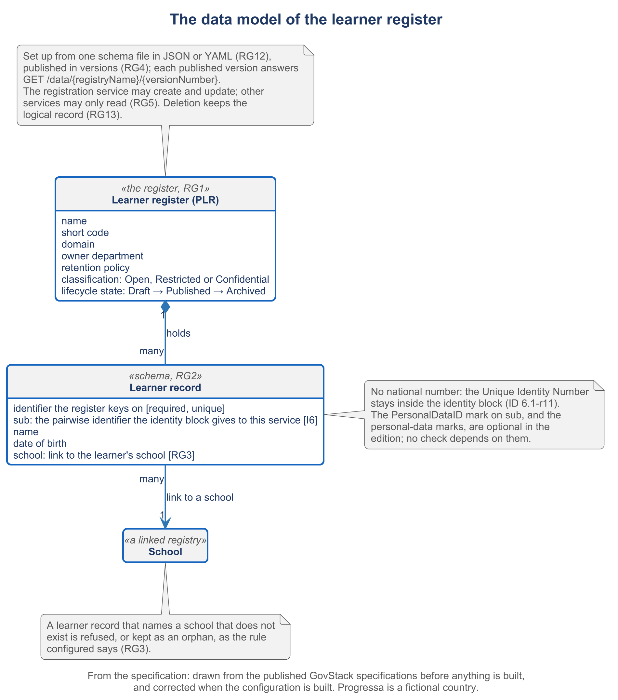

# 3.3 Generating the register's schema


🎬 **Video in production:** *Generating the register's schema* (~4 min).
The page below does not depend on the video: it carries what the video will say. The [video index](../../start-here/video-index.md) is the page to watch for links.


> **Single message.** The register is set up from one schema file, with its fields, rules, links and key, which an AI assistant drafts from the law and the form and the owner corrects and publishes.

## The concept

A register is set up from one file. The file names the register, lists its fields, states the rules on each field, links it to other registers and names its key. Get this file right, and the rest of the build follows from it.

The Digital Registries specification says what goes in the file. The register has a name, a unique short code, an owning body, a retention policy, a classification and a lifecycle state, from draft to published to archived. Each field has a name and a type, such as text, date or a list of values. A field can be required or unique, with a minimum and a maximum. A link joins one database to another, for example each learner to a school, with a rule for what happens when the school is deleted. Every publication creates a new version. The schema can be exported and imported as JSON or YAML.

One choice needs the owner's decision: the key. It is tempting to key the register on the national identity number. Do not. The GovStack Identity specification keeps that number secret inside the identity block. A service that checks a person signs the person in, with the person present, and receives an identifier made for that service alone. So Progressa's register keeps a learner number of its own, and stores beside it the identifier that the identity authority, PNIA, gives to the service. It never stores the national number.

An AI assistant drafts this file well, because its inputs are written down: the education act, the registration form, and the list of services that will read the register. The prompt asks it to trace every rule to the line it came from. The owner then decides the key and the fields that hold personal data. The marks for personal data are optional in the specification, so no check depends on them. The owner corrects the draft and publishes it. The file states the edition of the specification it implements: version 3.0-alpha, an early release.

The walkthrough of this subtopic shows the schema drafted, and the register created from it through the published interface. The check lists the registers and reads this one back: its schema, its metadata and the state published. A record without a required field must be refused, and so must a second record with the same learner number.




**Demonstration.** The schema drafted, and the register created from it. It needs RG1, RG2, RG3, RG4 and RG12. Until it is recorded, the storyboard in the script stands in its place; see the [build plan](../build-pack.md).


## Your turn — Draft the register's schema file


**💡 AI usage tip** · Draft the register's schema file

**Bring:** The education act's articles on learner records, the registration form and the list of services that will read the register.
**Get:** A draft schema file in YAML with a trace table, and a list of decisions for the owner.
**Time:** ~10–15 min · **Assistant:** any; the tips are tool-neutral.
**Watch for:** The owner decides the key and the fields that hold personal data, and the file states the edition of the specification it implements.


**The problem it solves.** Writing a register's schema by hand takes weeks of meetings and still misses rules that sit in the law. This prompt drafts the whole schema file in the terms of the GovStack Digital Registries specification, traces every rule to its source, and lists what only the owner may decide.



Copy the prompt, replace the bracketed parts with your own context, and run it in the AI assistant of your choice. Never paste personal data or unpublished documents — see [How to use the plays](../../start-here/how-to-use-the-plays.md).

```text
You are drafting the schema of a learner register to the GovStack Digital Registries specification, version 3.0-alpha. Below are [1] the articles of our education act on learner records [paste], [2] the registration form, field by field [paste], and [3] the services that will read the register and what each needs [paste]. Draft one schema file in YAML with: the register's name, short code, owning body, retention policy, classification and lifecycle state; each field with its name, its type, whether it is required or unique, and its limits; the link from each learner to a school, with its rule on deletion; and the key. Do not use the national identity number as the key or as any field; provide a field for the identifier the identity authority gives to the service. Then give a trace table: each field and rule, and the article or form line it comes from. List every choice you made without a source as a decision for the owner. Output: a draft schema file in YAML with a trace table, then the list of decisions.
```

[Open in Claude](<https://claude.ai/new?q=You%20are%20drafting%20the%20schema%20of%20a%20learner%20register%20to%20the%20GovStack%20Digital%20Registries%20specification%2C%20version%203.0-alpha.%20Below%20are%20%5B1%5D%20the%20articles%20of%20our%20education%20act%20on%20learner%20records%20%5Bpaste%5D%2C%20%5B2%5D%20the%20registration%20form%2C%20field%20by%20field%20%5Bpaste%5D%2C%20and%20%5B3%5D%20the%20services%20that%20will%20read%20the%20register%20and%20what%20each%20needs%20%5Bpaste%5D.%20Draft%20one%20schema%20file%20in%20YAML%20with%3A%20the%20register%27s%20name%2C%20short%20code%2C%20owning%20body%2C%20retention%20policy%2C%20classification%20and%20lifecycle%20state%3B%20each%20field%20with%20its%20name%2C%20its%20type%2C%20whether%20it%20is%20required%20or%20unique%2C%20and%20its%20limits%3B%20the%20link%20from%20each%20learner%20to%20a%20school%2C%20with%20its%20rule%20on%20deletion%3B%20and%20the%20key.%20Do%20not%20use%20the%20national%20identity%20number%20as%20the%20key%20or%20as%20any%20field%3B%20provide%20a%20field%20for%20the%20identifier%20the%20identity%20authority%20gives%20to%20the%20service.%20Then%20give%20a%20trace%20table%3A%20each%20field%20and%20rule%2C%20and%20the%20article%20or%20form%20line%20it%20comes%20from.%20List%20every%20choice%20you%20made%20without%20a%20source%20as%20a%20decision%20for%20the%20owner.%20Output%3A%20a%20draft%20schema%20file%20in%20YAML%20with%20a%20trace%20table%2C%20then%20the%20list%20of%20decisions.>) *(pre-fills the prompt in a new chat; check the bracketed parts before sending)*

*What to bring and what you get are in the box above.*




**Draft worked example, 2026-10-04.** Progressa is the fictional country used across these courses. The input below and the output in the next tab were made for this page by running the prompt once; they are shortened, and they have not been checked as the worked examples of the method have.


The bracketed parts of the prompt were replaced with the following:

**[1] Articles of the education act (the education act of 2011, invented for Progressa).** Art. 14: every head teacher keeps an admission register with each learner's names, date of birth, date of admission and grade. Art. 15: the head teacher reports learners who leave or transfer. Art. 31: school records are kept for as long as the minister directs.

**[2] The registration form, field by field (the learner registration service).** F1 given names; F2 family name; F3 date of birth; F4 school; F5 grade; F6 transfers from another school (yes or no); F7 the parent's sign-in through PNIA.

**[3] Services that will read the register.** PEMIS: learner counts by school and grade. PNEA: candidates for examination, by school. Scholarship pilot: an eligible learner, verified.




**Draft: model output, shortened and unverified.** Read it with the notes in the next tab, not on its own.


**Draft schema file (abridged)**

```yaml
# implements: GovStack Digital Registries, Version 3.0-alpha
register:
  name: Progressa Learner Register
  short_code: plr-learners
  owner: PLR
  retention_policy: as the minister directs (Art. 31)   # owner to confirm
  classification: Restricted
  lifecycle_state: Draft
learners:
  key: learner_number          # given by the register, prefix PLR-
  fields:
    - { name: pnia_service_identifier, type: Text, unique: true, required: false }
    - { name: given_name, type: Text, required: true, max: 100 }
    - { name: family_name, type: Text, required: true, max: 100 }
    - { name: date_of_birth, type: Date, required: true }
    - { name: school_code, type: Text, required: true,
        link: { to: schools.school_code, on_delete: Restrict delete } }
    - { name: grade, type: Number, required: true, min: 1, max: 12 }
    - { name: enrolment_date, type: Date, required: true }
    - { name: status, type: List of Values,
        values: [enrolled, transferred, left, completed] }
```

**Trace table**

| Field or rule | Source |
| --- | --- |
| given_name, family_name, date_of_birth, grade | Art. 14; F1, F2, F3, F5 |
| school_code and its link | F4 |
| enrolment_date | Art. 14 (date of admission) — not on the form |
| status | Art. 15 |
| pnia_service_identifier | F7 |
| key, grade limits, Restrict delete, classification | no source |

**Decisions for the owner**

- The key: a learner number of the register's own.
- Which fields are marked as personal data.
- Grades 1 to 12, and the rule on deleting a school.
- How enrolment date is filled, since the form does not ask for it.



This is the teaching part of the tip. Work through the output the way a chief architect would: what is earned, what is invented, what is missing.

<details>

<summary>1. The national number is kept out</summary>

The key is the register's own number, and PNIA's identifier for the service sits beside it, not required, because a young child may have none. This matches the schema specimen and commitment C-07 of the roadmap.

</details>

<details>

<summary>2. Two required fields have no way in</summary>

Enrolment date and status are required, but the registration form fills neither. As drafted, every write from the registration service would be refused. The run traced them to the act and stopped there; the owner must say who fills them.

</details>

<details>

<summary>3. Personal-data marks and the provisional identifier are missing</summary>

The run left out the personal-data marks and the parent's identifier. It also gave no field for the provisional learner identifier the roadmap promises to children below the age of identity issue. Check both before the draft is imported into a test installation.

</details>


**Safeguard.** The owner decides the key and the fields that hold personal data, and the file states the edition of the specification it implements. The draft is imported into a test installation and passes its checks before anyone relies on it.




The owner's corrected schema is the input of the quality checks in [3.4](./3-4.md) and of the access rules in [3.7](./3-7.md). Its fields are the targets of the write from registration in [2.5](../module-2/2-5.md).



## Sources

- GovStack Digital Registries specification, version 3.0-alpha (DRS-1, DRS-2, DRS-3, DRS-4, DRS-10, DRS-11, DRS-13, DRS-14, DRS-17, DRS-28, DRS-30; section 8.2) — https://specs.govstack.global/registries
- GovStack Identity specification, version 2.0 (sections 4.1.1 and 4.1.2, and requirement 11 of section 6.1) — https://specs.govstack.global/identity
