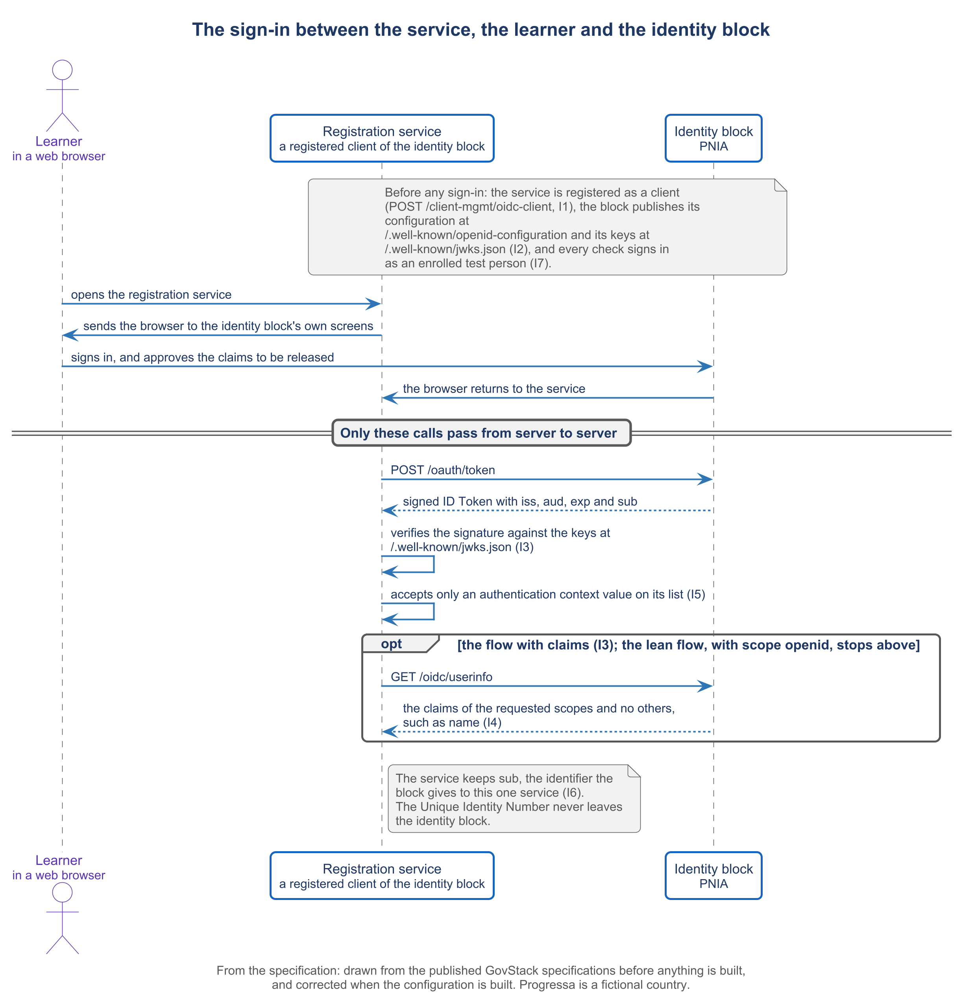

# 4.3 Generating the identity connection


🎬 **Video in production:** *Generating the identity connection* (~5 min).
The page below does not depend on the video: it carries what the video will say. The [video index](../../start-here/video-index.md) is the page to watch for links.


> **Single message.** A service connects to the identity block as its registered client, asks only for what it needs, and keeps the identifier the block gives to that service, never the national number.

| | |
| --- | --- |
| **Written for** | Architect — the ministry's technical lead or solution architect who connects its services to the identity block and the Payments block instead of building either again |
| **Anchor** | GovStack Identity specification, Version 2.0 (December 2025): ID §8.1.1, ID §9.1.1, ID §9.1.2, ID §7.2.1 to ID §7.2.4, ID §6.2, ID §4.1.2, ID 6.1-r11, ID §8.2; Digital Registries specification, Version 3.0-alpha (June 2026): DRS-14 |
| **Runtime** | ~5 min |
| **Class** | Core |
| **Terms of reference** | §4.1 (a step of the method with its acceptance check); §4.3 (AI integration — the generation prompt); §4.4 and §9 (the education demonstration); §4.5 (API specifications) |

## The concept

A registration service that needs to know who the applicant is does not need an identity system of its own. It needs a connection: registered once with the identity block, asking for little, and keeping the right identifier.

The first step is to register the service as a client of the identity block. The client registration names the service, the addresses to which the block may send the person back after signing in, and the key the service signs its requests with. The block publishes two addresses every client needs: one where it describes its own configuration, and one where it publishes the keys that sign its tokens. The client identifier the block returns is the name the service carries from then on.

The specification gives two flows. With claims, the person signs in, sees what the service asks for, approves it, and the service receives those claims. Without claims, the service asks only for proof of the person, with the scope 'openid', and no consent page is shown. Scopes such as profile, address, email and phone each release a set of claims. Ask only for what a field of your form needs. A registration that needs a name and a date of birth should not ask for an address.

Each sign-in comes back with an ID token, a signed record of who signed in, for which service, and when. It carries an authentication context value that says how the person signed in: with a PIN or a password, with a one-time code, with biometrics, or with a combination of these. The country chooses which methods it offers. The service states which values it accepts, and refuses a token whose value is not on its list. The access token lets the service fetch the claims the person approved.

Now the rule that protects every learner. The token's subject is an identifier the block made for this service and this person. Keep that identifier, never the national number, which the specification says must stay secret inside the block. In Progressa, the learner register this course sets up behind PLR keeps a learner number of its own and stores PNIA's identifier beside it. The Digital Registries specification makes the mark for the owner's identifier optional, so the register's design must state it rather than assume it.

The check that proves the connection is a sign-in, not a single call. An enrolled test person, never a real one, signs in on the block's own screen. The service receives a code, exchanges it for a token, and verifies the token's signature against the block's published keys. The check passes when the issuer, the audience, the expiry and the subject are present and valid. A second test service then signs in the same person, and the two identifiers must differ.



*F10. The sign-in between the service, the learner and the identity block.*


**Demonstration.** A test person signs in, and the token is verified. It needs I1 to I7. Until it is recorded, the storyboard in the script stands in its place; see the [build plan](../build-pack.md).


## Your turn — Draft the identity connection for one service

**The problem it solves.** An Architect connecting a service to the identity block needs a first draft of everything the connection holds: the client registration, the flow, the scopes and claims, and the levels of authentication the service accepts. This prompt drafts them from the data the service needs, and keeps every claim to a field of the form.

Copy the prompt, replace the bracketed parts with your own context, and run it in the AI assistant of your choice. Never paste personal data or unpublished documents — see [How to use the plays](../../start-here/how-to-use-the-plays.md).

```text
Below are the fields of the application form of [the service] in [country X], with what each field is for: [paste the fields]. The service will connect to the national identity block, which follows the GovStack Identity Building Block specification, Version 2.0 (December 2025), through OpenID Connect. Below are the authentication methods the identity authority offers: [paste them]. Draft: (1) the client registration — the service's name, its redirect addresses and the key it will sign with — for POST /client-mgmt/oidc-client; (2) the choice of flow — with claims, if the form needs attributes of the person, or without claims, with scope 'openid', if it needs only proof of the person; (3) the scopes and claims to request, kept to the minimum, each tied to the field of the form that needs it; (4) the authentication context values the service accepts, taken only from the methods listed above; (5) the identifier the service will keep — the subject the block gives to this service — with a statement that the national number is neither requested nor stored. Mark every value you cannot take from the form or from the specification as [confirm]. Output: a draft client registration with the flow, the scopes and claims, and the accepted levels of authentication, each claim tied to a field of your form.
```

[Open in Claude](<https://claude.ai/new?q=Below%20are%20the%20fields%20of%20the%20application%20form%20of%20%5Bthe%20service%5D%20in%20%5Bcountry%20X%5D%2C%20with%20what%20each%20field%20is%20for%3A%20%5Bpaste%20the%20fields%5D.%20The%20service%20will%20connect%20to%20the%20national%20identity%20block%2C%20which%20follows%20the%20GovStack%20Identity%20Building%20Block%20specification%2C%20Version%202.0%20%28December%202025%29%2C%20through%20OpenID%20Connect.%20Below%20are%20the%20authentication%20methods%20the%20identity%20authority%20offers%3A%20%5Bpaste%20them%5D.%20Draft%3A%20%281%29%20the%20client%20registration%20%E2%80%94%20the%20service%27s%20name%2C%20its%20redirect%20addresses%20and%20the%20key%20it%20will%20sign%20with%20%E2%80%94%20for%20POST%20%2Fclient-mgmt%2Foidc-client%3B%20%282%29%20the%20choice%20of%20flow%20%E2%80%94%20with%20claims%2C%20if%20the%20form%20needs%20attributes%20of%20the%20person%2C%20or%20without%20claims%2C%20with%20scope%20%27openid%27%2C%20if%20it%20needs%20only%20proof%20of%20the%20person%3B%20%283%29%20the%20scopes%20and%20claims%20to%20request%2C%20kept%20to%20the%20minimum%2C%20each%20tied%20to%20the%20field%20of%20the%20form%20that%20needs%20it%3B%20%284%29%20the%20authentication%20context%20values%20the%20service%20accepts%2C%20taken%20only%20from%20the%20methods%20listed%20above%3B%20%285%29%20the%20identifier%20the%20service%20will%20keep%20%E2%80%94%20the%20subject%20the%20block%20gives%20to%20this%20service%20%E2%80%94%20with%20a%20statement%20that%20the%20national%20number%20is%20neither%20requested%20nor%20stored.%20Mark%20every%20value%20you%20cannot%20take%20from%20the%20form%20or%20from%20the%20specification%20as%20%5Bconfirm%5D.%20Output%3A%20a%20draft%20client%20registration%20with%20the%20flow%2C%20the%20scopes%20and%20claims%2C%20and%20the%20accepted%20levels%20of%20authentication%2C%20each%20claim%20tied%20to%20a%20field%20of%20your%20form.>) *(pre-fills the prompt in a new chat; check the bracketed parts before sending)*

**What goes in and what comes out.** Input: the fields of the service's form and the authentication methods the identity authority offers. Output: a draft client registration with the flow, the scopes and claims, and the accepted levels of authentication, each claim tied to a field of your form.


**Safeguard.** Every claim requested is justified by a field of the form: strike any claim the model adds that no field needs. Tests use an enrolled test person and never a real one, and no real person's data is pasted into the prompt.


## Sources

- GovStack Identity Building Block specification, Version 2.0, December 2025 (https://specs.govstack.global/identity), sections 4.1.2, 6.1, 6.2, 7.2.1 to 7.2.4, 8.1.1, 8.2, 9.1.1 and 9.1.2
- GovStack Digital Registries Building Block specification, Version 3.0-alpha, June 2026 (https://specs.govstack.global/registries), DRS-14 (the mark for the data owner's identifier, optional)
