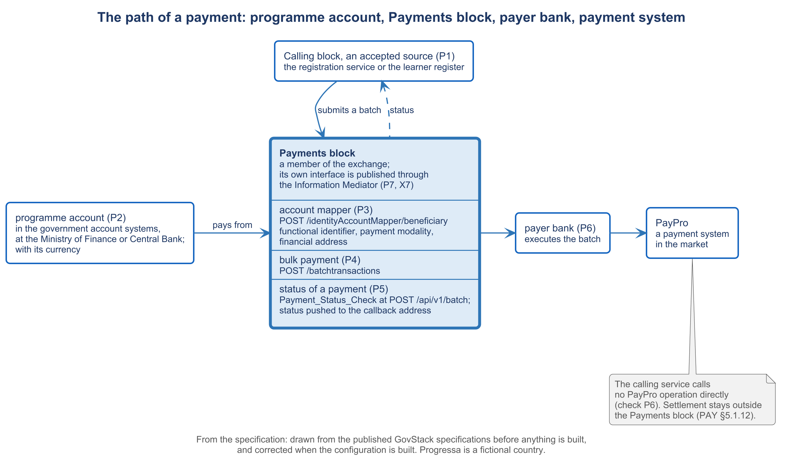

# 4.5 Generating the payment connection


🎬 **Video in production:** *Generating the payment connection* (~4 min).
The page below does not depend on the video: it carries what the video will say. The [video index](../../start-here/video-index.md) is the page to watch for links.


> **Single message.** To pay through the block you configure the sender, the programme, the beneficiary, the payment and the route for its status, and the proof is one test payment whose status comes back.

| | |
| --- | --- |
| **Written for** | Architect — the ministry's technical lead or solution architect who connects its services to the identity block and the Payments block instead of building either again |
| **Anchor** | GovStack Payments specification, Version 3.0 (December 2025): PAY §9.1.1, PAY §4.16, PAY §5.4, PAY §8.1.2, PAY §7.1.1, PAY 6.3-r1, PAY §8.1.4, PAY §7.2.1, PAY 6.4-r3, PAY 6.11-r2, PAY §5.1.14, PAY §5.3.1, PAY 6.14-r6 |
| **Runtime** | ~4 min |
| **Class** | Core |
| **Terms of reference** | §4.1 (a step of the method with its acceptance check); §4.3 (AI integration — the generation prompt); §4.4 and §9 (the education demonstration); §4.5 (API specifications) |

## The concept

Once the Payments block is installed, a service still cannot pay anyone. Five things have to be set up first, and the proof that they work is one small test payment whose status comes back.

First, the sender. The block accepts payment requests only from a calling block it has been configured to accept as a source. Second, the programme. Each programme has its payment account and its currency. The specification processes each currency on its own, without conversion, and names currencies by their ISO 4217 codes. So a programme that pays in one currency must pay into accounts held in that same currency.

Third, the beneficiary. Before anyone is paid, the service registers each beneficiary in the block's account mapper: a functional identifier, the way of payment, such as a bank account or mobile money, and the financial address where the money goes. The mapper answers on a callback address the service gives it. The service's own register keeps no payment details. In Progressa the functional identifier is the learner's number in the learner register, never the national number.

Fourth, the payment. The service hands the block a batch, which may hold one payment or many. The specification sets the least a payment request must contain: the payer's identifier, the payee's identifier, the amount, the currency, the policy, and the sender's own identifier for the transaction. The block gives each payment in the batch an instruction identifier of its own, so that every payment can be followed.

Fifth, the route for status. The service gives the block an address to which status is sent, and it can also ask for the status of one payment. A status is success, failed, or in progress. Around all five sits transport and security. The block's interface is published through the Information Mediator, every call travels over a secure connection with an authorisation token, and the messages about a payment are authenticated.

The check that proves the connection uses one test beneficiary, one test amount, and a test environment. The beneficiary is registered, and the callback confirms it. A batch of one payment is submitted. The service then asks for the status of that payment. The check passes when the answer is a status, success, failed or in progress, rather than an error, and when the same status arrives at the address configured for it.



*F11. The path of a payment: programme account, Payments block, payer bank, payment system.*


**Demonstration.** A beneficiary registered, a batch of one payment, the status returned. It needs P1 to P7. Until it is recorded, the storyboard in the script stands in its place; see the [guide to the build pack](../build-pack.md).


## Your turn — Draft the payment connection for one programme

**The problem it solves.** An Architect connecting a programme to the Payments block needs a first draft of the five things the connection holds: the accepted source, the programme with its account and currency, the onboarding of a beneficiary, the batch, and the route for status. This prompt drafts them from the description of the programme, using test values only.

Copy the prompt, replace the bracketed parts with your own context, and run it in the AI assistant of your choice. Never paste personal data or unpublished documents — see [How to use the plays](../../start-here/how-to-use-the-plays.md).

```text
Below is the description of a payment programme in [country X]: [paste — the programme's name, the paying body, its account and currency, who is paid, how often, and the service that will send the payments]. The payments will go through the government's Payments block, which follows the GovStack Payments Building Block specification, Version 3.0 (December 2025). Draft: (1) the calling service configured as an accepted source of payment requests; (2) the programme, with its payment account and its currency as an ISO 4217 code; (3) the onboarding of one test beneficiary into the account mapper — functional identifier, payment modality, financial address — through POST /identityAccountMapper/beneficiary, with the callback address; (4) a bulk payment of one test payment through POST /batchtransactions, containing at least the payer and payee identifiers, the amount, the currency, the policy and the source's transaction identifier; (5) the route for status — the callback address for pushed status, and the status check for one payment through POST /api/v1/batch. Use test values throughout and mark each one [test]. Output: a draft configuration of the source, the programme, the onboarding, the batch and the route for status, with every test value marked.
```

[Open in Claude](<https://claude.ai/new?q=Below%20is%20the%20description%20of%20a%20payment%20programme%20in%20%5Bcountry%20X%5D%3A%20%5Bpaste%20%E2%80%94%20the%20programme%27s%20name%2C%20the%20paying%20body%2C%20its%20account%20and%20currency%2C%20who%20is%20paid%2C%20how%20often%2C%20and%20the%20service%20that%20will%20send%20the%20payments%5D.%20The%20payments%20will%20go%20through%20the%20government%27s%20Payments%20block%2C%20which%20follows%20the%20GovStack%20Payments%20Building%20Block%20specification%2C%20Version%203.0%20%28December%202025%29.%20Draft%3A%20%281%29%20the%20calling%20service%20configured%20as%20an%20accepted%20source%20of%20payment%20requests%3B%20%282%29%20the%20programme%2C%20with%20its%20payment%20account%20and%20its%20currency%20as%20an%20ISO%204217%20code%3B%20%283%29%20the%20onboarding%20of%20one%20test%20beneficiary%20into%20the%20account%20mapper%20%E2%80%94%20functional%20identifier%2C%20payment%20modality%2C%20financial%20address%20%E2%80%94%20through%20POST%20%2FidentityAccountMapper%2Fbeneficiary%2C%20with%20the%20callback%20address%3B%20%284%29%20a%20bulk%20payment%20of%20one%20test%20payment%20through%20POST%20%2Fbatchtransactions%2C%20containing%20at%20least%20the%20payer%20and%20payee%20identifiers%2C%20the%20amount%2C%20the%20currency%2C%20the%20policy%20and%20the%20source%27s%20transaction%20identifier%3B%20%285%29%20the%20route%20for%20status%20%E2%80%94%20the%20callback%20address%20for%20pushed%20status%2C%20and%20the%20status%20check%20for%20one%20payment%20through%20POST%20%2Fapi%2Fv1%2Fbatch.%20Use%20test%20values%20throughout%20and%20mark%20each%20one%20%5Btest%5D.%20Output%3A%20a%20draft%20configuration%20of%20the%20source%2C%20the%20programme%2C%20the%20onboarding%2C%20the%20batch%20and%20the%20route%20for%20status%2C%20with%20every%20test%20value%20marked.>) *(pre-fills the prompt in a new chat; check the bracketed parts before sending)*

**What goes in and what comes out.** Input: the description of one payment programme. Output: a draft configuration of the source, the programme, the onboarding, the batch and the route for status, with every test value marked.


**Safeguard.** Tests use a test beneficiary, a test amount and a test environment. Never paste a real person's name, account number or mobile number into the prompt, and never point the draft at a live payer bank.


## Sources

- GovStack Payments Building Block specification, Version 3.0, December 2025 (https://specs.govstack.global/payments), sections 4.16, 5.1.14, 5.3.1, 5.4, 6.3, 6.4, 6.11, 6.14, 7.1.1, 7.2.1, 8.1.2, 8.1.4 and 9.1.1
