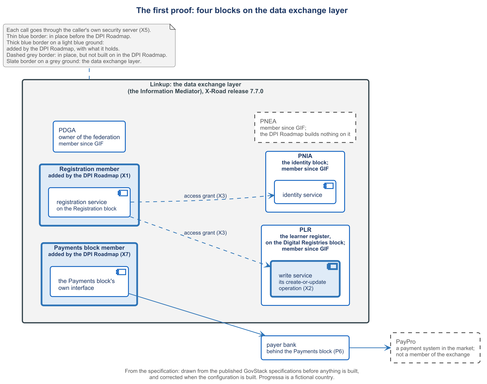

# 5.1 What must be in place before the blocks can call each other


🎬 **Video in production:** *What must be in place before the blocks can call each other* (~4 min).
The page below does not depend on the video: it carries what the video will say. The [video index](../../start-here/video-index.md) is the page to watch for links.


> **Single message.** Before one block can call another across ministries, each must be a member of the data exchange layer, each service registered with its contract, and access granted to the caller.

## The concept

A minister is told that the new registration service will reuse identity and the learner register. Your job is to check whether those calls can happen at all. Across ministries, three things must be in place first, and each one has an owner.

The first is membership. An organisation asks to join the data exchange layer, and the operator checks and accepts it. The second is a registered service. The provider publishes each service with its contract, an OpenAPI description, so that callers know exactly what it offers. The third is a grant. The provider decides who may call. The Information Mediator specification asks for all three. X-Road, the software behind Progressa's exchange, works the same way: a new service starts switched off, and the owner of the data controls who can use it.

One choice comes before the three. The specification strongly recommends the data exchange layer for any exchange across the internet. It does not require it between blocks that sit together on one platform. So sending every call through the exchange is a choice the specification allows, not a rule it imposes. Progressa makes that choice because its blocks belong to different authorities, and each authority must control who reads its data.

Progressa already has an exchange, called Linkup. The digital government authority, PDGA, owns and operates it. The examination authority, PNEA, is the caller. The learner registry, PLR, publishes one enrolment service, and only PNEA may call it. The identity authority, PNIA, publishes one service, a read of a person by national number. That is a contract of Progressa's own, and only PNEA may call it. The ministry of education, MoEYS, is not a member.

This course adds four things. The registration service gets a member of its own, with its application registered. The learner register gets a write service, registered with its contract, because PLR's one service today is a read. Grants let the registration service call that write service, and PNIA's service too if the build uses it. And the Payments block joins as a member, publishing its own interface. PayPro stays behind the block's payer bank, as one of the payment systems in the market.

The check is easy to read. The list of members shows the registration service. The list of services shows the register's write service and its contract. Then a member without a grant makes the same call, and the exchange refuses it with an access-denied fault. Being on the exchange is not permission.




**Demonstration.** The list of members and services, and a call refused for want of a grant. It needs X1, X2, X3 and X7, on the running federation. Until it is recorded, the storyboard in the script stands in its place; see the [build plan](../build-pack.md).


## Your turn — Check that every planned call can happen


**💡 AI usage tip** · Check that every planned call can happen

**Bring:** The planned calls, and the lists of members, services and grants exported from the exchange.
**Get:** A table of members, services and access grants with the missing ones marked.
**Time:** ~10–15 min · **Assistant:** any; the tips are tool-neutral.
**Watch for:** The table is only as good as the lists behind it.


**The problem it solves.** An architect is handed an integration plan that says which services will call which. Before approving it, the architect needs to know which memberships, registered services and grants each call depends on, and which of them are missing today.



Copy the prompt, replace the bracketed parts with your own context, and run it in the AI assistant of your choice. Never paste personal data or unpublished documents — see [How to use the plays](../../start-here/how-to-use-the-plays.md).

```text
Below is a list of the calls an integration plan expects between building blocks in [country X], one per line as caller → provider → service [paste the list]. Below that is the current list of members and registered services of the data exchange layer, exported from the exchange itself [paste the export], and the current access grants [paste them]. For each planned call, produce one row with: (1) the caller, and whether it is a member; (2) the provider, and whether it is a member; (3) the service, and whether it is registered with an OpenAPI contract; (4) whether the caller holds a grant on that service; (5) what is missing, and who must act: the operator of the exchange, the provider or the caller. Do not assume anything that is not in the pasted lists; write 'not in the list' instead. Output: a table with one row per planned call, then a short list of the actions grouped by who must take them.
```

[Open in Claude](<https://claude.ai/new?q=Below%20is%20a%20list%20of%20the%20calls%20an%20integration%20plan%20expects%20between%20building%20blocks%20in%20%5Bcountry%20X%5D%2C%20one%20per%20line%20as%20caller%20%E2%86%92%20provider%20%E2%86%92%20service%20%5Bpaste%20the%20list%5D.%20Below%20that%20is%20the%20current%20list%20of%20members%20and%20registered%20services%20of%20the%20data%20exchange%20layer%2C%20exported%20from%20the%20exchange%20itself%20%5Bpaste%20the%20export%5D%2C%20and%20the%20current%20access%20grants%20%5Bpaste%20them%5D.%20For%20each%20planned%20call%2C%20produce%20one%20row%20with%3A%20%281%29%20the%20caller%2C%20and%20whether%20it%20is%20a%20member%3B%20%282%29%20the%20provider%2C%20and%20whether%20it%20is%20a%20member%3B%20%283%29%20the%20service%2C%20and%20whether%20it%20is%20registered%20with%20an%20OpenAPI%20contract%3B%20%284%29%20whether%20the%20caller%20holds%20a%20grant%20on%20that%20service%3B%20%285%29%20what%20is%20missing%2C%20and%20who%20must%20act%3A%20the%20operator%20of%20the%20exchange%2C%20the%20provider%20or%20the%20caller.%20Do%20not%20assume%20anything%20that%20is%20not%20in%20the%20pasted%20lists%3B%20write%20%27not%20in%20the%20list%27%20instead.%20Output%3A%20a%20table%20with%20one%20row%20per%20planned%20call%2C%20then%20a%20short%20list%20of%20the%20actions%20grouped%20by%20who%20must%20take%20them.>) *(pre-fills the prompt in a new chat; check the bracketed parts before sending)*

*What to bring and what you get are in the box above.*




**Draft worked example, 2026-10-04.** Progressa is the fictional country used across these courses. The input below and the output in the next tab were made for this page by running the prompt once; they are shortened, and they have not been checked as the worked examples of the method have.


The bracketed parts of the prompt were replaced with the following:

**[country X]:** Progressa.

**[paste the list]**, the planned calls of the once-only registration plan:

- Registration service → PLR → register write service (`updateOrCreate`, `exists`)
- Registration service → PNIA → `identity-api` (only if the build shows a pre-fill from server to server)
- Registration service → Payments block → the block's own interface

**[paste the export]**, members and services of Linkup as the interoperability course left them:

- Members: PDGA (owner), PNEA, PLR, PNIA. MoEYS is not a member.
- PLR: `enrolment-api`, a read, with its OpenAPI description.
- PNIA: `identity-api`, a read of a person by national number, with its OpenAPI description.

**[paste them]**, the grants:

- `enrolment-api`: PNEA only.
- `identity-api`: PNEA only.




**Draft: model output, shortened and unverified.** Read it with the notes in the next tab, not on its own.


| Planned call | Caller / provider a member? | Service registered with a contract? | Caller holds a grant? | Missing, and who acts |
| --- | --- | --- | --- | --- |
| Registration service → PLR write | not in the list / yes | not in the list | no | Membership: operator (PDGA). Write service and contract: PLR. Grant: PLR |
| Registration service → PNIA `identity-api` | not in the list / yes | yes | no (PNEA only) | Membership: PDGA. Grant: PNIA, if the call is used |
| Registration service → Payments block | not in the list / not in the list | not in the list | no | Both memberships: PDGA. Interface: the body that runs the block. Grant: that body |

**Actions by who must take them**

- **Operator (PDGA):** accept the registration service and the Payments block as members.
- **Providers:** PLR registers a write service with its contract and grants it; PNIA decides on a grant on `identity-api`; the Payments block publishes its interface and grants it.
- **Caller:** the body in charge of the registration service applies for membership and asks each provider for its grant.



This is the teaching part of the tip. Work through the output the way a chief architect would: what is earned, what is invented, what is missing.

<details>

<summary>1. Earned: no call can happen today</summary>

Every row rests on the pasted lists. The registration service is in none of them, and the two services that exist are granted to PNEA alone. That matches the build plan: configurations X1, X2, X3 and X7 are all still to be set up.

</details>

<details>

<summary>2. Risky: the export is not an export</summary>

Linkup does not run on the date of this example, so the "export" was written from the specimen of the composition, not taken from the exchange. That breaks the tip's own safeguard. Before this table goes into a plan, PDGA has to confirm each "missing" mark from the live lists.

</details>

<details>

<summary>3. To check next: the identity row</summary>

The table treats `identity-api` as a normal provider call. It is a contract of Progressa's own, a read by national number, not the published Identity interface, and the published sign-in does not cross the exchange at all. Decide whether the plan needs that row before PNIA is asked for a grant.

</details>


**Safeguard.** The table is only as good as the lists behind it. Paste the exchange's own export of members, services and grants, not a list from memory or from an old design document, and confirm every 'missing' mark with the operator of the exchange before it goes into a plan.




The table feeds the sequence of the service in [5.2](./5-2.md), where each planned call is matched to the operation it uses. The gaps it confirms are the gaps G-08 and G-13 of the [gap register](../examples/E6_gap-register.md).



## Sources

- GovStack Information Mediator 1.1.1 — https://specs.govstack.global/information-mediator
- NIIS X-Road 7.7.0 Architecture (ARC-G) and Security Server User Guide (UG-SS) — https://github.com/nordic-institute/X-Road/tree/7.7.0/doc
- GovStack Payments 3.0 — https://specs.govstack.global/payments
- OpenAPI Specification 3.0.3 — https://spec.openapis.org/oas/v3.0.3.html
