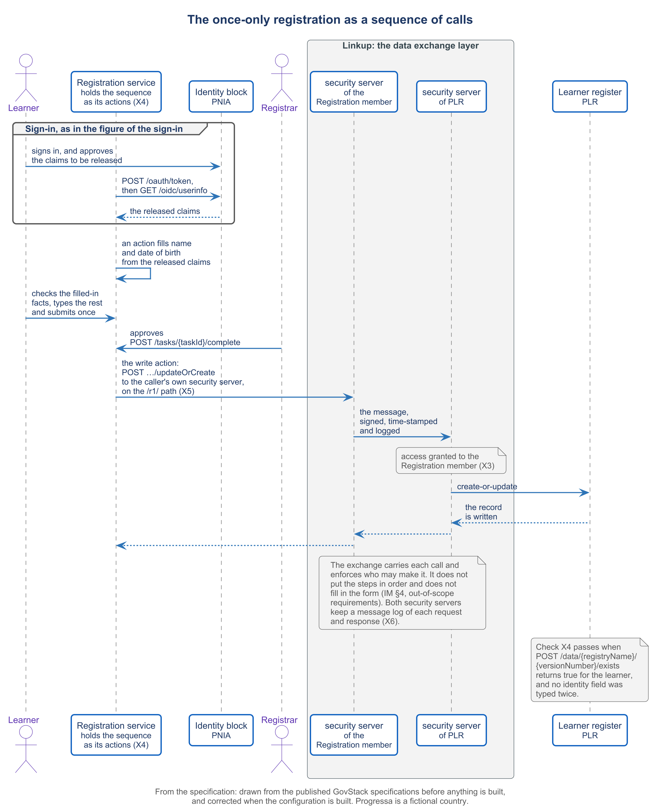

# 5.3 The once-only registration, from beginning to end


🎬 **Video in production:** *The once-only registration, from beginning to end* (~4 min).
The page below does not depend on the video: it carries what the video will say. The [video index](../../start-here/video-index.md) is the page to watch for links.


> **Single message.** A learner signs in, the form fills with the facts the learner agrees to release, the registrar approves and the record is in the register: one run that proves four blocks work as one foundation.

## The concept

A parent should not carry the same birth details to a school, a district office and a ministry. Once-only means the state asks once and reuses what it already holds. One registration run shows whether your foundation can do it.

PAERA states the principle plainly: citizens and businesses should only have to provide information to the government once. In education, that means a learner's name and date of birth, which the identity authority already holds, are not typed again on every form. Four blocks have to work together for that: identity, registration, the learner register, and the data exchange layer between them.

The run starts with a sign-in. The registration service sends the learner to the identity authority's own sign-in page. The learner, with a parent beside them, signs in, and PNIA asks which facts it may share with this service. The learner approves a name and a date of birth. The service receives only those, with the identifier PNIA gives to this one service. It keeps that identifier, never the national number.

Next, the form fills. The Registration specification lets a screen pull data from an outside source through a configured action. Here, the action places the released name and date of birth into the form. The parent types only what PNIA does not hold: the school, the grade and a contact number. Mapping identity facts into a registration record is the registration service's work; the exchange specification places it outside the exchange.

The learner submits once. The automated checks run, and the application reaches the registrar, a person who decides. On approval, an automated role in the registration service calls the learner register's write service through the exchange. That call is synchronous, signed, time-stamped and logged. Last, the service asks the register whether the record exists, and the register confirms it. Four blocks, one run.

One limit must be said plainly. The Identity specification requires the block to answer a query for a person's facts from server to server, but it publishes no interface for that query. What it publishes is the sign-in with the person present. PNIA's present service on Linkup, a read of a person by national number, is a contract of Progressa's own. If a build shows a pre-fill from server to server, it shows that contract under its own name.

This run is the principal demonstration of the course. The walkthrough follows it step by step: what the viewer sees at each step, and what counts as a pass. Nine steps lead from the sign-in on PNIA's own page to the register's answer that the record exists. A pass counts only from a run that took place, with its date.



*F12. The once-only registration as a sequence of calls.*


**Demonstration.** The once-only registration from beginning to end; this is the principal walkthrough of this guide. It needs X4, with everything it uses, on the running federation. Until it is recorded, the storyboard in the script stands in its place; see the [build plan](../build-pack.md).


## Your turn — Write the acceptance script for the once-only run


**💡 AI usage tip** · Write the acceptance script for the once-only run

**Bring:** The service description, the identity client registration and the register's contract.
**Get:** A numbered acceptance script for the run, each step with its pass condition.
**Time:** ~10–15 min · **Assistant:** any; the tips are tool-neutral.
**Watch for:** A script is not a result.


**The problem it solves.** Before anyone records the run, the team needs a script that says, step by step, what is done, what is observed and what counts as a pass, so that the recording proves something and a failed step is caught.



Copy the prompt, replace the bracketed parts with your own context, and run it in the AI assistant of your choice. Never paste personal data or unpublished documents — see [How to use the plays](../../start-here/how-to-use-the-plays.md).

```text
Below is the configuration of a registration service in [country X] that pre-fills a form from the identity block and writes to a register [paste the service description, the identity client registration and the contract of the register's write service]. Write the acceptance script for one run, from the sign-in to the register's confirmation. For each step give: (1) the step number and its name; (2) who acts: the test person, the registrar or the service; (3) what is done; (4) what is observed, on screen or in a response; (5) what counts as a pass, stated so that anyone can judge it. Include these checks: only the approved claims arrive; the identifier stored is the one the identity block gives this service, not the national number; no field is typed twice; the register confirms that the record exists. Use only the enrolled test person and the test register named in the configuration. Output: a numbered table of steps with the five columns, and a final line for the date and result of the run, left blank.
```

[Open in Claude](<https://claude.ai/new?q=Below%20is%20the%20configuration%20of%20a%20registration%20service%20in%20%5Bcountry%20X%5D%20that%20pre-fills%20a%20form%20from%20the%20identity%20block%20and%20writes%20to%20a%20register%20%5Bpaste%20the%20service%20description%2C%20the%20identity%20client%20registration%20and%20the%20contract%20of%20the%20register%27s%20write%20service%5D.%20Write%20the%20acceptance%20script%20for%20one%20run%2C%20from%20the%20sign-in%20to%20the%20register%27s%20confirmation.%20For%20each%20step%20give%3A%20%281%29%20the%20step%20number%20and%20its%20name%3B%20%282%29%20who%20acts%3A%20the%20test%20person%2C%20the%20registrar%20or%20the%20service%3B%20%283%29%20what%20is%20done%3B%20%284%29%20what%20is%20observed%2C%20on%20screen%20or%20in%20a%20response%3B%20%285%29%20what%20counts%20as%20a%20pass%2C%20stated%20so%20that%20anyone%20can%20judge%20it.%20Include%20these%20checks%3A%20only%20the%20approved%20claims%20arrive%3B%20the%20identifier%20stored%20is%20the%20one%20the%20identity%20block%20gives%20this%20service%2C%20not%20the%20national%20number%3B%20no%20field%20is%20typed%20twice%3B%20the%20register%20confirms%20that%20the%20record%20exists.%20Use%20only%20the%20enrolled%20test%20person%20and%20the%20test%20register%20named%20in%20the%20configuration.%20Output%3A%20a%20numbered%20table%20of%20steps%20with%20the%20five%20columns%2C%20and%20a%20final%20line%20for%20the%20date%20and%20result%20of%20the%20run%2C%20left%20blank.>) *(pre-fills the prompt in a new chat; check the bracketed parts before sending)*

*What to bring and what you get are in the box above.*




**Draft worked example, 2026-10-04.** Progressa is the fictional country used across these courses. The input below and the output in the next tab were made for this page by running the prompt once; they are shortened, and they have not been checked as the worked examples of the method have.


The bracketed parts of the prompt were replaced with the following:

**[country X]:** Progressa.

**[paste the service description, the identity client registration and the contract of the register's write service]**, all specimens, not yet run:

- **Service:** Progressa learner registration (MoEYS). Sequence: sign in, pre-fill name and birthdate, parent types school, grade and contact number, submit, registrar approves, write, confirm.
- **Identity client:** registered with PNIA as "Progressa learner registration"; scopes `openid`, `profile`; claims used: `name`, `birthdate`; keeps `sub`, never the national number. Enrolled test person: "Test Person One".
- **Register contract:** Digital Registries 3.0-alpha, test register `plr-learners`; `updateOrCreate` to write, `exists` to confirm. The register keys on its own `learner_number` (prefix `PLR-`) and stores `sub` in `pnia_service_identifier`.




**Draft: model output, shortened and unverified.** Read it with the notes in the next tab, not on its own.


| Step | Who acts | What is done | What is observed | Pass |
| --- | --- | --- | --- | --- |
| 1 Sign in | Test person | Chooses "sign in with national identity" | PNIA's own sign-in page, then its consent page | The address is PNIA's, not the service's |
| 2 Release | Test person, service | Approves name and birthdate | The form shows both | Only `name` and `birthdate` arrive; no other claim in the user information |
| 3 Complete | Test person | Types school, grade, contact number | Name and birthdate fields are read-only | No field filled in step 2 is typed again |
| 4 Submit and decide | Test person, registrar | Submits once; registrar approves | Application status "approved" | One submission; one approval by a person |
| 5 Write | Service | Calls `updateOrCreate` through Linkup | A success response with a `PLR-` number | `pnia_service_identifier` equals the `sub` received; no national number in the record |
| 6 Confirm | Service | Calls `exists` | The answer | `exists` returns true |

**Date of the run:** ______  **Result:** ______



This is the teaching part of the tip. Work through the output the way a chief architect would: what is earned, what is invented, what is missing.

<details>

<summary>1. Earned: the four required checks are there</summary>

Approved claims only (step 2), the service identifier and not the national number (step 5), nothing typed twice (step 3) and the register's confirmation (step 6) each have a pass anyone can judge. The result line is left blank, as it must be until a run takes place.

</details>

<details>

<summary>2. Risky: whose name fills the form</summary>

The enrolled test person is an adult, born 1988, applying as a parent. PNIA issues IDs only at 16, so the name and birthdate that arrive are the parent's, not the learner's. The script passes on paper while the record it writes would describe the wrong person.

</details>

<details>

<summary>3. Check next: rows were merged to fit</summary>

The page's walkthrough has nine steps; this table folds submission and approval into one row and leaves out a rejected run. Before recording, split step 4 again and add one run where the registrar rejects, to show nothing is written.

</details>


**Safeguard.** A script is not a result. Run it with the enrolled test person against a test register, never with a real learner, and record a pass only from a run that took place, with its date; leave the result line blank until then.




Each pass condition becomes the check X4 on the sheet of checks in [5.4](./5-4.md). The records of steps 5 and 6 are the evidence read in [5.5](./5-5.md).



## Sources

- PAERA v1.0, section 5.2 — https://paera.govstack.global/
- GovStack Registration — https://specs.govstack.global/registration
- GovStack Identity 2.0 — https://specs.govstack.global/identity
- GovStack Information Mediator 1.1.1 — https://specs.govstack.global/information-mediator
- GovStack Digital Registries 3.0-alpha — https://specs.govstack.global/registries
