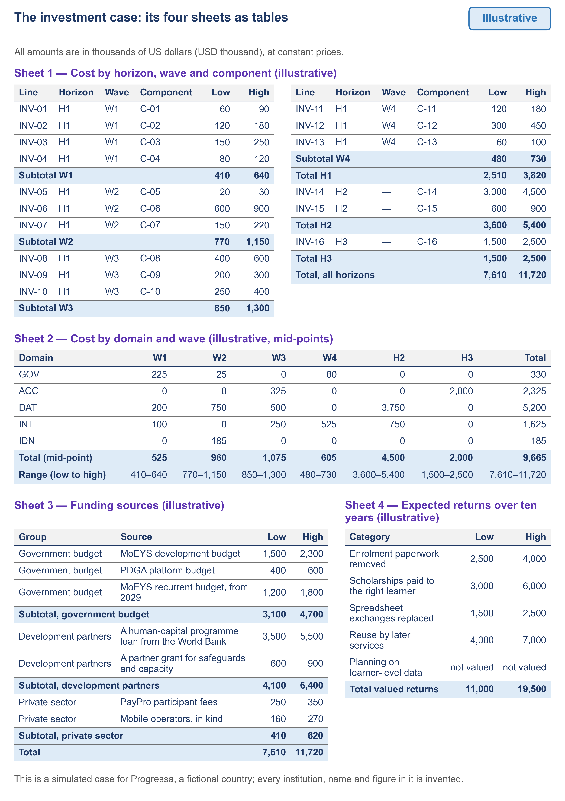

# 6.4 The investment case your finance ministry can read


🎬 **Video in production:** *The investment case your finance ministry can read* (~5 min).
The page below does not depend on the video: it carries what the video will say. The [video index](../../start-here/video-index.md) is the page to watch for links.


> **Single message.** Set out the roadmap's cost the way a finance ministry reads it: by wave and component with a low and a high estimate, by domain, by source of funds, and with the returns expected.

## The concept

A finance ministry does not fund a vision. It funds lines it can read, check and place in a budget year. The investment case turns the roadmap into those lines.

The first sheet costs every component of the roadmap, wave by wave. Each line names the component it pays for, so the case and the roadmap can be checked against each other. Each line also gives a low and a high estimate instead of one figure, because the cost of a shared system depends heavily on how it is bought. The World Bank found that procurement strategy can change the overall cost of an identity system by 25 per cent to over 100 per cent. Progressa's case, built as an example, comes to an illustrative 7.6 to 11.7 million dollars over seven years, of which 2.5 to 3.8 million fall in the first horizon.

The second sheet shows the same cost by domain and wave, so a minister sees where the money goes. In Progressa, digital data takes the largest share, because the register is rolled out to all 24 districts, and identity the smallest, because the identity authority is reused. The third sheet names who pays, in three groups: the government's budget, development partners and the private sector. The Universal DPI Safeguards Framework asks for diversified, phased and sustainable financing, with governments leading while the system is built. UNDP's playbook compares four instruments: public budgets, grants, private capital and debt.

Then the calendar. PAERA warns that a budget application, backed by a solid business case, can take 2 to 3 years before funds are received, and that projects funded by donors need a state budget commitment to last. So Progressa's ministry asks in 2027 for a recurrent budget line from the budget year 2029, before the partner money ends. Its third sheet shows, as illustrative figures, 3.1 to 4.7 million dollars from the government's budget, 4.1 to 6.4 million from development partners, and 410 to 620 thousand from the private sector.

The fourth sheet says what the country gets back. Progressa's case values four returns over ten years: enrolment paperwork removed, scholarships paid to the right learner, spreadsheet exchanges replaced, and reuse by later services. Together they come to an illustrative 11 to 19.5 million dollars, between about 0.9 and 2.6 times the cost. The case does not rest on the top of that range. It rests on reuse: later services pay for neither a register nor an identity check. Keep every figure illustrative until a costing confirms it; the World Bank says that even its own cost model does not predict actual costs.




**The worked example of this step** is [E8](../examples/E8_investment-case.md), built for Progressa.


## Your turn — Fill the four sheets of the investment case, and check that they agree


**💡 AI usage tip** · Fill the four sheets of the investment case, and check that they agree

**Bring:** The component register, the cost ranges with their sources, the funding sources and the expected returns.
**Get:** The four sheets of the investment case with the check of their totals, and a list of the figures that have no stated source.
**Time:** ~10–15 min · **Assistant:** any; the tips are tool-neutral.
**Watch for:** No figure enters the case without a source or the word illustrative.


**The problem it solves.** An investment case kept by hand in four sheets drifts: a line changed in one sheet is not changed in the others, and a figure arrives with no source. This prompt fills the four sheets from the components of the roadmap and the ranges it is given, checks that they add up to the same totals, and lists every figure that has no stated source.



Copy the prompt, replace the bracketed parts with your own context, and run it in the AI assistant of your choice. Never paste personal data or unpublished documents — see [How to use the plays](../../start-here/how-to-use-the-plays.md).

```text
Below are the components of the roadmap of [country X], each with its horizon, wave and domain: [paste the component register]. Below are a low and a high estimate for each component, each with its source or the word illustrative: [paste the ranges]. Below are the funding sources under discussion, each with its range and what it would fund: [paste]. Below are the expected returns, each with how it arises: [paste]. Fill four sheets: (1) cost by horizon, wave and component, with subtotals; (2) cost by domain and wave, using the mid-point of each range; (3) funding by source, in three groups: the government's budget, development partners, the private sector; (4) the expected returns. Check that sheets 1 and 3 give the same total range and that sheet 2 equals the mid-point of sheet 1, and show the arithmetic. List every figure that has neither a source nor the word illustrative. Do not invent a figure that was not given. Output: the four sheets of the investment case with the check of their totals, followed by a list of the figures that have no stated source.
```

[Open in Claude](<https://claude.ai/new?q=Below%20are%20the%20components%20of%20the%20roadmap%20of%20%5Bcountry%20X%5D%2C%20each%20with%20its%20horizon%2C%20wave%20and%20domain%3A%20%5Bpaste%20the%20component%20register%5D.%20Below%20are%20a%20low%20and%20a%20high%20estimate%20for%20each%20component%2C%20each%20with%20its%20source%20or%20the%20word%20illustrative%3A%20%5Bpaste%20the%20ranges%5D.%20Below%20are%20the%20funding%20sources%20under%20discussion%2C%20each%20with%20its%20range%20and%20what%20it%20would%20fund%3A%20%5Bpaste%5D.%20Below%20are%20the%20expected%20returns%2C%20each%20with%20how%20it%20arises%3A%20%5Bpaste%5D.%20Fill%20four%20sheets%3A%20%281%29%20cost%20by%20horizon%2C%20wave%20and%20component%2C%20with%20subtotals%3B%20%282%29%20cost%20by%20domain%20and%20wave%2C%20using%20the%20mid-point%20of%20each%20range%3B%20%283%29%20funding%20by%20source%2C%20in%20three%20groups%3A%20the%20government%27s%20budget%2C%20development%20partners%2C%20the%20private%20sector%3B%20%284%29%20the%20expected%20returns.%20Check%20that%20sheets%201%20and%203%20give%20the%20same%20total%20range%20and%20that%20sheet%202%20equals%20the%20mid-point%20of%20sheet%201%2C%20and%20show%20the%20arithmetic.%20List%20every%20figure%20that%20has%20neither%20a%20source%20nor%20the%20word%20illustrative.%20Do%20not%20invent%20a%20figure%20that%20was%20not%20given.%20Output%3A%20the%20four%20sheets%20of%20the%20investment%20case%20with%20the%20check%20of%20their%20totals%2C%20followed%20by%20a%20list%20of%20the%20figures%20that%20have%20no%20stated%20source.>) *(pre-fills the prompt in a new chat; check the bracketed parts before sending)*

*What to bring and what you get are in the box above.*




**Draft worked example, 2026-10-04.** Progressa is the fictional country used across these courses. The input below and the output in the next tab were made for this page by running the prompt once; they are shortened, and they have not been checked as the worked examples of the method have.


The bracketed parts of the prompt were replaced with the following:

**[country X]:** Progressa.

**[paste the component register]:** C-01 to C-16, each with its horizon, wave and domain, from the draft roadmap.

**[paste the ranges]:** lines INV-01 to INV-16, in USD thousand, one per component. Every range is marked illustrative except INV-12, the scholarship pilot (300–450), which was pasted with no source and no mark.

**[paste] (funding):** MoEYS development budget 1,500–2,300; PDGA platform budget 400–600; MoEYS recurrent budget from 2029, 1,200–1,800; World Bank loan 3,500–5,500; partner grant 600–900; PayPro participant fees 250–350; mobile operators in kind 160–270. All illustrative, except the participant fees, pasted without a mark.

**[paste] (returns):** four returns over ten years, each with how it arises, 11,000–19,500 in total, and planning on learner-level data, not valued.




**Draft: model output, shortened and unverified.** Read it with the notes in the next tab, not on its own.


**Sheet 1, cost by wave (subtotals of 16 lines):**

| Period | Low | High |
|---|---|---|
| W1 | 410 | 640 |
| W2 | 770 | 1,150 |
| W3 | 850 | 1,300 |
| W4 | 480 | 730 |
| H2 | 3,600 | 5,400 |
| H3 | 1,500 | 2,500 |

Total: 7,610–11,720, of which H1 2,510–3,820.

**Sheet 2, by domain (mid-points):** GOV 330, ACC 2,325, DAT 5,200, INT 1,625, IDN 185; total 9,665.

**Sheet 3, funding:** government budget 3,100–4,700; development partners 4,100–6,400; private sector 410–620; total 7,610–11,720.

**Sheet 4, returns:** 11,000–19,500 valued; one return not valued.

**Check of totals:**

- Sheet 1 and sheet 3 give the same range: 7,610–11,720.
- Sheet 2: (7,610 + 11,720) ÷ 2 = 9,665, equal to the sum of the domains.

**Figures with no stated source:**

- INV-12, scholarship pilot, 300–450.
- PayPro participant fees, 250–350.



This is the teaching part of the tip. Work through the output the way a chief architect would: what is earned, what is invented, what is missing.

<details>

<summary>1. The totals agree, and the arithmetic is shown</summary>

Sheet 1 and sheet 3 meet at the same range, and the mid-point check is written out. I recomputed both by hand from the lines given. That part is earned, and it is the check a reader can repeat.

</details>

<details>

<summary>2. A match of totals can hide a wrong line</summary>

Funding was built to equal cost, so the two sheets agreeing proves little about any single line. Sheet 2 also puts all of C-03 under data, although the school identifier also closes the connectivity gap. Read the domain of each line before the minister reads the pie.

</details>

<details>

<summary>3. Two figures must be traced before the case leaves</summary>

INV-12 and the participant fees carry neither a source nor the word illustrative. Find the source or mark them; then trace every other figure. Running costs after the third horizon are not in the case at all.

</details>


**Safeguard.** No figure enters the case without a source or the word illustrative. Before the case goes to the finance ministry, trace each figure to its source and recompute the totals yourself; a sum the model reports as matching is not a sum anyone has checked.




The case goes with the roadmap into the validation round in [6.7](./6-7.md), where the finance ministry's comments on its ranges are answered. Compare your sheets with [E8](../examples/E8_investment-case.md).



## Sources

- United Nations, Universal DPI Safeguards Framework, 2024, principle O8, page 25 (https://www.dpi-safeguards.org/framework)
- UNDP, The DPI Approach: A Playbook, 2023, page 44 (https://www.undp.org/publications/dpi-approach-playbook)
- PAERA v1.0, section 4.5 (https://paera.govstack.global/)
- World Bank, Understanding Cost Drivers of Identification Systems, 2018, pages 7 and 9 (https://documents1.worldbank.org/curated/en/702641544730830097/pdf/Understanding-Cost-Drivers-of-Identification-Systems.pdf)
