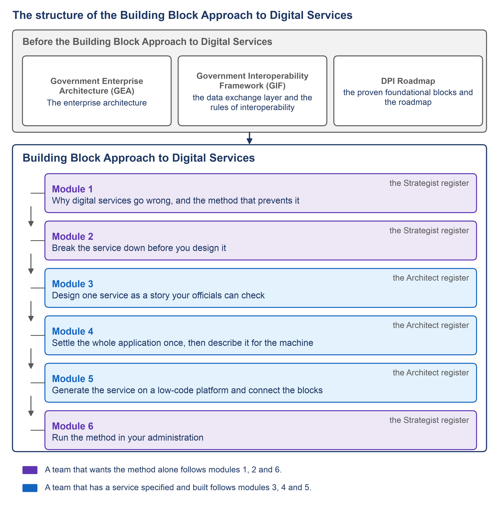

# Designing Digital Government Services using a Building Block Approach

37 videos in six modules · about 185 minutes of video · an AI usage tip on every page · 38 worked examples · ten blank instruments and a deliverables annex · self-paced · free and open

This guide teaches a government team to design a digital public service on shared building blocks and have it built on a low-code platform. It uses specification-driven development, SDD for short: a method in which every document a person writes is accepted before the next is begun, and the last is turned into the running service by a program, never by hand. The shared building blocks are the digital systems that many services of a country stand on: digital identity, registries, payments and the exchange of data between public bodies.

The guide has six modules and 37 subtopics. Each subtopic is one short video with a written page and an AI usage tip. Module 1 explains why digital services go wrong and what the method puts in the way. Modules 2 to 5 break a service down, design one goal of it, settle the whole application and generate it on the platform. Module 6 runs the method in an administration. Every example is set in Progressa, a fictional country: its quality authority for higher education and its ministry of education commission two applications so that a private institution gives its particulars to the state once.

*F1. The structure of this course: its modules and the two ways through them.*

## Outline

| Module | Topic | Persona | Videos | AI tips | Status |
| --- | --- | --- | --- | --- | --- |
| [1](module-1/README.md) | Why digital services go wrong, and the method that prevents it | Strategist | 5 | 5 tips | Prompts live |
| [2](module-2/README.md) | Break the service down before you design it | Strategist | 6 | 6 tips | Prompts live |
| [3](module-3/README.md) | Design one service as a story your officials can check | Architect | 6 | 6 tips | Prompts live |
| [4](module-4/README.md) | Settle the whole application once, then describe it for the machine | Architect | 6 | 6 tips | Prompts live |
| [5](module-5/README.md) | Generate the service on a low-code platform and connect the blocks | Architect | 7 | 7 tips | Prompts live |
| [6](module-6/README.md) | Run the method in your administration | Strategist | 7 | 7 tips | Prompts live |

*Prompts live — every page of the module is written, with its prompt. In production — the module's pages are added as its scripts are written.*


**How the course works.** **Watch** the video → **Read** its page, the video written out in full → **Prompt** with its AI usage tip on your own service → **Compare** your draft with the worked example for Progressa. The [worked examples](examples/README.md) follow the [twelve documents](twelve-documents.md) of the method in order and link to one another, from the catalogue of the sector's services to the running application, so that any screen can be followed back to the request behind it. Each document a person writes has a [blank instrument](toolkit/README.md) to copy and fill in.


| Module | What you can do afterwards | What of the worked example it uses |
| --- | --- | --- |
| 1 | Explain to the minister why an agreed service gets lost on the way and what the twelve documents of the method put in its way | The story of an institution that registered at the quality authority and filled in the same particulars again at the ministry |
| 2 | Commission the documents that are written before any design: the catalogue, the register, the records, the goals, the shared registers, the architecture | Filled extracts of the documents written before design, one for each subtopic |
| 3 | Have one goal written as a story with its screens, and run the review at which officials agree it | One goal written in full, the application for a provisional licence, with its screens and walk-through |
| 4 | Accept the interaction design, including the service workflow, and have the application model reviewed | The interaction design and the application model of the two applications |
| 5 | Read what is generated, why nothing is edited by hand, and how the service uses identity, registries, payments and information mediation | The two applications as they will be generated on the low-code platform, with the ministry reading the register across the data interface |
| 6 | Require the documents from a supplier, handle change, read progress from the work, use the AI assistant safely, and carry the method to the next service and another sector | A change of an institution's name, the trace report, and the digital credential as the next service |

## Audience — and the path for your role

| Persona | Who that is in practice | Modules | What you leave with |
| --- | --- | --- | --- |
| **Strategist** | The public-sector middle manager in education who commissions the service, judges the supplier's offer, convenes the review and answers to the minister and the donor | [1](module-1/README.md), [2](module-2/README.md), [6](module-6/README.md) | The method and the documents to ask for: the three places a service gets lost and the three rules to hold a supplier to, the twelve documents and who accepts each, the documents written before any design, and the way to run the method as the administration's own way of commissioning services. |
| **Architect** | The head of a sectoral ICT unit, or the project lead, who has a service specified and built by a supplier, convenes its reviews and accepts its documents | [3](module-3/README.md), [4](module-4/README.md), [5](module-5/README.md) | The service specified and built: one goal written as a story with its screens and agreed at the review, the whole application settled and described for the machine, and the service generated on the low-code platform, connected to the shared blocks and proved on the running system. |

Neither persona writes the documents of the method: staff, a supplier or an AI assistant does. The guide teaches what each document is for, what to see in it before accepting it, and where the manager's own decision lies. Modules 3, 4 and 5 go one level deeper than the others and still assume no knowledge of data models, version control, configuration files or the command line.

### Two ways through

| Way | Modules | What it gives |
| --- | --- | --- |
| **The method alone** | [1](module-1/README.md), [2](module-2/README.md), [6](module-6/README.md) | A team that wants the method alone follows modules 1, 2 and 6: why services go wrong, the documents that are written before any design, and how to run the method in an administration. |
| **The service specified and built** | [3](module-3/README.md), [4](module-4/README.md), [5](module-5/README.md) | A team that has a service specified and built follows modules 3, 4 and 5: one goal designed as a story, the whole application settled and described for the machine, and the service generated and connected to the shared blocks. |

The order of the modules follows the order in which an administration meets the method. It first learns why services go wrong, then breaks a service down, designs one goal of it, settles the whole application, has it generated and connected, and finally runs the method as its own way of commissioning services.

## All videos

Core marks the content without which the method cannot be followed from the request to the running service. Supplementary marks a video that deepens a core one and can be left out without losing the thread.

<strong>Module 1 — Why digital services go wrong, and the method that prevents it</strong>

| # | Video | Class | Demonstration | Page |
| --- | --- | --- | --- | --- |
| [1.1](module-1/1-1.md) | Where an agreed service gets lost | Core | — | Page live |
| [1.2](module-1/1-2.md) | Three rules you can hold a supplier to | Core | — | Page live |
| [1.3](module-1/1-3.md) | A question with a name on it is part of the specification | Core | — | Page live |
| [1.4](module-1/1-4.md) | Twelve documents from the request to the running service | Core | — | Page live |
| [1.5](module-1/1-5.md) | Who writes, who checks, who accepts | Core | — | Page live |

<strong>Module 2 — Break the service down before you design it</strong>

| # | Video | Class | Demonstration | Page |
| --- | --- | --- | --- | --- |
| [2.1](module-2/2-1.md) | One catalogue of the sector's services, and the blocks they share | Core | — | Page live |
| [2.2](module-2/2-2.md) | Write down what was asked before anyone designs | Core | — | Page live |
| [2.3](module-2/2-3.md) | The records the service keeps, and whose each one is | Core | — | Page live |
| [2.4](module-2/2-4.md) | Every goal named, and each tied to what was asked | Core | — | Page live |
| [2.5](module-2/2-5.md) | What every goal may use, and may not invent | Core | — | Page live |
| [2.6](module-2/2-6.md) | What the service is built on, and what crosses its boundary | Core | — | Page live |

<strong>Module 3 — Design one service as a story your officials can check</strong>

| # | Video | Class | Demonstration | Page |
| --- | --- | --- | --- | --- |
| [3.1](module-3/3-1.md) | One goal, written as a story a builder can follow | Core | — | Page live |
| [3.2](module-3/3-2.md) | Every way it can go wrong, written down | Core | — | Page live |
| [3.3](module-3/3-3.md) | Screens worked out from the story, every value with its source | Core | — | Page live |
| [3.4](module-3/3-4.md) | Screens officers can use | Supplementary | — | Page live |
| [3.5](module-3/3-5.md) | The walk-through your officials click | Core | Yes | Page live |
| [3.6](module-3/3-6.md) | The review: three people, every open line given a name | Core | — | Page live |

<strong>Module 4 — Settle the whole application once, then describe it for the machine</strong>

| # | Video | Class | Demonstration | Page |
| --- | --- | --- | --- | --- |
| [4.1](module-4/4-1.md) | Four questions decided once for every screen | Core | — | Page live |
| [4.2](module-4/4-2.md) | No list longer than nine: choose by category | Core | — | Page live |
| [4.3](module-4/4-3.md) | The service workflow: states, moves and who may make each | Core | — | Page live |
| [4.4](module-4/4-4.md) | One file a program reads: the application model | Core | — | Page live |
| [4.5](module-4/4-5.md) | Reviewing the model: what it assumed, and what it could not express | Core | — | Page live |
| [4.6](module-4/4-6.md) | Refused, not worked around | Core | Yes | Page live |

<strong>Module 5 — Generate the service on a low-code platform and connect the blocks</strong>

| # | Video | Class | Demonstration | Page |
| --- | --- | --- | --- | --- |
| [5.1](module-5/5-1.md) | From one file to a running application | Core | Yes | Page live |
| [5.2](module-5/5-2.md) | Nothing generated is edited by hand | Core | Yes | Page live |
| [5.3](module-5/5-3.md) | The platform's traps, caught before deployment | Core | — | Page live |
| [5.4](module-5/5-4.md) | Identity and registries: use the block, do not rebuild it | Core | Yes | Page live |
| [5.5](module-5/5-5.md) | The service's contract with the registration block, and its data interface | Core | Yes | Page live |
| [5.6](module-5/5-6.md) | Payments and information mediation as named crossings | Supplementary | — | Page live |
| [5.7](module-5/5-7.md) | Proof on the running system: a task a person finishes | Core | Yes | Page live |

<strong>Module 6 — Run the method in your administration</strong>

| # | Video | Class | Demonstration | Page |
| --- | --- | --- | --- | --- |
| [6.1](module-6/6-1.md) | What to require from a supplier | Core | — | Page live |
| [6.2](module-6/6-2.md) | When something changes, correct the document that owns the fact | Core | Yes | Page live |
| [6.3](module-6/6-3.md) | Read where the work stands from the work | Core | — | Page live |
| [6.4](module-6/6-4.md) | The AI assistant at every step, and the person who rules | Core | — | Page live |
| [6.5](module-6/6-5.md) | The next service on the same foundation | Core | — | Page live |
| [6.6](module-6/6-6.md) | Carry the method to another sector | Core | — | Page live |
| [6.7](module-6/6-7.md) | Before you rely on it: what the method does not claim | Supplementary | — | Page live |

## How to use this guide

Each subtopic page holds the content of its video written out in full, its worked example, its AI usage tip with the prompt ready to copy, and its sources with their links. A page can be read on its own, like the video it goes with.

Every AI usage tip has four parts: the problem it solves, the prompt, what goes in and what comes out, and a safeguard. The safeguard says what a person must check before the output of the assistant is used.

Every worked example is built for Progressa. Its names and values are invented for Progressa, and nothing in it is taken from the results of any country. Figures from public sources are given with their source, their year and their page.

The twelve documents of the method are on one page, and each document a person writes has a blank instrument that a team can copy and fill in.

Each module ends with a self-check: four questions on what a manager decides, each with the answer the module gives, to compare with after answering. The terms the guide uses are explained in its glossary.

Before your first prompt, read [Working with AI](../start-here/working-with-ai.md) and [How to use the plays](../start-here/how-to-use-the-plays.md): they hold the ground rules for using an assistant on government material, and they apply to every course in this knowledge base.

## Prerequisites

[**Developing a Gov Enterprise Architecture (GEA)**](../kp1/README.md), [**Building a Government Interoperability Framework (GIF)**](../kp2/README.md) **and** [**Education Digital Public Infrastructure (DPI) Roadmap**](../kp3/README.md) **come before this course, but none is a prerequisite.** Modules 1, 2 and 6 stand on their own. Module 5 connects the service to identity, registries, payments and the data exchange as blocks already in place; on Progressa they are, so you can follow it without having taken those courses.

**What you do need:**

| | |
| --- | --- |
| **A real service** | A public service, in education or another sector, that your administration is about to commission or has commissioned. The AI usage tips act on your service, not on a case study. No service to hand? Follow everything on [Progressa](../start-here/progressa.md) instead. |
| **The customer's own documents** | The mandate, the forms, the decrees and the notes of the people who run the service today. The register of requirements is drawn from them ([2.2](module-2/2-2.md)). |
| **An AI assistant** | Any general assistant — Claude, ChatGPT, Gemini. A free account is enough. Nothing to install. |
| **Nothing to run** | No code is written. The demonstrations that need the generated application are shown as storyboards until it has been generated and checked. |
| **About fifteen minutes, once** | The first pages of [Start here](../start-here/README.md) cover how to work with the prompts and the ground rules for using an assistant on government material. Read them before your first prompt. |

Time: each subtopic is a video of about five minutes, its page, and an AI usage tip of ten to fifteen minutes. A module is an afternoon. The whole course is roughly two working days spread over as long as you like.

<table data-view="cards"><thead><tr><th></th><th></th><th></th><th data-hidden data-card-target data-type="content-ref"></th></tr></thead><tbody>
<tr><td><h3>🛡️</h3></td><td><strong>Working with AI</strong></td><td>What an assistant is good for, the four ways it misleads you, and the safeguards. Read once; applies to every course in this knowledge base.</td><td><a href="../start-here/working-with-ai.md">working-with-ai</a></td></tr>
<tr><td><h3>🏁</h3></td><td><strong>Module 1 — Why digital services go wrong, and the method that prevents it</strong></td><td>5 videos for the Strategist: the three places a service gets lost, the three rules, the twelve documents and who accepts each.</td><td><a href="module-1/README.md">module-1</a></td></tr>
<tr><td><h3>📒</h3></td><td><strong>The worked examples</strong></td><td>One for each subtopic, built for Progressa and linked to one another: the shape of the documents you will commission.</td><td><a href="examples/README.md">examples/README</a></td></tr>
<tr><td><h3>🧰</h3></td><td><strong>The blank instruments</strong></td><td>A blank to copy and fill in for each document a person writes, with the questions to ask before accepting it.</td><td><a href="toolkit/README.md">toolkit/README</a></td></tr>
</tbody></table>

## Reference pages

<table data-view="cards"><thead><tr><th></th><th></th><th data-hidden data-card-target data-type="content-ref"></th></tr></thead><tbody>
<tr><td><strong>The twelve documents</strong></td><td>Each document of the method with who writes it, what goes in, what comes out, its blank instrument, where a person decides and how it is checked.</td><td><a href="twelve-documents.md">twelve-documents</a></td></tr>
<tr><td><strong>The blank instruments</strong></td><td>A blank to copy and fill in for each document a person writes, with the questions to ask before accepting it.</td><td><a href="toolkit/README.md">toolkit/README</a></td></tr>
<tr><td><strong>The worked examples</strong></td><td>One worked example for each subtopic, built for Progressa.</td><td><a href="examples/README.md">examples/README</a></td></tr>
<tr><td><strong>Frameworks and standards</strong></td><td>The public frameworks and standards this guide cites, in five kinds, each with its address.</td><td><a href="frameworks-and-standards.md">frameworks-and-standards</a></td></tr>
<tr><td><strong>The public sources</strong></td><td>Every public source this guide cites, with its edition or date and its address.</td><td><a href="public-sources.md">public-sources</a></td></tr>
<tr><td><strong>The standings of the method's standards</strong></td><td>How far each standard behind the twelve documents has come, stated once for the whole guide.</td><td><a href="standings.md">standings</a></td></tr>
<tr><td><strong>Glossary</strong></td><td>Every term this guide uses, each in one plain sentence.</td><td><a href="glossary.md">glossary</a></td></tr>
<tr><td><strong>Figures</strong></td><td>The figures of the guide, with the subtopics that use them.</td><td><a href="figures.md">figures</a></td></tr>
</tbody></table>

## Where this sits

| Part | What it takes | What it gives |
| --- | --- | --- |
| [Developing a Gov Enterprise Architecture (GEA)](../kp1/README.md), [Building a Government Interoperability Framework (GIF)](../kp2/README.md) and [Education Digital Public Infrastructure (DPI) Roadmap](../kp3/README.md), before this course | — | The enterprise architecture; the data exchange layer and the rules of interoperability; the proven foundational blocks and the roadmap |
| Module 1 | A service that went wrong, and the people who commission the next one | The three places a service gets lost, the three rules, the twelve documents and who accepts each |
| Module 2 | The sector's mandate and the customer's own documents | The catalogue, the register, the records, the goals, the shared registers and the architecture |
| Modules 3 and 4 | The documents of module 2 | One goal as a story with its screens and walk-through, agreed at the review; the interaction design and the service workflow; the application model, reviewed and admitted |
| Module 5 | The admitted model and the shared blocks | The generated service on the low-code platform, connected to identity, registries, payments and the data exchange, proved on the running system |
| Module 6 | The proved service | The supplier's deliverables, the handling of change, progress read from the work, the rules for the AI assistant, the next service and another sector |

All the courses in this knowledge base use [Progressa](../start-here/progressa.md) as the one worked example and share one set of [ground rules](../start-here/working-with-ai.md).


**Use this knowledge base from your AI assistant.** Every page is also published as plain Markdown, and the knowledge base exposes an `llms.txt` and an MCP endpoint at `/~gitbook/mcp`. Point Claude, ChatGPT or another assistant at the knowledge base and ask it to *run the AI usage tip of 2.2 with the following context* — the knowledge base becomes the tool's reference, not just yours.

