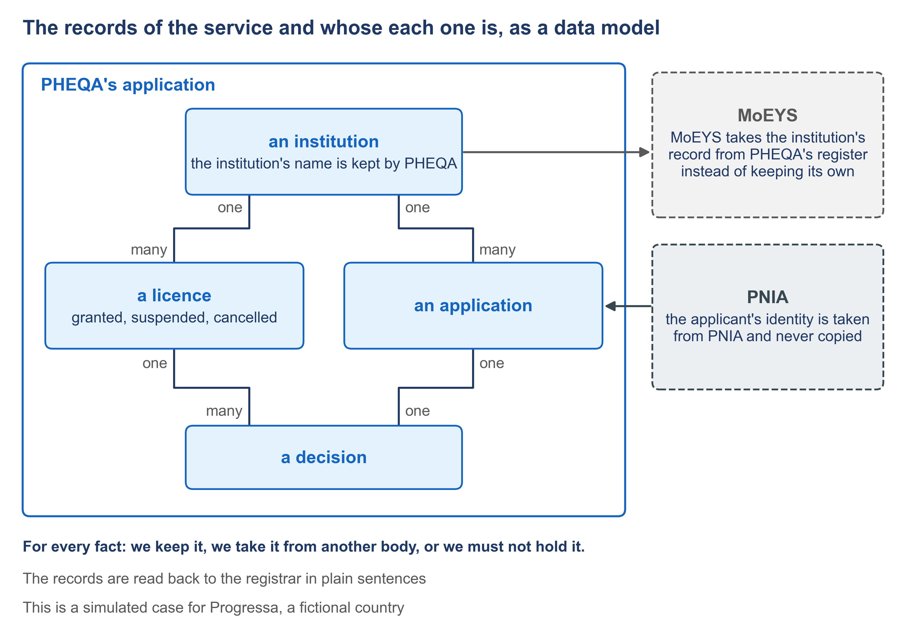
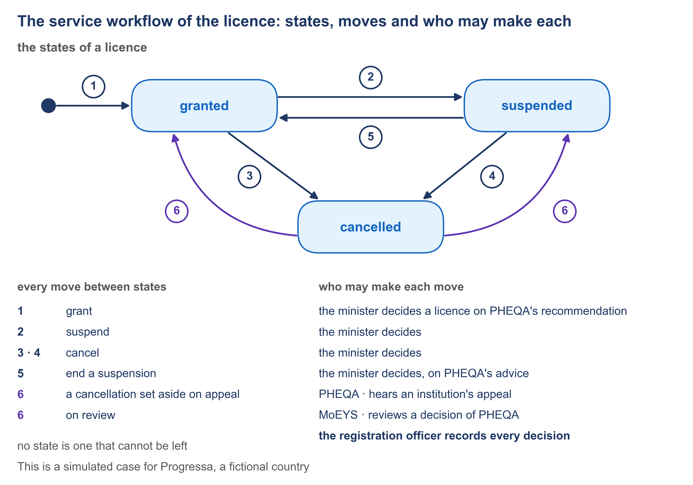

# Figures

The figures are made for this written guide; the slides of the videos stay text-only. A figure that shows a document of the worked example is drawn when that document exists. Every figure is illustrative, like the example.

| Figure | What it shows | Used by | State |
| --- | --- | --- | --- |
| F1 | The structure of this course: its modules and the two ways through them | The guide's opening | Drawn |
| F2 | The three places an agreed service gets lost | [1.1](module-1/1-1.md) | Drawn |
| F3 | The twelve documents in order, with where the manager stands | [1.4](module-1/1-4.md) and [6.1](module-6/6-1.md) | Drawn |
| F4 | Who writes, who checks, who accepts | [1.5](module-1/1-5.md) and [6.4](module-6/6-4.md) | Drawn |
| F5 | The sector's catalogue: many services resting on the same blocks | [2.1](module-2/2-1.md) and [6.5](module-6/6-5.md) | Drawn |
| F6 | The records of the service and whose each one is, as a data model | [2.3](module-2/2-3.md) | Drawn |
| F7 | The architecture: two applications, the shared blocks and the crossing | [2.6](module-2/2-6.md), [5.4](module-5/5-4.md), [5.5](module-5/5-5.md) and [5.6](module-5/5-6.md) | Drawn |
| F8 | One goal as a story, with its failures and their endings | [3.1](module-3/3-1.md) and [3.2](module-3/3-2.md) | Drawn |
| F9 | A screen with the source of every value | [3.3](module-3/3-3.md) | Drawn |
| F10 | The four questions of the interaction design | [4.1](module-4/4-1.md) | Drawn |
| F11 | The service workflow of the licence: states, moves and who may make each | [4.3](module-4/4-3.md) | Drawn |
| F12 | From one file to a running application, with the refusal before it | [4.4](module-4/4-4.md), [4.6](module-4/4-6.md) and [5.1](module-5/5-1.md) | Drawn |
| F13 | Correct up, generate down | [5.2](module-5/5-2.md) and [6.2](module-6/6-2.md) | Drawn |
| F14 | The data interface between the two bodies across the data exchange | [5.5](module-5/5-5.md) | Drawn |

## F1. The structure of this course: its modules and the two ways through them

## F2. The three places an agreed service gets lost

## F3. The twelve documents in order, with where the manager stands

## F4. Who writes, who checks, who accepts

## F5. The sector's catalogue: many services resting on the same blocks

## F6. The records of the service and whose each one is, as a data model

## F7. The architecture: two applications, the shared blocks and the crossing

## F8. One goal as a story, with its failures and their endings

## F9. A screen with the source of every value

## F10. The four questions of the interaction design

## F11. The service workflow of the licence: states, moves and who may make each

## F12. From one file to a running application, with the refusal before it

## F13. Correct up, generate down

## F14. The data interface between the two bodies across the data exchange

