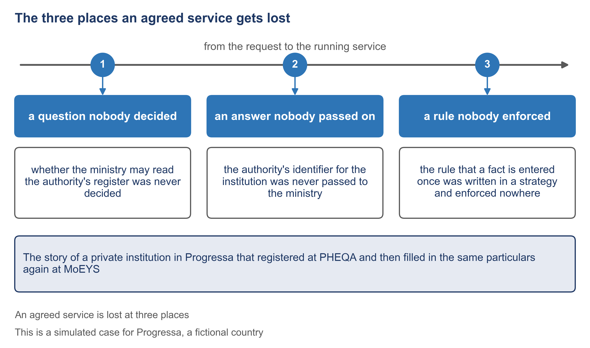

# 1.1 Where an agreed service gets lost


🎬 **Video in production:** *Where an agreed service gets lost* (~5 min).
The page below does not depend on the video: it carries what the video will say. The [video index](../../start-here/video-index.md) is the page to watch for links.


> **Single message.** An agreed service is lost at three places: a question nobody decided, an answer nobody passed on, a rule nobody enforced.

| | |
| --- | --- |
| **Written for** | Strategist — the public-sector middle manager in education who commissions the service, judges the supplier's offer, convenes the review and answers to the minister and the donor |
| **Anchor** | None. The content is the SDD method's own: an agreed service is lost at three places, and a silence that is named, owned and counted is a specification. No public source is cited. |
| **Runtime** | ~5 min |
| **Class** | Core |
| **Terms of reference** | §4.4 (education as the demonstration, with a method other sectors can use); §4.1 (the method as a whole: why each of its steps exists); §4.3 (AI integration — sorting a project's lessons learned) |

## The concept

Your minister agreed a service with the officials who will run it. A year later, the service that arrives is not the one they agreed. You will be asked why. There is an answer you can give, and it has three parts.

Between what officials agree and what a system does, there is a wide space. In that space, every question about the service must be answered by somebody. What happens when an applicant leaves a document out? Which body keeps the institution's address? If nothing forces those questions into the open, they are still answered: quietly, by whoever is at the keyboard that day, and with no record. The service is delivered. It simply does not do what anybody agreed it would do.

The SDD method, short for specification-driven development, names three places where this happens. First, a question nobody decided: the people who agreed the service never settled a point, so the builder settled it alone, or nobody did. Second, an answer nobody passed on: somebody decided, but the decision never reached the document or the person who needed it. Third, a rule nobody enforced: the rule was written down, but no check, no person and no program held anyone to it.

Here is how it looked in Progressa. Harbourview University College, a private institution, applied to PHEQA, the quality authority, for its licence. In June PHEQA entered it in the register of institutions, under the number INS-00217. In September MoEYS, the ministry of education, asked for the same particulars on its own form. The college had moved its office in August and told PHEQA, but not the ministry. So the ministry asked why the two addresses differed. In the college registrar's words: everybody had agreed, in the national strategy, that an institution gives its particulars to the state once. We gave them twice and were then asked to explain the difference.

Now place each loss. Nobody ever decided whether MoEYS may read PHEQA's register, so the ministry built its own form and asked again. That is a question nobody decided. PHEQA gave the college a number, but nobody passed it to MoEYS, so the ministry's form had no place for it and could not look the college up. That is an answer nobody passed on. And the rule that a fact is entered once was written in the national strategy, but no document of either project tested it, and no review asked about it. That is a rule nobody enforced.

Notice what is missing from this story: a programming error. Each loss is a decision about the service that was never made, never written into the right document, or never checked. That is why the method states its purpose in one sentence. A silence that is named, owned and counted is a specification. A silence filled in with a plausible answer is a fault dressed as a specification. The method's documents exist to close the three places, so that you can tell your minister where a service was lost, and what must change.



*F2. The three places an agreed service gets lost.*


**The worked example of this subtopic** is [E1-1](../examples/E1-1_where-an-agreed-service-gets-lost.md), built for Progressa.


## Your turn — Place each problem of a past project at one of the three places

**The problem it solves.** After a project, a lessons-learned note lists what went wrong, but not where the service was lost. Until each problem is placed, nobody can tell whether the fix is a decision, a document or a check, or who should make it.

Copy the prompt, replace the bracketed parts with your own context, and run it in the AI assistant of your choice. Never paste personal data or unpublished documents — see [How to use the plays](../../start-here/how-to-use-the-plays.md).

```text
Below is the lessons-learned note of a project in [the ministry or agency] that built [the service] [paste the note]. An agreed service is lost at one of three places: (1) a question nobody decided, where the people who agreed the service never settled a point; (2) an answer nobody passed on, where a decision was made but never reached the document or the person who needed it; (3) a rule nobody enforced, where a rule was written down but no check, person or program held anyone to it. For each problem in the note, produce one row with: (a) the problem, in the note's own words; (b) the place, 1, 2 or 3; (c) one line of reason, quoting the sentence of the note it rests on. If a problem cannot be placed from what the note says, write 'cannot be placed from the note' and keep the problem as the note states it. Do not merge problems, and do not add problems the note does not state. Output: a table with one row per problem, then a count of the problems at each place and of those that could not be placed.
```

[Open in Claude](<https://claude.ai/new?q=Below%20is%20the%20lessons-learned%20note%20of%20a%20project%20in%20%5Bthe%20ministry%20or%20agency%5D%20that%20built%20%5Bthe%20service%5D%20%5Bpaste%20the%20note%5D.%20An%20agreed%20service%20is%20lost%20at%20one%20of%20three%20places%3A%20%281%29%20a%20question%20nobody%20decided%2C%20where%20the%20people%20who%20agreed%20the%20service%20never%20settled%20a%20point%3B%20%282%29%20an%20answer%20nobody%20passed%20on%2C%20where%20a%20decision%20was%20made%20but%20never%20reached%20the%20document%20or%20the%20person%20who%20needed%20it%3B%20%283%29%20a%20rule%20nobody%20enforced%2C%20where%20a%20rule%20was%20written%20down%20but%20no%20check%2C%20person%20or%20program%20held%20anyone%20to%20it.%20For%20each%20problem%20in%20the%20note%2C%20produce%20one%20row%20with%3A%20%28a%29%20the%20problem%2C%20in%20the%20note%27s%20own%20words%3B%20%28b%29%20the%20place%2C%201%2C%202%20or%203%3B%20%28c%29%20one%20line%20of%20reason%2C%20quoting%20the%20sentence%20of%20the%20note%20it%20rests%20on.%20If%20a%20problem%20cannot%20be%20placed%20from%20what%20the%20note%20says%2C%20write%20%27cannot%20be%20placed%20from%20the%20note%27%20and%20keep%20the%20problem%20as%20the%20note%20states%20it.%20Do%20not%20merge%20problems%2C%20and%20do%20not%20add%20problems%20the%20note%20does%20not%20state.%20Output%3A%20a%20table%20with%20one%20row%20per%20problem%2C%20then%20a%20count%20of%20the%20problems%20at%20each%20place%20and%20of%20those%20that%20could%20not%20be%20placed.>) *(pre-fills the prompt in a new chat; check the bracketed parts before sending)*

**What goes in and what comes out.** Input: the project's lessons-learned note, as written. Output: a table of the project's problems, each placed at one of the three places with one line of reason, and the problems that could not be placed kept as the note states them.


**Safeguard.** The placing is a proposal, not a finding. The people who ran the project confirm each row before the table is used, and a problem the prompt cannot place is kept as it is, not forced into a place: forcing it would hide the very thing nobody has yet understood.


## Sources

This subtopic cites no public source. Its content is the specification-driven method itself, described at the level of the manager.
