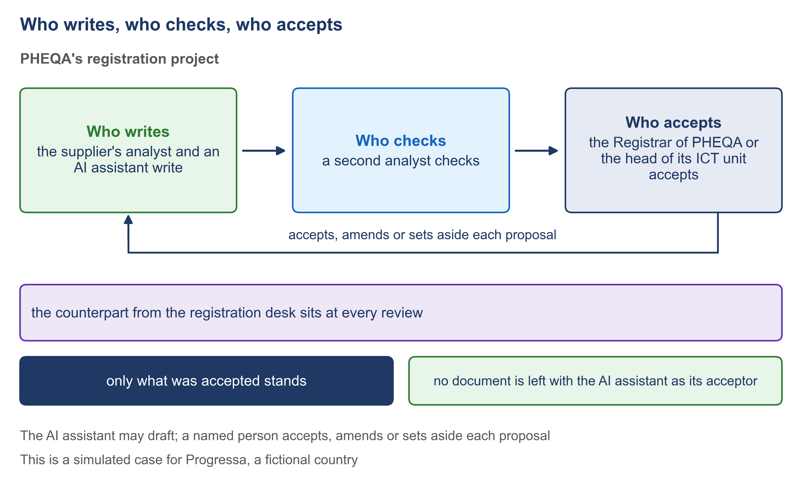

# 1.5 Who writes, who checks, who accepts


🎬 **Video in production:** *Who writes, who checks, who accepts* (~5 min).
The page below does not depend on the video: it carries what the video will say. The [video index](../../start-here/video-index.md) is the page to watch for links.


> **Single message.** The AI assistant may draft; a named person accepts, amends or sets aside each proposal, and only what was accepted stands.

## The concept

An AI assistant can draft a register of requirements in an afternoon. That is real help. It also raises a question your minister will ask: if a machine wrote it, who is answerable for it?

The SDD method's answer is simple. An AI assistant may draft any document a person would otherwise draft. It proposes; it never decides. A named person rules on each thing it proposes, and says one of three words: accepted, amended or set aside. The document then holds only what that person accepted, in that person's words. A draft is never accepted because it reads well. It is accepted line by line, by somebody whose name is on it, and who can be asked about it later.

Inventing something plausible is the thing an assistant does best. So the method binds it with one rule: a gap is recorded as a question with an owner, and never filled with an invented answer. When an official's text is silent, the assistant does not guess a figure to keep the work moving. It writes the question down, and a person decides who must answer it and by when. Every invented answer it avoids is one less fault hidden in the service.

For each of the twelve documents, three roles are named. Someone writes it. Someone else checks it. And a named person accepts it. In PHEQA's project in Progressa, the supplier's analyst and an AI assistant write. A second analyst of the supplier checks. The Registrar of PHEQA accepts, or the head of PHEQA's ICT unit for the technical documents. And the head of the registration desk sits at every review of something an officer will use.

In four of PHEQA's documents, an AI assistant does the writing. It extracts the register of what was asked. It helps write the shared settings and lists. It drafts each goal as a story. And it writes the application model, the file a program reads, under the rule that it must refuse to guess. In each of the four, a named person rules on what it wrote, and a different named person accepts it: the Registrar, the owner of each setting, or the head of the ICT unit.

Ask your supplier for this table before the first document is written, and check three things. No row ends with the assistant. In no row does the writer accept alone: where a writer sits at a review, as the owner of the screens does, two other people must agree. And at every review of something an officer will use, the person who will live with the result sits beside the owner and the builder. If a cell under 'accepts' names the supplier, or names nobody, that decision has not been given to anyone in your organisation.



*F4. Who writes, who checks, who accepts.*


**The worked example of this subtopic** is [E1-5](../examples/E1-5_who-writes-who-checks-who-accepts.md), built for Progressa.


## Your turn — Draft who writes, checks and accepts each document

**The problem it solves.** A project team knows its roles but has never written down, document by document, who writes, who checks and who accepts. Until it does, an AI assistant's draft can slip into the record with nobody answerable for it.

Copy the prompt, replace the bracketed parts with your own context, and run it in the AI assistant of your choice. Never paste personal data or unpublished documents — see [How to use the plays](../../start-here/how-to-use-the-plays.md).

```text
Below is the list of roles in the team that will commission and build [the service] for [the ministry or agency], with the body each role belongs to: our own staff, the supplier, or another body [paste the list]. For each of these twelve documents, propose who writes it, who checks it, who accepts it, and who sits at its review: (1) our own documents; (2) the register of what was asked; (3) the records the service keeps; (4) every goal, each tied to what was asked; (5) the architecture; (6) the shared states, settings and code lists (fixed lists of choices); (7) one goal written as a story; (8) the screens of that goal; (9) the walk-through; (10) the interaction design; (11) the application model; (12) the working application. Where an AI assistant writes, name the person who rules on its draft. Follow three rules: the writer never accepts alone; the AI assistant never accepts; and the official who will use the result sits at every review of something an officer will use. Use only the roles in the list; where no role fits, write 'no role named'. Output: a table with one row per document and four columns, then a list of the cells marked 'no role named'.
```

[Open in Claude](<https://claude.ai/new?q=Below%20is%20the%20list%20of%20roles%20in%20the%20team%20that%20will%20commission%20and%20build%20%5Bthe%20service%5D%20for%20%5Bthe%20ministry%20or%20agency%5D%2C%20with%20the%20body%20each%20role%20belongs%20to%3A%20our%20own%20staff%2C%20the%20supplier%2C%20or%20another%20body%20%5Bpaste%20the%20list%5D.%20For%20each%20of%20these%20twelve%20documents%2C%20propose%20who%20writes%20it%2C%20who%20checks%20it%2C%20who%20accepts%20it%2C%20and%20who%20sits%20at%20its%20review%3A%20%281%29%20our%20own%20documents%3B%20%282%29%20the%20register%20of%20what%20was%20asked%3B%20%283%29%20the%20records%20the%20service%20keeps%3B%20%284%29%20every%20goal%2C%20each%20tied%20to%20what%20was%20asked%3B%20%285%29%20the%20architecture%3B%20%286%29%20the%20shared%20states%2C%20settings%20and%20code%20lists%20%28fixed%20lists%20of%20choices%29%3B%20%287%29%20one%20goal%20written%20as%20a%20story%3B%20%288%29%20the%20screens%20of%20that%20goal%3B%20%289%29%20the%20walk-through%3B%20%2810%29%20the%20interaction%20design%3B%20%2811%29%20the%20application%20model%3B%20%2812%29%20the%20working%20application.%20Where%20an%20AI%20assistant%20writes%2C%20name%20the%20person%20who%20rules%20on%20its%20draft.%20Follow%20three%20rules%3A%20the%20writer%20never%20accepts%20alone%3B%20the%20AI%20assistant%20never%20accepts%3B%20and%20the%20official%20who%20will%20use%20the%20result%20sits%20at%20every%20review%20of%20something%20an%20officer%20will%20use.%20Use%20only%20the%20roles%20in%20the%20list%3B%20where%20no%20role%20fits%2C%20write%20%27no%20role%20named%27.%20Output%3A%20a%20table%20with%20one%20row%20per%20document%20and%20four%20columns%2C%20then%20a%20list%20of%20the%20cells%20marked%20%27no%20role%20named%27.>) *(pre-fills the prompt in a new chat; check the bracketed parts before sending)*

**What goes in and what comes out.** Input: the team's list of roles, with the body each role belongs to. Output: a table of who writes, checks and accepts each of the twelve documents for your project team, with the cells where no role is named marked.


**Safeguard.** The people named in the table are proposals until the head of the unit confirms them. Before the table is used, check that no document is left with the AI assistant as its acceptor.


## Sources

This subtopic cites no public source. Its content is the specification-driven method itself, described at the level of the manager.
