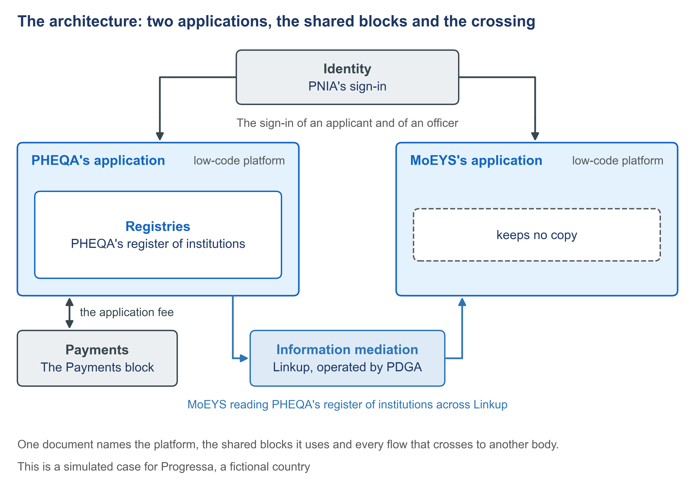

# 2.6 What the service is built on, and what crosses its boundary


🎬 **Video in production:** *What the service is built on, and what crosses its boundary* (~5 min).
The page below does not depend on the video: it carries what the video will say. The [video index](../../start-here/video-index.md) is the page to watch for links.


> **Single message.** One document names the platform, the shared blocks it uses and every flow that crosses to another body.

## The concept

Your new service will read another body's register. Has that body agreed? A promise made on someone else's behalf can stall a project at the border between two offices. One page prevents it.

That page is the software architecture. It names three things: the platform the service runs on, the shared blocks it uses instead of building its own, and every flow that crosses to another body, in either direction. The solution architect writes it once the register of what was asked, the records and the goals are settled, and agrees it with the bodies on the other side of each crossing. A manager can read it without a technical background.

Progressa's page shows two applications. The quality authority's, PHEQA's, runs on its own installation of the low-code platform and keeps the register of institutions. It is the only one that writes it. The ministry's, MoEYS's, runs on a second installation and keeps the minister's decisions and the list for the Gazette, but no copy of the register. Both use PNIA's sign-in. Every exchange between the two bodies passes through Linkup, the data exchange layer that PDGA operates, and the fee goes through the Payments block.

The heart of the page is the table of crossings. As PHEQA's application sees it, there are six. Who is signing in comes in from PNIA. An institution's entry goes out to MoEYS, as the answer to the ministry's reading. PHEQA's recommendation goes out to the minister, and the minister's decision on a licence and approval of a new name come back. The fee request goes out to the Payments block, and its confirmation comes in. Each row names its direction, the body on the other side and the channel. For each crossing, the full document also says what happens when a value is missing or out of date, or when the other side cannot be reached. If PHEQA's register cannot be reached, the ministry's officer waits; there is no old copy to use.

This is the building block approach as GovStack publishes it. Its Architecture specification asks that government systems be built from loosely coupled building blocks that can be developed, maintained and replaced independently, which supports reuse. The Registration specification asks that traffic in and out of the block pass through an Information Mediator or a secure API gateway: a controlled entry point that checks every request. The Information Mediator specification describes the mediator as the channel to registry, identity and payment services. In Progressa, that mediator is Linkup.

Before the head of PHEQA's ICT unit accepts the page, the body on the other side of each crossing confirms its row: the ministry for four rows, PNIA for the sign-in, the operator of the Payments block for the fee, and PDGA for the use of Linkup. GovStack's Architecture specification warns that when systems do not share the same rules, every connection becomes a custom project. A crossing nobody on the other side has agreed is a promise made on their behalf.



*F7. The architecture: two applications, the shared blocks and the crossing.*


**The worked example of this subtopic** is [E2-6](../examples/E2-6_what-the-service-is-built-on.md), built for Progressa.


## Your turn — List every crossing of the service's boundary

**The problem it solves.** A service description says what the service does but rarely lists every flow that crosses to another body. A crossing nobody lists is never agreed, and the project stalls when it reaches it.

Copy the prompt, replace the bracketed parts with your own context, and run it in the AI assistant of your choice. Never paste personal data or unpublished documents — see [How to use the plays](../../start-here/how-to-use-the-plays.md).

```text
Below is the description of a service in [country X]: what it does, who uses it, and which other bodies and shared blocks it deals with [paste the description]. List every flow that crosses the boundary of the service. For each crossing give: (1) a number, X-1, X-2 and so on; (2) what crosses, in plain words; (3) its direction: in, out, or out then in; (4) the body on the other side; (5) the channel it goes through, such as the national sign-in, the data exchange layer or the payments block; (6) when it happens; (7) the sentence of the description it rests on, quoted. Where you infer a crossing that no sentence states, mark it 'inferred: question'. Output: a table of crossings, then a list of the bodies that must confirm their rows.
```

[Open in Claude](<https://claude.ai/new?q=Below%20is%20the%20description%20of%20a%20service%20in%20%5Bcountry%20X%5D%3A%20what%20it%20does%2C%20who%20uses%20it%2C%20and%20which%20other%20bodies%20and%20shared%20blocks%20it%20deals%20with%20%5Bpaste%20the%20description%5D.%20List%20every%20flow%20that%20crosses%20the%20boundary%20of%20the%20service.%20For%20each%20crossing%20give%3A%20%281%29%20a%20number%2C%20X-1%2C%20X-2%20and%20so%20on%3B%20%282%29%20what%20crosses%2C%20in%20plain%20words%3B%20%283%29%20its%20direction%3A%20in%2C%20out%2C%20or%20out%20then%20in%3B%20%284%29%20the%20body%20on%20the%20other%20side%3B%20%285%29%20the%20channel%20it%20goes%20through%2C%20such%20as%20the%20national%20sign-in%2C%20the%20data%20exchange%20layer%20or%20the%20payments%20block%3B%20%286%29%20when%20it%20happens%3B%20%287%29%20the%20sentence%20of%20the%20description%20it%20rests%20on%2C%20quoted.%20Where%20you%20infer%20a%20crossing%20that%20no%20sentence%20states%2C%20mark%20it%20%27inferred%3A%20question%27.%20Output%3A%20a%20table%20of%20crossings%2C%20then%20a%20list%20of%20the%20bodies%20that%20must%20confirm%20their%20rows.>) *(pre-fills the prompt in a new chat; check the bracketed parts before sending)*

**What goes in and what comes out.** Input: the description of the service. Output: a table of crossings: what crosses, its direction, the body on the other side and the channel it goes through.


**Safeguard.** Each crossing is confirmed with the body on the other side before the page is accepted. A crossing the prompt infers without a sentence of the description behind it is marked as a question.


## Sources

- GovStack Architecture specification, edition 2.2.0 — https://specs.govstack.global/architecture/
- GovStack Information Mediator Building Block specification, version 1.1.1 — https://specs.govstack.global/information-mediator
- GovStack Registration Building Block specification, default edition (23Q4) — https://specs.govstack.global/registration
