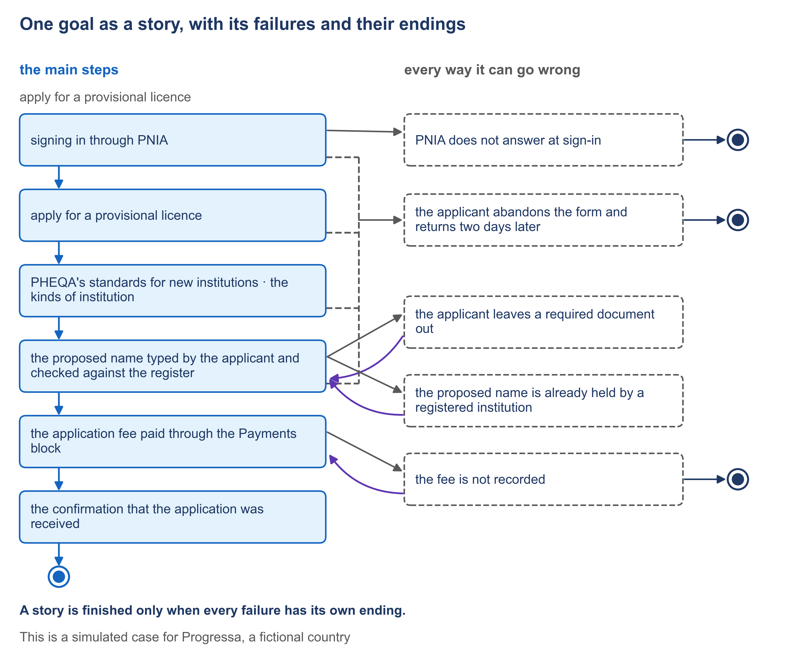

# 3.2 Every way it can go wrong, written down


🎬 **Video in production:** *Every way it can go wrong, written down* (~5 min).
The page below does not depend on the video: it carries what the video will say. The [video index](../../start-here/video-index.md) is the page to watch for links.


> **Single message.** A story is finished only when every failure has its own ending.

## The concept

A service is judged on its bad days: the sign-in that does not answer, the document left out, the payment that never arrives. If nobody wrote down what happens then, the builder decides, alone and under deadline.

For each failure, the story says what the system notices, what it does, and how the story ends. There are only three endings: the goal fails, the goal still succeeds, or the person goes back to a named step of the main story. For each ending, the story also says which of the authority's guarantees still holds. A failure without its own ending is a decision left to the builder.

The GovStack Registration specification names the checks a registration service makes. There are rules on each field: whether it is required, a number within limits, a date, a file of the right size and type. A field can be checked against another body's records. And the system checks that everything required is there, and should not let an applicant send an application that is incomplete. Every check that can fail needs its ending in the story.

Here are the five failures of PHEQA's goal. PNIA does not answer at sign-in: the applicant is told that nothing has started. The evidence of funding is left out: the system names it and keeps everything else. The proposed name is already held: the system shows which registered institution holds it. The fee is not confirmed: the application is not made. And the applicant who leaves and returns two days later finds nothing kept. Whatever the failure, PHEQA's guarantee holds: no application is recorded unless the applicant confirmed it and paid.

Three of those endings follow from the story. Two were decisions an official had to take. Should an application wait for its fee? The head of the registration desk said no: a waiting application would be a third state that no other goal uses and nobody asked for. Should half-finished applications be kept as drafts? The Registrar said not in the first version, and recorded the cost: an applicant who stops loses what was typed. That question stays open, and the Registrar owns it.

Before you accept a story, count its endings. A story with only a success ending is not finished. Then, for each failure, ask who decided the ending. If the answer is the builder, the decision was taken by the wrong person. An AI assistant can propose the first list of failures, step by step, and officials accept or set aside each one. But no list is complete. The walk-through and the review are where more failures are found.




**The worked example of this subtopic** is [E3-2](../examples/E3-2_every-way-it-can-go-wrong.md), built for Progressa.


## Your turn — Propose the failures of each step, for the official to decide


**💡 AI usage tip** · Propose the failures of each step, for the official to decide

**Bring:** The main story of one goal, its guarantees and its checks.
**Get:** A table of failures for each step, each with a proposed ending for the official to accept or set aside.
**Time:** ~10–15 min · **Assistant:** any; the tips are tool-neutral.
**With the kit:** `use-case-description` — helps the team write the description of one goal in full, with every way it can go wrong. Optional: the tip runs bare; see [the kit](../../start-here/ea-plays-kit.md).
**Watch for:** The official decides each ending; neither the builder nor the prompt does.


**The problem it solves.** A story with only its main steps looks finished and is not. The team needs a first list of what can go wrong at each step, with a proposed ending for each, so that the official who runs the service decides the endings before the builder has to.



Copy the prompt, replace the bracketed parts with your own context, and run it in the AI assistant of your choice. Never paste personal data or unpublished documents — see [How to use the plays](../../start-here/how-to-use-the-plays.md).

```text
Below is the main story of one goal of a public service in [country X], as numbered steps with who acts and what happens [paste the story]. Below that are the guarantees the authority makes for this goal [paste them], and the checks the service makes on each field and against other bodies' records [paste them, or write 'none listed']. For each step, list what can go wrong. For each failure give: (1) the step it leaves; (2) what the system notices; (3) what the system does; (4) a proposed ending: the goal fails, the goal still succeeds, or the person goes back to a named step; (5) which guarantee still holds; (6) whether the ending follows from the story or is a decision an official must take, and if it is a decision, the question to put to the official. Do not settle any ending that is a decision. Output: a table of failures for each step, each with a proposed ending for the official to accept or set aside, then the list of questions for officials.
```

[Open in Claude](<https://claude.ai/new?q=Below%20is%20the%20main%20story%20of%20one%20goal%20of%20a%20public%20service%20in%20%5Bcountry%20X%5D%2C%20as%20numbered%20steps%20with%20who%20acts%20and%20what%20happens%20%5Bpaste%20the%20story%5D.%20Below%20that%20are%20the%20guarantees%20the%20authority%20makes%20for%20this%20goal%20%5Bpaste%20them%5D%2C%20and%20the%20checks%20the%20service%20makes%20on%20each%20field%20and%20against%20other%20bodies%27%20records%20%5Bpaste%20them%2C%20or%20write%20%27none%20listed%27%5D.%20For%20each%20step%2C%20list%20what%20can%20go%20wrong.%20For%20each%20failure%20give%3A%20%281%29%20the%20step%20it%20leaves%3B%20%282%29%20what%20the%20system%20notices%3B%20%283%29%20what%20the%20system%20does%3B%20%284%29%20a%20proposed%20ending%3A%20the%20goal%20fails%2C%20the%20goal%20still%20succeeds%2C%20or%20the%20person%20goes%20back%20to%20a%20named%20step%3B%20%285%29%20which%20guarantee%20still%20holds%3B%20%286%29%20whether%20the%20ending%20follows%20from%20the%20story%20or%20is%20a%20decision%20an%20official%20must%20take%2C%20and%20if%20it%20is%20a%20decision%2C%20the%20question%20to%20put%20to%20the%20official.%20Do%20not%20settle%20any%20ending%20that%20is%20a%20decision.%20Output%3A%20a%20table%20of%20failures%20for%20each%20step%2C%20each%20with%20a%20proposed%20ending%20for%20the%20official%20to%20accept%20or%20set%20aside%2C%20then%20the%20list%20of%20questions%20for%20officials.>) *(pre-fills the prompt in a new chat; check the bracketed parts before sending)*

*What to bring and what you get are in the box above.*




**Draft worked example, 2026-10-05.** Progressa is the fictional country used across these courses. The input below and the output in the next tab were written for this page to show a typical run of the prompt; they are simplified, and they have not been checked as the worked examples of the method have.


The bracketed parts of the prompt were replaced with the following:

**[country X]:** Progressa.

**[paste the story]:** the nine steps of "apply for a provisional licence": 1 the applicant signs in through PNIA; 2 asks to apply; 3 the system shows the standards with their version; 4 the applicant states the kind; 5 the system asks for the particulars for that kind; 6 the applicant gives the name and each particular and attaches the evidence of funding; 7 the system checks that nothing is missing and the name is not held; 8 the applicant confirms and pays through the Payments block; 9 the system records the application and shows the date received.

**[paste them]:** whatever happens, no application is recorded unless the applicant confirmed it and the fee was paid. On success, one application is recorded with every particular and the version of the standards.

**[paste them, or write 'none listed']:**

- Every particular the regulations list for the kind is required; the evidence of funding is a required document.
- The proposed name is checked against the register of institutions.
- The applicant's identity comes from PNIA's sign-in.
- The fee counts as paid only when the Payments block confirms it.




**Draft: model output, shortened and unverified.** Read it with the notes in the next tab, not on its own.


| Step | What the system notices | What it does | Proposed ending | Guarantee | Follows or decision |
|---|---|---|---|---|---|
| 1 | PNIA does not answer | Says sign-in is unavailable; nothing started | Goal fails | Holds | Follows |
| 7 | Evidence of funding missing | Names it; keeps the rest | Back to step 6 | Holds | Follows |
| 7 | Name already held | Says so; keeps the rest | Back to step 6 | Holds | Follows |
| 7 | A required particular missing | Names it | Back to step 6 | Holds | Follows |
| 8 | Applicant cancels the payment | Says the application is not made | Back to step 8, or fails | Holds | Follows |
| 8 | Payment confirmation does not arrive | Records the application as "awaiting payment" for 48 hours, then cancels it | Goal still succeeds once paid | Holds | Follows |

**Questions for officials:**

1. When a name is held, should the system show which institution holds it?
2. If the applicant says the money has left its account, who handles it?



This is the teaching part of the tip. Work through the output the way a chief architect would: what is earned, what is invented, what is missing.

<details>

<summary>1. The checks each found their failure</summary>

Every check pasted in has at least one failure, and the three at step 7 send the applicant back to step 6 with what was given kept. Those endings follow from the story and the guarantee, as the table says. The head of the registration desk can accept them in minutes.

</details>

<details>

<summary>2. "Awaiting payment" was settled, not asked</summary>

The last row records an application before the fee is confirmed, which breaks the guarantee it claims holds. It also invents a 48-hour limit and a third state of an application that nobody asked for. Whether an application waits for its fee is a decision for an official, and the prompt said not to settle it. The safeguard returns it to the official as a question: at PHEQA, the head of the desk decided the application is not made at all.

</details>

<details>

<summary>3. The list stops before it is finished</summary>

Nothing is proposed for an applicant who leaves the form and comes back two days later, and steps 2 to 5 have no failures at all. The safeguard says the list is a starting point, not a claim that every failure is found. Keep it open; the walk-through and the review add what it missed.

</details>


**Safeguard.** The official decides each ending; neither the builder nor the prompt does. The list is a starting point, not a claim that every failure has been found: keep it open for the walk-through and the review, where more are found.




Take the accepted failures, each with its ending, to [3.3](./3-3.md), where each one is served by a screen. Keep the list open for the walk-through of [3.5](./3-5.md) and the review of [3.6](./3-6.md); compare it with [E3-2](../examples/E3-2_every-way-it-can-go-wrong.md).



## Sources

- GovStack Registration Building Block specification, edition 23Q4 (version history to 1.0), sections 6.3.3.1, 6.3.3.2 and 6.3.3.3 — https://specs.govstack.global/registration
