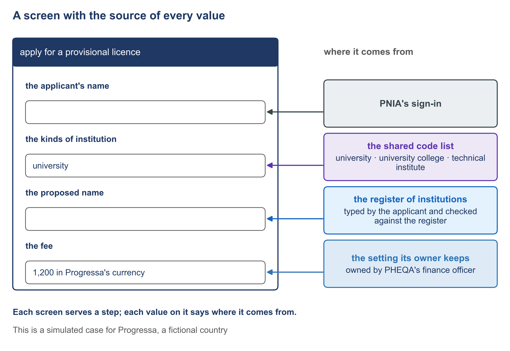

# 3.3 Screens worked out from the story, every value with its source


🎬 **Video in production:** *Screens worked out from the story, every value with its source* (~5 min).
The page below does not depend on the video: it carries what the video will say. The [video index](../../start-here/video-index.md) is the page to watch for links.


> **Single message.** Each screen serves a step; each value on it says where it comes from.

## The concept

A screen designed from a list of fields shows everything and explains nothing. A screen worked out from the story shows what a person needs at that step, and says where each value on it comes from.

The screens are worked out after the story is written, by walking it step by step. A step where the person asks, states, gives or confirms something gets a screen. A step that is wholly the system's gets a screen only if it shows something the person must read before going on. Two steps share a screen when nothing the system does stands between them. So every screen serves a step, and you can say which one.

Every value on every screen comes from one of four places. It is taken from another body, such as the identity authority or the Payments block. It is chosen from a list kept once for the whole service. It is read from a record or a setting the authority already keeps. Or it is entered here, typed by the person, and then the screen record says why no other place has it.

PHEQA's goal, to apply for a provisional licence, has five screens. The first asks to apply. The second shows PHEQA's standards and asks for the kind of institution. The third takes the particulars, and also serves two failures: a document left out, and a name already held. The fourth confirms and takes the fee. The fifth shows the application received. Each screen names the steps and the failures it serves.

Now point at values. The applicant's name is taken from PNIA's sign-in; nobody types it. The kind of institution is chosen from PHEQA's shared list of three, kept once in the shared groundwork and re-used by every goal that asks for a kind. The fee is read from the setting that PHEQA's finance officer owns. The proposed name is entered here, because no other body knows it yet, and it is checked against the register of institutions.

The GovStack Registration specification describes the same work from the builder's side. An analyst creates the screens and their order: a guide, the applicant's form, the upload of documents, the payment, and a send screen. Each field has a name, a type, and whether it must be filled. Lists, which the specification calls catalogues, are reusable across all services in the same installation. Progressa's five screens follow much the same order.

The screens are checked against four lists the story wrote: its steps, its failures, the records it reads or changes, and the settings and lists it uses. In Progressa's first draft, the third screen asked for the applicant's phone number. No list of the story names it, and PNIA does not release it. It was struck out, and a question went to the Registrar: does PHEQA need to telephone an applicant?



*F9. A screen with the source of every value.*


**The worked example of this subtopic** is [E3-3](../examples/E3-3_screens-every-value-with-its-source.md), built for Progressa.


## Your turn — List the screens of a story and the source of every value

**The problem it solves.** Screens drawn from a list of fields carry values nobody can trace, and an untraced value will one day disagree with its source. The prompt works out from the story which screen each step needs and where each value on it comes from, and shows every value that has no source.

Copy the prompt, replace the bracketed parts with your own context, and run it in the AI assistant of your choice. Never paste personal data or unpublished documents — see [How to use the plays](../../start-here/how-to-use-the-plays.md).

```text
Below is the main story of one goal of a public service in [country X], with its failures, as numbered steps [paste the story and its failures]. Below that are the records the service keeps, the lists and settings it uses with their owners, and what other bodies supply, such as an identity sign-in or a payment [paste them]. Work out the screens. A step where the person asks, states, gives or confirms something gets a screen; a step that is wholly the system's gets one only if the person must read something before going on; two steps share a screen when nothing the system does stands between them. For each screen give: (1) its name, and the steps and failures it serves; (2) every value on it; (3) the source of each value: taken from another body, chosen from a list, read from what the authority keeps, or entered here; (4) for a value entered here, why no other place has it. Use only the sources pasted above. Mark any value whose source is not among them as 'NO SOURCE', and do not suggest one. Output: a table of screens, one for each step that needs one, with the source of every value and the values with no source marked.
```

[Open in Claude](<https://claude.ai/new?q=Below%20is%20the%20main%20story%20of%20one%20goal%20of%20a%20public%20service%20in%20%5Bcountry%20X%5D%2C%20with%20its%20failures%2C%20as%20numbered%20steps%20%5Bpaste%20the%20story%20and%20its%20failures%5D.%20Below%20that%20are%20the%20records%20the%20service%20keeps%2C%20the%20lists%20and%20settings%20it%20uses%20with%20their%20owners%2C%20and%20what%20other%20bodies%20supply%2C%20such%20as%20an%20identity%20sign-in%20or%20a%20payment%20%5Bpaste%20them%5D.%20Work%20out%20the%20screens.%20A%20step%20where%20the%20person%20asks%2C%20states%2C%20gives%20or%20confirms%20something%20gets%20a%20screen%3B%20a%20step%20that%20is%20wholly%20the%20system%27s%20gets%20one%20only%20if%20the%20person%20must%20read%20something%20before%20going%20on%3B%20two%20steps%20share%20a%20screen%20when%20nothing%20the%20system%20does%20stands%20between%20them.%20For%20each%20screen%20give%3A%20%281%29%20its%20name%2C%20and%20the%20steps%20and%20failures%20it%20serves%3B%20%282%29%20every%20value%20on%20it%3B%20%283%29%20the%20source%20of%20each%20value%3A%20taken%20from%20another%20body%2C%20chosen%20from%20a%20list%2C%20read%20from%20what%20the%20authority%20keeps%2C%20or%20entered%20here%3B%20%284%29%20for%20a%20value%20entered%20here%2C%20why%20no%20other%20place%20has%20it.%20Use%20only%20the%20sources%20pasted%20above.%20Mark%20any%20value%20whose%20source%20is%20not%20among%20them%20as%20%27NO%20SOURCE%27%2C%20and%20do%20not%20suggest%20one.%20Output%3A%20a%20table%20of%20screens%2C%20one%20for%20each%20step%20that%20needs%20one%2C%20with%20the%20source%20of%20every%20value%20and%20the%20values%20with%20no%20source%20marked.>) *(pre-fills the prompt in a new chat; check the bracketed parts before sending)*

**What goes in and what comes out.** Input: the story with its failures, and the records, lists, settings and outside sources the service uses. Output: a table of screens, one for each step that needs one, with the source of every value and the values with no source marked.


**Safeguard.** A value marked 'NO SOURCE' is a question for the story's owner, not a gap to fill. The prompt never supplies a source it was not given; check every source it names against the lists you pasted.


## Sources

- GovStack Registration Building Block specification, edition 23Q4 (version history to 1.0), sections 6.3.2.1 and 6.3.2.2 — https://specs.govstack.global/registration
