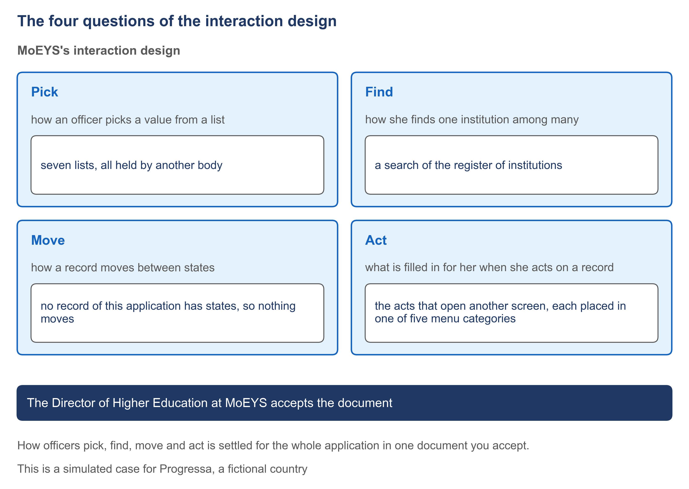

# 4.1 Four questions decided once for every screen


🎬 **Video in production:** *Four questions decided once for every screen* (~5 min).
The page below does not depend on the video: it carries what the video will say. The [video index](../../start-here/video-index.md) is the page to watch for links.


> **Single message.** How officers pick, find, move and act is settled for the whole application in one document you accept.

## The concept

Your officials have agreed the screens of each goal, one goal at a time. Four questions are still open, because each crosses many screens. If you do not settle them in one document, the program that builds the application settles them for you.

The first question is how an officer picks a value from a list, such as the kind of licence. The second is how she finds one record among many, such as one institution among hundreds. The third is how a case moves from one state to the next, and who may move it. The fourth is what happens when she acts on a record: which screen opens, and what is already filled in. No single goal can answer these. One list serves many goals, and one case is moved by the acts of several goals.

Each goal's screens were agreed on their own, so nobody has yet looked across them. Left open, the four questions get answered by default while the application is built, and often differently on different screens. The method closes that gap with one document, the interaction design. One analyst writes it from the agreed screens of every goal. You, or the person you name, accept it. Only then is the application described for the machine. A decision settled once is re-used by every screen that needs it.

Here is how MoEYS, Progressa's ministry of education, answered the first two questions for its application. To pick a value, an officer uses seven lists. Each is held elsewhere, fixed by Progressa's Higher Education Regulations. MoEYS keeps none, so no screen of its application changes a list. To find an institution, she searches PHEQA's register by name or register number. She never scrolls a list of every institution. Most of the time she does not search at all: she opens the list of what waits for her, and picks a row.

The third answer is short. No record of this application has states. A decision is written once, and a correction is a new version, so nothing moves. An institution's standing is shown as PHEQA's register gives it, and is never changed here. The fourth answer covers every act that opens another screen. The record she acted on is carried into that screen, filled in and locked, so she never types it again. Every menu entry sits in one of five categories, from Licences to Requests for review.

The Director of Higher Education at MoEYS accepts the document. She reads a short answer, a table for each question, and a few sample pages that show each answer working. She does not read every screen again. Where the goals were silent, the analyst writes a recommended answer, and she agrees it or changes it. Her acceptance is written into the document with her name and the date. Everything described for the machine afterwards is measured against what she accepted.



*F10. The four questions of the interaction design.*


**The worked example of this subtopic** is [E4-1](../examples/E4-1_four-questions-decided-once-for-every-screen.md), built for Progressa.


## Your turn — Find where the four questions are still open


**💡 AI usage tip** · Find where the four questions are still open

**Bring:** The agreed screens of every goal, as written.
**Get:** A table of the places where pick, find, move or act is still open, each with its goal, its screen and the words that leave it open.
**Time:** ~10–15 min · **Assistant:** any; the tips are tool-neutral.
**Watch for:** The prompt reads only the screens you paste and must propose nothing.


**The problem it solves.** The screens of every goal are agreed, one goal at a time, and the interaction design is about to be written. The manager needs to see, before the analyst starts, every place where the agreed screens leave pick, find, move or act open, so that nothing is settled by default.



Copy the prompt, replace the bracketed parts with your own context, and run it in the AI assistant of your choice. Never paste personal data or unpublished documents — see [How to use the plays](../../start-here/how-to-use-the-plays.md).

```text
Below are the agreed screens of every goal of [the application] in [your ministry], each screen with its values and its buttons [paste them]. Read them together, not one goal at a time. For each of four questions, list every place where the screens leave it open: (1) PICK — a value chosen from a list, where the screens do not say which list, who keeps it, or how many values it offers; (2) FIND — a record chosen from many, where the screens do not say whether it is searched for or picked from a list, or by what; (3) MOVE — a case whose state changes, where the screens do not say which act moves it, from which state to which, or who may make the move; (4) ACT — a button that opens another screen, where the screens do not say what it carries into that screen or what is filled in and locked. For each place give the goal, the screen, the question, and the exact words of the screen that leave it open. Do not answer any question and do not propose an answer. Output: a table of the places where pick, find, move or act is still open, sorted by question, then a count for each question.
```

[Open in Claude](<https://claude.ai/new?q=Below%20are%20the%20agreed%20screens%20of%20every%20goal%20of%20%5Bthe%20application%5D%20in%20%5Byour%20ministry%5D%2C%20each%20screen%20with%20its%20values%20and%20its%20buttons%20%5Bpaste%20them%5D.%20Read%20them%20together%2C%20not%20one%20goal%20at%20a%20time.%20For%20each%20of%20four%20questions%2C%20list%20every%20place%20where%20the%20screens%20leave%20it%20open%3A%20%281%29%20PICK%20%E2%80%94%20a%20value%20chosen%20from%20a%20list%2C%20where%20the%20screens%20do%20not%20say%20which%20list%2C%20who%20keeps%20it%2C%20or%20how%20many%20values%20it%20offers%3B%20%282%29%20FIND%20%E2%80%94%20a%20record%20chosen%20from%20many%2C%20where%20the%20screens%20do%20not%20say%20whether%20it%20is%20searched%20for%20or%20picked%20from%20a%20list%2C%20or%20by%20what%3B%20%283%29%20MOVE%20%E2%80%94%20a%20case%20whose%20state%20changes%2C%20where%20the%20screens%20do%20not%20say%20which%20act%20moves%20it%2C%20from%20which%20state%20to%20which%2C%20or%20who%20may%20make%20the%20move%3B%20%284%29%20ACT%20%E2%80%94%20a%20button%20that%20opens%20another%20screen%2C%20where%20the%20screens%20do%20not%20say%20what%20it%20carries%20into%20that%20screen%20or%20what%20is%20filled%20in%20and%20locked.%20For%20each%20place%20give%20the%20goal%2C%20the%20screen%2C%20the%20question%2C%20and%20the%20exact%20words%20of%20the%20screen%20that%20leave%20it%20open.%20Do%20not%20answer%20any%20question%20and%20do%20not%20propose%20an%20answer.%20Output%3A%20a%20table%20of%20the%20places%20where%20pick%2C%20find%2C%20move%20or%20act%20is%20still%20open%2C%20sorted%20by%20question%2C%20then%20a%20count%20for%20each%20question.>) *(pre-fills the prompt in a new chat; check the bracketed parts before sending)*

*What to bring and what you get are in the box above.*




**Draft worked example, 2026-10-05.** Progressa is the fictional country used across these courses. The input below and the output in the next tab were written for this page to show a typical run of the prompt; they are simplified, and they have not been checked as the worked examples of the method have.


The bracketed parts of the prompt were replaced with the following:

**[the application]:** MoEYS's application.

**[your ministry]:** MoEYS, Progressa's ministry of education, youth and skills.

**[paste them]:** the agreed screens of the four goals, shortened here:

- *Decide a licence.* D1 "PHEQA's recommendations": a list of recommendations, button "Open". D2 "Decide": the institution, the kind of licence, PHEQA's recommendation; "Decision: grant or refuse"; button "Record the decision".
- *Approve a change of an institution's name.* N1 "Changes of name": PHEQA's advice on changes of name, button "Open". N2 "Approve": present name, new name asked for, PHEQA's advice; "approve or do not approve"; button "Record".
- *Publish the list of registered institutions.* G1 "The list for the Gazette": the institutions in PHEQA's register, "with their kind and standing"; button "Prepare the notice".
- *Review a decision of PHEQA.* R1 "New request for review": "the institution concerned"; "the decision of PHEQA to be reviewed"; "matter"; button "Save". R2 "Review": "Outcome"; button "Record the outcome".




**Draft: model output, shortened and unverified.** Read it with the notes in the next tab, not on its own.


| Question | Goal | Screen | Words that leave it open |
| --- | --- | --- | --- |
| PICK | Decide a licence | D2 | "the kind of licence" — no list named, no keeper |
| PICK | Review a decision of PHEQA | R1 | "matter" — no list named, no number of values |
| PICK | Review a decision of PHEQA | R2 | "Outcome" — not said whether chosen or typed |
| FIND | Review a decision of PHEQA | R1 | "the institution concerned" — searched or picked, and by what? *Suggested: search PHEQA's register by register number.* |
| FIND | Review a decision of PHEQA | R1 | "the decision of PHEQA to be reviewed" — not said how it is found |
| FIND | Publish the list | G1 | "the institutions in PHEQA's register" — all of them, or a search? |
| MOVE | Decide a licence | D2 | "Decision: grant or refuse" — not said which state the licence moves to, or who may record it *(probably the minister, under article 11)* |
| ACT | Decide a licence | D1 | "Open" — not said what is carried into D2 |
| ACT | Approve a change of name | N1 | "Open" — not said what is carried into N2, or what is locked |
| ACT | Publish the list | G1 | "Prepare the notice" — opens a screen not shown |

**Count:** PICK 3, FIND 3, MOVE 1, ACT 3.



This is the teaching part of the tip. Work through the output the way a chief architect would: what is earned, what is invented, what is missing.

<details>

<summary>1. Reading the goals together pays off</summary>

The review goal's screens were agreed on their own, and they leave the most open: three places on R1 alone. Seen next to the other goals, it is plain that "the institution concerned" is the same find as on D2 and N2, so it is settled once, not three times.

</details>

<details>

<summary>2. Two answers crept in: strike them out</summary>

The FIND row for R1 suggests a search by register number, and the MOVE row names the minister under article 11. The prompt forbade both. They may well be right, but an answer written by the prompt would reach the analyst as if it were settled. Strike them out. The analyst writes each answer in the interaction design, and the Director of Higher Education accepts it.

</details>

<details>

<summary>3. The MOVE row is a question, not a state</summary>

D2 records a decision; the licence's state is kept in PHEQA's register, not in MoEYS's application. The open place is real, but its answer may well be "nothing moves here". That is for the analyst to write and the director to accept.

</details>


**Safeguard.** The prompt reads only the screens you paste and must propose nothing. If it offers an answer, strike it out: each open place is answered by the analyst who writes the interaction design and accepted by its owner, not settled by the prompt.




Hand the table to the analyst who writes the [interaction design](../toolkit/10_interaction-design.md). Any list longer than nine goes through [4.2](./4-2.md); any case that moves gets its workflow in [4.3](./4-3.md).



## Sources

This subtopic cites no public source. Its content is the specification-driven method itself, described at the level of the manager.
