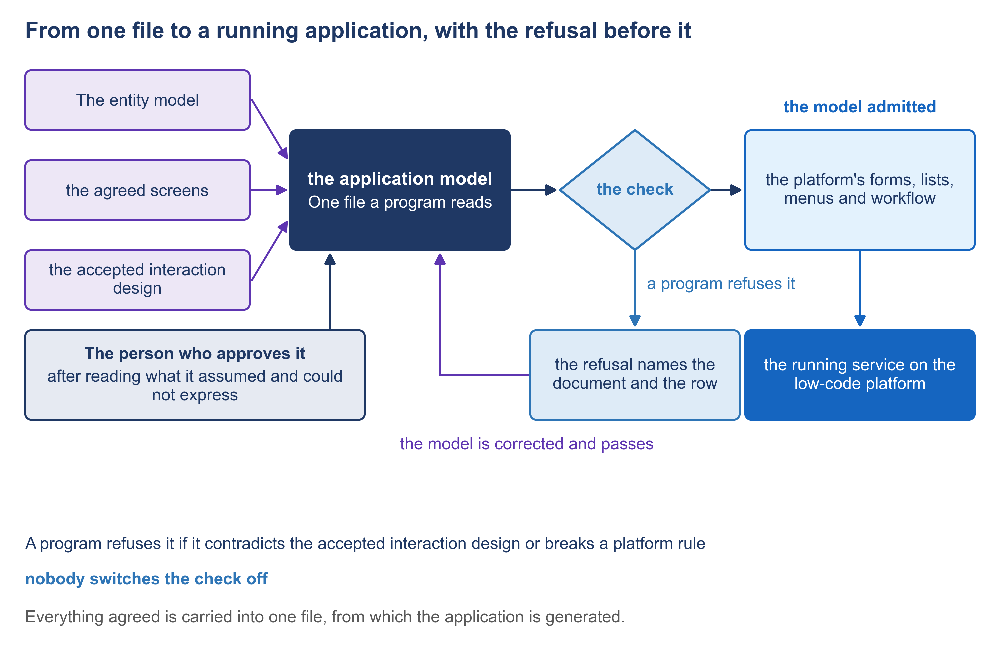

# 5.1 From one file to a running application


🎬 **Video in production:** *From one file to a running application* (~5 min).
The page below does not depend on the video: it carries what the video will say. The [video index](../../start-here/video-index.md) is the page to watch for links.


> **Single message.** The kit turns the model into the platform's forms, lists, menus and workflow, and installs them.

## The concept

Your supplier reports that the ministry's new application is built. Before you accept that report, you need to know what was built from what, and which questions to ask of the result. One file decides almost everything you will see.

In the SDD method, specification-driven development, each document a person writes is accepted before the next one begins. The last of them is the application model: one file, written for a program to read. It carries every record, screen, list, menu and step of the workflow, each taken from documents your officials have already accepted. Before anything is built, a program checks the file, and refuses it if it contradicts what was accepted.

The kit is the method's set of programs, which the supplier runs. From the file it makes the four things a low-code platform is built from. Forms are the screens where an officer enters or reads a record. Lists are the worklists and registers. Menus are what each role sees after signing in, grouped in categories. The workflow is the order of steps, and who may take each one. The platform's own documentation has a builder for each of them, and the kit fills those builders from the file instead of by hand.

Then the kit installs what it built. It packs the application's design and puts it on the platform's server. The platform's documentation describes the same kind of move, of one application from one server to another, and by default only the design travels, not the data. So the same package can go to a test server, be checked there, and then go to the live server, with nothing rebuilt by hand in between.

In Progressa, MoEYS's application is generated from its model onto MoEYS's own installation of the platform. The model asks for the forms on which the minister decides and an officer records the Gazette, for lists of what awaits the minister, and for a menu in five categories: licences; names, the list and reviews; suspension and cancellation; the Gazette; and requests for review. It asks for no table of institutions, because MoEYS reads PHEQA's register instead.

Acceptance starts from the model, not from the supplier's account. For each goal, ask where it starts and who can start it. Check that every menu category is there, for the right role and no other. Open each list and check that it shows only what waits for an act. Then ask whether any screen exists that no accepted document asked for. Each answer is read on the running application, not on a slide.

The demonstration follows these steps. The check admits the file. The kit builds the application and installs it on MoEYS's installation. Then the menu, one form and one list are opened on the platform. It passes when the build ends without error, the application appears on the installation, and every menu category of the interaction design is there. Until MoEYS's application is generated, this is a storyboard: the steps and the pass, written before anything is recorded.




**The worked example of this subtopic** is [E5-1](../examples/E5-1_from-one-file-to-a-running-application.md), built for Progressa.



**Demonstration.** The model admitted, the application built and installed, its menu, a form and a list opened; this is the principal walkthrough of this guide. It needs The ministry's application model and its instance. Until it is recorded, the storyboard in the script stands in its place.


## Your turn — Write the acceptance questions for a generated application


**💡 AI usage tip** · Write the acceptance questions for a generated application

**Bring:** The goals, the roles and the menu categories, from the accepted model or its interaction design.
**Get:** A numbered list of acceptance questions, one for each goal, each with where on the running application to look.
**Time:** ~10–15 min · **Assistant:** any; the tips are tool-neutral.
**Watch for:** The questions are answered on the running application by the person who accepts it, not from the supplier's account of it, a screenshot or a slide.


**The problem it solves.** A manager about to accept a generated application needs questions that come from what was agreed, not from the supplier's demonstration: one for each goal and one for each menu category, each answerable by looking at the running application.



Copy the prompt, replace the bracketed parts with your own context, and run it in the AI assistant of your choice. Never paste personal data or unpublished documents — see [How to use the plays](../../start-here/how-to-use-the-plays.md).

```text
Below is the list of goals of an application in [your administration], each with its name, the role that starts it and where it starts, taken from the accepted application model or its interaction design [paste the list]. Below that are the menu categories and the roles that see each [paste them]. For each goal, write one acceptance question that a person can answer by looking at the running application: (1) the goal; (2) the question, in one sentence; (3) where on the running application to look: the menu category and the entry; (4) what answer counts as yes. Then add one question for each menu category: is it present, and is it shown only to its role? Do not invent a goal, a role or a category that is not in the pasted lists; write 'not in the list' instead. Output: a numbered list of acceptance questions, one for each goal, each with where on the running application to look.
```

[Open in Claude](<https://claude.ai/new?q=Below%20is%20the%20list%20of%20goals%20of%20an%20application%20in%20%5Byour%20administration%5D%2C%20each%20with%20its%20name%2C%20the%20role%20that%20starts%20it%20and%20where%20it%20starts%2C%20taken%20from%20the%20accepted%20application%20model%20or%20its%20interaction%20design%20%5Bpaste%20the%20list%5D.%20Below%20that%20are%20the%20menu%20categories%20and%20the%20roles%20that%20see%20each%20%5Bpaste%20them%5D.%20For%20each%20goal%2C%20write%20one%20acceptance%20question%20that%20a%20person%20can%20answer%20by%20looking%20at%20the%20running%20application%3A%20%281%29%20the%20goal%3B%20%282%29%20the%20question%2C%20in%20one%20sentence%3B%20%283%29%20where%20on%20the%20running%20application%20to%20look%3A%20the%20menu%20category%20and%20the%20entry%3B%20%284%29%20what%20answer%20counts%20as%20yes.%20Then%20add%20one%20question%20for%20each%20menu%20category%3A%20is%20it%20present%2C%20and%20is%20it%20shown%20only%20to%20its%20role%3F%20Do%20not%20invent%20a%20goal%2C%20a%20role%20or%20a%20category%20that%20is%20not%20in%20the%20pasted%20lists%3B%20write%20%27not%20in%20the%20list%27%20instead.%20Output%3A%20a%20numbered%20list%20of%20acceptance%20questions%2C%20one%20for%20each%20goal%2C%20each%20with%20where%20on%20the%20running%20application%20to%20look.>) *(pre-fills the prompt in a new chat; check the bracketed parts before sending)*

*What to bring and what you get are in the box above.*




**Draft worked example, 2026-10-05.** Progressa is the fictional country used across these courses. The input below and the output in the next tab were written for this page to show a typical run of the prompt; they are simplified, and they have not been checked as the worked examples of the method have.


The bracketed parts of the prompt were replaced with the following:

**[your administration]:** MoEYS, Progressa's ministry of education.

**[paste the list]:**

- G-11 Decide on a licence. The minister. Starts: Licences, the list of PHEQA's advice that waits for a decision.
- G-12 Approve a change of an institution's name. The minister. Starts: Names, the list and reviews, the list of advices on a change of name.
- G-13 Publish the list of registered institutions in the Gazette. The minister; the Gazette entry recorded by an officer of MoEYS. Starts: The Gazette, the list for publication.
- G-14 Review a decision of PHEQA at a person's request. The minister. Starts: Requests for review.

**[paste them]:** Licences — the minister. Names, the list and reviews — the minister. Suspension and cancellation — the minister. The Gazette — the minister and the Gazette officer. Requests for review — the minister.




**Draft: model output, shortened and unverified.** Read it with the notes in the next tab, not on its own.


**Goals**

1. **G-11 Decide on a licence.** Can the minister open PHEQA's advice on a licence and record a decision? *Look:* Licences › Advice awaiting decision. *Yes if:* the advice opens and a decision can be recorded.
2. **G-12 Approve a change of name.** Can the minister approve a new name from PHEQA's advice? *Look:* Names, the list and reviews › Advices on a change of name. *Yes if:* the approval is recorded.
3. **G-13 Publish the list in the Gazette.** Can the list of registered institutions be prepared and its Gazette entry recorded? *Look:* The Gazette › List for publication. *Yes if:* the supplier's demonstration shows the list read from PHEQA's register.
4. **G-14 Review a decision of PHEQA.** Can the minister open a person's request and record the outcome? *Look:* Requests for review › Open requests. *Yes if:* the request opens with PHEQA's decision beside it.

**Menu categories**

5. Licences: present, and shown to the minister only?
6. Names, the list and reviews: present, and shown to the minister only?
7. Suspension and cancellation: present, and shown to the minister only? *Note:* no goal in the list starts here — not in the list.
8. The Gazette: present, and shown to the minister and the Gazette officer only?
9. Requests for review: present, and shown to the minister only?



This is the teaching part of the tip. Work through the output the way a chief architect would: what is earned, what is invented, what is missing.

<details>

<summary>1. One question per goal, one per category</summary>

Every goal and every category from the pasted lists has its question, and nothing was added. Question 7 is the useful surprise: a category with no goal that starts in it. Either a goal is missing from the list or the category has no reason to exist.

</details>

<details>

<summary>2. "Open requests" is not in the input</summary>

G-14 was pasted with its category only. The run named the entry "Open requests" itself, instead of writing "not in the list". A tester will look for an entry by that name and may not find it. Take the entry's name from the interaction design.

</details>

<details>

<summary>3. Question 3 is answered by the supplier, not by you</summary>

"Yes if the supplier's demonstration shows" is exactly what the safeguard rules out. Rewrite it: the person who accepts opens The Gazette, sees the list read from PHEQA's register, and records the entry. If the running application cannot show that, it goes back to the owner of the model as an open line, with a name and a date.

</details>


**Safeguard.** The questions are answered on the running application by the person who accepts it, not from the supplier's account of it, a screenshot or a slide. A question that the running application cannot answer goes back to the owner of the model as an open line with a name and a date.




Turn each goal's question into a full journey through its screens in [5.7](./5-7.md). Check the entry names against the [interaction design](../toolkit/10_interaction-design.md) before the acceptance meeting.



## Sources

- Joget DX 9 Knowledge Base, Form Builder (https://kb.joget.org/jw/web/userview/jdocs/docs/DX9/form-builder)
- Joget DX 9 Knowledge Base, List Builder (https://kb.joget.org/jw/web/userview/jdocs/docs/DX9/list-builder)
- Joget DX 9 Knowledge Base, UI Builder (https://kb.joget.org/jw/web/userview/jdocs/docs/DX9/ui-builder)
- Joget DX 9 Knowledge Base, Process Builder (https://kb.joget.org/jw/web/userview/jdocs/docs/DX9/process-builder)
- Joget DX 9 Knowledge Base, Migrating a Single Joget App (https://kb.joget.org/jw/web/userview/jdocs/docs/DX9/migrating-a-single-joget-app)
