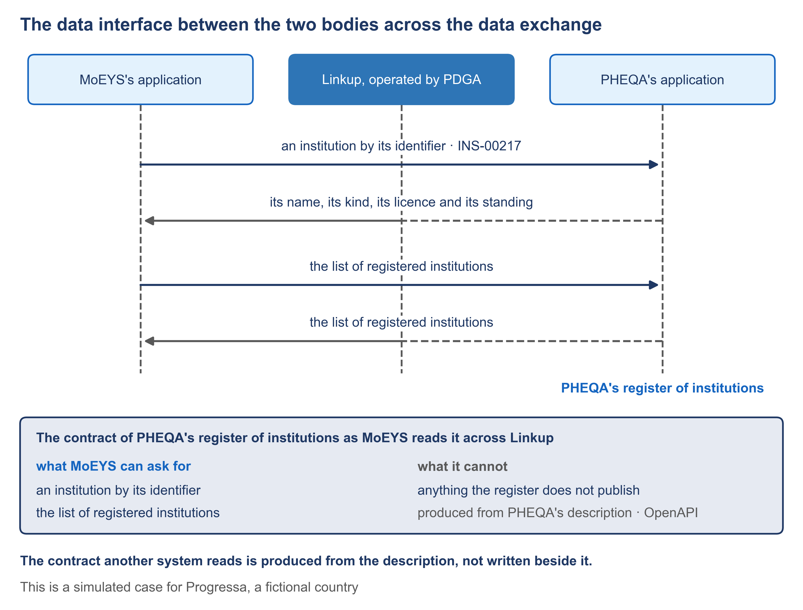

# 5.5 The service's contract with the registration block, and its data interface


🎬 **Video in production:** *The service's contract with the registration block, and its data interface* (~5 min).
The page below does not depend on the video: it carries what the video will say. The [video index](../../start-here/video-index.md) is the page to watch for links.


> **Single message.** The contract another system reads is produced from the description, not written beside it.

## The concept

When the ministry's application asks the quality authority's application for an institution, both sides rely on a contract: what may be asked, and what comes back. If someone writes that contract by hand beside the application, the two will drift apart.

A contract, here, is the written promise one system makes to others. It says what they may ask for, what they must send, and what comes back. It is written in a published standard form, the OpenAPI Specification, so that a program on the other side can read it. The data exchange carries the call; the contract says what the call may be. Across the data exchange, each call names the service it is made to, and the exchange's own rules ask that each service be described in this standard form.

In the SDD method, nobody writes the contract beside the application. The accepted description already says what the register holds and what it publishes. A program produces the contract from that description, in the same way the application itself is produced. When the description changes, the contract is produced again, so the application and the promise it makes to others cannot say different things. It is the same rule as for the application itself: correct the description, never the copy.

The same holds for a registration service and the GovStack Registration block. Its specification publishes the operations of applying online: the services and forms on offer, and sending an application with its documents. It publishes operations for processing: the applications and the officers' tasks. For managing and designing services and workflows, it says no interface is specified yet. So the service's contract with the block is produced from the description, in the block's published terms.

Read as a list, the contract of PHEQA's register is short. MoEYS may ask for one institution by its register number, such as INS-00217, and receive its name, its kind, its licence and its standing. MoEYS may ask for the list of registered institutions. It cannot ask for applications, inspections, fees, or anything else the register does not publish. Every call goes through Linkup. The manager reads this list; the builder's program reads the same contract as a file. One document gives the business side and IT one shared language.

The demonstration reads one institution. MoEYS's application asks for it across the data interface, and the contract it is read by is shown beside the call. It passes when the record returned agrees with PHEQA's register, and the call is one that the contract publishes. Until both applications are generated, this is a storyboard: the steps and the pass, written before anything is recorded.





**The worked example of this subtopic** is [E5-5](../examples/E5-5_the-services-contract-with-the-registration-block-and-its-data-interface.md), built for Progressa.



**Demonstration.** One institution read across the data interface, with the contract it is read by. It needs Both generated applications and the data interface. Until it is recorded, the storyboard in the script stands in its place.


## Your turn — Read an interface contract as a plain list


**💡 AI usage tip** · Read an interface contract as a plain list

**Bring:** The interface contract itself.
**Get:** Two plain lists, what the other body can ask for and what it cannot, with every operation that writes data marked.
**Time:** ~10–15 min · **Assistant:** any; the tips are tool-neutral.
**Watch for:** The prompt is given the contract itself, never a summary of it.


**The problem it solves.** An interface contract is written for programs. A manager who must agree it with another body needs to know, in plain sentences, what the other body can ask for and what it cannot.



Copy the prompt, replace the bracketed parts with your own context, and run it in the AI assistant of your choice. Never paste personal data or unpublished documents — see [How to use the plays](../../start-here/how-to-use-the-plays.md).

```text
Below is the interface contract that [your body]'s system publishes to [the other body], written in the OpenAPI form [paste the contract itself]. Read it and write: (1) every request the other body can make, one plain sentence each, with what it must send and what comes back; (2) what the contract does not let it ask for, judged from the records and fields the contract leaves out; (3) every operation that writes, changes or deletes data, marked clearly. Quote each operation's name exactly as the contract gives it. Do not describe any request that is not in the contract. Output: two plain lists, what the other body can ask for and what it cannot, with every operation that writes data marked.
```

[Open in Claude](<https://claude.ai/new?q=Below%20is%20the%20interface%20contract%20that%20%5Byour%20body%5D%27s%20system%20publishes%20to%20%5Bthe%20other%20body%5D%2C%20written%20in%20the%20OpenAPI%20form%20%5Bpaste%20the%20contract%20itself%5D.%20Read%20it%20and%20write%3A%20%281%29%20every%20request%20the%20other%20body%20can%20make%2C%20one%20plain%20sentence%20each%2C%20with%20what%20it%20must%20send%20and%20what%20comes%20back%3B%20%282%29%20what%20the%20contract%20does%20not%20let%20it%20ask%20for%2C%20judged%20from%20the%20records%20and%20fields%20the%20contract%20leaves%20out%3B%20%283%29%20every%20operation%20that%20writes%2C%20changes%20or%20deletes%20data%2C%20marked%20clearly.%20Quote%20each%20operation%27s%20name%20exactly%20as%20the%20contract%20gives%20it.%20Do%20not%20describe%20any%20request%20that%20is%20not%20in%20the%20contract.%20Output%3A%20two%20plain%20lists%2C%20what%20the%20other%20body%20can%20ask%20for%20and%20what%20it%20cannot%2C%20with%20every%20operation%20that%20writes%20data%20marked.>) *(pre-fills the prompt in a new chat; check the bracketed parts before sending)*

*What to bring and what you get are in the box above.*




**Draft worked example, 2026-10-05.** Progressa is the fictional country used across these courses. The input below and the output in the next tab were written for this page to show a typical run of the prompt; they are simplified, and they have not been checked as the worked examples of the method have.


The bracketed parts of the prompt were replaced with the following:

**[your body]:** PHEQA, Progressa's quality authority.

**[the other body]:** MoEYS, Progressa's ministry of education.

**[paste the contract itself]:** An excerpt of the contract produced from PHEQA's accepted description (OpenAPI 3.0.3):

```yaml
paths:
  /institutions/{registerNumber}:
    get:
      operationId: getInstitution
      responses:
        '200': { $ref: '#/components/schemas/Institution' }   # registerNumber, name, kind, licence, standing
  /institutions:
    get:
      operationId: listRegisteredInstitutions
      responses:
        '200': { $ref: '#/components/schemas/InstitutionSummary' }   # registerNumber, name
  /name-approvals:
    post:
      operationId: recordNameApproval
      requestBody: { $ref: '#/components/schemas/NameApproval' }   # registerNumber, newName, decision, decidedOn
      responses:
        '201': { description: Approval received }
```




**Draft: model output, shortened and unverified.** Read it with the notes in the next tab, not on its own.


**What MoEYS can ask for**

1. **getInstitution** — asks for one institution by its register number, such as INS-00217. Gets back its register number, name, kind, licence and standing.
2. **listRegisteredInstitutions** — asks for the list of registered institutions. Gets back each institution's register number, name, kind, licence and standing.
3. **recordNameApproval** ✎ *writes data* — sends the minister's decision on a change of name: register number, new name, decision and date. Gets back a confirmation that the approval was received.

**What MoEYS cannot ask for**

- Applications for a licence, inspections, recommendations or fees: no operation or field covers them.
- A search by name: institutions are read by register number or as a whole list.
- Any change to an institution's licence or standing: the only write is the approval of a name.
- The history of an institution's names or licences.



This is the teaching part of the tip. Work through the output the way a chief architect would: what is earned, what is invented, what is missing.

<details>

<summary>1. The write is marked</summary>

recordNameApproval is the one operation that changes PHEQA's data, and it is marked. It is easy to miss in a contract that is mostly reading. PHEQA should know that MoEYS can send it something, not only read from it.

</details>

<details>

<summary>2. The list was read from the wrong schema</summary>

Item 2 says the list returns kind, licence and standing. The contract points the list at InstitutionSummary, which carries the register number and the name only. The run filled the list from the single-record schema. This is what the architect's check against the contract itself is for: send this list to MoEYS uncorrected and its officers will plan screens on fields they will not receive.

</details>

<details>

<summary>3. "History" is a guess</summary>

The last "cannot" line is probably true, but the excerpt says nothing about history either way. Keep only the "cannot" lines the contract supports, and mark the rest as questions for PHEQA's analyst.

</details>


**Safeguard.** The prompt is given the contract itself, never a summary of it. Its plain lists are checked by the architect against the contract before they are sent to the other body.




The calls in this contract are one crossing of the service; the table of every crossing, with the body that must confirm each, is drawn in [5.6](./5-6.md). The [worked example](../examples/E5-5_the-services-contract-with-the-registration-block-and-its-data-interface.md) shows the same contract read as a plain list.



## Sources

- GovStack Registration — https://specs.govstack.global/registration
- GovStack Information Mediator 1.1.1 — https://specs.govstack.global/information-mediator
- NIIS X-Road 7.7.0, Message Protocol for REST (PR-REST) — https://github.com/nordic-institute/X-Road/tree/7.7.0/doc
- OpenAPI Specification 3.0.3 — https://spec.openapis.org/oas/v3.0.3.html
