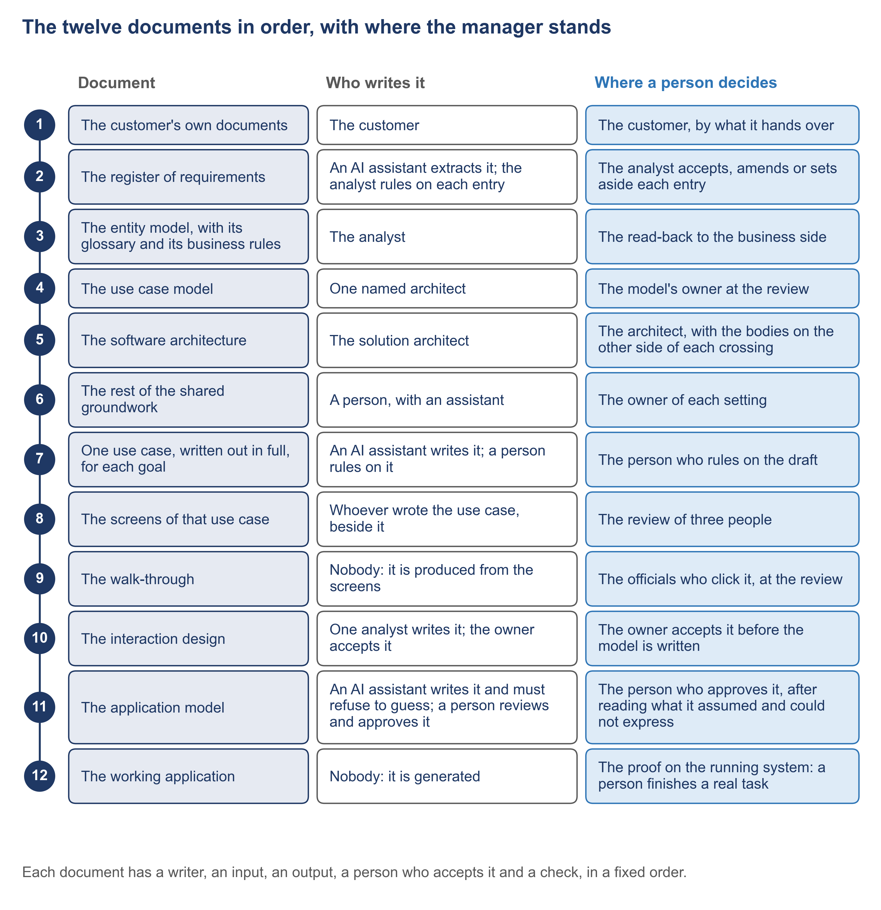

# 6.1 What to require from a supplier


🎬 **Video in production:** *What to require from a supplier* (~5 min).
The page below does not depend on the video: it carries what the video will say. The [video index](../../start-here/video-index.md) is the page to watch for links.


> **Single message.** The twelve documents are deliverables you name in the contract, each accepted by a named person.

## The concept

A supplier's offer often promises a working system and its documentation. Neither phrase says what you will receive, or who on your side decides that it is good enough. Both can be settled in the contract, before any work begins.

The SDD method, short for specification-driven development, writes a service down in twelve documents, in a fixed order. The first is your own: the law, the mandate and the requests, handed over and never edited. Seven more are written before anything is built: what was asked, the records the service keeps, the goals, the architecture, the shared lists and settings, each goal written as a story, and its screens. Then come the walk-through your officials click, the decisions settled once for the whole application, and the one file a program reads. The twelfth is the working application itself. Each of the twelve can be named in the contract as a deliverable.

For each deliverable, the contract names three things. The first is the form, a blank instrument the document is written on, so that what arrives can be compared with what was ordered. The second is the person in your organisation who accepts it, named by role: the director who owns the service, or the head of the ICT unit for the technical documents. The supplier never accepts its own work. The third is the check the document must pass before it is accepted: its own checklist, a comparison with an earlier document, or a program. The next document is written only from what was accepted.

Two clauses protect you most. The first says that the working application is generated from the accepted model, the one file a program reads, and that nothing generated is edited by hand. A supplier who patches the running system leaves your documents saying one thing while the system does another. The second clause says that every open question is delivered with an owner and a date. A question with a name on it is part of what you receive. A question the supplier answered with a guess is a fault in the delivery.

Here is how Progressa's ministry of education, MoEYS, writes it, in an example built for this course. Its annex lists all twelve documents. The Director of Higher Education accepts the register of what was asked. The screens of each goal are accepted at a review of three people: their owner, the builder and the officer who will use them. The head of the ICT unit approves the file a program reads, once a program has checked it. And the working application is accepted only when an officer has finished a real task on it.




**The worked example of this subtopic** is [E6-1](../examples/E6-1_what-to-require-from-a-supplier.md), built for Progressa.



The blank instruments of the twelve documents are kept in one place, [the blank instruments](../toolkit/README.md), with [the deliverables annex](../toolkit/A_deliverables-annex.md) this subtopic teaches.


## Your turn — Draft the deliverables annex of a terms of reference


**💡 AI usage tip** · Draft the deliverables annex of a terms of reference

**Bring:** A description of the service, the table of the twelve documents, and the roles in the ministry that can accept work.
**Get:** A deliverables annex with one row for each of the twelve documents, followed by the two clauses and the list of rows still waiting for a name.
**Time:** ~10–15 min · **Assistant:** any; the tips are tool-neutral.
**Watch for:** The annex is a draft.


**The problem it solves.** A terms of reference often asks a supplier for 'a system and its documentation'. This prompt drafts the deliverables annex instead: the twelve documents of the method as deliverables, each with the form it is written on, the person in the ministry who accepts it and the check it must pass.



Copy the prompt, replace the bracketed parts with your own context, and run it in the AI assistant of your choice. Never paste personal data or unpublished documents — see [How to use the plays](../../start-here/how-to-use-the-plays.md).

```text
Below is a short description of a digital service, [name of the service], that [name of the ministry] will commission from a supplier: [paste the description]. Below is the table of the twelve documents of the specification-driven method, each with who writes it, what goes in, what comes out, where a person decides and how it is checked: [paste the table]. Below are the roles in the ministry that can accept work: [paste the roles]. Draft the deliverables annex of the terms of reference. For each of the twelve documents, write one row with: (1) the deliverable, named by what it is for; (2) the blank form it must be written on; (3) the role in the ministry that accepts it, which is never the supplier; (4) the check it must pass before it is accepted; (5) the documents it is written from, which must already be accepted. Add two clauses: the working application is generated from the accepted application model and is never edited by hand; every open question is delivered with an owner and a date. Where the description does not say who should accept a document, write 'to be named by the ministry' and do not choose a role yourself. Output: a deliverables annex with one row for each of the twelve documents, followed by the two clauses and the list of rows still waiting for a name.
```

[Open in Claude](<https://claude.ai/new?q=Below%20is%20a%20short%20description%20of%20a%20digital%20service%2C%20%5Bname%20of%20the%20service%5D%2C%20that%20%5Bname%20of%20the%20ministry%5D%20will%20commission%20from%20a%20supplier%3A%20%5Bpaste%20the%20description%5D.%20Below%20is%20the%20table%20of%20the%20twelve%20documents%20of%20the%20specification-driven%20method%2C%20each%20with%20who%20writes%20it%2C%20what%20goes%20in%2C%20what%20comes%20out%2C%20where%20a%20person%20decides%20and%20how%20it%20is%20checked%3A%20%5Bpaste%20the%20table%5D.%20Below%20are%20the%20roles%20in%20the%20ministry%20that%20can%20accept%20work%3A%20%5Bpaste%20the%20roles%5D.%20Draft%20the%20deliverables%20annex%20of%20the%20terms%20of%20reference.%20For%20each%20of%20the%20twelve%20documents%2C%20write%20one%20row%20with%3A%20%281%29%20the%20deliverable%2C%20named%20by%20what%20it%20is%20for%3B%20%282%29%20the%20blank%20form%20it%20must%20be%20written%20on%3B%20%283%29%20the%20role%20in%20the%20ministry%20that%20accepts%20it%2C%20which%20is%20never%20the%20supplier%3B%20%284%29%20the%20check%20it%20must%20pass%20before%20it%20is%20accepted%3B%20%285%29%20the%20documents%20it%20is%20written%20from%2C%20which%20must%20already%20be%20accepted.%20Add%20two%20clauses%3A%20the%20working%20application%20is%20generated%20from%20the%20accepted%20application%20model%20and%20is%20never%20edited%20by%20hand%3B%20every%20open%20question%20is%20delivered%20with%20an%20owner%20and%20a%20date.%20Where%20the%20description%20does%20not%20say%20who%20should%20accept%20a%20document%2C%20write%20%27to%20be%20named%20by%20the%20ministry%27%20and%20do%20not%20choose%20a%20role%20yourself.%20Output%3A%20a%20deliverables%20annex%20with%20one%20row%20for%20each%20of%20the%20twelve%20documents%2C%20followed%20by%20the%20two%20clauses%20and%20the%20list%20of%20rows%20still%20waiting%20for%20a%20name.>) *(pre-fills the prompt in a new chat; check the bracketed parts before sending)*

*What to bring and what you get are in the box above.*




**Draft worked example, 2026-10-05.** Progressa is the fictional country used across these courses. The input below and the output in the next tab were written for this page to show a typical run of the prompt; they are simplified, and they have not been checked as the worked examples of the method have.


The bracketed parts of the prompt were replaced with the following:

**[name of the service]:** MoEYS's application for higher education.

**[name of the ministry]:** MoEYS, the ministry of education, youth and skills.

**[paste the description]:**

- The minister decides a licence on PHEQA's recommendation, approves a change of an institution's name, publishes the list of registered institutions in the Gazette, and reviews a decision of PHEQA at a person's request.
- The application reads PHEQA's register of institutions across Linkup; it keeps no copy. Officials sign in through PNIA.
- The Director of Higher Education owns the service. The head of the ICT unit of MoEYS accepts the technical documents.

**[paste the table]:** the table of the twelve documents from the course's page on [the twelve documents](../twelve-documents.md), with its columns: who writes, what goes in, what comes out, where a person decides, how it is checked.

**[paste the roles]:** the minister; the Director of Higher Education; the head of the ICT unit of MoEYS; an officer of the Directorate of Higher Education who will use the service.




**Draft: model output, shortened and unverified.** Read it with the notes in the next tab, not on its own.


| # | Deliverable | Blank form | Accepted by | Check | Written from |
|---|---|---|---|---|---|
| 1 | The ministry's own documents | None: kept as received | Director of Higher Education | Never edited | — |
| 2 | The register of what was asked | Register of requirements (02) | Director of Higher Education | Own checklist | 1 |
| 3 | The records and their rules | Entity model (03) | Director of Higher Education | Own checklist | 1, 2 |
| 4 | The list of goals | Use case model (04) | Director of Higher Education | Goals against the register, both ways | 2, 3 |
| 5 | The architecture | Software architecture (05) | Head of the ICT unit | Own checklist | 3, 4 |
| 6 | Shared lists, settings and states | Shared groundwork (06) | Head of the ICT unit | Own checklist | 3, 5 |
| 7 | Each goal in full | Use case in full (07) | Director of Higher Education | Own checklist | 4, 6 |
| 8 | The screens of each goal | Screens of a use case (08) | Review of three: owner, builder, officer | Against the story | 7 |
| 9 | The walk-through | None: produced by a program | The supplier's builder, who confirms it matches the screens | Version of the screens shown | 8 |
| 10 | The interaction design | Interaction design (10) | Director of Higher Education | Compared with the screens | 8 |
| 11 | The application model | Application model review (11) | Head of the ICT unit | Checked by a program | 10 |
| 12 | The working application | None: generated | Director of Higher Education, after an officer finishes a real task | Acceptance journeys | 11 |

**Clause 1.** The working application is generated from the accepted application model and is never edited by hand.

**Clause 2.** Every open question is delivered with an owner and a date.

**Rows still waiting for a name:** none. Every row has a role.



This is the teaching part of the tip. Work through the output the way a chief architect would: what is earned, what is invented, what is missing.

<details>

<summary>1. Most rows are earned</summary>

Rows 2, 4, 7 and 12 put the Director of Higher Education where the description puts the owner of the service, and row 11 gives the model to the head of the ICT unit, as the description says. The checks and the "written from" column follow the order of the twelve documents. The two clauses are there, word for word.

</details>

<details>

<summary>2. Row 9 hands acceptance to the supplier</summary>

The walk-through is "accepted" by the supplier's builder. That is the supplier checking its own work, which the safeguard forbids outright. In the method the walk-through is not accepted on its own: it is clicked at the review of the screens, row 8. The procurement officer strikes the cell before the annex goes anywhere.

</details>

<details>

<summary>3. Row 6 was filled in, not left open</summary>

Nothing in the description says who accepts the shared lists and settings. The prompt asked for "to be named by the ministry"; the assistant chose the head of the ICT unit. In the method each setting is accepted by its owner, named in the setting, so the guess is also wrong. An empty "waiting" list is the sign: a draft with no open rows deserves a second reading.

</details>


**Safeguard.** The annex is a draft. The ministry's procurement officer reviews it against the procurement rules that apply before the terms of reference are issued, and no row may name the supplier as the one who accepts.




Compare the draft with [the deliverables annex](../toolkit/A_deliverables-annex.md) and with the filled annex in [E6-1](../examples/E6-1_what-to-require-from-a-supplier.md). Clause 1 is what makes [6.2](./6-2.md) possible: a change is corrected in its document and the application generated again.



## Sources

This subtopic cites no public source. Its content is the specification-driven method itself, described at the level of the manager.
