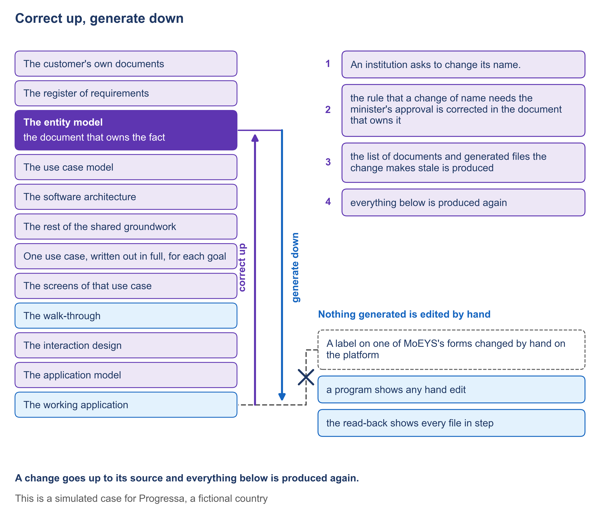

# 6.2 When something changes, correct the document that owns the fact


🎬 **Video in production:** *When something changes, correct the document that owns the fact* (~5 min).
The page below does not depend on the video: it carries what the video will say. The [video index](../../start-here/video-index.md) is the page to watch for links.


> **Single message.** A change goes up to its source and everything below is produced again.

## The concept

A service is in use, and someone asks for a change. The quickest fix is to change the screen, or the running system, where the problem was seen. That fix is the one that brings the problem back later.

The SDD method has one rule for every change. The change goes up to the document that owns the fact. It is corrected there, and nowhere else. Then everything below that document is produced again from it. The reason is simple. If you correct a fact where you happened to notice it, the document that owns the fact still says the old thing. The next time anything is produced from that document, the old fault returns. One statement of each fact, with every copy made from it, is the only arrangement that stays true over the years.

When the behaviour of the service itself must change, the order matters even more. The story of the goal changes first, and is agreed. Then the screens are brought into line. Then the walk-through is produced again. Only then does what was built change. People notice a screen first, so they ask for the screen to change first. Hold the order. A screen changed ahead of its story is a decision that nobody agreed, and the builder has no way to know it. Ask which story the change belongs to, before anything else is touched.

Here is an example built for Progressa. Harbourview University College asks the quality authority, PHEQA, to change its name. The request is followed through both bodies, PHEQA and the ministry of education, MoEYS. The head of the registration desk sees that an officer could write the new name into the register before the minister had approved it. The screen does not own that fact. PHEQA's register of business rules does. The rule is corrected there, to say that a new name is written only on the minister's approval, received from MoEYS. PHEQA's Registrar, who owns the rules, confirms the correction.

Then a program lists everything made from the old version of the rule: the shared states of a request, two of PHEQA's goals, their screens and walk-throughs, the decisions for the whole application, the file a program reads, and the application itself. Nothing on the list is reviewed, agreed or built from until it has been produced again. MoEYS's documents are not on the list, because none of them was made from PHEQA's rule. The recording of this segment will show the list, the application generated again, and the change on the running service. It passes when the list names everything the change reaches, and nothing is stale afterwards.



*F13. Correct up, generate down.*


**The worked example of this subtopic** is [E6-2](../examples/E6-2_when-something-changes-correct-the-document-that-owns-the-fact.md), built for Progressa.



**Demonstration.** A change of name corrected in its owning document, the stale list produced, the application generated again. It needs Both application models and their generated applications. Until it is recorded, the storyboard in the script stands in its place.


## Your turn — Find the document that owns the fact a change touches

**The problem it solves.** When a change is requested, the first instinct is to change the screen or the running system. This prompt names, for the change, the document that owns the fact, with the reason, so that the correction is made there and everything below is produced again.

Copy the prompt, replace the bracketed parts with your own context, and run it in the AI assistant of your choice. Never paste personal data or unpublished documents — see [How to use the plays](../../start-here/how-to-use-the-plays.md).

```text
Below is a change requested for a digital service, in the words of the person who asked for it: [paste the request]. Below is the list of the service's documents, each with what it holds and what it was made from: [paste the list]. Name the one document that owns the fact the change touches. Give the reason in one or two sentences, quoting the line of that document that states the fact today. Then list the documents made from it, and the documents made from those, that will have to be produced again. Say plainly whether the change touches the behaviour of the service; if it does, the story of the goal changes first, then the screens, then the walk-through, and only then what was built. If no document states the fact, say so, and write the question to ask, with the role that should answer it. Never place the change in a generated file or in the running system. Output: the owning document with the reason, the list of documents to produce again, and any question with its owner.
```

[Open in Claude](<https://claude.ai/new?q=Below%20is%20a%20change%20requested%20for%20a%20digital%20service%2C%20in%20the%20words%20of%20the%20person%20who%20asked%20for%20it%3A%20%5Bpaste%20the%20request%5D.%20Below%20is%20the%20list%20of%20the%20service%27s%20documents%2C%20each%20with%20what%20it%20holds%20and%20what%20it%20was%20made%20from%3A%20%5Bpaste%20the%20list%5D.%20Name%20the%20one%20document%20that%20owns%20the%20fact%20the%20change%20touches.%20Give%20the%20reason%20in%20one%20or%20two%20sentences%2C%20quoting%20the%20line%20of%20that%20document%20that%20states%20the%20fact%20today.%20Then%20list%20the%20documents%20made%20from%20it%2C%20and%20the%20documents%20made%20from%20those%2C%20that%20will%20have%20to%20be%20produced%20again.%20Say%20plainly%20whether%20the%20change%20touches%20the%20behaviour%20of%20the%20service%3B%20if%20it%20does%2C%20the%20story%20of%20the%20goal%20changes%20first%2C%20then%20the%20screens%2C%20then%20the%20walk-through%2C%20and%20only%20then%20what%20was%20built.%20If%20no%20document%20states%20the%20fact%2C%20say%20so%2C%20and%20write%20the%20question%20to%20ask%2C%20with%20the%20role%20that%20should%20answer%20it.%20Never%20place%20the%20change%20in%20a%20generated%20file%20or%20in%20the%20running%20system.%20Output%3A%20the%20owning%20document%20with%20the%20reason%2C%20the%20list%20of%20documents%20to%20produce%20again%2C%20and%20any%20question%20with%20its%20owner.>) *(pre-fills the prompt in a new chat; check the bracketed parts before sending)*

**What goes in and what comes out.** Input: the change requested, and the list of the service's documents with what each holds and what it was made from. Output: the owning document with the reason, the list of documents to produce again, and any question with its owner.


**Safeguard.** The owner of the document the prompt names confirms that the fact is theirs before the change is made. A change the prompt places in a generated file or in the running system is placed wrongly, whatever reason it gives.


## Sources

This subtopic cites no public source. Its content is the specification-driven method itself, described at the level of the manager.
