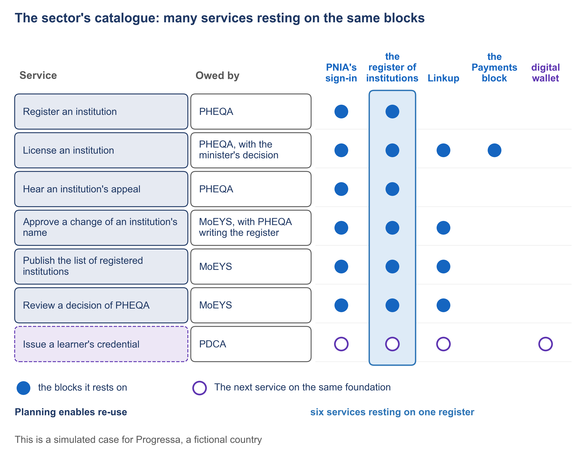

# 6.5 The next service on the same foundation


🎬 **Video in production:** *The next service on the same foundation* (~5 min).
The page below does not depend on the video: it carries what the video will say. The [video index](../../start-here/video-index.md) is the page to watch for links.


> **Single message.** The second service, a digital credential, reuses what the first one built and proved.

## The concept

In Progressa, private institutions now register with the quality authority once, and the ministry reads that register instead of asking again. The next request is already on the table: graduates want proof of their degree that an employer can trust.

Inside one project, building your own list of institutions or your own sign-in always looks faster. That is what a project is paid to do. Procurement rules can make each contract cheaper, but only whole-of-government planning makes re-use possible. The sum that makes re-use worth it, one block paid for and many services carried, exists only at the level of the sector. UNDP describes digital public infrastructure as a set of shared digital systems. PAERA, the GovStack reference architecture, says that digital public infrastructure is not neutral and shapes what can be built on top of it. The first service chose the foundation; the second one builds on it.

The second service is a digital credential for a graduate. It is already a row of Progressa's catalogue of services, owed by the digital credentials authority, PDCA, and the row shows what it rests on. The graduate signs in through the identity authority's sign-in, the same one the first service uses. PDCA reads the quality authority's register of institutions across Linkup, the data exchange, under the rules the register's keeper sets. One rule matters most: a credential is issued only for an institution whose licence is granted. PDCA keeps no copy of the register. None of these is built again.

The one new block is the credential itself. Of the roles the W3C standard for verifiable credentials names, three matter here. The issuer, here PDCA, gives the credential to the holder, the graduate. The holder stores it in what the standard calls a credential repository: for a person, usually a digital wallet. When an employer needs proof, the graduate presents the credential, in what the standard calls a verifiable presentation, and the employer, as the verifier, checks it. UNDP's compendium on digital public infrastructure counts verifiable credentials among the trust services that come with digital identity.

The method does not change for the second service. PDCA's team writes the same twelve documents, in the same order, each accepted by a named person. What changes is the architecture. Most of its crossings already exist, and each one is confirmed with the body that keeps the block: the identity authority for the sign-in, the quality authority for the register. The second service pays for what it adds, the credential and the wallet, and not for the foundation the first one built. Each confirmation is written down before the plan is approved. For the minister, that is the argument in one line: the foundation is already paid for.



*F5. The sector's catalogue: many services resting on the same blocks.*


**The worked example of this subtopic** is [E6-5](../examples/E6-5_the-next-service-on-the-same-foundation.md), built for Progressa.


## Your turn — List what a new service can reuse, and what it must add


**💡 AI usage tip** · List what a new service can reuse, and what it must add

**Bring:** The sector's catalogue of services and the description of the new service.
**Get:** A reuse list of blocks and records with their keepers, a list of what the service must add, and the bodies to consult.
**Time:** ~10–15 min · **Assistant:** any; the tips are tool-neutral.
**Watch for:** The list is a proposal for the planning meeting.


**The problem it solves.** A new service is easier to plan, and cheaper, when its team can see which blocks and records already exist. This prompt reads the sector's catalogue of services and lists, for the new service, what it can reuse, on whose terms, and what it must add.



Copy the prompt, replace the bracketed parts with your own context, and run it in the AI assistant of your choice. Never paste personal data or unpublished documents — see [How to use the plays](../../start-here/how-to-use-the-plays.md).

```text
Below is the sector's catalogue of services, each row with the body that owes the service, its state today and the blocks and records it rests on: [paste the catalogue]. Below is the description of a new service: [paste the description]. List, for the new service: (1) each block and record it can reuse, with the body that keeps it and the rows of the catalogue that already rest on it; (2) the conditions under which it may use each one, as the catalogue states them; (3) what it must add, which no row of the catalogue provides; (4) the bodies to consult before the plan is final. Use only what the catalogue says; where it does not say who keeps a block, write 'keeper not stated' and do not guess. Output: a reuse list of blocks and records with their keepers, a list of what the service must add, and the bodies to consult.
```

[Open in Claude](<https://claude.ai/new?q=Below%20is%20the%20sector%27s%20catalogue%20of%20services%2C%20each%20row%20with%20the%20body%20that%20owes%20the%20service%2C%20its%20state%20today%20and%20the%20blocks%20and%20records%20it%20rests%20on%3A%20%5Bpaste%20the%20catalogue%5D.%20Below%20is%20the%20description%20of%20a%20new%20service%3A%20%5Bpaste%20the%20description%5D.%20List%2C%20for%20the%20new%20service%3A%20%281%29%20each%20block%20and%20record%20it%20can%20reuse%2C%20with%20the%20body%20that%20keeps%20it%20and%20the%20rows%20of%20the%20catalogue%20that%20already%20rest%20on%20it%3B%20%282%29%20the%20conditions%20under%20which%20it%20may%20use%20each%20one%2C%20as%20the%20catalogue%20states%20them%3B%20%283%29%20what%20it%20must%20add%2C%20which%20no%20row%20of%20the%20catalogue%20provides%3B%20%284%29%20the%20bodies%20to%20consult%20before%20the%20plan%20is%20final.%20Use%20only%20what%20the%20catalogue%20says%3B%20where%20it%20does%20not%20say%20who%20keeps%20a%20block%2C%20write%20%27keeper%20not%20stated%27%20and%20do%20not%20guess.%20Output%3A%20a%20reuse%20list%20of%20blocks%20and%20records%20with%20their%20keepers%2C%20a%20list%20of%20what%20the%20service%20must%20add%2C%20and%20the%20bodies%20to%20consult.>) *(pre-fills the prompt in a new chat; check the bracketed parts before sending)*

*What to bring and what you get are in the box above.*




**Draft worked example, 2026-10-05.** Progressa is the fictional country used across these courses. The input below and the output in the next tab were written for this page to show a typical run of the prompt; they are simplified, and they have not been checked as the worked examples of the method have.


The bracketed parts of the prompt were replaced with the following:

**[paste the catalogue]:** three rows of Progressa's catalogue of higher-education services:

| Service | Owed by | State today | PNIA's sign-in | Register of institutions (kept by PHEQA) | Linkup | Payments block |
|---|---|---|---|---|---|---|
| License an institution | PHEQA, with the minister's decision | Running | ● | ● | ● the minister's decision crosses to MoEYS | ● fee, confirmed by PHEQA's finance officer |
| Approve a change of an institution's name | MoEYS, with PHEQA writing the register | Running | ● | ● | ● read by MoEYS; PHEQA grants each reading | — |
| Issue a learner's credential | PDCA | Not offered | ○ | ○ only while the licence is granted | ○ | — |

**[paste the description]:** PDCA will issue a graduate a digital credential for a degree, which the graduate keeps in a wallet and shows to an employer. A credential is issued only for an institution whose licence is granted. PDCA keeps no copy of the register.




**Draft: model output, shortened and unverified.** Read it with the notes in the next tab, not on its own.


**1. What the credential can reuse**

| Block or record | Kept by | Rows already resting on it | Conditions |
|---|---|---|---|
| PNIA's sign-in | PNIA | License; change of name | Not stated |
| Register of institutions | PHEQA | License; change of name | Read only while the institution's licence is granted |
| Linkup | PDGA | License; change of name | PHEQA grants each reading |
| Payments block | Keeper not stated | License | A fee for each credential, confirmed by PDCA |

**2. What it must add**

- The credential itself, issued by PDCA.
- The graduate's digital wallet.
- PDCA's record of the credentials it has issued.

**3. Bodies to consult**

PNIA, PHEQA, PDGA, and the keeper of the Payments block.



This is the teaching part of the tip. Work through the output the way a chief architect would: what is earned, what is invented, what is missing.

<details>

<summary>1. The three foundations are found</summary>

Sign-in, the register and Linkup each come with the rows that already rest on them, and the register's condition is copied from the catalogue exactly. That is the case for re-use in one table: three blocks the first services already paid for.

</details>

<details>

<summary>2. "PDGA" came from outside the catalogue</summary>

The catalogue names no keeper for Linkup. The prompt asked for "keeper not stated"; the assistant wrote PDGA. In Progressa that is right, but it was not read from the input, and the next run may guess wrongly. The safeguard covers it: each reuse is confirmed with the body that keeps it, and that confirmation names the keeper.

</details>

<details>

<summary>3. The Payments block was added, and something was missed</summary>

The credential's row shows "—" under Payments, and the description mentions no fee. The assistant borrowed the licensing fee and turned it into "a fee for each credential". It also missed what the description implies: a confirmation from the institution that the person graduated, which the register of institutions does not hold.

</details>


**Safeguard.** The list is a proposal for the planning meeting. Each reuse is confirmed with the body that keeps the block or record, on that body's terms, before the plan relies on it.




Compare the list with PDCA's reuse list in [E6-5](../examples/E6-5_the-next-service-on-the-same-foundation.md). The catalogue the list is read from is the one built in [2.1](../module-2/2-1.md), on [the blank catalogue](../toolkit/00_catalogue-of-services.md).



## Sources

- PAERA v1.0, section 2.6 (https://paera.govstack.global/)
- W3C, Verifiable Credentials Data Model v2.0, W3C Recommendation, 15 May 2025, sections 1.2 and 4.13 (https://www.w3.org/TR/vc-data-model-2.0/)
- GovStack Identity specification, version 2.0 (https://specs.govstack.global/identity)
- GovStack Digital Registries specification, version 3.0-alpha (https://specs.govstack.global/registries)
- UNDP, Accelerating the SDGs through Digital Public Infrastructure: A Compendium, 21 August 2023, pages 3 and 4 (https://www.undp.org/publications/accelerating-sdgs-through-digital-public-infrastructure-compendium-potential-digital-public-infrastructure)
