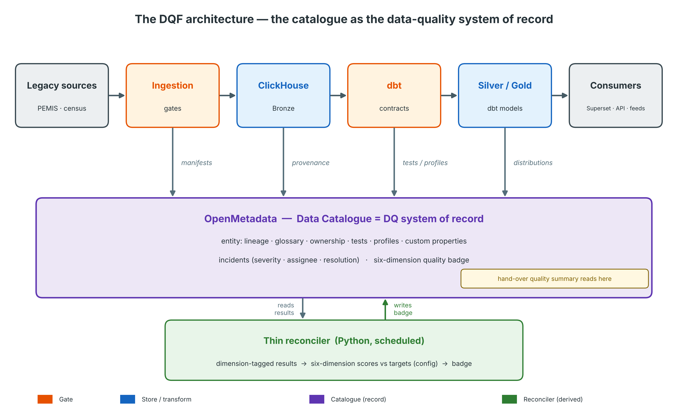

# Data Quality Framework (DQF) — Progressa's education data platform

**Version 0.1 (working design)**
**Status:** A design to adapt, not a framework already in operation. Its controls are what the skills of this kit implement: `onboard-source` the gates of stages S1 and S2, `add-dq-checks` the six-dimension tests of stage S4, `verify-catalogue-semantics` the catalogue gate of stage S5, `production-readiness-check` the final gate.
**Simulated case:** Progressa is a fictional country. MoEYS, PEMIS, PLR, PNEA and every table, figure and date in this document are invented.

---

## 1. Purpose and position in the architecture

This document defines the holistic Data Quality Framework for an education data platform — here, the one the Progressa ministry of education, youth and skills (MoEYS) builds over PEMIS, its education management information system: the dimensions it measures, the lifecycle stages it covers, the controls it mandates, the components that implement them, the governance that operates them, and the phasing that delivers them. It is the single source of truth for *what data quality means on the platform and how it is assured*. Implementation artefacts — extract gates, dbt tests, OpenMetadata suites, the reconciler — are derived from this framework, not the other way round.

**The central architectural commitment:** the Data Catalogue (**OpenMetadata**) is the *integration point and presentation plane* of the DQF. Every quality signal, wherever it is produced — in the ingestion service, in the dbt DAG, in the OpenMetadata profiler, in the reconciler — ultimately lands on the OpenMetadata entity for the table or column it describes, beside that entity's lineage, glossary terms, and ownership. Quality is not a separate system the analyst must visit; it is a property of the catalogued asset, visible at the point of use — including, critically, the **hand-over package** in which the cleaned school, learner and teacher data pass to the team that builds the learner register (PLR), whose quality summary is read straight from these entities.

Implementation is deliberately *federated* across components (ingestion, transformation, catalogue, consumption) — but the framework is one. A check belongs to the DQF not because of where it runs, but because it is registered in this framework's control catalogue (§6), carries a dimension tag, and reports to the catalogue.

This framework supplies the per-table quality scores the hand-over package depends on, and the evidence the ministry's **data governance board** reviews.

### 1.1 Why now — the case for a framework before the first load

MoEYS is about to profile, ingest and describe the tables of PEMIS, of the school census database and of the teacher payroll extract — several hundred tables of largely *unknown* quality — against a fixed date: the hand-over package for the learner register must carry per-table quality scores and the mystery-table triage. Today there is **no quality mechanism at all** — no profiling, no gates, no scoring. Building the catalogue without the DQF would hand the register's builders an inventory of unknown trustworthiness and migrate data of unknown integrity.

The framework's design is anchored by a set of **representative failure classes** that any adequate DQF must catch automatically. Each is a failure that loads from a legacy database into an analytical store commonly suffer, and each is squarely live for a legacy education estate.

| # | Failure class | What it looks like | Dimension |
|---|---|---|---|
| R1 | Silent truncation / partial extract | a multi-million-row table silently flips to a degraded mode and stays quietly incomplete | Completeness (load) |
| R2 | Type-domain overflow | real money values (school grants, fees) exceed a test-derived `Decimal(p,s)`; a source→ClickHouse type mismatch | Validity |
| R3 | Schema drift at load | a column is lost/reordered versus the expected DDL | Consistency / schema |
| R4 | Semantic drift / dead column | a field is present, typed and non-null but constant (e.g. a status code that never varies) | Validity / semantic fidelity |
| R5 | Unfit mapping / indicator banding | a field assumed meaningful is populated in ≪1% of real records, so a derived indicator mis-bands | Accuracy (output) |
| R6 | Mixed-era / provenance ambiguity | Bronze holds rows from different extraction eras/sources without a provenance tag | Consistency / provenance |
| R7 | Empty / placeholder table consumed as real | a 0-row table is plausibly consumable and silently used | Completeness |
| R8 | Untriaged mystery table enters scope | one of the tables of unknown purpose is migrated/described without an A/B/C decision | Fitness / governance |

**The design's acceptance test:** a framework that would not catch R1–R8 *automatically* is not yet the right framework. §6 names a control for each (acceptance check at the end of §6; traceability in Appendix A).

### 1.2 Scope

In scope: all PEMIS source databases and their derived Medallion layers (Bronze → Silver → Gold); the OpenMetadata catalogue and the **hand-over package**; the consumption surfaces (Superset dashboards, the read API, the feeds to the examination authority PNEA and to PLR); the migration-intelligence/reconciliation loop; and the governance around all of these. Out of scope for v0.1: fixing the source systems themselves (we measure quality at the boundary, we do not repair PEMIS); master-data management beyond what the catalogue does; pseudonymisation/anonymisation *correctness* (handled under the security and data-protection workstream — though the *use* of anonymised data in the development environment is a precondition, §8); and the choice of analytics tools for consumers (a consumer is a consumer, not a DQ tool).

---

## 2. Framework principles

Each DQ principle follows from the platform's architectural principles (the register of `dataplatform-architecture-principles`) and the ministry's data-protection constraints. When designing or reviewing any control, test these first.

**DQ-1. Two failure semantics, never confused.** Every control is explicitly either a **build-time contract / gate** (failure stops the step: a load is not declared done, a dbt build fails, a spec is not promoted) or a **fitness-for-use monitor** (failure raises an alert/incident; data flows on). Gates protect invariants; monitors observe fitness. A gate on a fitness signal blocks legitimate work; a monitor guarding an invariant lets corruption propagate. The control catalogue (§6) assigns semantics per control, as a reviewed design decision.

**DQ-2. Quality lands on the catalogue entity.** OpenMetadata is the single pane. Producers push results to the entity (table/column) they describe: dbt results via OpenMetadata's dbt-artifact ingestion; ingestion manifests via custom properties; OpenMetadata-native tests natively; the six-dimension badge via the reconciler. No separate quality dashboard as the primary surface; the hand-over quality summary and any Superset view read what the catalogue already holds.

**DQ-3. Rules are configuration, not code.** Thresholds, mandatory-field sets, reconciliation tolerances, freshness SLAs, dimension targets, severity mappings — all live in configuration (YAML in Git, the `dq` registry, or OpenMetadata test definitions), never as literals inside scripts or models.

**DQ-4. Every custody transfer is reconciled (motivated by R1).** Wherever data crosses a component boundary — source→Bronze, Bronze→Silver, Silver→Gold, Gold→consumption — the receiving side proves it received what the sending side held: row counts at minimum, checksums/aggregates where feasible. A load or build without a reconciliation record is **not done**. "It ran without error" is not evidence (R1 runs without error).

**DQ-5. Evidence, not assertion.** Every control produces a durable, queryable record: load manifests, dbt `run_results.json`, OpenMetadata time-series, incident history. The audit question "was this data fit for use on date D?" must be answerable from stored evidence, not memory. This is also the governance currency — it is what is shown to the data governance board and to the register's builders at hand-over.

**DQ-6. Steward self-service on a code-managed baseline.** The **baseline** suite — the controls this framework mandates — is code: Git-versioned, PR-reviewed, reproducible at hand-over. Data stewards extend it with **supplementary** tests through the OpenMetadata UI without IT tickets. Baseline controls may not be weakened from the UI.

**DQ-7. Two products, plus glue we own.** **dbt and OpenMetadata are the only DQ products.** No third quality product; an analytics suite the ministry already licenses is a *consumer*, never a DQ or cataloguing tool — "already licensed" is a commercial fact, not an architectural argument. The bespoke surface is deliberately small: ingestion gates inside the ingestion service, and one thin reconciler. All open-source and self-hosted.

**DQ-8. Profile the typed layers richly, the raw layer cheaply.** Bronze gets counts, freshness and schema checks; Silver/Gold get full profiling and distributional monitoring. Heavy metrics on large ClickHouse MergeTree tables run **by-partition and off-peak**, on a tier-aware schedule (Hot frequently, Archive rarely). A one-table profiling spike validates cost before fleet rollout (§9, O3).

**DQ-9. Fitness extends to *meaning*, not just form (motivated by R4, R5, R8).** A column can be present, typed, non-null, unique — and still semantically dead (a constant status code) or unfit for use (a field populated in ≪1% of records). The framework therefore includes **semantic-fidelity controls**: constant-column detection, fill-rate profiling against the form/business definition, the mystery-table A/B/C triage as a gate on scope, and distribution snapshots of *outputs* (indicator distributions), not just inputs.

---

## 3. The six-dimension model

The framework retains the six-dimension model (DAMA-DMBOK), operationalised for an education data platform:

| Dimension | Definition (operational form) | Example measures |
|---|---|---|
| **Completeness** | Required data is present: rows survive custody transfers; mandatory fields populated | source-vs-Bronze row delta; % mandatory fields non-null per business definition; empty-table detection |
| **Validity** | Values conform to domain, type, and format rules | type-domain fit (no overflow); date within plausible range; learner-number and school-code format; enum membership against reference tables |
| **Accuracy** | Values agree with an authoritative reference | cross-source reconciliation (e.g. learners on the census return vs active learners in the register); box-total consistency within a census return (total = boys + girls); cache-vs-canonical |
| **Consistency** | The same fact agrees across representations and over time | Silver row count vs deduplicated Bronze; era consistency (one batch generation per analytical run); FK resolution across the source databases |
| **Uniqueness** | Entities are represented once at their declared grain | duplicate rate on the declared PK; post-dedup grain check at Silver (e.g. one row per school per census year) |
| **Timeliness** | Data is as fresh as its tier SLA requires, and its age is visible | `_extracted_at` age vs the tier SLA; snapshot-period coverage; staleness badge |

**Targets.** Each dimension carries a **PoC target** (build/validation phase) and a **Full target** (production). The starting point is the gates the platform already enforces at ingestion (stage S2) and the headline Data Quality Score trajectory; numbers are **proposals to be confirmed with the Data Owners and the data governance board** — placeholders with rationale, not decisions.

| Dimension | PoC target (proposed) | Full target (proposed) |
|---|---|---|
| Completeness | ≥ 95% mandatory-field fill at Silver; ≥ 99% rows reconciled per load | ≥ 99% fill; 100% reconciled |
| Validity | ≥ 99% rows pass validity tests (format/range/code) | ≥ 99.5% |
| Accuracy | cross-source reconciliations defined & measured for the census chain | tolerance bands agreed with the Data Owners and met |
| Consistency | ≥ 98% cross-reference match; era-uniform Bronze per source | + cross-database FK resolution ≥ agreed floor |
| Uniqueness | < 1% duplicates; 100% at declared grain post-dedup (Silver) | 100% |
| Timeliness | freshness *visible* per table (age badge); tier SLAs defined | per-tier SLAs met — Hot < 5 min, Warm < 1 h, Cold < 24 h, Archive < 7 d |

**Composite score.** Scores roll up per table per dimension on a **0–100** scale, computed by the reconciler (§7.4) from dimension-tagged test results, and written back to the OpenMetadata entity as the quality badge. The **headline Data Quality Score** target is set by the data governance board — for example, from the level measured at the first scoring to 90% within a year.

---

## 4. Lifecycle coverage

Per stage: the quality risks it owns (with the failure class it answers) and the controls (catalogued in §6).

**S1. Source onboarding & cataloguing.** Risks: unknown semantics, undocumented columns, wrong assumptions baked into DDL, untriaged mystery tables (R3, R4, R8). Controls: schema capture into OpenMetadata at onboarding (the source's catalogue connector); **onboarding profile** of the real source (fill rates, constant columns, value ranges) *before* DDL and staging models are authored; **mystery-table A/B/C triage** as a scope gate (Category A excluded, B prioritised, C investigated); business/form-definition cross-check (semantics confirmed with the Data Owner, not inferred); ownership assigned in OpenMetadata (every source has a named business Data Owner and a data steward).

**S2. Acquisition / ingestion (extract → Bronze).** Risks: silent truncation (R1), type overflow (R2), schema drift at load (R3), partial-batch ambiguity. Controls: pre-load schema comparison (gate); type-domain verification with a widening protocol for money/precision (gate); post-load source↔target reconciliation (gate); **load manifest** per table per batch (evidence); non-silent failure — any degraded fallback exits non-zero and marks the manifest failed.

**S3. Storage (Bronze).** Risks: mixed eras (R6), empty placeholder tables (R7), staleness invisibility. Controls: era/provenance tagging (`_batch_id`, `_source_system`, `_extracted_at`) surfaced as OpenMetadata custom properties (latest batch, load date, source host); zero-row detection on consumable tables; **tier classification** (Hot/Warm/Cold/Archive) recorded; deprecated/dead tables (Category-A mystery, test/backup) tagged `Deprecated` and excluded from active lineage scope.

**S4. Transformation (Silver / Gold via dbt).** Risks: contract violations (grain, keys, ranges), transformation logic on dead semantics. Controls: dbt tests as build gates (uniqueness at grain, not-null join keys, accepted ranges/values, relationships); dbt source-freshness checks; **row-budget band** Silver vs Bronze (expected dedup ratio); results pushed to OpenMetadata via dbt-artifact ingestion. (Modelling discipline: persisted `staging → intermediate → marts` so each join is a test boundary — see `build-dbt-model`.)

**S5. Catalogue enrichment & the hand-over.** Risks: handing the register's builders unfit/undescribed columns; a spec referencing a dead/unfit column (R4, R5). Controls: the quality badge and onboarding profile (fill rate, constancy) are visible **at the point of field selection** and on the hand-over package; a **hand-over gate** — every table in the package carries a quality score and a triage state; a red-flagged column entering a spec/hand-over requires explicit steward override with a comment.

**S6. Consumption (Gold marts, Superset, the read API, the PNEA and PLR feeds).** Risks: implausible outputs consumed as truth (R5); querying periods with no data. Controls: **output distribution snapshots** after each Gold build (e.g. enrolment and pass-rate distributions per period) compared to the previous snapshot — large shifts open an incident (monitor); period-coverage metadata on marts; composite outputs carry the quality badge of their weakest critical input (lineage-derived, later phase).

**S7. Feedback / analytics and models (e.g. a dropout-risk score).** Risks: models calibrated on placeholder or biased data; outputs treated as decisions. Controls: provenance and minimum-volume gates before model statistics are trusted; model outputs recorded with the data-quality state at decision time (evidence); mandatory human-in-the-loop review (per the platform's AI governance) — DQ supplies the input-quality signal that review depends on.

**S8. Retention / archival.** Risks: silent loss of evidence; irreproducible past states. Controls: manifests, test results and snapshots retained per a defined schedule (proposal: manifests and scorecards retained ≥ 5 years — the public-records audit horizon); deprecated/backup-table lifecycle (kept until a clean re-pull is verified, then dropped by decision, not by accident).

---

## 5. Architecture: components and the catalogue as hub



```
 Legacy sources (PEMIS, census) ─► ingestion gates ─► ClickHouse Bronze ─► dbt contracts ─► Silver/Gold ─► consumers
                        │ manifests          │ provenance props    │ profiler/tests    │ distribution
                        ▼                     ▼                     ▼ (by-partition)    ▼ snapshots
            ┌───────────────────────────────────────────────────────────────────────────────────────┐
            │                 OpenMetadata  (catalogue = DQ system of record)                         │
            │   entity: lineage + glossary + ownership + tests + profiles + custom properties         │
            │   incidents (severity, assignee, resolution)  ·  hand-over quality summary reads here   │
            └───────────────────────────────▲───────────────────────────────────────────────────────┘
                                            │ six-dimension badge (write-back)
                                      thin reconciler (Python, scheduled)
                                      reads dimension-tagged results, computes
                                      6-dim scores vs targets (config), writes badge
```

Division of labour (settled when the tools were chosen, restated as framework law):

| Job | Owner | Semantics | Definition lives in |
|---|---|---|---|
| Ingestion gates & manifests | ingestion service (Python) | gate | Git (script + YAML config) |
| Build-time contracts | dbt tests (+ dbt-expectations) | gate (fail build) | Git, beside the model |
| Profiling & fitness monitoring | OpenMetadata profiler + test suites | monitor (incident) | baseline: Git via OM SDK/YAML; supplementary: OM UI |
| Six-dimension rollup + badge | thin reconciler | derived | Git |
| Incident workflow | OpenMetadata Incident Manager | process | OpenMetadata |
| Quality-at-field-selection / hand-over | catalogue + hand-over package reading OM | display | (read-only) |

**Storage decision (proposal):** load manifests and distribution snapshots live in a **PostgreSQL `dq` schema** beside the ingestion service's own state (its watermarks), not in ClickHouse — they are operational, transactional records queried by the reconciler, not analytical data. OpenMetadata holds the derived display copy (PostgreSQL is the source of truth for manifests; OM custom properties are the presentation).

---

## 6. Control catalogue (baseline v0.1)

Identifier convention: `DQC-<stage>-<nn>`. Every control carries dimension(s), mechanism, semantics, owner. This catalogue is the *configuration of record* for the baseline suite; the implementation backlog is derived from it.

| ID | Control | Dim. | Stage | Mechanism | Semantics |
|---|---|---|---|---|---|
| DQC-S1-01 | Onboarding profile of real source (fill rates, constant columns, ranges) before DDL/staging authored | Validity, sem. fidelity | S1 | profiling script → OM | gate (onboarding checklist) |
| DQC-S1-02 | Mystery-table A/B/C triage as a scope gate (pipeline activity × static analysis of the legacy code) | Fitness / governance | S1 | triage script → OM tags | gate (onboarding) |
| DQC-S1-03 | Business/form-definition cross-check: column semantics confirmed with the Data Owner | Accuracy | S1 | checklist + OM glossary | gate (onboarding) |
| DQC-S1-04 | Ownership assigned (business Data Owner, data steward) per source/domain | — (governance) | S1 | OM ownership | gate (onboarding) |
| DQC-S2-01 | Pre-load schema comparison source vs target DDL | Consistency | S2 | ingestion service | gate |
| DQC-S2-02 | Type-domain verification; widening protocol for money/precision | Validity | S2 | ingestion + DDL convention | gate |
| DQC-S2-03 | Post-load reconciliation: ClickHouse count == source count (tolerance 0) | Completeness | S2 | ingestion service | gate |
| DQC-S2-04 | Load manifest per table/batch (counts, duration, status, host, batch_id) | — (evidence) | S2 | ingestion → PG `dq.load_manifest` → OM props | evidence |
| DQC-S2-05 | No silent fallback: any degraded mode fails the run (exit ≠ 0, manifest `FAILED`) | Completeness | S2 | ingestion service | gate |
| DQC-S3-01 | Provenance surfaced: latest `_batch_id`, `_extracted_at`, source host as OM properties | Timeliness, Consistency | S3 | reconciler (reads CH meta) | monitor |
| DQC-S3-02 | Zero-row / placeholder detection on consumable tables | Completeness | S3 | OM test (row count > 0) | monitor |
| DQC-S3-03 | Tier classification (Hot/Warm/Cold/Archive) recorded per table | Timeliness | S3 | reconciler / OM props | display |
| DQC-S3-04 | Deprecated/backup & Category-A tables tagged `Deprecated`; excluded from active lineage | Consistency | S3 | OM tags | monitor |
| DQC-S4-01 | Grain uniqueness at Silver (declared PK per model) | Uniqueness | S4 | dbt test | gate |
| DQC-S4-02 | Not-null join keys; accepted ranges/codes (dates, enums) | Validity | S4 | dbt test | gate |
| DQC-S4-03 | Referential relationships Silver↔Silver where contracted | Consistency | S4 | dbt test | gate |
| DQC-S4-04 | Source freshness vs tier SLA | Timeliness | S4 | dbt source freshness / OM SLA test | monitor |
| DQC-S4-05 | Row-budget band Bronze→Silver (dedup ratio within band) | Completeness | S4 | dbt singular test | gate (warn band, error floor) |
| DQC-S4-06 | dbt results pushed to OM entities | — (evidence) | S4 | OM dbt-artifact ingestion | evidence |
| DQC-S5-01 | Quality badge + fill/constancy visible at field selection and on the hand-over package | sem. fidelity | S5 | catalogue/hand-over reads OM | display |
| DQC-S5-02 | Hand-over gate: every table in the package carries a quality score + triage state | all | S5 | reconciler + hand-over build | gate |
| DQC-S5-03 | Red-flagged column entering a spec/hand-over requires steward override + comment | Validity | S5 | catalogue lifecycle | gate |
| DQC-S6-01 | Output distribution snapshot per indicator/period after Gold build; shift alert | Accuracy (output) | S6 | snapshot script → PG `dq` + OM | monitor |
| DQC-S6-02 | Period-coverage metadata on marts (periods with data) | Timeliness | S6 | dbt meta / OM props | display |
| DQC-S6-03 | Composite badge = weakest critical input (lineage-derived) | all | S6 | reconciler (later phase) | display |
| DQC-S7-01 | Provenance & minimum-volume gate before analytics/model statistics are trusted | Accuracy | S7 | backend check | gate |
| DQC-S7-02 | Model/analytic decisions record the DQ state at decision time | — (evidence) | S7 | audit schema | evidence |
| DQC-S8-01 | Evidence retention schedule (manifests, scorecards ≥ 5y proposed) | — (evidence) | S8 | PG retention policy | process |

**Acceptance check against §1.1:** R1→DQC-S2-03/-05; R2→DQC-S2-02; R3→DQC-S2-01; R4→DQC-S1-01 (constant-column) + DQC-S1-03; R5→DQC-S1-01/-03 + DQC-S5-01/-03 + DQC-S6-01; R6→DQC-S3-01/-04; R7→DQC-S3-02; R8→DQC-S1-02. **All eight covered, each by a named, automated control.**

---

## 7. Governance

**7.1 Roles.** Roles are named, never persons.

| Role | Held by | Responsibilities |
|---|---|---|
| Data Owner (per domain) | The business unit that answers for the data (e.g. the MoEYS statistics unit for PEMIS and the census; the teaching service for teacher records; PNEA for examination records) | Semantics authority (DQC-S1-03), classification, refresh commitments, target sign-off |
| Data Steward | The data management team of the MoEYS statistics unit | Supplementary OM tests, fitness-incident triage, promotion overrides (DQC-S5-03), dimension-target proposals |
| Platform Engineer | Data engineering (ClickHouse/dbt); a supplier's staff and the ministry's own, working shadow → pair → lead | Baseline suite (Git), gates, reconciler, profiler operation |
| Quality Forum | The above + the data protection officer, monthly — rides on the data governance board | Scorecard review, target adjustment, incident retrospective, baseline promotion |

**7.2 Incident process.** Detect (gate failure or monitor alert) → triage severity (S1: wrong data may have reached consumers or the hand-over; S2: pipeline blocked; S3: degradation, not blocking) → OpenMetadata incident with assignee → remediate → close with a resolution comment. Gate failures during a load are *not* incidents unless data already shipped; they are **failed runs** recorded in the manifest. Post-mortems feed new controls into this catalogue — the catalogue is append-mostly.

**7.3 Rule lifecycle.** Baseline controls follow Draft → Review (PR) → Production → Retired in Git. Supplementary steward tests follow the OpenMetadata UI lifecycle; quarterly, the Quality Forum reviews supplementary tests for promotion into the baseline (codified in Git) or retirement. UI tests may not override or weaken baseline controls (DQ-6).

**7.4 Scorecard and reporting.** The reconciler computes per-table dimension scores (0–100) from dimension-tagged results, rolls them to per-source scorecards, writes badges to OpenMetadata, and emits a **monthly scorecard** (per source: six scores, trend, open incidents, MTTR). This artefact is the standing evidence for the data governance board, **and the quality summary delivered with the hand-over package**.

**7.5 KPIs of the framework itself.** % consumable tables with a current badge; % loads with a reconciled manifest (**target 100% — it is a gate**); % of hand-over tables with a quality score; mean time to detect (monitor incidents); mean time to resolve by severity; # supplementary tests promoted to baseline per quarter (steward-engagement signal).

---

## 8. Phasing

**Precondition (gating all phases): the development environment.** Execution cannot start until the ministry's ICT unit provides (a) access to the source databases with realistic **anonymised** data, (b) the source code of the legacy applications (for static analysis → the A/B/C triage), and (c) the team's tooling. Ask for them in writing before the work is planned. The framework below is *ready to execute on day one* of access.

**Phase DQ-0 — "Foundations" (a few days once the environment lands, before the first production loads).** Gates into the ingestion service: schema comparison (DQC-S2-01), type-domain/widening (DQC-S2-02), reconciliation (DQC-S2-03), no-silent-fallback (DQC-S2-05); load-manifest table in PG `dq` (DQC-S2-04). Onboarding profiler (DQC-S1-01) and the **A/B/C triage gate** (DQC-S1-02) — run on each source *before* authoring its DDL/staging. Deliverable: the first database loads run under the framework.

**Phase DQ-1 — Contracts & evidence (1–2 weeks; directly feeds the hand-over).** Extend dbt test coverage to the contract baseline (DQC-S4-01…05) for all loaded sources; enable OM dbt-artifact ingestion (DQC-S4-06); **verify the deployed OpenMetadata version** (profiler-on-ClickHouse coverage, freshness tests, Incident Manager) and run the **ClickHouse profiling cost spike** on one large Silver table (named open items); baseline OM suite as code (SDK/YAML in Git); provenance & tier properties (DQC-S3-01…04). Quality scores begin landing on entities → the **hand-over gate** (DQC-S5-02) becomes enforceable.

**Phase DQ-2 — Scorecard & self-service (2–3 weeks).** Thin reconciler: dimension-tagging convention, score computation vs targets (targets signed off with the Data Owners by then), badge write-back; output distribution snapshots (DQC-S6-01) after Gold builds; incident workflow live; steward onboarding (the data management team adds its first supplementary tests).

**Phase DQ-3 — Closing the loop.** Quality-at-field-selection and the full hand-over surfacing (DQC-S5-01/-03); composite weakest-input badges (DQC-S6-03); analytics/model provenance gates (DQC-S7-01/-02); cross-source accuracy reconciliations (e.g. learners on the census return vs active learners in the register) as OM custom-SQL tests; retention automation (S8).

Each phase is additive; nothing in DQ-0 is rework for DQ-3.

---

## 9. Open decisions and risks

| # | Item | Proposal | Decide by |
|---|---|---|---|
| O1 | PoC/Full dimension targets (§3) — confirm with Data Owners; data governance board sign-off | proposals in §3 (anchored on the ingestion gates of S2) | DQ-2 start |
| O2 | Manifest/snapshot store: PG `dq` schema vs ClickHouse | PG (operational) | DQ-0 |
| O3 | Deployed OpenMetadata version capability check + ClickHouse profiler cost | spike in DQ-1 | DQ-1 |
| O4 | Profiler/test scheduling runner (OM ingestion scheduler vs cron/systemd) | follow platform ops convention | DQ-1 |
| O5 | Dimension-tagging convention for tests (OM tags vs naming prefix) | OM tags, fallback naming prefix | DQ-2 |
| O6 | A formal document for the ministry derived from this design | after v0.2 review | when stable |
| **O7** | **Risk: the development environment is not provided (databases, anonymised data, legacy source code, tooling)** | **raised in writing with the ministry's ICT unit — DQ-0 cannot start without it** | **immediate** |
| O8 | Risk: framework outpaces team capacity (few posts filled) | strictly value-ordered phasing; DQ-0 alone pays for itself; recruit to the plan | standing |

---

## Appendix A — Failure classes → controls (traceability)

| Class | Control(s) | Phase |
|---|---|---|
| R1 silent truncation / partial load | DQC-S2-03, DQC-S2-05, DQC-S2-04 | DQ-0 |
| R2 type-domain overflow | DQC-S2-02 | DQ-0 |
| R3 schema drift at load | DQC-S2-01 | DQ-0 |
| R4 semantic drift / dead column | DQC-S1-01, DQC-S1-03 | DQ-0/1 |
| R5 unfit mapping / indicator banding | DQC-S1-01/-03, DQC-S5-01/-03, DQC-S6-01 | DQ-0/2/3 |
| R6 mixed-era / provenance ambiguity | DQC-S3-01, DQC-S3-04 | DQ-1 |
| R7 empty / placeholder table | DQC-S3-02 | DQ-1 |
| R8 untriaged mystery table | DQC-S1-02 | DQ-0 |

## Appendix B — Where this framework is applied in the kit

- **`onboard-source`** → S1 and S2: the onboarding profile (DQC-S1-01), the A/B/C triage (DQC-S1-02), the money-widening DDL (DQC-S2-02), reconciliation and no silent fallback (DQC-S2-03/-05).
- **`add-dq-checks`** → §3 and S4: the six dimension-tagged tests (DQC-S4-01…05), the tier SLAs, the threshold configuration the reconciler scores against, the accuracy stub (DQC-S6-01).
- **`import-schema-to-catalogue`** and **`legacy-module-to-openmetadata`** → S1: schema capture and DRAFT semantics.
- **`verify-catalogue-semantics`** → S5: the catalogue gate (DQC-S1-03, DQC-S5-02/-03).
- **`production-readiness-check`** → the final gate, which reads the S5 hand-over gate and the DQ gates (DQ-1/DQ-2 on its checklist).
- **`dataplatform-architecture-principles`** → §2: the DQ principles follow from the platform's principles register.
