# About this manual

This manual is for the people who use the four ITU/Giga Knowledge Products on education digital transformation. KP1 teaches government enterprise architecture. KP2 teaches the government interoperability framework. KP3 teaches the roadmap for education digital public infrastructure. KP4 teaches how to design a public service on shared building blocks.

You may be a middle manager in a ministry of education or in a digital agency. You prepare the case that goes to the minister. Or you may be a member of the technical team that works with that manager on KP2, KP3 or KP4.

All four Knowledge Products ask you to work with an AI assistant. The assistant drafts a context pack, a gap register, a decree or one goal of a service. This manual is about a tool that keeps that work in order. The tool is called the Orchestrator. The manual answers three questions about it. When should you use it? Why does it exist? How do you use it?

**How the chapters run.** Chapter 1 explains why the Orchestrator exists. Chapter 2 names the parties and the documents they pass to each other. Chapter 3 says when to use it, and when not. Chapter 4 follows one piece of work from the first question to the verdict. Chapter 5 explains how to choose who does the work. Chapter 6 describes the record that the work leaves. Chapter 7 explains how the role passes from one session to the next. Chapter 8 gives one worked example for each Knowledge Product, set in Progressa. Chapter 9 tells you what you need to start. A two-page quick reference and a glossary close the manual.

**Two words to settle first.** A *session* is one conversation with the AI assistant, from its first message to its end. The *orchestrator*, in small letters, is a session that holds one role: it keeps the work in order and does not do the work itself. The *Orchestrator*, with a capital letter, is the tool. It is a plugin that you add to your assistant. It carries the rules of the role, the forms the role writes from, and a small program that keeps the record.

**The examples.** Every example is set in Progressa, the fictional country of all four Knowledge Products, and in its education sector. Every name, date and figure about Progressa is invented. The folder names in the examples are generic, such as `my-project/_prompts/`. Use the names of your own project in their place.

**The models.** The manual names the Claude models as the present example of each kind of work. The rules are about the kind of work, not about one product. If you use another assistant, section 5.4 shows how to apply them.

**Paths and file names in this manual.** A document for readers outside a project normally carries no paths or file names. This manual is an exception, because its subject is a tool that works with files and folders. The paths appear only in the examples and in the boxes that show a form. The running text describes, in plain words, what each one is for.

# 1. Why the Orchestrator exists

## 1.1 A case from a ministry

In Progressa, the ICT Director of the Ministry of Education, Youth and Skills (MoEYS) must send the minister a business case for the National Learner Registry. She asks an AI assistant to draft it. The draft looks good. So, in the same conversation, she asks the assistant to check it. The assistant reads its own draft again and finds it sound.

But the draft has an error. Her request gave the number of schools as 8,000. The true number is 8,200. The assistant worked out the cost of connecting the schools from her figure. When it checked the draft, it checked it against the same request. So the check confirmed the error. It did not find it.

Three weeks later, a colleague opens a new conversation to update the table of costs. In the first conversation, the Director had agreed to leave secondary schools out of the first year. The new conversation does not know this. It puts the secondary schools back. Now two versions of the business case exist. Nobody can say which one is current, or why the two differ. The conversation that knew is closed.

## 1.2 The two failures

The case shows two failures. They happen in any team that works with an AI assistant. They also happen in many teams that do not.

**The first failure: the one who does the work also judges it.** A party that does the work and then judges it has no independent check. A mistake in the request passes into the result, and nobody sees it. The judgement reads as a confirmation. It is not a check.

**The second failure: what a conversation knows is lost when it ends.** The next piece of work must rebuild what was already known. It rebuilds it in a different way. Two versions of one fact then exist, and nobody can tell which is right.

## 1.3 The answer

The Orchestrator answers both failures with two arrangements.

- **Three parties, with written documents between them.** One session writes the instruction. A second session does the work and writes a report. A third session, which did neither, checks the report and gives the verdict. No session judges its own work.
- **The state of the work lives in files, not in anyone's memory.** Every instruction, report and review is a file in a known place. Every event, such as "this task has started", is written in a log. When you ask where the work stands, the answer is produced from these files.

Everything else in this manual follows from these two arrangements.

Figure 1 shows both failures, and what changes when the two arrangements are in place.

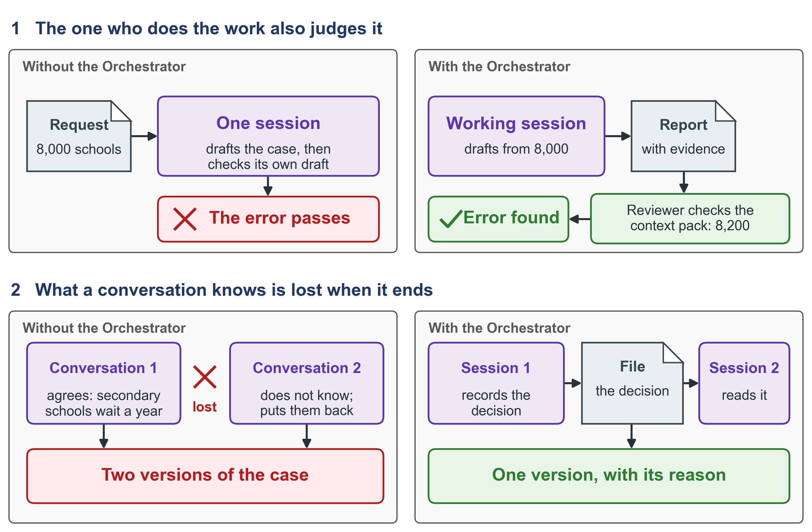

*Figure 1. The two failures, and the two arrangements that answer them. A check made by a separate party catches the error that a self-check confirms, and a fact kept in a file survives the end of the conversation.*

## 1.4 You know this idea already

The four Knowledge Products teach the same idea for people. KP1 asks for an Enterprise Architecture Board that can say no to a project. KP3 asks reviewers to check the work of each step before the next step starts. KP4 has the rule that the person who writes a document never accepts it alone. The Orchestrator applies the same rule to the work of an AI assistant.

## 1.5 What the Orchestrator does not do

The Orchestrator does not make the assistant know more. It makes the assistant's work checkable, and it keeps the state of the work after a conversation ends.

It does not decide for you. The decisions that are yours stay yours (section 2.8).

It does not start sessions by itself. You start every session.

# 2. The parties and their documents

## 2.1 Four parties: three sessions and you

**The orchestrator** holds the state of the work. It decides what should happen next. It writes the instruction for each piece of work. When a report comes back, it sends the report for review and acts on the verdict. It keeps the records and drafts messages for you. It does not do the technical work itself. It thinks about how the work will be done and where it can go wrong, and it writes that into the instruction. It may read files to check what is true. It never changes them.

**The working session** takes one instruction. It does exactly what the instruction asks, and nothing else. At the end it writes a report of what it did, with the evidence.

**The reviewing session** neither wrote the instruction nor carried it out. It checks the report against the instruction and writes the review. The review carries the verdict.

**You**, the person who owns the work, start every session. You give each session its first message. You make the decisions that are yours. You save the finished work in the project's history and publish it.

> **The one rule with no exception.** A session never carries out work that it commissioned itself. A session never judges work that it commissioned itself.

The rule exists because the session that wrote the instruction carries the same assumptions into the work and into the check. Without the rule, the first failure of chapter 1 returns.

Figure 2 shows the four parties and the documents that pass between them.

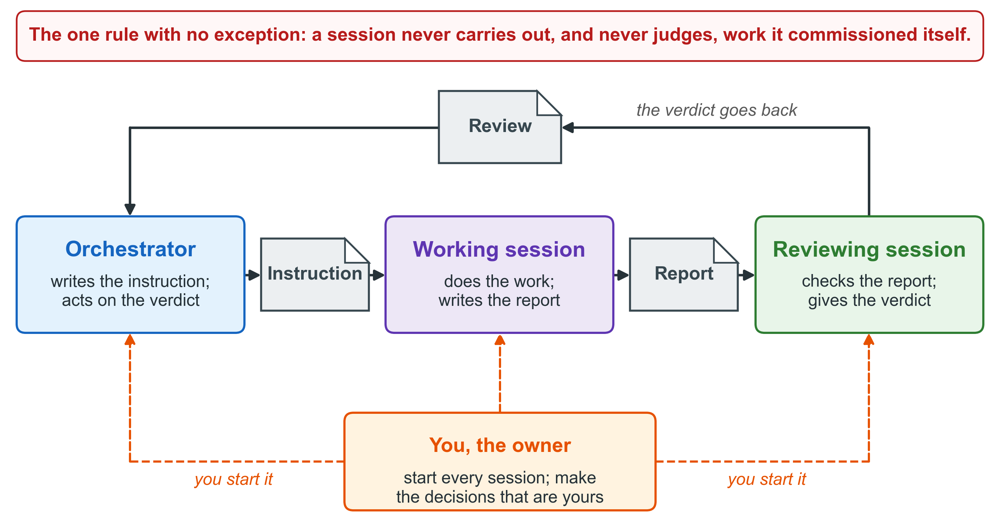

*Figure 2. The three sessions, the three documents, and you. Each document passes from one party to the next, you start every session, and no session checks its own work.*

## 2.2 What "acting on what comes back" means

When a report arrives, the orchestrator does four things. It compares two lines: the instruction names the report it expects, and the report names the instruction it answers. It sends the report for review. It receives the review. It acts on the verdict.

The orchestrator may read the report to understand it. It may not grade it. Grading belongs to the reviewing session.

## 2.3 The three documents

**The instruction** says what one piece of work is. It names what the work serves, the model that should do it and why, who will review it, and every output with the folder it goes to. It states the tests of success, the ways the work can fail, and what is out of scope. One instruction covers one task with clear limits.

**The report** says what was done. It gives the answer first, in one paragraph. Then it takes each test of success, one by one, with the command that was run, its output and the time. It lists what the session found but did not fix. **The report carries no verdict.**

**The review** says whether the work passed. For each test, it says whether the test was met and on what evidence. It works out at least one figure of the report again, by another route. It checks that every output exists. It ends with a verdict: *accepted* or *not accepted*. There is no third word.

Each document begins with a short block of named lines, called the *declaration*. Programs and reviewers read these lines. Chapter 4 shows them.

## 2.4 One place for each kind of document

Instructions, reports and reviews each have their own folder. By default these are `_prompts/`, `_reports/` and `_reviews/` at the top of the project folder. The file names begin with `PROMPT_`, `REPORT_` and `REVIEW_`. The project's constants file may name other folders; once it does, those folders apply.

The reason is not tidiness. A folder whose name says one kind of document can be counted and checked. A folder whose name says one kind and holds three kinds cannot. The difference between its name and its contents grows with every piece of work.

The same rule holds for everything the project makes: each thing belongs in the place that names its kind. Every instruction names, by path, where each of its outputs goes.

Figure 3 shows the difference between one kind of document to a place and three kinds in one place.

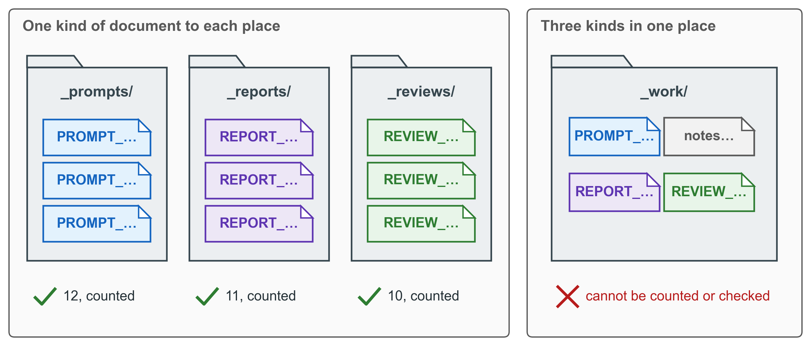

*Figure 3. One place for each kind of document. Because each folder holds one kind, anyone can count what was commissioned, what came back and what was judged.*

## 2.5 The five duties of the orchestrator

The orchestrator has five duties. Each one prevents a failure that is easy to name.

| Duty | What it means | What goes wrong without it |
|---|---|---|
| Keep the work moving in order | No instruction reaches you before its first entry stands in the log. Only one piece of work writes at a time in any one body of work. The order of the pieces is written down. | Two pieces of work run without knowing of each other, and one overwrites the other's result. The order of the work lives in a conversation and ends with it. |
| Report where the work stands from the records | The statement of where the work stands is produced from the files. It is never written from memory. | A memory is repeated as a fact, and people who were not there quote it. |
| Keep the trace | Each instruction names the document it uses and the report it will produce. Each report names the instruction it answers. The two must agree. | A report is read as the answer to an instruction it does not answer. Nobody can follow a document back to the instruction that asked for it. |
| Keep the direction | Each instruction says, in one line, which deliverable or date it serves. An instruction that serves nothing is not written. | Correct and careful work that serves nothing the project owes. |
| Keep the record durable | One source for each document, in the place that names its kind, saved in the project's history and copied to a second machine. | Two files for one document, no way to see what changed, and work lost with the one machine that held it. |

Chapter 6 says more about the second and the fifth duty.

## 2.6 What the orchestrator refuses

The orchestrator refuses ten things. It states each refusal plainly: the condition that caused it, and what it wrote instead. It refuses:

1. to answer when one of the five conditions of chapter 3 holds;
2. to carry out an instruction it wrote;
3. to judge work it commissioned;
4. to write anything outside its own records;
5. to leave a decision open after the piece of work that raised it;
6. to write a second instruction for work that already has one;
7. to let an instruction wait, not carried out, for more than a day, with nothing in the record saying why;
8. to issue an instruction that does not name the model and the reason;
9. to hand over the role without writing the handover note, and to act on a claim it inherited without checking it;
10. to hold the role before its first entry, "taken up", stands in the log.

## 2.7 How a decision is closed

No decision is left open. None is sent to you as a list of questions. The orchestrator closes each decision by exactly one of four routes:

1. **It answers from a document already in force.** It names the document and does not restate it.
2. **It makes the decision a named setting** with an owner, to be given a value later.
3. **It takes the recommendation** and marks it to be tested. This is the default, unless the work itself shows that the recommendation is wrong.
4. **It records the decision as a consequence for another document**, which then carries it.

## 2.8 What reaches you

A decision reaches you only when there is something finished to look at: working software or a finished document. It reaches you as a short paper that makes a recommendation.

Four kinds of decision are always yours:

- what the project delivers;
- what is cut;
- what money is spent;
- what is said to people outside the project, such as the minister or a development partner.

The reason is balance. If every open question came to you, you would spend your time on questions that the documents already answer. If none came to you, the assistant would decide things that are not its to decide.

# 3. When to use it, and when not

## 3.1 Why "this is complex" is not the test

You might think: use the Orchestrator for complex work, and answer simple questions directly. That test does not work. A party cannot measure the difficulty of its own work. From the inside, every question looks easy to answer.

So the test is a set of conditions that anyone can observe. The orchestrator checks them on itself before it answers anything.

## 3.2 The five conditions

If any one of these conditions holds, the orchestrator does not answer. It writes an instruction instead, and it tells you in one line which condition held.

1. **Too much to read.** The answer would need more than three documents to be read, or a list made of any body of material other than the orchestrator's own records. *Example: "Which district returns report no connectivity data?" needs every district return to be read.*
2. **A lasting document.** The answer would be a document that another reader relies on: a design, a plan, a set of slides, a formal document or an assessment. *Example: the target architecture for the single learner record.*
3. **A figure that will be quoted.** The answer carries a number that someone will repeat later. *Example: the cost of the National Learner Registry over three years.*
4. **A change to a file.** Something would be written outside the orchestrator's own records. *Example: correcting a table in the draft roadmap.*
5. **Evidence it cannot see.** The answer needs a server, a data store, a running screen or a build. *Example: whether the registration service accepts an application on the test platform.*

The number three in the first condition is a named setting. Section 6.8 explains why.

## 3.3 The rule above the conditions

Beside the five conditions stands the rule of chapter 2: a session never carries out, and never judges, work that it commissioned itself. This rule needs no judgement. It always holds.

## 3.4 The counter-rule: when not to write an instruction

An instruction written for a question that one reading would settle is waste. It costs as much as an answer that should have been commissioned. So no instruction is written in three cases:

1. **One check that changes nothing settles the matter.** The orchestrator runs the check, says what it ran and when, and stops.
2. **The act is part of the orchestrator's own record.** Writing an instruction, or an entry in the log, is an example.
3. **An instruction for the same act is already waiting.**

**An instruction, once written, is carried out or withdrawn the same day.** To withdraw it, the orchestrator writes one entry in the log with the outcome *withdrawn* and the reason. The program counts "the same day" as 24 hours from the moment the instruction was last issued. If no session has started on it by then, the check of the log names it as *uncarried*.

## 3.5 How a refusal reads

When a condition holds, the orchestrator says so plainly. A refusal reads like this:

> I am not answering this. Condition 2 holds: the answer would be a target architecture that other readers rely on. I have written the instruction instead, `_prompts/PROMPT_TARGET_learner-record_2026-11-02.md`, and its first entry is in the log. It names Fable, because the question has two real positions and the work must be free to settle it against both you and me, the orchestrator. It names the reviewing session and the tests of success. The instruction is carried out or withdrawn today.

Figure 4 shows the whole decision, in the order in which the orchestrator checks it.

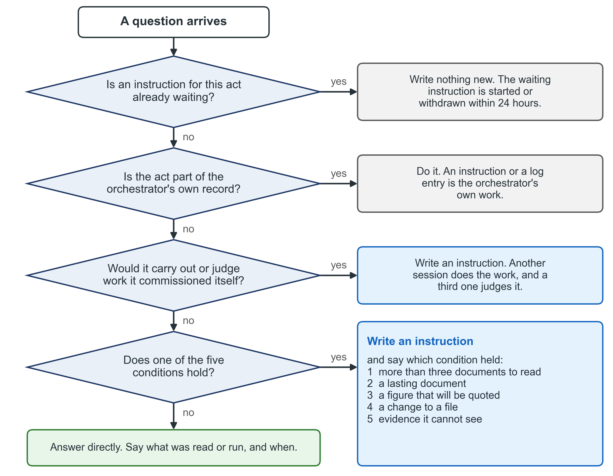

*Figure 4. Answer, or write an instruction. Three questions come first: is an instruction for the act already waiting, is the act the orchestrator's own record, and would the orchestrator carry out or judge its own commission. Then come the five conditions. Only a question that meets none of them is answered directly.*

## 3.6 When you need no orchestrator at all

The five conditions are the test. If none of them ever holds in your work, you do not need an orchestrator. A single question with a quick answer from one reading needs only the assistant.

You need the Orchestrator when the work runs over several days, leaves lasting documents, carries figures that others will quote, or changes files that other people depend on. The work of all four Knowledge Products is of this kind: a context pack, a target architecture, a decree, a gap register, a roadmap and the design of a service are all lasting documents.

# 4. The life of one piece of work

## 4.1 From the first question to the verdict, in nine steps

One piece of work passes through nine steps. Each step has a reason, and each one prevents a failure.

1. **Size the question.** The orchestrator finds out what is already known, and the cheapest way to an answer. Reading in order to size the question is part of its role. *Without this step, a working session spends a whole round finding what one file would have shown.*
2. **Decide: answer, or write an instruction.** The orchestrator checks the five conditions of chapter 3. If one holds, it says which.
3. **Write the instruction** from the instruction form. One instruction covers one task with clear limits. Section 4.2 lists what it contains.
4. **Write the "issued" entry** in the log. This happens when the instruction is complete, and before you receive its start message. The program takes everything in the entry from the instruction's declaration; nobody writes it by hand. *Without it, nobody can see the work between the moment the instruction is written and the moment a session starts, and in that time two pieces of work can write the same file.*
5. **You start the working session.** The orchestrator gives you the instruction file and its start message: two lines that you paste into a new session. The orchestrator does not start sessions itself.
6. **The report arrives** in the place for reports. The working session's last act is its "finished" entry in the log, which names the report.
7. **Compare the two declarations.** The instruction names the report it expects, and the report names the instruction it answers. A difference, a missing file, or a declaration that names no file is settled before any test is read.
8. **Send the report for review.** The reviewing party was named in the instruction when the instruction was written. The review has its own instruction, and that instruction is a task like any other: its "issued" entry is written before you receive its start message.
9. **Act on the verdict**, with one entry in the log. The verdict belongs to the review. The orchestrator does not write a verdict.

Figure 5 shows the nine steps, with the party that acts at each one and what passes between them.

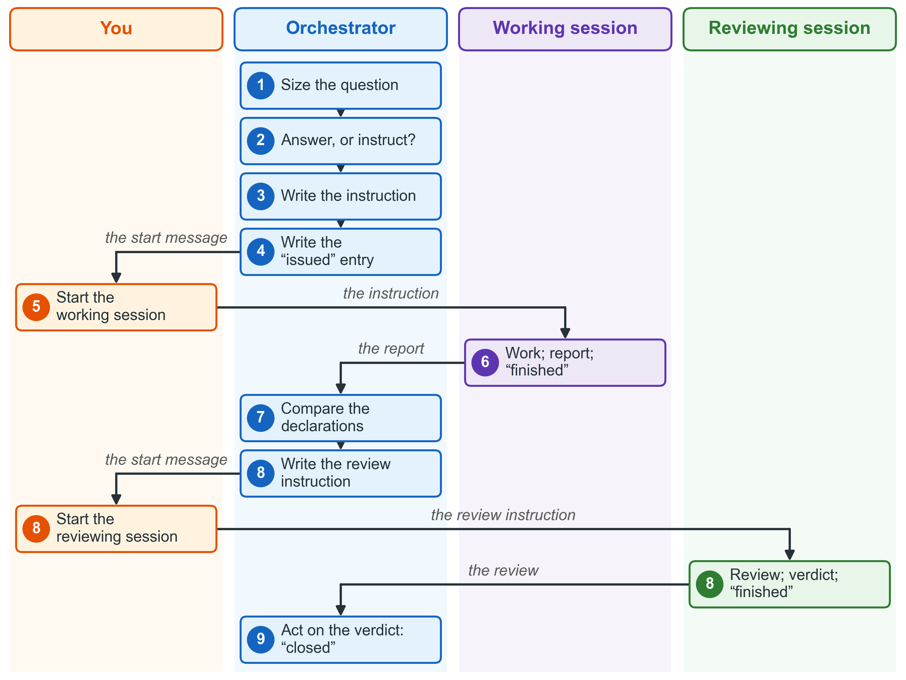

*Figure 5. The life of one piece of work. Each party acts only in its own row, every hand-over between parties is a document, and you start both sessions.*

## 4.2 What an instruction contains

An instruction begins with its declaration. The table explains each line.

| Line | What it says | Why it is there |
|---|---|---|
| `kind` | `instruction` | The kind is what the folder is named for. |
| `commission_id` | The identifier of this piece of work | One piece of work has one identifier. A second attempt is the next version, never a new identifier. |
| `version` | 1 at first, raised for each next version | The log takes the version from this line and from nowhere else. |
| `session_name` | The name of the session that will do the work | You can see in your list of sessions which orchestrator a session belongs to (section 6.6). |
| `upstream_artefact` | The document the work uses, or `none` | One half of the trace. |
| `downstream_artefact` | The report the work will produce | The other half of the trace. The report must name this instruction in return. |
| `serves` | The one deliverable or date that the work serves | Work that serves nothing is not commissioned. |
| `model` | The kind of model, and the reason | Chapter 5. |
| `effort` | The effort level, and the reason | Chapter 5. |
| `reviewer` | Who will review the report, with its model and effort level | It is chosen now, not when the report arrives. |
| `outputs` | Every output, by path, each in the place that names its kind | The checks read these paths. A report is never sent to the place for instructions. |
| `running_record` | The orchestrator's code, and a statement that the "issued" entry is written from this declaration | The working session learns from this line that it writes its own entries in the log. |

Six lines are required: `session_name`, `serves`, `model`, `effort`, `reviewer` and `outputs`. An instruction without one of them is refused before it is issued.

This is a declaration from the KP3 example of chapter 8:

```text
kind: instruction
commission_id: DPI-C-031
version: 1
session_name: DPI · work · gap register
upstream_artefact: my-project/work/domain-reports-accepted.md
downstream_artefact: my-project/_reports/REPORT_GAPS_2026-11-10.md
serves: the prioritisation workshop of 26 November 2026
model: Opus — the rule of priority settles the content; the risk is a wrong score
effort: high — fourteen gaps, three ratings each, every gap traced to its findings
reviewer: a separate session started from the review form; Opus, effort high
outputs: my-project/work/gap-register.md · my-project/_reports/REPORT_GAPS_2026-11-10.md
running_record: DPI — the issued entry is written in the log from this declaration
```

After the declaration and the start message come nine sections: the role and where to run; what to read first; the task; the constraints; the tests of success; the evidence required; how this piece of work can fail; what is out of scope; and the report.

**The tests of success.** Each test can be checked by a command or a reading that a stranger could carry out. "It works" is not a test. Two tests appear in every instruction. The first: the outputs are in the places named, and the report answers this instruction. The second: the log shows the entries of this task.

**How this piece of work can fail.** Each instruction names the two or three ways that this particular work can go wrong while it seems to succeed: a clause misread, half of the material covered, a check that passes for the wrong reason. It is not a general warning.

**Out of scope.** The instruction names what the session must not touch. Anything the session finds but was not asked for goes into its report, under "found, not fixed". It does not go into the work.

## 4.3 The start message

The start message has two lines. The first line is the session's name. The second line names the instruction file by its full path. Nothing else goes in it. The instruction is the file, not the message.

```text
DPI · work · gap register
Carry out the instruction at /path/to/my-project/_prompts/PROMPT_GAPS_2026-11-10.md
```

Here `/path/to/my-project` stands for the full path of your own project folder. The path is given in full so that the session finds the file wherever it starts.

The assistant takes a new session's name from its first message. This is why the name comes first. If the name the session receives does not begin with the code, rename the session to the first line of the start message.

## 4.4 What a report contains

The report also begins with a declaration. It names the instruction it answers, the review that will judge it, the kind of session that wrote it, the time window of its work, and every output with its size and its checksum. A checksum is a short code worked out from the content of a file. If the file changes, the code changes. So the reviewer can be sure that it reads the same file the report describes.

The body of the report has seven parts:

1. **The answer first.** What was done and what it comes to, in one paragraph, before any evidence.
2. **The tests, one by one.** For each test: the test as written, the command as run, its output and the time, and whether it was met. A partial result is *not met*, with the reason.
3. **Found, not fixed.** Everything the session saw outside its task, one line each. Nothing here was repaired. These lines become candidate instructions.
4. **What could not be established**, and what it would take to establish it. To stop early and say so is worth more than work that claims to be complete when it is not.
5. **Corrections to the instruction.** A figure that had changed, a test that could not be met as written, a path that had moved.
6. **What was not finished**, and where the next round begins.
7. **The outputs, shown.** The session opens your file manager at each place it wrote in. The command fails on a path that does not exist, so this act also proves that the output is where the report says.

A report states no figure from memory. Each figure comes with the command that produced it and the time. It claims nothing wider than the command shows.

## 4.5 What a review contains

A review is a check, not a reading. A reading says whether the report is convincing. Only a check catches a report that is wrong and consistent with itself. That is the failure the third party exists for.

The review does five things, in this order:

1. **The tests, one by one.** For each test: was it met, and on what evidence? The report's statement that a test was met is not evidence.
2. **One figure worked out again.** At least one figure of the report is worked out again, by a route the report did not use. If the two results differ, the difference is the finding.
3. **The outputs exist.** Every output the report names is looked for at its path, at the size the report claims.
4. **The checks that programs make.** The trace check compares the instruction and the report. The placement check looks at whether each output is in the place that names its kind. The log is read for this task. A task with no "started" or no "finished" entry fails the test on the log, and the verdict is *not accepted*.
5. **The verdict, and what follows from it.**

Two of these checks, the trace check and the placement check, are named in the Orchestrator's rules, but their programs are not yet written. Until they exist, the instruction says that the check is named and could not be run, and the report records that absence. A check that cannot run is a failure. It is never a pass.

## 4.6 What follows each verdict

**Accepted.** The orchestrator writes one "closed" entry with the outcome *accepted* for the review. The review names the working task as its subject, so this one entry closes both tasks. If the work is one part of a longer delivery, the review writes the row for this part in the record of that delivery. The next part is then commissioned from what this part actually produced, not from what it was asked to produce. The lines under "found, not fixed" become candidate instructions.

**Not accepted.** The gaps that the review names are added to the original instruction as its next version. The orchestrator raises the version number in the same act. The next "issued" entry names the review as its subject, and this records that the verdict was acted on. No second instruction is written for the same act: one act with two identifiers cannot be counted. The second attempt goes back to the same reviewing party, which has already read the first attempt. The working task stays open, and nothing new is built on it yet.

**Not accepted twice: the task is defined again.** After two rounds that are not accepted, the instruction is withdrawn and the work is defined again. At that point the definition of the task, not the session that tried it, is usually what is wrong. The orchestrator writes one "closed" entry with the outcome *re-scoped*. It names the instruction that takes the work up, if that instruction already exists.

**In no case does the orchestrator repair the work itself.** When a fix would need a file to be written, nothing is fixed. The next instruction is written instead.

Figure 6 shows the three outcomes side by side.

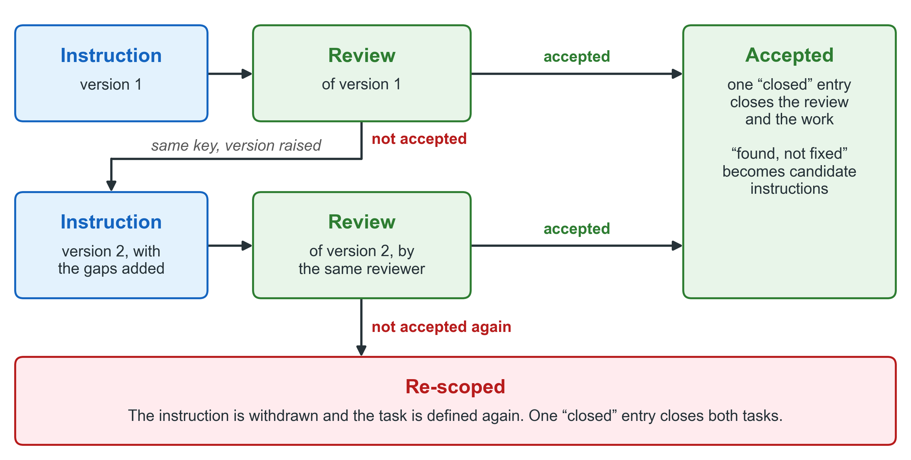

*Figure 6. What follows each verdict. An accepted task is closed in one entry; a task not accepted returns, with its gaps, to the same reviewer; after two such rounds the task is defined again.*

## 4.7 Changing an instruction

**Before any session has started on it,** an instruction may be changed. It is then issued again under the same identifier and version, so the log shows that it changed and when.

**After a session has started on it,** the instruction is not changed at all. The orchestrator closes it as *withdrawn*, issues the change as its next version, and tells the running session nothing. A session whose instruction changes while it works would carry out half of one version and half of the other.

## 4.8 One piece of work writes at a time

A *body of work* is the set of files that a task will write. The instruction names them in its outputs. Two tasks whose outputs name the same file, or a folder and a file inside it, are in one body of work. While the first of them runs, the second does not write.

For every task that is waiting to start, the program says one of three things: it can start now; it must not start together with another task; or it waits for a task that is running.

Figure 7 shows how the program decides which task may start.

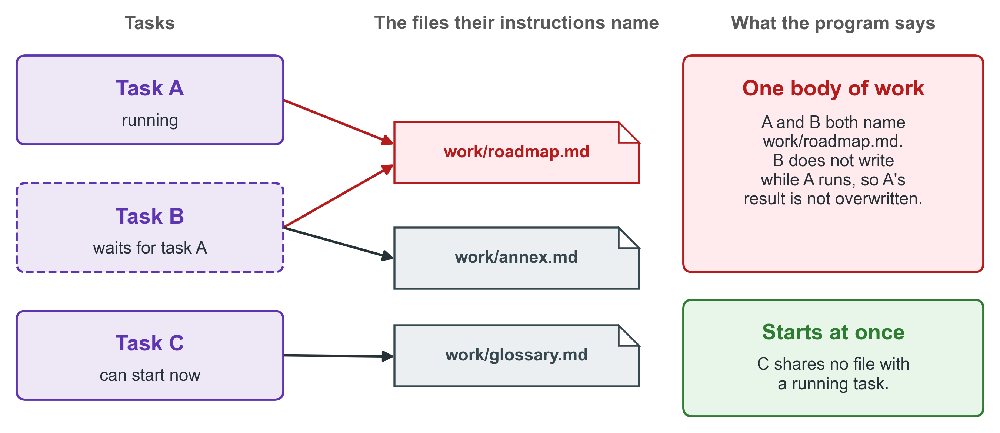

*Figure 7. Two tasks that name the same file are one body of work. The second task waits, so the first task's result is not overwritten; a task that shares no file starts at once.*

# 5. Choosing who does the work

## 5.1 Three kinds of work

Every instruction names the model that should do the work, and the reason. The choice does not depend on how important the subject is. It depends on the kind of work. There are three kinds.

| Kind of work | What the work is | How success is tested | Present example with Claude | Usual effort |
|---|---|---|---|---|
| **Mechanical** | Work that leaves no room for judgement | A mechanical check | Sonnet | medium |
| **Exact** | The content is already settled by a document, but there is a large amount to write. The risk is a mistake in the detail, not a wrong judgement. | A full reading against a written test, or a careful build against a standard that someone else wrote | Opus | high |
| **Open judgement** | The question is truly open. It has real rival answers, and it is hard to reverse once decided. The work must be free to reach a conclusion that contradicts both you and the orchestrator. | No mechanical test. The rival answers, and the ground for the conclusion, are the evidence | Fable | max |

## 5.2 Point at something

The kind of work is chosen by pointing at something that exists. The orchestrator asks three questions, in this order.

1. **Can you point at the check that decides whether the work succeeded, and would running that check settle the matter?** Then the work is mechanical.
2. **Can you point at the document that already settles the content, so that what remains is to write it out exactly?** Then the work is exact.
3. **Can you point at a real disagreement: two positions, each with a case, which the work must be free to settle against both you and the orchestrator?** Then the work is open judgement.

If no question can be answered by pointing at something, the question has not been sized yet. Sizing it is the next act, not naming a model.

Figure 8 shows the three questions in their order.

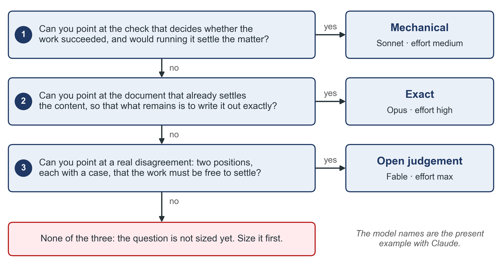

*Figure 8. Three questions, asked in order, point at the kind of work. The first question that can be answered by pointing at something decides the kind; if none can, the question is sized first.*

## 5.3 The kind of work, never the importance of the subject

An important subject whose content is settled is exact work. It is not open judgement. To give it the strongest model because it matters is the most common error, and this rule exists to prevent it.

Take the minister's briefing on the National Learner Registry. It matters a great deal. But its content is settled by the business case that was already accepted. What remains is to write it out exactly, so the work is exact. A small question about which identifier the registry uses for a learner may look modest. But it has two real positions and is hard to reverse, so it is open judgement.

Figure 9 shows that each kind of work can come with a modest subject or with an important one.

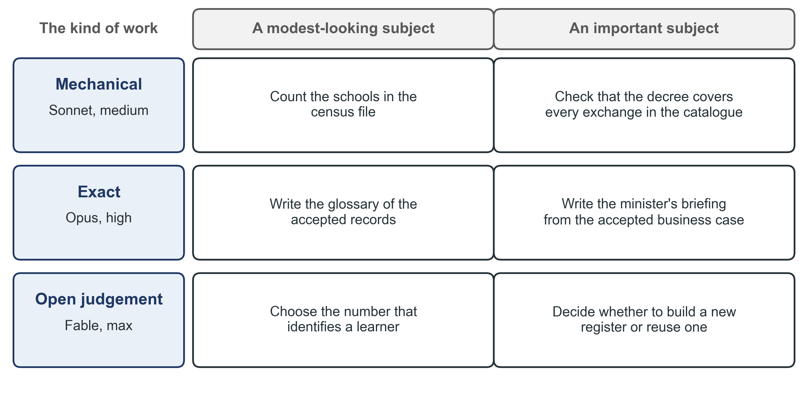

*Figure 9. The kind of work follows the work, not the importance of the subject. An important briefing whose content is settled is exact work; a modest-looking question with two real positions is open judgement.*

## 5.4 If you use another assistant

The model names in this manual are the present example with Claude. The rule is about the kind of work, so it works with any assistant. Match each kind to the model your tool offers for it:

- for **mechanical** work, a fast model that follows instructions exactly;
- for **exact** work, a careful model that writes long documents precisely;
- for **open judgement**, the strongest reasoning model your tool offers.

Model names change from year to year. The three questions of section 5.2 do not.

## 5.5 The effort level

Every instruction also names the effort level at which the model should run, with its reason. The effort level says how long and how carefully the model works before it answers. There are five levels: *low*, *medium*, *high*, *xhigh* (extra high) and *max*.

The level is chosen for the task, not for the kind of work. The usual starting points are *medium* for mechanical work, *high* for exact work and *max* for open judgement. The orchestrator then moves the level up or down for the size and the risk of the particular task. A mechanical check over thousands of rows may need *high*. A short piece of exact work may need only *medium*.

The reviewer's line in the instruction names the reviewer's own model and its own effort level in the same way.

## 5.6 Work in stages

Some work runs in stages. The first stage might be a draft, and a later stage a full build. In that case, the instruction names the model for the stage that will actually run now. It names separately the model that the later stage would need, if that stage is commissioned.

## 5.7 The naming is advice

You start every session, so the choice of model at the moment of starting stays yours. This is why the instruction names the model as a recommendation, with its reason, and not as a fixed setting.

# 6. The record

## 6.1 Status is produced, never remembered

In every project, someone asks: where does the work stand? The answer is never written from memory. It is produced from the records each time it is asked.

The reason is the second failure of chapter 1. A statement of status written from memory is repeated afterwards as a fact. People who were not there quote it. When it is wrong, nobody can find where the error came from. A statement produced from the records can be produced again, by anyone, and it gives the same answer.

To ask for status, type *check* in the orchestrator's session. The orchestrator then reads the log and the records, and tells you where each task stands and what to start next.

## 6.2 The event log

The event log is one folder. It holds one small text file for each event. One program writes every file in it, and nothing else writes there. No entry is ever edited or deleted. If an entry is wrong, a later entry corrects it. The program also checks the log and names every problem it finds. The program calls the log *the ledger*.

Six kinds of event in the log describe the work:

| Entry | Written by | When |
|---|---|---|
| `taken-up` | The session that takes the orchestrator's role | Before it holds the role. An incoming session writes it right after the "started" entry of its first task (section 7.5). The first orchestrator of a project writes it when it takes up the role (section 9.2) |
| `given-up` | The orchestrator that leaves the role | As its very last act, after its handover note and after it has issued its successor's first task |
| `issued` | The orchestrator | When an instruction is complete, before you receive its start message; again if it changes before any session starts on it; and for each next version |
| `started` | The working or reviewing session | First of all: once it has read the declaration of its instruction, before it reads anything else |
| `finished` | The working or reviewing session | At the very end, once its report stands and its outputs have been shown. A reviewing session states its verdict in this entry |
| `closed` | The orchestrator | When it acts on a report or a review, and when it withdraws, holds or re-scopes a task |

A "closed" entry carries one of four outcomes. *Accepted*: the review accepted the work. *Withdrawn*: the instruction will not be carried out, and the entry gives the reason. *Held*: the instruction waits because you asked for it to wait, and the entry gives the reason. *Re-scoped*: the work failed review twice and is defined again.

Figure 10 shows who writes the entries, and what is produced from them.

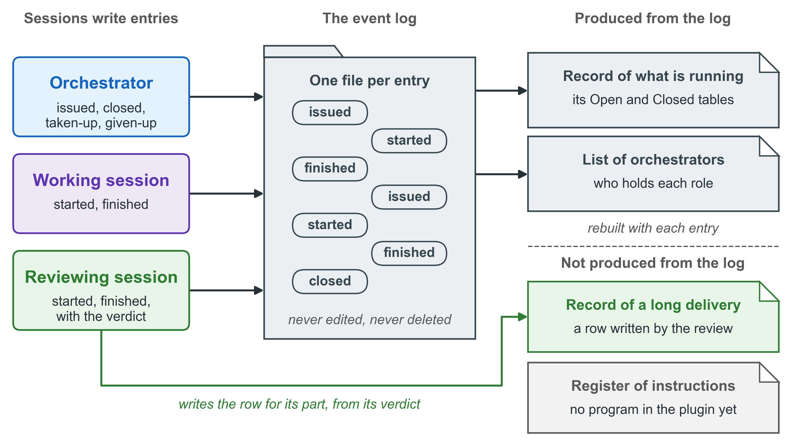

*Figure 10. The event log, and what is produced from it. Sessions write the entries, and the log program rebuilds two views from them with every entry, so two people who ask get the same answer. The record of a long delivery is written by the review, and the register of instructions has no program yet.*

## 6.3 One task in the log

A task is known by its *key*: the orchestrator's code and the instruction's identifier. Every entry of a task also carries the version it belongs to, taken from the instruction's declaration.

Whatever the program says about a task, it works out from that task's entries alone. So what is not in the log did not happen, as far as any view is concerned.

Figure 11 follows one task through the log. It is the KP4 example of chapter 8, which was not accepted at its first version.

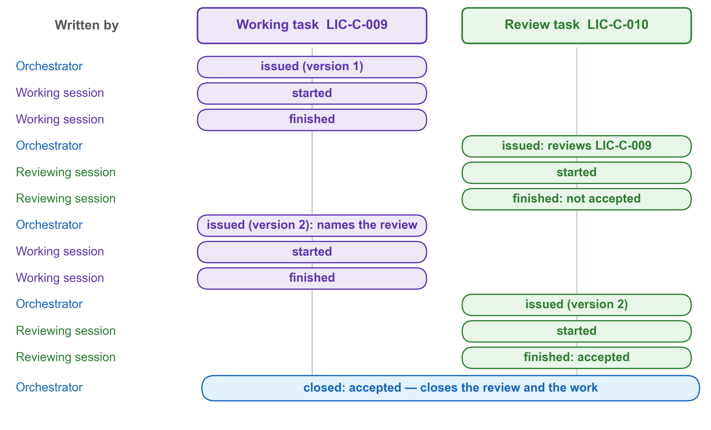

*Figure 11. One task in the log, from the first instruction to the last entry. A review that does not accept the work leads to a second version under the same key, and one "closed" entry ends both the review and the work.*

## 6.4 What is produced from the log, and what is written

The log program produces two *views* from the log. Each new entry rebuilds, in the same act, the views that it changes. Nobody writes a view by hand.

- **The record of what is running** answers one question: what is being worked on at this moment? It has two tables, Open and Closed. The program produces both tables from the log. Only the head of the record, which states its rules, and its table of held instructions are written by hand. A line that someone writes by hand inside a produced table is lost the next time the table is rebuilt. Until then, the check of the log names the table as out of date.
- **The list of orchestrators** names, for each code, the session that holds the role and since when.

Two other records belong to the work. The program produces neither of them.

- **The record of a long delivery** answers how far a larger piece of work has come. It has one row for each part, with its instruction, report, review and verdict. The review writes the row for its own part, because the verdict in that row is the review's. The orchestrator reads the record before it commissions the next part, and names its last row in the next instruction. So the next part starts from what the last part actually produced, not from what it was asked to produce. A part with no review has no verdict, and nothing is built on it.
- **The register of instructions** answers what was commissioned, and how each piece of work ended. It is named in the Orchestrator's rules, but its program is not yet part of the plugin, so nothing produces it yet. Until it is, the log holds the same facts: each instruction has its "issued" entry, and its "closed" entry says how it ended.

## 6.5 Read the record before you write

The head of the record of what is running states three rules for every session.

1. **Before you write anything, write your "started" entry.** Then read the Open table. If a task in it names a file you were going to write, you do not write it. Say so to whoever commissioned you, and stop.
2. **When you finish, or when you stop without finishing, write your "finished" entry.** Write it after your report is written and shown, and name the report in it. A task with no "finished" entry is read as work still in progress.
3. **If you change something that others depend on, say so** in the "moved" line of your "finished" entry. That line appears in the Closed table. People who depend on the project read that table to see what changed in the files they rely on. They have no other way to find out.

The Open table also shows tasks of other orchestrators whose outputs lie inside this project. So a session that reads it before writing sees every piece of work that writes where it is about to write.

## 6.6 The session name

You will soon have many sessions in your assistant's list, and several orchestrators may commission sessions at the same time. The only thing in the list that tells you which orchestrator a session belongs to is its name. So every session started from an instruction carries the orchestrator's code at the front of its name.

The name has three parts, separated by a middle dot (·):

1. **the code**: the capital letters that begin the orchestrator's own session name, written once in the project's constants file;
2. **the kind of session**: *work* for a working session, *review* for a reviewing session, *orchestrator* for a session that takes up the orchestrator's role;
3. **the task, in a few plain words**: the same words for a working session and for the session that reviews its report.

For example, `DPI · work · gap register` and `DPI · review · gap register`. The code comes first because the list cuts long names off at the end, and the code must survive the cut.

Figure 12 shows the three parts of a name, and why the code comes first.

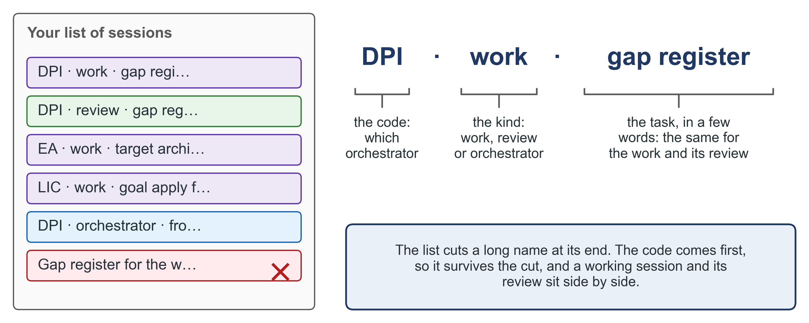

*Figure 12. The session name, and why the code comes first. The list of sessions cuts a long name at its end, so the code survives and the working session and its review sit side by side.*

## 6.7 A session that cannot reach the log

A session may run where it cannot reach the folder of the log, for example on another machine. It then writes its entries when it can reach the log again, and gives the moment of each act as it happened. Its report states that the log could not be reached, and from when.

If the session never reaches the log, the orchestrator writes the entries on its behalf. Each such entry names the session it was written for. Nobody asks the session to do anything, and the session asks nobody.

## 6.8 The two named settings

Two numbers in the rules are held as *named settings*. A named setting has an owner, a present value that anyone can read, and a record of what it was before. You are the owner of both.

| Setting | Present value | What it is |
|---|---|---|
| The reading limit | 3 documents | The number in the first of the five conditions (section 3.2) |
| The waiting limit | 24 hours | How long an instruction may wait, issued and not started, before the check of the log names it as uncarried (section 3.4) |

A number written inside a rule cannot change without changing the rule. Then nobody can tell, from the history of the rule, which change was a new rule and which was a new number. So the number is held apart. It changes when experience shows that the limit belongs elsewhere. It does not change because one question feels large.

The waiting limit is counted in hours, not in calendar days, for a practical reason. Instructions are written at every hour. A calendar day would call an instruction overdue when it is twenty minutes old, just because midnight passed. The count starts again each time an instruction is issued again. An instruction closed as withdrawn or held is never uncarried.

## 6.9 A durable record

The fifth duty of chapter 2, keeping the record durable, has five parts.

1. **One source for each document.** Every document has exactly one source, and that source is what the project's history keeps. The source is in a form where a change can be seen line by line: text as plain text with simple marks for headings, tables as text with separators, and a figure as the program that draws it. A file that cannot be compared line by line, such as a Word file or a picture, is one of two things. Either it is a build: it is made from its source and never edited by hand. Or it is truly a source, such as the scan of a signed letter or a photograph, and it is then named as an exception. *Without this, two files exist for one document, and nobody can see what changed between two versions.*
2. **Each thing in the place that names its kind.** Every instruction names, by path, where its outputs go. A check looks only at the files that one piece of work produced. It reports what it finds, and it never stops the work. *Without this, a folder holds three kinds of thing under one name, and nothing in it can be counted or checked.*
3. **Saved in the project's history, and copied to a second machine.** The project's history is called version control: each saved change is a *commit*, and copying the history to a second machine is a *push*. Work is delivered when it is pushed, not when it is written. Saving and copying are your acts. The orchestrator's duty is to show you the gap between what is written and what is pushed, and to refuse to call the work delivered while that gap exists. *Without this, work that reached one disk is reported as delivered and is lost with that machine.*
4. **A document for a reader outside the project is a build, never a source.** It is written in plain professional language, without paths, file names or other details of the work. It is built from its source, and every correction goes into the source. Internal records, such as instructions, reports and reviews, keep their paths and commands, because the work needs them.
5. **What is saved, and what is not.** A Word file made only for review, and not sent, is not saved in the history: it can be built again from its source. A file that has been sent to someone is saved, unchanged, as the record of what was sent, under a name that says when and to whom.

This manual follows these rules. Its source is a text file, each figure is drawn by a program, and the Word file is built from them.

# 7. Handing over the role

## 7.1 When the role should change hands

An orchestrator session does not show clearly when it starts to fail. It fails in one particular way. It begins to quote figures it worked out earlier, instead of working them out again. It loses the ability to tell what it read from what it guessed.

So the signal is a refusal. **When the orchestrator finds that it cannot work out again something it believes it knows, it says so and proposes its own retirement.** You decide. The orchestrator is obliged to raise the matter.

## 7.2 The handover note

Before it stops, the outgoing orchestrator writes a handover note. The note carries only what the records cannot produce. That is three kinds of thing:

1. **What it did that it should not have done.** Anything it carried out, judged, wrote outside its records or decided when the decision was not its own. Each line names the file it touched and when. So nothing reaches the successor without the name of the session that did it. If there is nothing, the note says "nothing", and the successor checks that claim too.
2. **What is owed.** Work it undertook and did not do. Judgements it made that it now believes are wrong. Corrections it found and did not make.
3. **Findings that appear in no report.** Things it saw in passing that no instruction, report or review records.

The note refuses three things, and it has no place to put them:

- **a figure**, because the successor works out every figure again, with the command and the time;
- **a survey of the state of the work**, because the state of the work is produced from the log, and a written survey is out of date on the day it is written;
- **a story of the work**, because the instructions, reports and reviews are the record of what happened.

**Every line of the note is a claim.** The successor checks it before acting on it. Nothing in the note is inherited as a fact.

```text
HANDOVER — the education DPI roadmap (code DPI)

1. What this session did that it should not have done
   - [claim] On 12 November it corrected a typing error in the draft
     roadmap itself, instead of writing an instruction for it.
     File: work/roadmap.md, section 3.

2. What is owed
   - [claim] The investment case (step 8 of the roadmap method) is not
     yet commissioned.

3. Findings that appear in no report
   - [claim] Two provinces send their district returns with an older
     school code. Seen in the assessment files on 6 November.

Claims for the successor to check
  1  The correction in section 3 is the only one   -> the history of work/roadmap.md
  2  No instruction exists for the investment case -> the log, and _prompts/
  3  Two provinces use the older school code       -> the district returns
```

## 7.3 The first task of the incoming session

A session that takes over the role with an open first task tends to do too much. It reads everything, writes a survey of the whole project, and acts on what it inherited without checking it. The role needs something smaller first: check a few claims, and stop. So the incoming session's first act is itself an instruction, with clear limits, a rule for when to stop and a test of success. Its purpose is to check, not to survey. It reads the constants file, produces the state of the work from the log, checks a small number of the outgoing session's claims, named in the task, and stops. Before any of that, right after the task's "started" entry, it writes its "taken-up" entry. Only then does it hold the role.

## 7.4 Who writes the first task

The outgoing session writes the first task, from a fixed form that it does not change. The form is part of the tool and is the same every time, except for the list of claims to check. The outgoing session fills in that list from its handover note.

The incoming session cannot write the task, because it does not know the work yet. And because everything in the form is fixed except the claims, the outgoing session cannot shape its own handover by writing the task.

The list names only the handful of claims whose falsity would most change what the successor does. A list of everything is a list that nobody checks.

## 7.5 How the change of hands is recorded

The change of hands is recorded by two entries in the log, so that it is never invisible.

1. The outgoing session writes its handover note.
2. It writes its successor's first task from the fixed form, with the list of claims.
3. It writes the "issued" entry of that task.
4. As its very last act, it writes its "given-up" entry. The entry names the note and the session name the successor will start under, such as `DPI · orchestrator · from 14 November`.
5. You start the incoming session with the task's start message.
6. The incoming session writes the task's "started" entry, then its own "taken-up" entry, which names its predecessor, the note and the task.

If the outgoing session is gone without a "given-up" entry, for example because its conversation was closed, the incoming session writes that entry on its behalf. It does this only when you tell it to, it records the date you gave, and it does it before its own "taken-up" entry. If two sessions hold the same code with no "given-up" between them, the check of the log names the problem, and the program refuses the second "taken-up".

Figure 13 shows the change of hands, act by act.

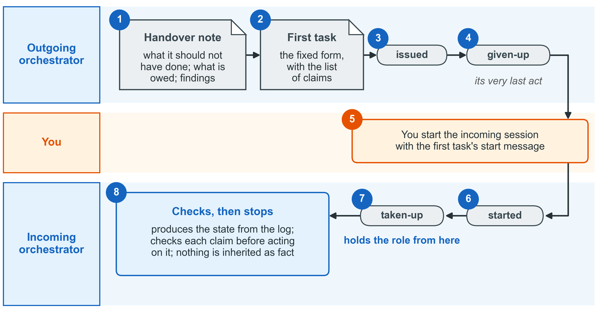

*Figure 13. Handing over the role. The outgoing session writes the note and the bounded first task, then gives up the role; the incoming session holds the role only after its "taken-up" entry, and checks the claims before it acts on them.*

## 7.6 What the note is not

The handover note is the orchestrator's own record. It is filed with the project's records. It is not a fourth kind of document, and the three places, one kind to each, stay as they are.

# 8. Worked examples in Progressa

This chapter gives one worked example for each Knowledge Product. Each example is a piece of work that the Knowledge Product itself asks of you. Each one shows four things:

- the decision of chapter 3: which condition held, so that the orchestrator wrote an instruction instead of answering;
- the choice of chapter 5: which question pointed at the kind of work;
- the instruction, the report and the review, in miniature;
- what followed the verdict.

The facts about Progressa come from the shared context pack of the Knowledge Products. Every name, date and figure is invented. Each example uses its own orchestrator code, because each piece of work belongs to a different team.

## 8.1 KP1: the target architecture for the single learner record

**The situation.** The architecture unit of Progressa's Digital Government Authority (PDGA) works with the ICT Director of MoEYS. Their assessment of the education sector is accepted. They have ranked the gaps, adopted their principles and decided how each shared platform is obtained: built, bought or shared. They are now at the fourth phase of the KP1 lifecycle, *Plan*: they must design the target architecture. The minister's flagship is "one learner, one record": a single record that follows a child from primary school to university.

One question in the design is open. What identifies a learner in the new register? The Progressa National Identity Authority (PNIA) issues national identity numbers only at the age of 16. Birth registration covers 71 per cent of children, and the Civil Registration Act makes birth registration the legal anchor of a child's identity.

**The question, as it came to the orchestrator.** The ICT Director wrote: "Draft the target architecture for the single learner record. Should we key the register on the birth registration number?"

**The decision.** The orchestrator did not answer. Two conditions held:

> I am not answering this. Condition 1 holds: the answer needs the ranked gaps, the adopted principles, the sourcing decisions and the context pack, which is more than three documents. Condition 2 holds: a target architecture is a lasting document that the Enterprise Architecture Board will rely on. I have written the instruction instead, and its first entry is in the log.

**Who does the work.** The first question finds no check that could settle the matter. The second finds no document that already settles the content. The third question points at a real disagreement, with a case on each side:

- **Position A:** key the register on the birth registration number. It is the legal anchor of a child's identity. The Director prefers it.
- **Position B:** the register issues its own learner number at first enrolment. It records the birth registration number where one exists, and links the national identity number at 16.

The choice is hard to reverse once schools start to enrol learners. So the work is open judgement: Fable, at effort *max*. The reviewer reads the design against the context pack and the KP1 method, which is exact work: Opus, effort *high*.

**The instruction, in miniature.**

```text
kind: instruction
commission_id: EA-C-014
version: 1
session_name: EA · work · target architecture for the learner record
upstream_artefact: my-project/work/ranked-gaps-accepted.md
downstream_artefact: my-project/_reports/REPORT_TARGET_2026-11-02.md
serves: the target architecture for the EA Board of 20 November 2026
model: Fable — two real positions on the learner's identifier; the work must weigh both
effort: max — open judgement, hard to reverse once schools enrol learners
reviewer: a separate session started from the review form; Opus, effort high
outputs: my-project/work/architecture.md · my-project/_reports/REPORT_TARGET_2026-11-02.md

THE TASK
Write the target architecture for the single learner record, in the four
layers of KP1: business, data, application and technology. Settle what
identifies a learner in the register.

TESTS OF SUCCESS
T1  Both positions are stated, each with its case.
T2  The conclusion gives its ground, and says what it would take to reverse it.
T3  Every fact about Progressa names its place in the context pack.
T4  Each of the four layers is covered, and every element traces back to
    the gap it closes and forward to its sourcing: build, buy or share.
T5  A first-cut integration map names each exchange with PNIA, the
    examinations authority and civil registration, for the KP2 work.
```

**The report, in miniature.**

> **The answer first.** The register issues its own learner number at first enrolment. It records the birth registration number where one exists, and links the national identity number when the learner reaches 16. The ground: 29 children in every 100 have no birth registration. A register keyed on that number would hold no record for them, and the promise of one learner, one record would fail for those children. Position A is kept as the rule for linking records, not as the key. This conclusion differs from the Director's stated preference. To reverse it, birth registration would need to reach nearly every child.
>
> **Found, not fixed.** The Data Protection Act needs a legal basis for sharing a minor's data. No instrument names one for the register. This belongs to the legal work of KP2.

**The review, in miniature.**

> **Verdict: accepted.** T1 to T5 are met; each is shown with the passage of the design that meets it. **One figure worked out again:** the report took the age of 16, at which PNIA first issues an identity number, from the section of the context pack on the operating-model question. The review took it from the table of laws and policies instead. Both give 16. **Outputs:** both files exist at the sizes the report gives. **The log:** the "issued", "started" and "finished" entries of the task stand.

**What followed.** The orchestrator wrote one "closed" entry, *accepted*. The decision itself is still the Director's: she takes the design to the Enterprise Architecture Board. The finding on the legal basis became a candidate instruction for the KP2 team.

Figure 14 sums up the KP1 example.

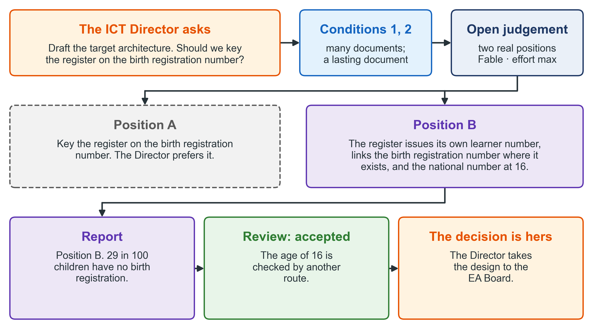

*Figure 14. The KP1 example. Two conditions held, the third question pointed at a real disagreement, and the accepted design differs from the preference of the person who asked; the decision on it stays hers.*

## 8.2 KP2: the draft decree checked against the use-case catalogue

**The situation.** PDGA's interoperability team works with the legal officer of MoEYS on the interoperability decree. KP2 teaches that the finished decree must authorise exactly the exchanges in the use-case catalogue. Every exchange in the catalogue needs a lawful basis in the decree, and no article may reach beyond the catalogue. Progressa's catalogue lists six exchanges, and the first wave carries rows 1 to 3:

1. PNIA to the Examinations Authority (PNEA): a candidate's identity;
2. the Progressa Learner Registry (PLR) to PNEA: a learner's enrolment;
3. PNEA to MoEYS: examination results;
4. Civil Registration to schools: the facts of a child's birth;
5. PLR to the Social Protection Agency: enrolment;
6. the social register to MoEYS: a family's eligibility.

Three articles of the draft decree matter here. Article 3 obliges every public body that holds a base registry to connect to Linkup. Article 5 lets each body listed in Annex I (PNIA, PLR, PNEA and MoEYS) obtain evidence of identity, enrolment or examination results directly from the listed body that holds it. Article 6 limits each exchange to the fields listed in Annex II, which has one list for identity and one list for enrolment.

**The question, as it came to the orchestrator.** The legal officer wrote: "Does the draft decree authorise exactly the exchanges in the catalogue?"

**The decision.** This question looks like one quick check. It is not. The answer goes into the cover note that travels with the decree to the Ministry of Justice, so its counts will be quoted. And the table that answers it will travel with the decree as a lasting document.

> I am not answering this. Condition 2 holds: the table of exchanges and articles will travel with the decree. Condition 3 holds: the counts in it will be quoted in the cover note to the Ministry of Justice. I have written the instruction instead.

**Who does the work.** The first question points at a check. Make two lists: the exchanges the catalogue asks for, and the exchanges the articles allow, each written as provider, consumer and kind of data. Then compare the two lists in both directions. Running that comparison settles the matter, so the work is mechanical: Sonnet, at effort *medium*. The reviewer runs the same comparison by another route, which is also mechanical: Sonnet, effort *medium*.

**The instruction, in miniature.**

```text
kind: instruction
commission_id: GIF-C-022
version: 1
session_name: GIF · work · decree against catalogue
upstream_artefact: my-project/work/use-case-catalogue.md
downstream_artefact: my-project/_reports/REPORT_XCHECK_2026-11-06.md
serves: the cover note to the Ministry of Justice, due 15 November 2026
model: Sonnet — two lists compared both ways; the comparison settles it
effort: medium — six exchanges, three articles and two annexes
reviewer: a separate session started from the review form; Sonnet, effort medium
outputs: my-project/work/decree-check.md · my-project/_reports/REPORT_XCHECK_2026-11-06.md

THE TASK
List the exchanges the catalogue asks for and the exchanges the decree
allows, as provider, consumer and kind of data. Compare the two lists
in both directions. Change neither document.

TESTS OF SUCCESS
T1  One row for each exchange in the catalogue: the article and annex
    that allow it, or "none".
T2  One row for each exchange the articles allow: the catalogue row
    that asks for it, or "none".
T3  Each covered exchange has a field list in Annex II, or its row
    says that it has none.
T4  The counts of both lists are given, each with the command that
    produced it.
T5  Neither the decree nor the catalogue has changed: their checksums
    before and after are the same.
```

**The report, in miniature.**

> **The answer first.** The catalogue asks for six exchanges. Article 5 allows three of them: rows 1, 2 and 3. Row 3 has no field list in Annex II, so nothing limits the results PNEA sends. Rows 4, 5 and 6 are not covered, because in each of them a body is missing from Annex I. In the other direction, Article 5 allows nine exchanges: each kind of evidence may be obtained by the three other listed bodies. The catalogue asks for three of the nine. Six go beyond the catalogue. For example, PLR or MoEYS could obtain identity from PNIA, and no row asks for that.
>
> **Found, not fixed.** Article 3 binds "every public body that holds a base registry". The decree does not list those bodies, so no list can show whether the article reaches beyond the catalogue. That question is for the lawyer.

**The review, in miniature.**

> **Verdict: accepted.** T1 to T5 are met. **One figure worked out again:** the report counted the nine exchanges that Article 5 allows by listing them one by one. The review multiplied instead. Three kinds of evidence, each held by one listed body, each open to the three other listed bodies: three times three is nine. **Outputs:** the file exists at the size given. **The log:** all three entries stand.

**What followed.** The orchestrator wrote one "closed" entry, *accepted*. The gaps that the check found are the result of the work, not a fault in it. The orchestrator then wrote the next instruction: redraft Article 5 so that an annex names each allowed exchange as a pair of bodies with its data and purpose, and add a field list for examination results to Annex II. That is a formal document, so condition 2 holds again. It is exact work, because the catalogue and the decree's own pattern settle its content: Opus, at effort *high*. When the redraft is accepted, the same check runs again before the decree is filed. The lawyer still judges whether each article is lawful. The check only shows whether two documents agree.

Figure 15 sums up the KP2 example.

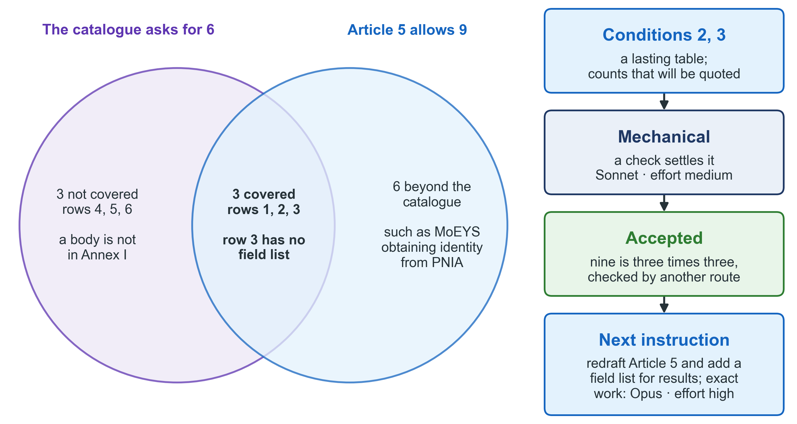

*Figure 15. The KP2 example. A question that looked like one quick check was commissioned because its counts would be quoted; the first question pointed at a check, and the gaps it found led to the next instruction.*

## 8.3 KP3: the gap register and its priorities

**The situation.** MoEYS and PDGA are writing Progressa's education roadmap with the nine steps of KP3. The five domain reports of step 5 are accepted. Step 6 turns each finding into a gap, scores each gap by the written rule of priority, and sorts the gaps into bands. The prioritisation workshop meets on 26 November.

**The question, as it came to the orchestrator.** The facilitator wrote: "Turn the findings of the five domain reports into the gap register, with scores and bands, by our rule of priority."

**The decision.** Three conditions held:

> I am not answering this. Condition 1 holds: the answer needs the five domain reports. Condition 2 holds: the roadmap of step 7 will rely on the register. Condition 3 holds: the scores and bands will be quoted at the workshop. I have written the instruction instead.

**Who does the work.** The first question finds no single check that settles it, because each gap needs a reading of its findings. The second question points at the documents that settle the content: the five domain reports, and the rule of priority. Each gap is rated from 1 to 3 on impact, urgency and feasibility, and the three ratings are added. A score of 8 or 9 is the first band, 6 or 7 the second band, and 5 or less the third band. What remains is to apply this rule exactly to fourteen gaps. So the work is exact: Opus, at effort *high*. The reviewer is also Opus, effort *high*.

**The instruction, in miniature.** Its declaration is the one shown in section 4.2. Its task and tests read:

```text
THE TASK
Turn the findings of the five domain reports into the gap register.
Score each gap by the rule of priority and place it in its band.

TESTS OF SUCCESS
T1  Every gap names the findings it comes from.
T2  Every score is the sum of three ratings from 1 to 3, checked by command.
T3  Every band follows the rule: 8-9 first, 6-7 second, 5 or less third.
T4  Inside a band, a gap that another gap depends on comes first.
T5  The ranks are marked as proposals; the workshop decides the order.
```

**The report, in miniature.**

> **The answer first.** The register holds fourteen gaps, each traced to its findings. Four are in the first band: G-02, no joint body to decide education's shared infrastructure; G-05, no authoritative learner record; G-06, no common school identifier; G-08, MoEYS is not on the national data exchange. G-05 depends on G-06, so G-06 comes first in the band.

**The review, in miniature.**

> **Verdict: accepted.** T1 to T5 are met. **One figure worked out again:** the report gave "four gaps in the first band" from its band column. The review added up the three ratings of every gap again, with its own command, and counted the scores of 8 or more. It also found four.

**What followed.** The orchestrator wrote one "closed" entry, *accepted*. A week later the facilitator asked: "Which gaps are in the first band?" This time the orchestrator answered directly. One reading of the accepted register settles the question, so the counter-rule of section 3.4 applies. The orchestrator said what it read and when, and wrote no instruction. The facilitator then asked: "And what will it cost to close them?" That answer is a figure that will be quoted, and it is step 8 of the method. So the orchestrator wrote an instruction for it.

Figure 16 sums up the KP3 example.

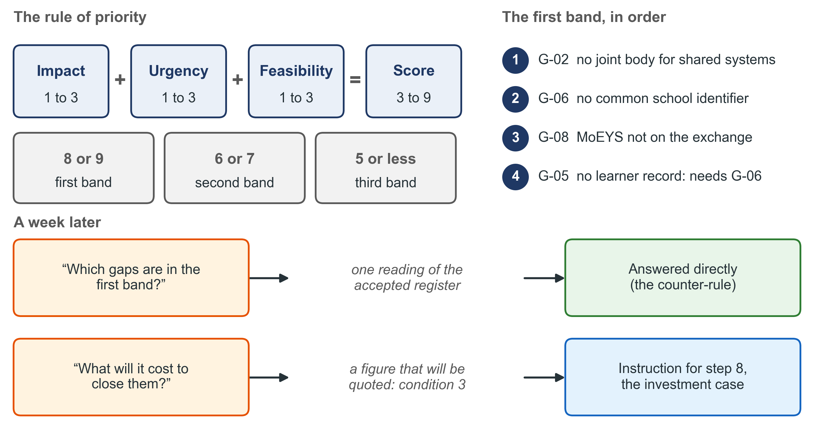

*Figure 16. The KP3 example. The written rule of priority settled the content, so the work was exact; once the register was accepted, a question that one reading settles was answered directly.*

## 8.4 KP4: one goal of a service, designed on building blocks

**The situation.** The Progressa Higher Education Quality Authority (PHEQA) is having its registration service specified and built with the method of KP4. A supplier writes the documents, and PHEQA accepts them. The documents that come before design were accepted in October: the catalogue of services, the register of requirements, the records, the list of goals, the shared groundwork and the architecture. The shared groundwork holds the application fee as a setting: 1,200 in Progressa's currency, owned by PHEQA's finance officer. The next document is one goal written out in full: *an applicant applies for a provisional licence*. The goal uses three building blocks. The applicant signs in through PNIA (identity). The proposed name is checked against PHEQA's register of institutions (registries). The fee is paid through the Payments block (payments). A fourth block, information mediation, comes later, when MoEYS reads the register across Linkup.

**The question, as it came to the orchestrator.** The supplier's analyst wrote: "Write the goal 'apply for a provisional licence' in full, with every way it can go wrong."

**The decision.**

> I am not answering this. Condition 1 holds: the answer needs the register of requirements, the records, the list of goals, the shared groundwork, the architecture and article 6 of the Higher Education Regulations. Condition 2 holds: the screens and the application model will rely on this goal. I have written the instruction instead.

**Who does the work.** The second question points at the documents that settle the content: the documents accepted in October. What remains is to write the goal out exactly, step by step, with every value traced to its source. So the work is exact: Opus, at effort *high*. The reviewer is Opus, effort *high*.

The Orchestrator's rules carry one rule from the KP4 method itself: an instruction to write the application model is issued only after the interaction design has been accepted. This goal comes before both, so the rule does not stop it.

**The instruction, in miniature.**

```text
kind: instruction
commission_id: LIC-C-009
version: 1
session_name: LIC · work · goal apply for a provisional licence
upstream_artefact: my-project/work/documents-before-design-accepted.md
downstream_artefact: my-project/_reports/REPORT_GOAL_2026-11-09.md
serves: the review of the screens with the Registrar of PHEQA, 24 November 2026
model: Opus — the accepted documents settle the content; the risk is a missing step
effort: high — one goal, three building blocks, every way it can go wrong
reviewer: a separate session started from the review form; Opus, effort high
outputs: my-project/work/goal-licence.md · my-project/_reports/REPORT_GOAL_2026-11-09.md

TESTS OF SUCCESS
T1  Each step names who acts, and which building block it uses.
T2  Every value names the accepted document it comes from.
T3  Each step that calls a building block, or that checks what the
    applicant gave, has its failures written out: what the system
    notices, what it does, and how the goal ends.
T4  Every particular that article 6 requires appears in the application.
T5  Nothing is invented: where an ending needs a decision that the
    accepted documents do not make, it is written as an open question,
    with the name of the person who owns it.
```

**The report of the first attempt, in miniature.**

> **The answer first.** The goal has nine steps. It uses PNIA's sign-in at step 1, the register of institutions at step 7 and the Payments block at step 8. Four failures are written out: PNIA does not answer; a required document is left out; the proposed name is already held; the applicant leaves the form and returns two days later.

**The review of the first attempt, in miniature.**

> **Verdict: not accepted.** T3 is not met. Step 8 calls the Payments block, but no failure is written for it. If the block does not confirm the fee, the goal does not say what happens. T1, T2, T4 and T5 are met.

**The second version.** The orchestrator added the gap to the instruction as its version 2, and raised the version number in the same act. The "issued" entry of version 2 names the review as its subject. The same reviewing party reviewed the second attempt.

> **Report, version 2.** Five failures are written out. The fifth: the Payments block does not confirm the fee. The accepted documents do not say whether the application should then wait for the fee, or not be made at all. That is a decision, not a fact. So the goal writes it as an open question, owned by the head of the registration desk.
>
> **Review, version 2. Verdict: accepted.** T1 to T5 are met. The ending that needs a decision is written as an open question with an owner, so T5 is met and nothing is invented.

**What followed.** The orchestrator wrote one "closed" entry, *accepted*. The review wrote the row for this goal in the record of the delivery. The head of the registration desk then answered the open question: the application is not made at all. An application that waits for its fee would be a new state of an application, which no other goal uses. The screens are commissioned from the goal as written.

One thing does not change. In KP4, the supplier's analyst rules on the assistant's draft, a second analyst checks it, and the Registrar of PHEQA accepts the goal at the review of the screens, with the head of the registration desk in the room. The review of the assistant's work does not replace any of these people.

Figure 17 sums up the KP4 example.

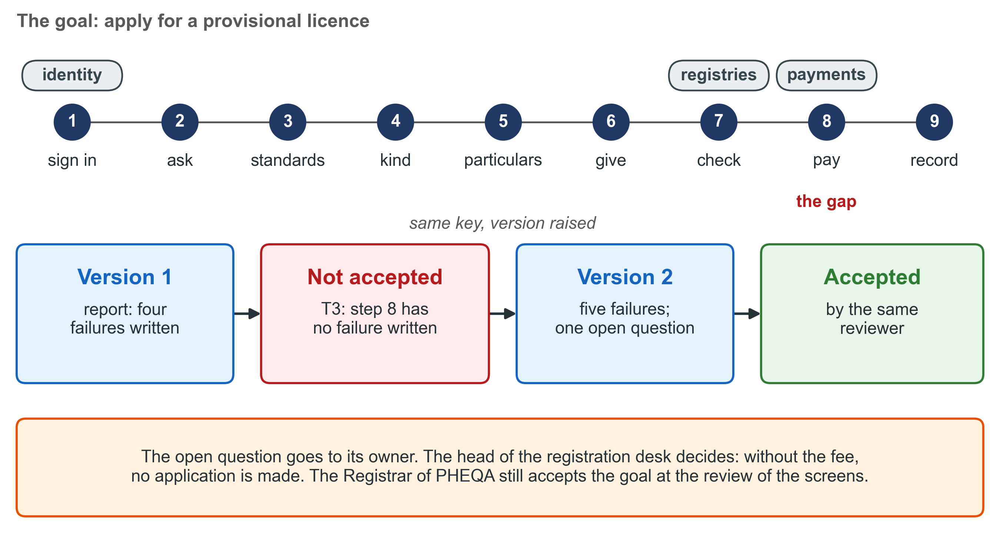

*Figure 17. The KP4 example. The first review named one gap against one test; the gap was added to the same instruction as version 2, the same reviewer accepted it, and the decision the goal left open went to the person who owns it.*

# 9. Getting started

## 9.1 What you need

You need six things before the first session.

1. **A working folder for the project.** All the project's files live under it. If you can, keep it under version control (section 6.9), so that every change is saved and copied to a second machine.
2. **The three places.** The folders `_prompts/`, `_reports/` and `_reviews/` at the top of the project folder. They must exist before the first piece of work, because its report must have somewhere to go.
3. **A place for the log.** One more folder, for example `_log/`. The log program writes there, and nothing else does. The folder holds the entries and nothing else.
4. **The constants file.** One document that states what the project is for, what it delivers and by when, the documents that govern it, and where each kind of thing lives. It also holds the orchestrator's code. It is written once, and it changes only when a decision changes it. A fact that carries a date never belongs in it.
5. **The record of what is running.** One file, opened empty from its form. The program fills its two tables.
6. **The Orchestrator plugin, added to your assistant.** It is in the plugins folder of the Knowledge Products repository, `10-Knowledge-Products/plugins/`. Add it to your assistant as the plugin folder's own instructions describe. The log program needs Python 3 on the machine that holds the project folder.

If your project is already under way, nothing is moved. The constants file records where each kind of thing already lives, and the work goes on from there. Other documents may point to those files by their paths, and a move would break every such pointer.

This is what the project folder looks like, set up for the KP3 work of chapter 8:

```text
my-project/
├── CONSTANTS.md          what the project is, and where each thing lives
├── WHAT_IS_RUNNING.md    the record of what is running
├── orchestrators.txt     who holds the orchestrator's role, produced by the program
├── status.html           the page that answers, written by the program
├── _prompts/             instructions
├── _reports/             reports
├── _reviews/             reviews
├── _log/                 the event log: one file for each event
└── work/                 the documents the project makes
```

The log program finds its folders through the constants file. Under the heading *The map of places*, the file has a table whose first column is headed *Kind of thing*. Three rows of that table must begin with the exact words below. Two more lines, anywhere in the file, give the project folder and the code. The program uses its own older words: *ledger* for the log, *estate* for the project folder, and *registry* for the list of orchestrators.

```text
## The map of places

| Kind of thing                       | Where it lives      |
|-------------------------------------|---------------------|
| the ledger of orchestrator events   | `_log/`             |
| the page that answers               | `status.html`       |
| the registry of orchestrators       | `orchestrators.txt` |

**The estate's root:** `/path/to/my-project`
**The orchestrator's code:** `DPI`
```

The page that answers is a page that the log program writes each time it answers where the work stands. It carries the same answer that you get when you type *check*, and you can open it in a web browser. Keep it outside the folder of the log, as here. The program reads every file in that folder as an entry, so its check names a page placed there as an entry it cannot read.

Choose a code of a few capital letters that is short and says something about the work, such as `DPI` for the DPI roadmap.

Figure 18 shows the plugin and the project folder side by side.

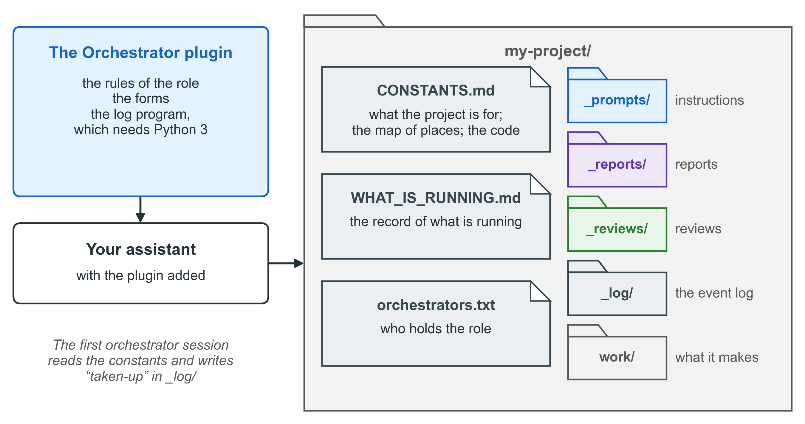

*Figure 18. What you set up before the first session. The plugin brings the rules, the forms and the log program; the project folder holds the three places, the log, the constants and the record; the first orchestrator session ties them together.*

## 9.2 The first session

1. **Start the orchestrator's session.** Name it with your code, the word *orchestrator* and the date, for example `DPI · orchestrator · from 2 November`. In its first message, ask it to take up the orchestrator's role for the project, and give the path of the constants file.
2. **The orchestrator reads its rules** from the plugin, then the constants file.
3. **It writes its "taken-up" entry.** Only then does it hold the role.
4. **It prepares the record of what is running.** It runs the log program once, so that the program places its two produced tables in the record.
5. **Tell it what the project delivers,** what kinds of thing it will produce, and which documents govern it. If the constants file does not yet say where each other kind of thing lives, the orchestrator proposes the rest of the map. You decide on it, and a first working session writes it into the constants file, because the orchestrator writes nothing outside its own records.
6. **Ask your first question.** The orchestrator either answers it, or tells you which condition held and gives you an instruction and its start message.

## 9.3 Every day

- **Start each session with its two-line start message.** Paste the two lines into a new session. If the session's name does not begin with the code, rename it to the first line.
- **Type *check* in the orchestrator's session** to see where the work stands and what to start next.
- **Start the reviewing session** when the orchestrator gives you the review instruction. Never ask the working session to judge its own report.
- **Make the decisions that are yours** when the orchestrator brings you a short paper with a recommendation.
- **Save and copy the work.** Commit and push the sources, the instructions, the reports, the reviews and the log. Do not commit a Word file built only for review.
- **When the orchestrator proposes its retirement, decide.** If you agree, it writes the handover note and the first task, and you start the incoming session (chapter 7).

## 9.4 Common mistakes, and how to avoid them

| Mistake | What goes wrong | What to do instead |
|---|---|---|
| Asking the working session to check its own work | The check confirms the error (chapter 1) | Start the reviewing session from the review instruction |
| Starting a session before its "issued" entry stands | The record does not show the work, and two tasks can write the same file | Start a session only from the start message the orchestrator gives you |
| Writing a line by hand into the Open or Closed table | The line is lost at the next rebuild | Write in the head of the record only; the tables are produced |
| Putting any other file in the folder of the log, such as the page that answers | The check names it as an entry it cannot read, again after each answer | Keep only the entries there; put the page in the project folder |
| Asking the orchestrator for the status "from what it remembers" | A memory is repeated as a fact | Type *check*; the answer is produced from the log |
| Editing the Word file to fix a mistake | The fix is lost at the next build | Fix the source, and build again |
| Choosing the strongest model because the subject is important | Cost and time spent where exactness was needed | Ask the three questions of section 5.2 |

# Quick reference

**Why.** A party that does work and judges it has no independent check. What a conversation knows is lost when it ends. So: three parties with written documents between them, and the state of the work in files.

Figure 19 shows the whole cycle on one page.

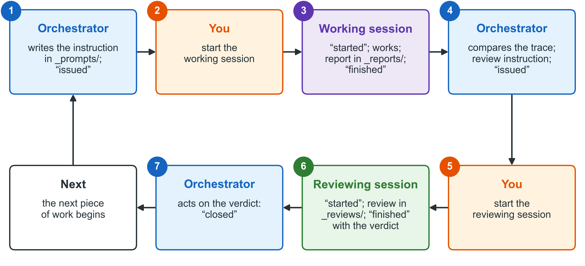

*Figure 19. The Orchestrator on one page: who writes what, in which place, and which entry each act leaves in the log.*

| Party | Does | Never |
|---|---|---|
| Orchestrator | Sizes, decides, writes instructions, sends reports for review, acts on verdicts, keeps records | Carries out or judges work it commissioned; writes outside its records |
| Working session | Carries out one instruction; writes the report with evidence | Writes a verdict; changes what is out of scope |
| Reviewing session | Checks the report; works out one figure again; writes the verdict | Repairs anything |
| You | Start every session; decide what is delivered, cut, spent and said outside; commit and push | Ask a session to judge its own work |

**Answer, or write an instruction?** Write an instruction if any of these holds: (1) more than three documents to read; (2) a lasting document; (3) a figure that will be quoted; (4) a change to a file; (5) evidence the orchestrator cannot see. **Do not** write one if a single check that changes nothing settles it, if the act is the orchestrator's own record, or if an instruction for it already waits. An instruction is carried out or withdrawn the same day: one that no session has started within 24 hours is named uncarried.

<!-- pagebreak -->

**The nine steps.** (1) Size the question. (2) Decide. (3) Write the instruction. (4) Write the "issued" entry. (5) You start the working session. (6) The report arrives, with the "finished" entry. (7) Compare the two declarations. (8) Send for review; you start the reviewing session. (9) Act on the verdict with one entry.

| Ask, in this order | If yes, the work is | With Claude today | Usual effort |
|---|---|---|---|
| Can you point at the check that settles it? | Mechanical | Sonnet | medium |
| Can you point at the document that settles the content? | Exact | Opus | high |
| Can you point at a real disagreement, two positions each with a case? | Open judgement | Fable | max |
| None of the three? | Not sized yet: size it first | — | — |

The kind follows the work, never the importance of the subject. Effort levels: low, medium, high, xhigh, max.

| Verdict | What follows |
|---|---|
| Accepted | One "closed" entry, *accepted*, closes the review and the work. "Found, not fixed" becomes candidate instructions. |
| Not accepted | The gaps are added to the same instruction as its next version. The same reviewer reviews it. |
| Not accepted twice | The instruction is withdrawn; one "closed" entry, *re-scoped*; the task is defined again. |

| Log entry | Written by | When |
|---|---|---|
| taken-up / given-up | Orchestrator | Before it holds the role / as its last act |
| issued | Orchestrator | Before you get the start message |
| started / finished | Working or reviewing session | First act / last act, after the report |
| closed | Orchestrator | Accepted, withdrawn, held or re-scoped |

**Session name:** `CODE · work | review | orchestrator · the task in a few words`. **Start message:** the name, then "Carry out the instruction at" and the instruction's full path.

**Handover note:** carries what it did that it should not have done, what is owed, and findings in no report; every line a claim to check. It refuses figures, a survey of the state, and a story of the work.

**Settings:** the reading limit is 3 documents; the waiting limit is 24 hours. You own both.

# Glossary

Figure 20 shows how the main terms fit together. The table after it gives every term the manual uses, in alphabetical order.

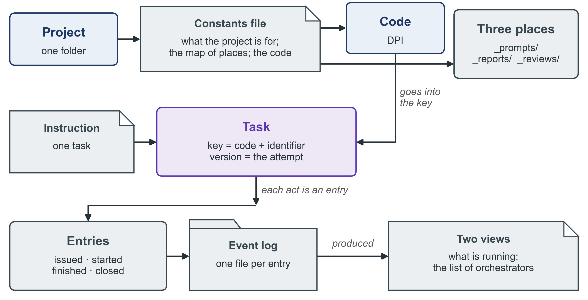

*Figure 20. How the main terms fit together. A project has one constants file and one code; each instruction is a task with a key; each act on a task is an entry; and the log program produces the two views from the entries.*

| Term | Meaning in this manual |
|---|---|
| Body of work | The set of files that a task will write, as its instruction names them. Two tasks that name the same file are in one body of work, and only one of them writes at a time. |
| Build | A file made by a program from its source, such as a Word file made from a text file. It is never edited by hand. |
| Building block | A shared digital system that many services use, such as identity, payments, registries or data exchange. |
| Candidate instruction | A line of "found, not fixed" that may become the next instruction. |
| Check (typed) | The word you type in the orchestrator's session to have it produce, from the log, where the work stands. |
| Checksum | A short code worked out from the content of a file. It changes when the file changes. |
| Closed | The log entry the orchestrator writes when a task ends or is held: accepted, withdrawn, held or re-scoped. |
| Code | The capital letters that begin the orchestrator's session name and every session it commissions, such as DPI. |
| Commission | To ask for a piece of work by writing an instruction for it. |
| Commit, push | Saving a change in the project's history; copying that history to a second machine. |
| Constants file | The one document of the project's facts that do not change with time: its purpose, deliverables, governing documents, map of places and code. |
| Context pack | The facts about a country, or about Progressa, that you give an assistant so that its work starts from them. |
| Counter-rule | The rule that no instruction is written when one check settles the matter, when the act is the orchestrator's own record, or when an instruction already waits. |
| Declaration | The block of named lines at the head of an instruction, report or review, which programs and reviewers read. |
| Effort level | How long and how carefully a model works before it answers: low, medium, high, xhigh or max. |
| Entry | One event written in the log, as one small file. |
| Estate | The log program's word for the project folder and everything under it. |
| Event log | The folder of entries, written by one program only. The program calls it the ledger. |
| Exact work | Work whose content a document already settles, with a large amount to write. The risk is a mistake in the detail. |
| Five conditions | The five observable conditions under which the orchestrator writes an instruction instead of answering (section 3.2). |
| Form | The fixed pattern that an instruction, a report, a review or a handover note is written from. The forms come with the plugin. |
| Found, not fixed | The part of a report that lists what the session saw outside its task. Nothing in it was repaired. |
| Given up, taken up | The log entries that record an orchestrator leaving the role and a session taking it. |
| Handover note | The outgoing orchestrator's note of what the records cannot show. Every line is a claim. |
| Held | An outcome of "closed": the instruction waits because you asked for it to wait, with the reason. |
| Instruction | The document that says what one piece of work is, who reviews it and how its success is tested. |
| Issued | The log entry written when an instruction is complete, before you receive its start message. |
| Key | How a task is known in the log: the orchestrator's code and the instruction's identifier. |
| Ledger | The log program's word for the event log. |
| List of orchestrators | The view that names, for each code, the session that holds the orchestrator's role and since when. The log program calls it the registry. |
| Map of places | The table in the constants file that says where each kind of thing lives. |
| Mechanical work | Work that leaves no room for judgement; a check decides whether it succeeded. |
| Moved line | The line of a "finished" entry that says what changed that other people depend on. |
| Named setting | A number held apart from the rules, with an owner and a present value: the reading limit and the waiting limit. |
| Open judgement | Work with real rival answers that is hard to reverse, and must be free to contradict you and the orchestrator. |
| Orchestrator | The session that holds the role of keeping the work in order. With a capital letter, the tool: the plugin. |
| Owner | You: the person who starts every session and makes the decisions that are yours. |
| Page that answers | The page the log program writes each time it answers where the work stands: the same answer as *check*, to open in a web browser. It is kept outside the folder of the log. |
| Place | The folder that names a kind of thing, such as `_reports/` for reports. |
| Placement check | The check that each output of a piece of work is in the place that names its kind. Its program is not yet written. |
| Plugin | A package that you add to your assistant. The Orchestrator plugin carries the rules, the forms and the log program. |
| Progressa | The fictional country of all four Knowledge Products. |
| Re-scoped | An outcome of "closed": after two rounds not accepted, the task is defined again. |
| Reading limit | The named setting in the first of the five conditions: three documents. |
| Record of a long delivery | The record with one row for each part of a larger piece of work, with its instruction, report, review and verdict. The review writes each row from its verdict; the record is not produced from the log. |
| Record of what is running | The record of what is being worked on now. Its Open and Closed tables are views, produced from the log; its head and its table of held instructions are written by hand. |
| Register of instructions | The register, named in the Orchestrator's rules, that lists what was commissioned and how each piece of work ended. Its program is not yet part of the plugin. |
| Report | The document in which a working session says what it did, with evidence. It carries no verdict. |
| Review | The document in which a reviewing session checks a report and gives the verdict. |
| Reviewing session | The session that checks a report and gives the verdict. It neither wrote nor carried out the instruction. |
| Round | One piece of work carried out by one session from one instruction. |
| Session | One conversation with the AI assistant, from its first message to its end. |
| Session name | The three-part name of a session: the code, the kind of session, and the task in a few words. |
| Sizing | Finding out what is already known about a question, and the cheapest way to an answer, before deciding anything. |
| Source | The one file from which a document is built, kept in a form where changes can be seen line by line. |
| Start message | The two lines you paste to start a session: its name, and the path of its instruction. |
| Started, finished | The log entries a working or reviewing session writes as its first and its last act. |
| Subject | The task that a review, or a next version of an instruction, refers to. A review names the working task as its subject. |
| Trace | The two declarations that link an instruction and its report: each names the other. |
| Trace check | The check that an instruction and its report name each other. Its program is not yet written. |
| Uncarried | Said of an instruction issued and not started within the waiting limit of 24 hours. |
| Verdict | The result of a review: accepted or not accepted. There is no third word. |
| Version | The number of an attempt at one instruction. A second attempt is the next version, never a new instruction. |
| Version control | The system that keeps the history of a project's files: every saved change, with a copy on a second machine. |
| View | A record, or a table in a record, that the log program produces from the log and rebuilds with each entry that changes it. There are two: the Open and Closed tables of the record of what is running, and the list of orchestrators. |
| Waiting limit | The named setting of 24 hours. An instruction issued and not started for longer is named uncarried. |
| Withdrawn | An outcome of "closed": the instruction will not be carried out, with the reason. |
| Working session | The session that carries out one instruction and writes the report. |

